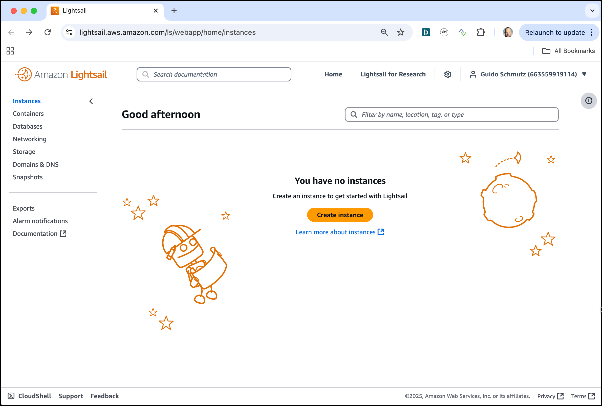
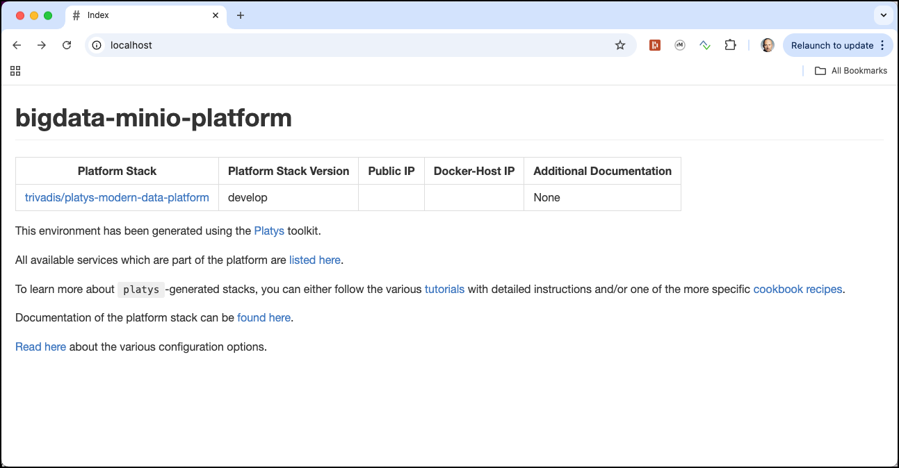

# AWS Lightsail

Navigate to the [AWS Console](http://console.aws.amazon.com) and login with your user. Click on the [Lightsail service](https://lightsail.aws.amazon.com/ls/webapp/home/instances).



## Provision instance

Click **Create instance** to navigate to the **Create an instance** dialog. 


Optionally change the **Instance Location** to a AWS region of your liking.
Keep **Linux/Unix** for the **Select a platform** and click on **OS Only** and select **Ubuntu 20.04 LTS** for the **Select a blueprint**. 


Scroll down to **Launch script** and add the following script. 
Optionally change the password from the default value of `ubuntu` to a more secure one. 

```
export GITHUB_PROJECT=bigdata-spark-workshop
export GITHUB_OWNER=gschmutz
export PLATYS_VERSION=2.4.0
export NETWORK_NAME=ens5
export USERNAME=ubuntu
export PASSWORD=ubuntu

# Prepare Environment Variables 
export PUBLIC_IP=$(curl ipinfo.io/ip)
export DOCKER_HOST_IP=$(ip addr show ${NETWORK_NAME} | grep "inet\b" | awk '{print $2}' | cut -d/ -f1)

# allow login by password
sudo sed -i "s/.*PasswordAuthentication.*/PasswordAuthentication yes/g" /etc/ssh/sshd_config
echo "${USERNAME}:${PASSWORD}"|chpasswd
sudo service sshd restart

# add alias "dataplatform" to /etc/hosts
echo "$DOCKER_HOST_IP     dataplatform" | sudo tee -a /etc/hosts

# Install Docker
sudo apt-get update
sudo apt-get install \
    ca-certificates \
    curl \
    gnupg \
    lsb-release
sudo mkdir -p /etc/apt/keyrings    
curl -fsSL https://download.docker.com/linux/ubuntu/gpg | sudo gpg --dearmor -o /etc/apt/keyrings/docker.gpg
echo \
  "deb [arch=$(dpkg --print-architecture) signed-by=/etc/apt/keyrings/docker.gpg] https://download.docker.com/linux/ubuntu \
  $(lsb_release -cs) stable" | sudo tee /etc/apt/sources.list.d/docker.list > /dev/null

sudo apt-get update
sudo apt-get install -y docker-ce docker-ce-cli containerd.io docker-compose-plugin
sudo usermod -aG docker $USERNAME

# Install Docker Compose Switch
sudo curl -fL https://github.com/docker/compose-switch/releases/latest/download/docker-compose-linux-amd64 -o /usr/local/bin/compose-switch
chmod +x /usr/local/bin/compose-switch
sudo update-alternatives --install /usr/local/bin/docker-compose docker-compose /usr/local/bin/compose-switch 99

# Install Platys
sudo curl -L "https://github.com/TrivadisPF/platys/releases/download/${PLATYS_VERSION}/platys_${PLATYS_VERSION}_linux_x86_64.tar.gz" -o /tmp/platys.tar.gz
tar zvxf /tmp/platys.tar.gz 
sudo mv platys /usr/local/bin/
sudo chown root:root /usr/local/bin/platys
sudo rm platys.tar.gz 

# Install various Utilities
sudo apt-get install -y curl jq kafkacat tmux unzip

# needed for elasticsearch
sudo sysctl -w vm.max_map_count=262144   

# Get the project
cd /home/${USERNAME} 
git clone https://github.com/${GITHUB_OWNER}/${GITHUB_PROJECT}
chown -R ${USERNAME}:${USERNAME} ${GITHUB_PROJECT}

cd /home/${USERNAME}/${GITHUB_PROJECT}/01-environment/docker

# Make Environment Variables persistent
sudo echo "export PUBLIC_IP=$PUBLIC_IP" | sudo tee -a /etc/profile.d/platys-platform-env.sh
sudo echo "export DOCKER_HOST_IP=$DOCKER_HOST_IP" | sudo tee -a /etc/profile.d/platys-platform-env.sh
sudo echo "export DATAPLATFORM_HOME=$PWD" | sudo tee -a /etc/profile.d/platys-platform-env.sh

# Startup Environment
sudo -E docker-compose up -d
```

into the **Launch Script** edit field
 


Under **Choose your instance plan** click on the arrow on the right and select the **16 GB** instance.   

Under **Identify your instance** enter **Ubuntu-Hadoop-1** into the edit field. 


Click on **Create Instance** to start provisioning the instance. 

The new instance will show up in the Instances list on the Lightsail homepage. 


Click on the instance to navigate to the image details page. On the right you can find the Public IP address of the newly created instance, which is **18.194.105.133** in this example, of course your Public IP will be different.


Click **Connect using SSH** to open the console and enter the following command to watch the log file of the init script.

```
tail -f /var/log/cloud-init-output.log --lines 1000
```

The initialisation is finished when you see the `Creating xxxxx .... done` lines after all the docker images have been downloaded, which takes a couple of minutes. 


## View Platform Documentation

The platform contains some web-based documentation, which can be accessed once the platform is running. In a web browser, navigate to the public IP <http://18.194.105.133> (replace the IP address by your Public IP address) and you should see a page similar to the one shown here



If you click on the "A list of available services is available here" a page with the list of available services and their IP address will appear
   


So with all services running, there is one last step to do. We have to configure the Firewall to allow traffic into the Lightsail instance. 

## Open Network Firewall 

For accessing the services running in the cloud from our machine, we have two options:

1. Open the ports on the firewall (this is what we do here)
2. Create an SSH Tunnel

Because the Lightsail instance is exposed to the public internet, generally opening the ports is not the best idea. But if you open it to accept only traffic from your own IP address, the risk can be minimised. Using an SSH tunnel is more secure, but also more difficult to setup. 

So let see how we can open the ports on the firewall. Click on the **Networking** tab/link to navigate to the network settings.


Click on **Add rule** to add a new Firewall rule.

For simplicity reasons, we allow all TCP traffic by selecting **All TCP** on port range **0 - 65535**. 
To increase security, you should restrict incoming traffic to one or more IP addresses by selecting the option **Restrict to IP address** and adding the IP address of your client as the **Source IP address**.


To find out your IP address, browse to <https://www.whatismyip.com/> and use the `XXX.XXX.XXX.XXX` value shown right to **My Public IPv4 is:** to replace the `188.60.35.196` value in the image above. Also add the Public IP of the Lightsail VM (`18.194.105.133` in this example, replace it with your one) as a second address to restrict on/allow. 

Click on **Create** to save this new Firewall rule and it should be added to the list of rules. 


Your instance is now ready to use. Complete the post installation steps documented the [here](README.md).


## Using the Web-Terminal

Before you can use this option, you either have to open the ports on the Firewall documented under **Open Network Firewall**.

After the stack is started, you can use your web browser (best is Chrome) to access the terminal in the ligthsail environment. Navigate to <http://18.196.124.212:3001> (replace the IP address by the IP address your IP address and you should see a back terminal window asking to enter the username to connect:


Enter `ubuntu` for the **username** and enter value you have chosen as your password when creating the lightsail environment (when specifying the **Launch Script**) for the **password** and you should be able to connect. 


This finishes the setup of the Platform. You are now ready to start working on the various workshops!


## Further options (optional)

### Connecting from a Terminal window using SSH

Optionally you can also SSH into the Lightsail instance using the **SSH key pair** which you can download from the **Account** menu in the top menu bar or using the username/password you have specified in the initialisation script above.

For that open a terminal window (on Mac / Linux) or Putty (on Windows) and either 

* connect using the **SSH key pair**   

```
ssh -i LightsailDefaultKey-eu-central-1.pem ubuntu@18.194.105.133 
```

* connect using username and password (you will be prompted for the password)

```
ssh ubuntu@18.194.105.133
```

In both cases replace the IP address (18.194.105.133) with you own one.

### Creating an SSH Tunnel as a Socks Proxy

Opening an SSH tunnel is different on Windows and Mac. The following short description shows how to create the tunnel on **Windows** and on **Mac OS-X**.

#### Using Windows

First you have to install Putty (available at <http://www.chiark.greenend.org.uk/~sgtatham/putty/>). We will use Putty to extract the private key as well as for creating the SSH Tunnel. 

**a). Download the SSH Key of the Lightroom instance and Extract Private Key**

In order to connect to the lightsail instance, a copy of the private SSH key. You can use the key pair that Lightsail creates. Download the key from the AWS console by choosing **Account** on the top navigation bar and again choose **Account** from the drop-down menu. Navigate to the **SSH Keys** tab. 


Select the **Default** key and click on the **Download** link to download it to your local computer. 

Now start the **PuTTYgen** tool you have installed before. The following screen should appear. 


Click on **Load** and load the `xxxxxxx.pem` file you have downloaded before. By default, PuTTYgen displays only files with the `.ppk` extension. To locate your `.pem` file, select the option to display files of all types.

PuTTYgen confirms that you successfully imported the key, and then you can choose OK.

Choose **Save private key**, and then confirm you don't want to save it with a passphrase.

**b). Create the SSH Tunnel**

Start Putty and from the Session tab, enter the public IP (54.93.82.199) into the **Host Name (or IP address)** field. Leave the **port** field to 22.


Now click on the **SSH** folder, expand it and click on **Auth**. 


Click on **Browse** and select the private key file you have created above.  

Click on **Tunnels** and on the screen, enter `9870` into the **Source port** field, click the **Dynamic** radio button and then click on **Add**.


Now click on **Open** and confirm the Alert pop up with **Yes**. Enter `ubuntu` as the login user and you should get the bash prompt. 

Be sure to save your connection for future use.

**c). Configure Web Browser to use the SSH Tunnel** 

As a last step you have to configure the browser (we assume Firefox here, but Chrome would be fine as well) to use the SSH Tunnel. 

Install the **FoxyProxy Standard** extension into Firefox. 


After installing the Addon, click on the new icon in the top right corner of the menu bar and click on **Options**. 


Click on **Add** in the menu to the left. Configure the proxy settings as shown below


and click **Save**. 
Click again on the **FoxyProxy** icon in the top right corner and select the **Hadoop Workshop** entry to enable the proxy settings. 


You can now reach the services on Lightsail using the localhost address. For example you can reach Zeppelin over <http://localhost:38081>. For the other URLs, consult the table at the bottom of the main [Readme](README.md). 

#### Using Mac OS-X

**a). Download the SSH Key of the Lightroom instance**

Download the key from the AWS console by choosing **Account** on the top navigation bar and again choose **Account** from the drop-down menu. Navigate to the **SSH Keys** tab. 


Select the **Default** key and click on the **Download** link to download it to your local computer. 

**b). Create the SSH Tunnel**
On Mac OS-X you can either use the `ssh` command line utility to open up a ssh tunnel or 
download an SSH Tunnel GUI client. The [**Secure Pipes**](https://www.opoet.com/pyro/) Application is the one I use here.

To configure Secure Pipes, click on the cloud icon in the menu bar


and select the **Preferences** menu. The **Connections** overview screen is shown. 


Click on the **+** icon in the bottom left corner and select **New SOCKS Proxy...** from the drop-down menu. 

On the **Connection** tab, enter `Hadoop Workshop` into the **Connection Name** field and use the public IP address of the Lightsail instance for the **SSH Server Address** field. Set the **Port** field to `22`, **Local Bind Address** field to `localhost` and the other **Port** field to a port which is not used on your local computer. 
If you have administrator rights on your Mac, then you can enable the **Automatically configure SOCKS proxy in Network Preferences** as shown below. 


Next click on **Options** and enable the **Use ssh identity file** check box and click on **Select...** to select the key file you have downloaded in step 1. 


Click **Add** to add the new connection to the **Secure Pipes**. 

Now the SSH tunnel can be activated by again clicking on the clod icon in the menu bar and selecting the connection **Hadoop Workshop** configured above.


The green icon in front of the connection signals that the SSH tunnel has been established successfully. 

**c). Configure Web Browser to use the SSH Tunnel** 

As a last step you have to configure the browser (we assume Firefox here, but Chrome would be fine as well) to use the SSH Tunnel. 

Install the **FoxyProxy Standard** extension into Firefox. 


After installing the Addon, click on the new icon in the top right corner of the menu bar and click on **Options**. 


Click on **Add** in the menu to the left. Configure the proxy settings as shown below


and click **Save**. 

Click again on the **FoxyProxy** icon in the top right corner and select the **Hadoop Workshop** entry to enable the proxy settings. 


You can now reach the services on Lightsail using the localhost address. For example you can reach Zeppelin over <http://localhost:38081>. For the other URLs, consult the table at the bottom of the main [Readme](README.md). 


## Stop an Instance

To stop the instance, navigate to the instance overview and click on the drop-down menu and select **Stop**. 


Click on **Stop** to confirm stopping the instance. 


A stopped instance will still incur charges, you have to delete the instance completely to stop charges. 

## Delete an Instance

t.b.d.

## Create a snapshot of an Instance

When an instance is stopped, you can create a snapshot, which you can keep, even if later drop the instance to reduce costs.


You can always recreate an instance based on a snapshot. 

# De-provision the environment

To stop the environment, execute the following command:

```
docker-compose stop
```

after that it can be re-started using `docker-compose start`.

To stop and remove all running container, execute the following command:

```
docker-compose down
```

