# Working with MinIO Object Storage

In this workshop we will work with [MinIO](https://min.io/) Object Storage to persist data. It will also be used in the other workshops and is configured as the default filesystem for Spark and ecosystem.

We assume that the **Data platform** described [here](../00-environment) is running and accessible.

In this workshop, we will use the `airports-data` and `flight-data` available in the `data-transfer` folder of the environment and upload it to Minio. These files will also be used later by other workshops. 

## Table of Contents

- [What you will learn](#what-you-will-learn)
- [Prerequisites](#prerequisites)
- [Accessing MinIO](#accessing-minio)
- [Create a Bucket](#create-a-bucket)
- [Uploading data](#uploading-data)
- [Downloading objects](#downloading-objects)
- [Copying objects within MinIO](#copying-objects-within-minio)
- [Deleting objects and buckets](#deleting-objects-and-buckets)

## What you will learn

- How to create buckets in MinIO using the Web UI, `mc`, and `s3cmd`
- How to upload files (CSV, JSON, PDF) to object storage using the command line and the browser
- How to list, browse, and inspect objects using `mc ls`, `mc tree`, and the MinIO Aistor Console
- How to share objects via a pre-signed URL
- How to download objects back to the local filesystem using `mc cp` and `s3cmd get`
- How to delete objects and buckets using `mc rm` and `mc rb`
- How to copy and move objects within MinIO using `mc cp` and `mc mv`
- How an object store serves as an S3-compatible drop-in replacement for HDFS

## Prerequisites

- The **Data Platform** described [here](../00-environment) is running and accessible
- The `airports-data` and `flight-data` files are available in the `data-transfer` folder of the environment

### Volume Map data for MinIO container

If you want the data to persist even after you shutdown the docker-compose stack, then you might want to add an additional value mapping to the `minio` service (this is of less use if you have provisioned the stack on **AWS Lightsail**). 

```bash
    volumes:
      - './container-volume/minio/data/:/data'
```

You can enable in Platys by setting `MINIO_volume_map_data` to `true` and regenerate the stack.

## Accessing MinIO

[MinIO](https://min.io/) is an object storage server released under Apache License v2.0. It is compatible with Amazon S3 cloud storage service. It is best suited for storing unstructured data such as photos, videos, log files, backups and container / VM images. Size of an object can range from a few KBs to a maximum of 5TB.

There are various ways for accessing MinIO

 * **S3cmd** - a command line S3 client for working with S3 compliant object stores
 * **MinIO MC** - the MinIO command line utility
 * **MinIO UI** - a browser based GUI for working with MinIO

These are only a few of the tools available to work with S3. And because an Object Store is in fact a drop-in replacement for HDFS, we can also use it from the tools in the Big Data ecosystem such as Hadoop Hive, Spark, ...

**Using S3cmd**

[S3cmd](https://s3tools.org/s3cmd) is a command line utility for working with S3. 

In our environment, S3cmd is accessible inside the `awscli` container.  

Running `s3cmd -h` will show the help page of s3cmd.

```bash
docker exec -ti awscli s3cmd -h
```

> **What you should see:** The s3cmd help page listing all available commands and options such as `put`, `get`, `del`, `ls`, and `mb`.

This can also be found on the [S3cmd usage page](https://s3tools.org/usage).

**Using MinIO mc**

In our environment, `mc` is accessible inside the `minio-mc`.  

Running `mc -h` will show the help page of mc.

```bash
docker exec -ti minio-mc mc -h
```

> **What you should see:** The mc help page listing all available sub-commands such as `cp`, `ls`, `mb`, `rm`, and `tree`.

**Using MinIO Aistor Console**

In a browser window, navigate to <http://dataplatform:9010>. 

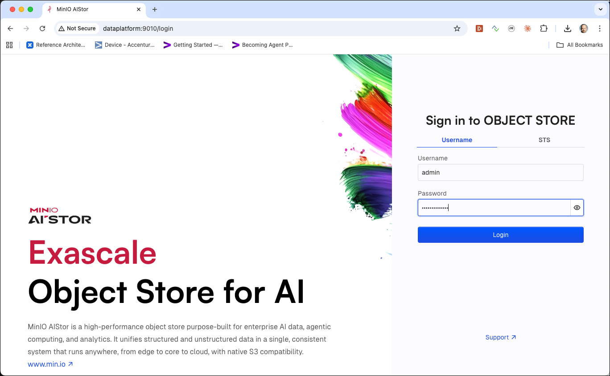

Enter `admin` into the **Access Key** and  `abc123!abc123!` into the **Secret Key** field and click on the **Connect** button. The keys are defined in the `minio-1` service definition in the [docker-compose.yml](https://github.com/gschmutz/hadoop-spark-workshop/blob/master/00-environment/docker/docker-compose.yml) file. 

The MinIO Console dashboard page should now appear.
 
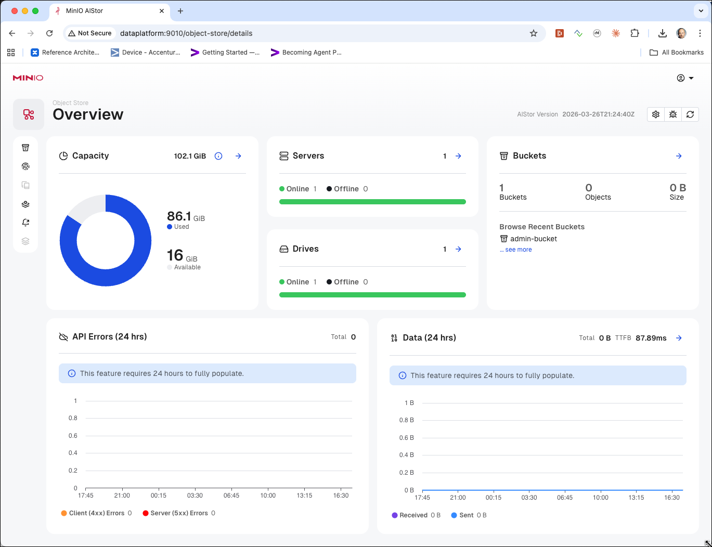

> **What you should see:** The MinIO Aistor Console dashboard showing an overview of the storage, with the **Buckets** menu item visible on the left.

Before we can upload the files to MinIO, we first have to create a new bucket. We can either do it over the Console or using a Command-Line Interface (CLI).

## Create a Bucket 

### Using Minio Aistor Console (Web UI)

Now click on the **Buckets** menu item on the left.

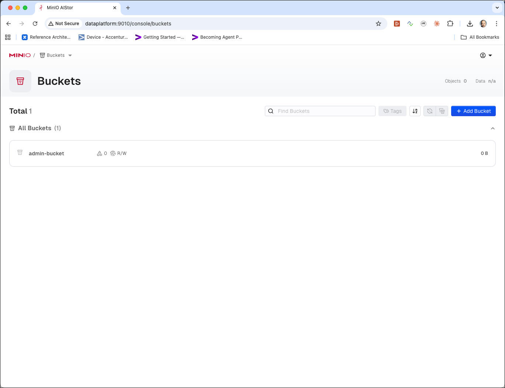

Click on the **+ Add Bucket** button at the top right corner to create a new bucket.

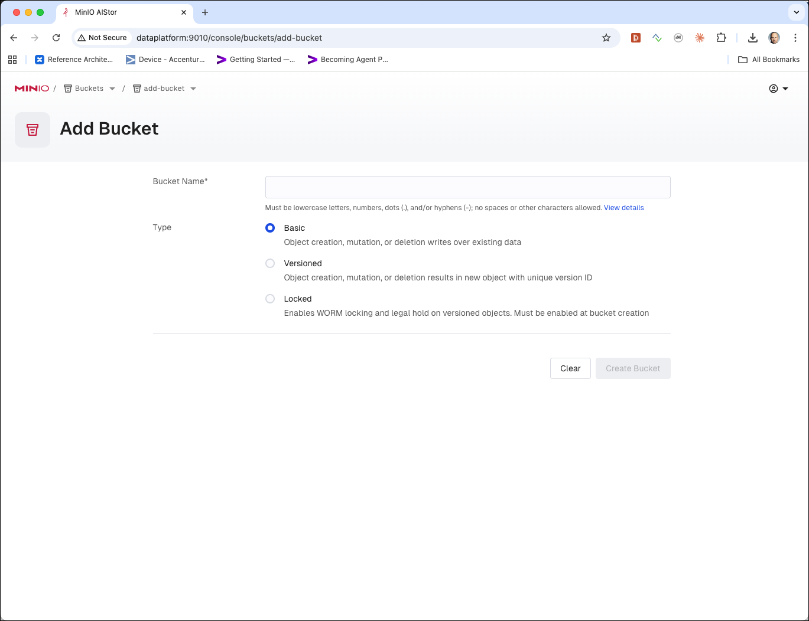

Enter `flight-bucket` into the **Bucket Name** field, leave the **Type** set to **Basic**

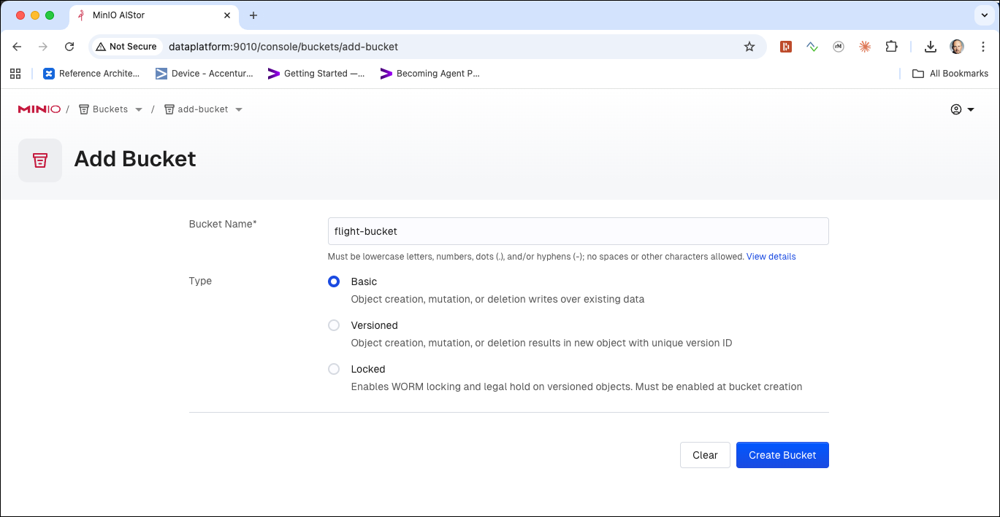

and click **Create Bucket**.

> **What you should see:** The new `flight-bucket` appears in the bucket list.

### Using MinIO mc

Here are the commands to perform when using the MinIO **mc** utility on the command line

```bash
docker exec -ti minio-mc mc mb minio-1/flight-bucket
```

**Note**: add the `--with-lock` if you want to enable object locking on the bucket.

and you should get the confirmation message as shown below

```bash
bigdata@bigdata:~$ docker exec -ti minio-mc mc mb minio-1/flight-bucket

Bucket created successfully `minio-1/flight-bucket`.
```

> **What you should see:** The line `Bucket created successfully \`minio-1/flight-bucket\`` confirming the bucket was created.

Navigate to the MinIO UI (<http://dataplatform:9010/console/buckets>) and you should see the newly created bucket. 

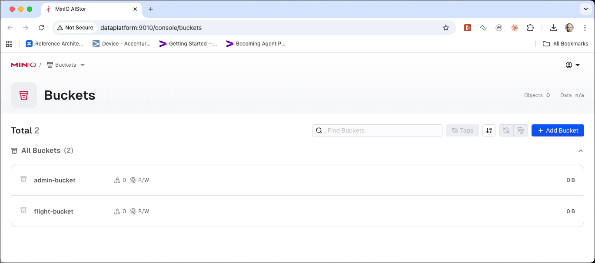

or you can also use `mc ls` to list all buckets.

```bash
docker exec -ti minio-mc mc ls minio-1
```

and you should get

```
bigdata@bigdata:~$ docker exec -ti minio-mc mc ls minio-1
[2026-04-02 12:08:34 UTC]     0B admin-bucket/
[2026-04-02 15:55:25 UTC]     0B flight-bucket/
```

> **What you should see:** Two buckets listed — `admin-bucket` (created automatically at startup) and `flight-bucket` (just created).

**Note**: the `admin-bucket` has been created when starting the platform. 

## Uploading data

### Upload the Airport and Plane-Data CSV files to the new bucket

To upload a file we are going to use the `cp` command of the `minio-mc`. First for the `airports.csv`

```bash
docker exec -ti minio-mc mc cp /data-transfer/airport-data/airports.csv minio-1/flight-bucket/raw/airports/airports.csv
```

> **What you should see:** A progress bar followed by a confirmation line showing the file size and destination path, e.g. `...airports.csv: 11 MiB / 11 MiB`.

and then also for the `plane-data.csv` file. 

```bash
docker exec -ti minio-mc mc cp /data-transfer/flight-data/plane-data.csv minio-1/flight-bucket/raw/planes/plane-data.csv
```

> **What you should see:** A similar progress bar and confirmation for `plane-data.csv`.

Let's use the `mc ls` command once more but now to display the content of the `flight-bucket`

```bash
docker exec -ti minio-mc mc ls minio-1/flight-bucket/
```

We can see that the bucket contains a directory with the name `raw`, which is the prefix we have used when uploading the data above. 

```bash
bigdata@bigdata:~$ docker exec -ti minio-mc mc ls minio-1/flight-bucket/
[2026-04-02 15:59:40 UTC]     0B raw/
```

> **What you should see:** A single `raw/` prefix entry — object storage has no real directories, but the shared key prefix is displayed as a folder.

> **What just happened?** MinIO, like S3, has no native directory concept. The `raw/airports/airports.csv` key simply contains a `/` separator, and `mc ls` groups objects by their common prefix to give a familiar folder-like view.

If we use the `-r` argument

```bash
docker exec -ti minio-mc mc ls -r minio-1/flight-bucket/
```

we can see the objects with the hierarchy as well. 

```bash
bigdata@bigdata:~$ docker exec -ti minio-mc mc ls -r minio-1/flight-bucket/
[2026-04-02 15:59:21 UTC]  11MiB STANDARD raw/airports/airports.csv
[2026-04-02 15:59:31 UTC] 418KiB STANDARD raw/planes/plane-data.csv
```

> **What you should see:** Both uploaded files listed with their sizes and full key paths.

you can also use the `tree` command to display it as a tree

```bash
docker exec -ti minio-mc mc tree minio-1/flight-bucket/
```

we can see the folder hierarchy as well. 

```bash
bigdata@bigdata:~$ docker exec -ti minio-mc mc tree minio-1/flight-bucket/
minio-1/flight-bucket/
└─ raw
   ├─ airports
   └─ planes
```

> **What you should see:** A tree showing the `raw` folder with `airports` and `planes` sub-folders.

if we use the `--files` option we can see the files as well

```bash
docker exec -ti minio-mc mc tree --files minio-1/flight-bucket/
```

we can see the files within the folder hierarchy as well. 

```bash
bigdata@bigdata:~$ docker exec -ti minio-mc mc tree --files minio-1/flight-bucket/
minio-1/flight-bucket/
└─ raw
   ├─ airports
   │  └─ airports.csv
   └─ planes
      └─ plane-data.csv
```

> **What you should see:** The same tree but now with the actual filenames listed under each folder.

We can see the same in the MinIO Aistor Console. In the **Buckets** menu, click on the `flight-bucket` to see the configuration of the bucket

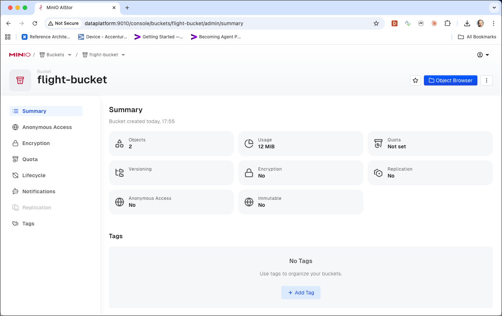

On here click on **Object Browser** and then click on **raw** and **airports**:  

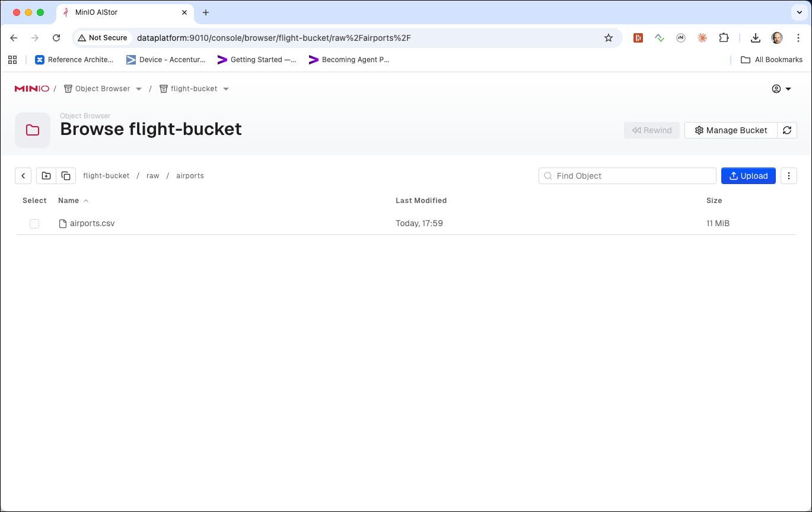

### Upload the Carriers JSON file to the new bucket

To upload the carriers JSON file we are going to use the `s3cmd put` command, which is available through the `awscli` docker container. 

First for the `carriers.json`

```bash
docker exec -ti awscli s3cmd put /data-transfer/flight-data/carriers.json s3://flight-bucket/raw/carriers/carriers.json
```

> **What you should see:** A progress line ending with `upload: '/data-transfer/flight-data/carriers.json' -> 's3://flight-bucket/raw/carriers/carriers.json'`.

Check again in the MinIO Aistor Console that the object has been uploaded.

### Upload the different Flights data CSV files to the new bucket

Next let's upload some flights data files, all documenting flights in April and May of 2008

```bash
docker exec -ti awscli s3cmd put /data-transfer/flight-data/flights-small/flights_2008_4_1.csv s3://flight-bucket/raw/flights/ &&
   docker exec -ti awscli s3cmd put /data-transfer/flight-data/flights-small/flights_2008_4_2.csv s3://flight-bucket/raw/flights/ &&
   docker exec -ti awscli s3cmd put /data-transfer/flight-data/flights-small/flights_2008_5_1.csv s3://flight-bucket/raw/flights/ &&
   docker exec -ti awscli s3cmd put /data-transfer/flight-data/flights-small/flights_2008_5_2.csv s3://flight-bucket/raw/flights/ &&
   docker exec -ti awscli s3cmd put /data-transfer/flight-data/flights-small/flights_2008_5_3.csv s3://flight-bucket/raw/flights/
```

> **What you should see:** Five upload confirmation lines, one per file, each ending with `-> 's3://flight-bucket/raw/flights/<filename>'`.

All these objects are now available in the flight-bucket under the `raw/flights` path.

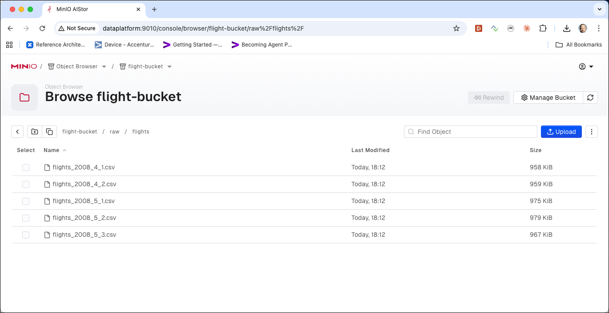

### Upload the Flight Handbook PDF file to the new bucket

Now after we have seen how to upload text files, let's also upload a binary file. In the `data-transfer/flight-data` there is the `pilot-handbook.pdf` PDF file. Let's upload this into a pdf folder:

```bash
docker exec -ti minio-mc mc cp /data-transfer/flight-data/pilot_handbook.pdf minio-1/flight-bucket/raw/pdf/
```

> **What you should see:** A progress bar and confirmation that the PDF was uploaded to `minio-1/flight-bucket/raw/pdf/pilot_handbook.pdf`.

> **What just happened?** Object storage treats every file — text, CSV, PDF, image — identically as a sequence of bytes. The file extension is stored as metadata but has no special meaning to the storage engine itself.

The file has been upload, which you can again check using the MinIO Aistor console.

Click on `flight-bucket` | `raw` | `pdf` and select the newly uploaded `pilot_handbook.pdf` object

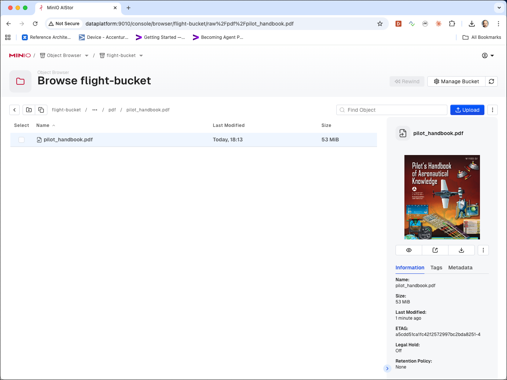

You can see a preview of the PDF on the right.

The MinIO Aistor Console also allows you to get a sharable link for this object. Click on the second icon in the menu to the right of the object:

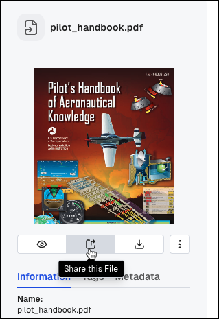

A pop-up window will appear from where you can copy the link by clicking on the **Copy** icon:

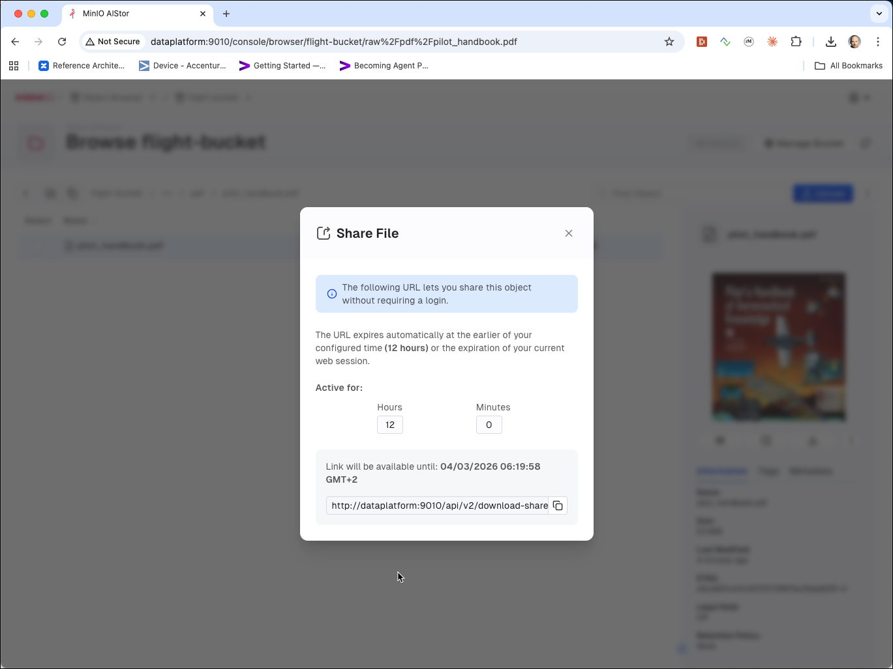

> **What you should see:** A pre-signed URL containing a time-limited access token that allows anyone with the link to download the object without needing credentials.

Copy the link into a Web-browser window (make sure to replace `127.0.0.1:9014` by `<public-ip-address>:9005`) and the document will be downloaded locally to disk or depending on the browser directly rendered in the browser. 


We can see that an object store can also handle binary objects such as images, pdfs, ... and that they can be retrieved over these URLs.

## Downloading objects

### Using mc

To download an object from MinIO to the local filesystem, use the `mc cp` command with source and destination reversed:

```bash
docker exec -ti minio-mc mc cp minio-1/flight-bucket/raw/airports/airports.csv /data-transfer/airports-download.csv
```

> **What you should see:** A progress bar and a confirmation line showing the file was downloaded to `/data-transfer/airports-download.csv`.

You can also download an entire prefix recursively with the `--recursive` flag:

```bash
docker exec -ti minio-mc mc cp --recursive minio-1/flight-bucket/raw/flights/ /data-transfer/flights-download/
```

> **What you should see:** Five progress bars (one per file) as all objects under `raw/flights/` are downloaded into the local `flights-download/` directory.

### Using s3cmd

To download an object using `s3cmd get`:

```bash
docker exec -ti awscli s3cmd get s3://flight-bucket/raw/carriers/carriers.json /data-transfer/carriers-download.json
```

> **What you should see:** A line ending with `download: 's3://flight-bucket/raw/carriers/carriers.json' -> '/data-transfer/carriers-download.json'`.

## Copying objects within MinIO

You can copy objects between paths or buckets entirely within MinIO without downloading them locally, using `mc cp`:

```bash
docker exec -ti minio-mc mc cp minio-1/flight-bucket/raw/airports/airports.csv minio-1/flight-bucket/backup/airports/airports.csv
```

> **What you should see:** A confirmation that `airports.csv` was copied to the `backup/airports/` path within the same bucket.

> **What just happened?** The copy happens server-side inside MinIO — no data is transferred to your machine and back. This is equivalent to S3's server-side copy operation.

To copy a whole prefix to another bucket:

```bash
docker exec -ti minio-mc mc cp --recursive minio-1/flight-bucket/raw/ minio-1/flight-bucket/backup/
```

> **What you should see:** A confirmation line for each object copied, mirroring the full `raw/` hierarchy under `backup/`.

To move (copy then delete the source), use `mc mv`:

```bash
docker exec -ti minio-mc mc mv minio-1/flight-bucket/raw/airports/airports.csv minio-1/flight-bucket/archive/airports/airports.csv
```

> **What you should see:** A confirmation that the object was moved to `archive/airports/airports.csv`.

> **What just happened?** `mc mv` is a shorthand for `mc cp` followed by `mc rm` on the source — there is no native move/rename operation in S3-compatible object stores.

## Deleting objects and buckets

### Deleting objects

To delete a single object, use `mc rm`:

```bash
docker exec -ti minio-mc mc rm minio-1/flight-bucket/raw/airports/airports.csv
```

> **What you should see:** A confirmation line `Removed \`minio-1/flight-bucket/raw/airports/airports.csv\``.

To delete all objects under a prefix recursively:

```bash
docker exec -ti minio-mc mc rm --recursive --force minio-1/flight-bucket/raw/flights/
```

> **What you should see:** Multiple `Removed` lines, one per deleted object under `raw/flights/`.

> **What just happened?** The `--recursive` flag makes `mc rm` walk all keys sharing the given prefix and delete them one by one. The `--force` flag suppresses the confirmation prompt — without it the command would ask you to confirm each deletion.

You can also use `s3cmd del` to remove an object:

```bash
docker exec -ti awscli s3cmd del s3://flight-bucket/raw/carriers/carriers.json
```

> **What you should see:** A line `delete: 's3://flight-bucket/raw/carriers/carriers.json'` confirming the object was removed.

### Deleting a bucket

To remove an empty bucket, use `mc rb`:

```bash
docker exec -ti minio-mc mc rb minio-1/flight-bucket
```

> **What you should see:** `Removed \`minio-1/flight-bucket\``. If the bucket still contains objects the command will fail with an error — empty the bucket first or use `--force`.

To remove a bucket and all its contents in one step, add the `--force` flag:

```bash
docker exec -ti minio-mc mc rb --force minio-1/flight-bucket
```

> **What you should see:** `Removed \`minio-1/flight-bucket\`` after all contained objects have been deleted.

> **What just happened?** `--force` first empties all objects from the bucket and then removes the bucket itself in a single command. Use with care — this operation is irreversible.

**Note**: use `--force` with care — this is irreversible.
