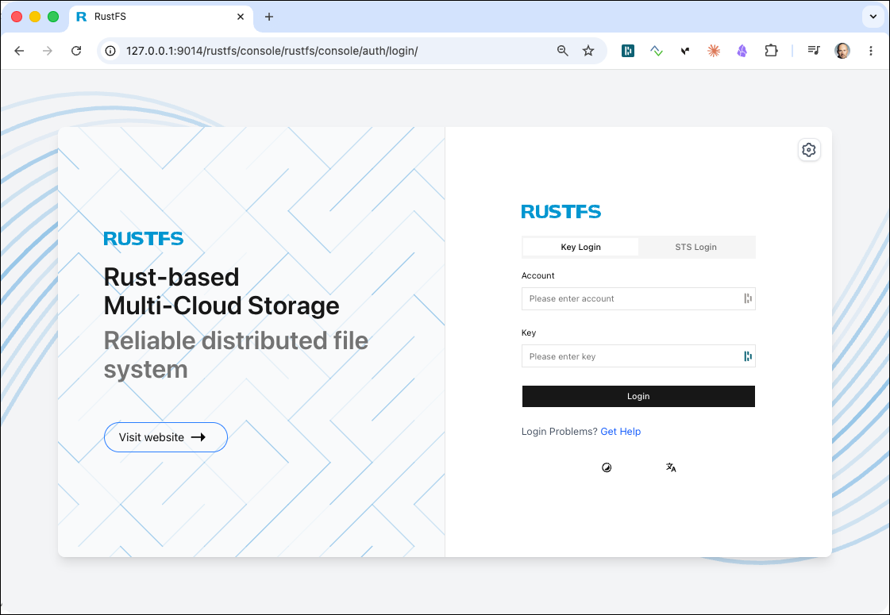
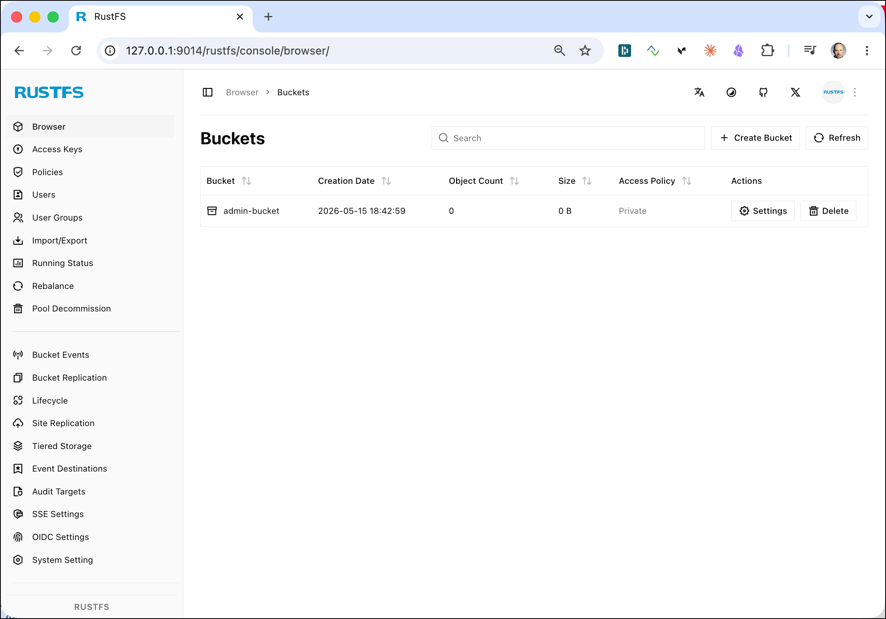
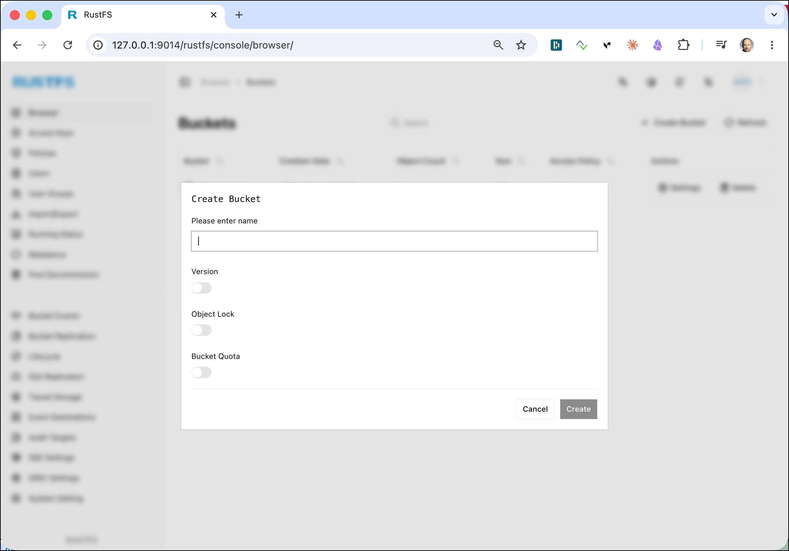
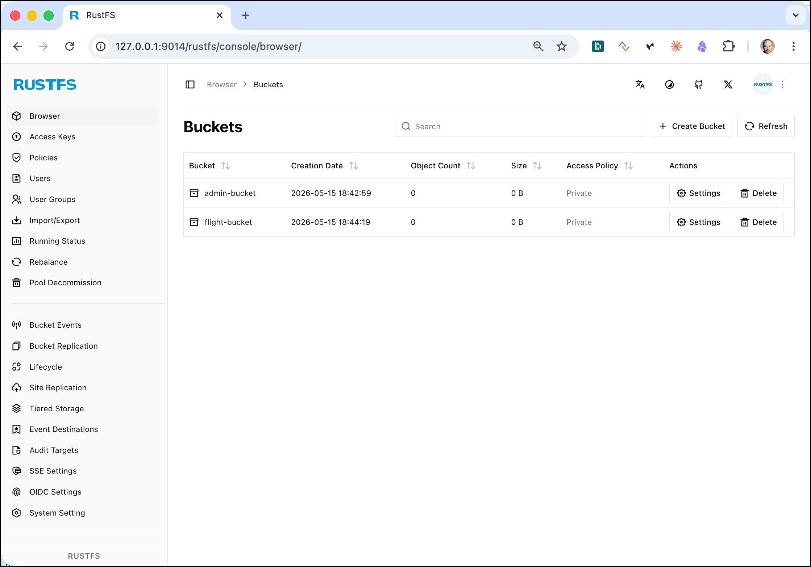
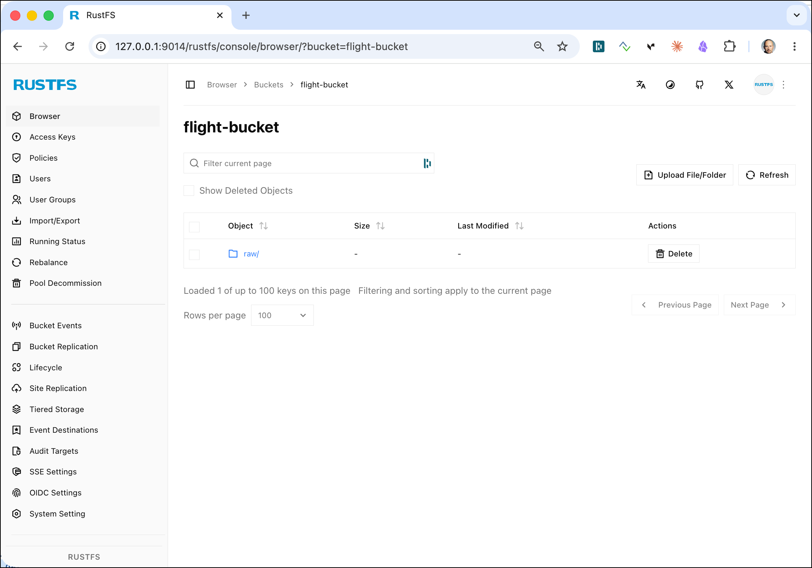
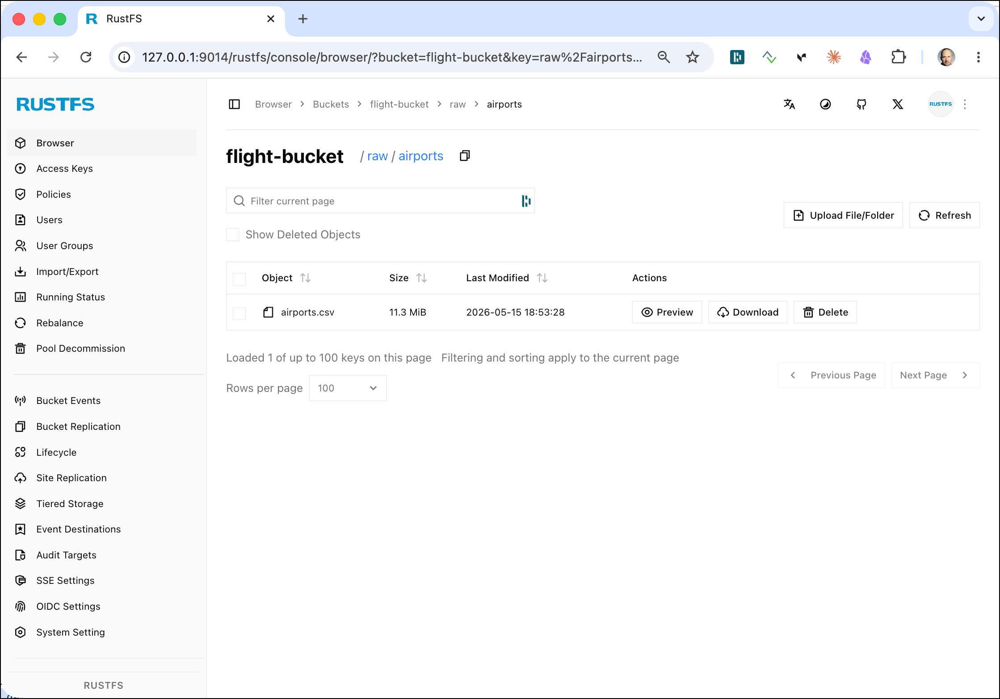
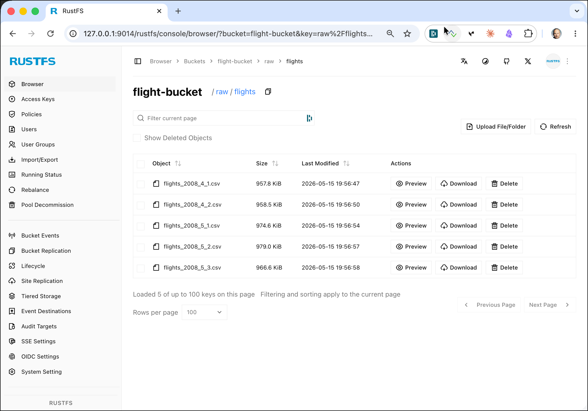
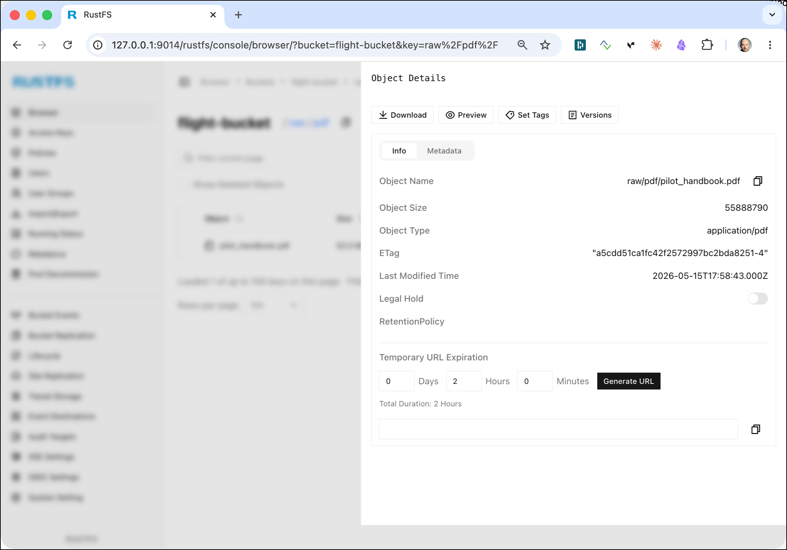
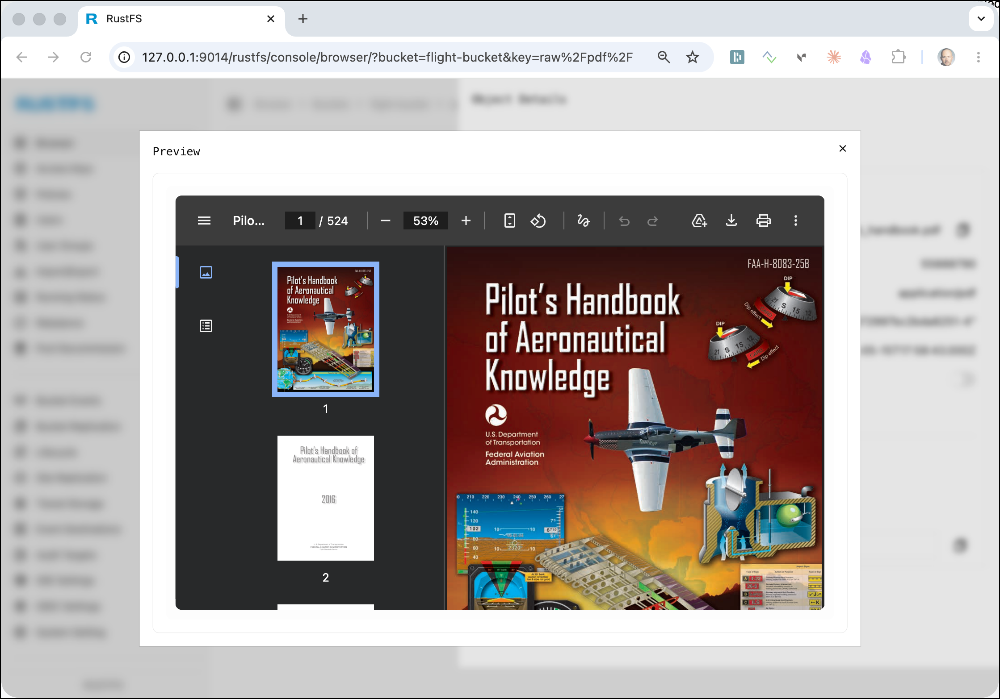
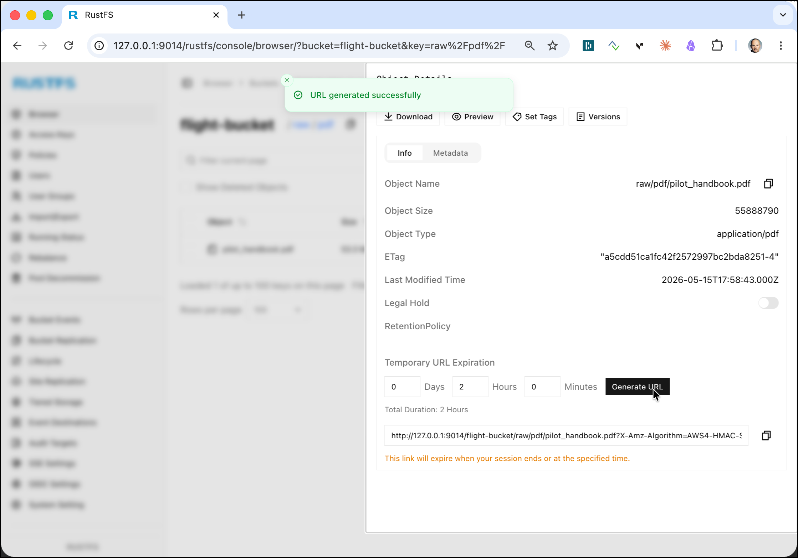

# Working with RustFS Object Storage

In this workshop we will work with [RustFS](https://rustfs.com/) Object Storage to persist data. It will also be used in the other workshops and is configured as the default filesystem for Spark and the ecosystem.

We assume that the **Data platform** described [here](../00-environment) is running and accessible.

In this workshop, we will use the `airports-data` and `flight-data` available in the `data-transfer` folder of the environment and upload it to RustFS. These files will also be used later by other workshops.

## Table of Contents

- [What you will learn](#what-you-will-learn)
- [Prerequisites](#prerequisites)
- [Accessing RustFS](#accessing-rustfs)
- [Create a Bucket](#create-a-bucket)
- [Uploading data](#uploading-data)
- [Downloading objects](#downloading-objects)
- [Copying objects within RustFS](#copying-objects-within-rustfs)
- [Deleting objects and buckets](#deleting-objects-and-buckets)

## What you will learn

- How to create buckets in RustFS using the Web Console, `mc`, and `s3cmd`
- How to upload files (CSV, JSON, PDF) to object storage using the command line and the browser
- How to list, browse, and inspect objects using `mc ls`, `mc tree`, and the RustFS Console
- How to share objects via a pre-signed URL
- How to download objects back to the local filesystem using `mc cp` and `s3cmd get`
- How to delete objects and buckets using `mc rm` and `mc rb`
- How to copy and move objects within RustFS using `mc cp` and `mc mv`
- How an object store serves as an S3-compatible drop-in replacement for HDFS

## Prerequisites

- The **Data Platform** described [here](../00-environment) is running and accessible
- The `airports-data` and `flight-data` files are available in the `data-transfer` folder of the environment

### Volume Map data for RustFS container

If you want the data to persist even after you shutdown the docker-compose stack, then you might want to add an additional volume mapping to the `rustfs-1` service (this is of less use if you have provisioned the stack on **AWS Lightsail**).

```bash
    volumes:
      - './container-volume/rustfs/data/:/data'
```

You can enable this in Platys by setting `RUSTFS_volume_map_data` to `true` and regenerating the stack.

## Accessing RustFS

[RustFS](https://rustfs.com/) is a high-performance, S3-compatible object storage server written in Rust. It is compatible with the Amazon S3 API and is best suited for storing unstructured data such as photos, videos, log files, backups, and container images. Object size can range from a few KBs to a maximum of 5TB.

There are various ways for accessing RustFS:

 * **S3cmd** - a command line S3 client for working with S3-compliant object stores
 * **mc** - the MinIO-compatible command line utility (also works with RustFS)
 * **RustFS Console** - a browser-based GUI for working with RustFS

These are only a few of the tools available to work with S3. And because an object store is a drop-in replacement for HDFS, we can also use it from the tools in the Big Data ecosystem such as Hadoop Hive, Spark, ...

**Using S3cmd**

[S3cmd](https://s3tools.org/s3cmd) is a command line utility for working with S3.

In our environment, S3cmd is accessible inside the `awscli` container.

Running `s3cmd -h` will show the help page of s3cmd.

```bash
docker exec -ti awscli s3cmd -h
```

This can also be found on the [S3cmd usage page](https://s3tools.org/usage).

**Using mc**

In our environment, `mc` is accessible inside the `rustfs-mc` container.

Running `mc -h` will show the help page of mc.

```bash
docker exec -ti rustfs-mc mc -h
```

**Using the RustFS Console**

In a browser window, navigate to <http://dataplatform:9014>.



Enter `admin` into the **Account** and `abc123abc123!` into the **Key** field and click on the **Login** button. The keys are defined in the `rustfs-1` service definition in the [docker-compose.yml](../00-environment/docker/docker-compose.yml) file.

The RustFS Console with the browser view should now appear.



Before we can upload the files to RustFS, we first have to create a new bucket. We can either do it over the Console or using a Command-Line Interface (CLI).

## Create a Bucket 

### Using the RustFS Console (Web UI)

Click on the **Browser** menu item on the left, then click the **+ Create Bucket** button.



Enter `flight-bucket` into the **Please enter name** field, leave the options disabled and click **Create**.

### Using mc

Here are the commands to perform when using the **mc** utility on the command line:

```bash
docker exec -ti rustfs-mc mc mb rustfs-1/flight-bucket
```

**Note**: add the `--with-lock` flag if you want to enable object locking on the bucket.

You should get the confirmation message:

```bash
bigdata@bigdata:~$ docker exec -ti rustfs-mc mc mb rustfs-1/flight-bucket

Bucket created successfully `rustfs-1/flight-bucket`.
```

Navigate to the RustFS Console (<http://dataplatform:9014>) and you should see the newly created bucket.



You can also use `mc ls` to list all buckets:

```bash
docker exec -ti rustfs-mc mc ls rustfs-1
```

and you should get:

```
bigdata@bigdata:~$ docker exec -ti rustfs-mc mc ls rustfs-1
[2026-04-02 12:08:34 UTC]     0B admin-bucket/
[2026-04-02 15:55:25 UTC]     0B flight-bucket/
```

**Note**: the `admin-bucket` has been created when starting the platform.

## Uploading data

### Upload the Airport and Plane-Data CSV files to the new bucket

To upload a file we are going to use the `cp` command of `mc`. First for the `airports.csv`:

```bash
docker exec -ti rustfs-mc mc cp /data-transfer/airport-data/airports.csv rustfs-1/flight-bucket/raw/airports/airports.csv
```

and then also for the `plane-data.csv` file:

```bash
docker exec -ti rustfs-mc mc cp /data-transfer/flight-data/plane-data.csv rustfs-1/flight-bucket/raw/planes/plane-data.csv
```

Let's use the `mc ls` command once more but now to display the content of the `flight-bucket`:

```bash
docker exec -ti rustfs-mc mc ls rustfs-1/flight-bucket/
```

We can see that the bucket contains a directory with the name `raw`, which is the prefix we used when uploading the data above.

```bash
bigdata@bigdata:~$ docker exec -ti rustfs-mc mc ls rustfs-1/flight-bucket/
[2026-04-02 15:59:40 UTC]     0B raw/
```

If we use the `-r` argument:

```bash
docker exec -ti rustfs-mc mc ls -r rustfs-1/flight-bucket/
```

we can see the objects with the hierarchy as well:

```bash
bigdata@bigdata:~$ docker exec -ti rustfs-mc mc ls -r rustfs-1/flight-bucket/
[2026-04-02 15:59:21 UTC]  11MiB STANDARD raw/airports/airports.csv
[2026-04-02 15:59:31 UTC] 418KiB STANDARD raw/planes/plane-data.csv
```

You can also use the `tree` command to display it as a tree:

```bash
docker exec -ti rustfs-mc mc tree rustfs-1/flight-bucket/
```

```bash
bigdata@bigdata:~$ docker exec -ti rustfs-mc mc tree rustfs-1/flight-bucket/
rustfs-1/flight-bucket/
└─ raw
   ├─ airports
   └─ planes
```

If we use the `--files` option we can see the files as well:

```bash
docker exec -ti rustfs-mc mc tree --files rustfs-1/flight-bucket/
```

```bash
bigdata@bigdata:~$ docker exec -ti rustfs-mc mc tree --files rustfs-1/flight-bucket/
rustfs-1/flight-bucket/
└─ raw
   ├─ airports
   │  └─ airports.csv
   └─ planes
      └─ plane-data.csv
```

You can also browse the same structure in the RustFS Console at <http://dataplatform:9014>. 

In the **Browser** page, click on `flight-bucket`, 



then navigate to `raw` → `airports`.



### Upload the Carriers JSON file to the new bucket

To upload the carriers JSON file we are going to use the `s3cmd put` command, available through the `awscli` docker container:

```bash
docker exec -ti awscli s3cmd put /data-transfer/flight-data/carriers.json s3://flight-bucket/raw/carriers/carriers.json
```

Check in the RustFS Console that the object has been uploaded.

### Upload the different Flights data CSV files to the new bucket

Next let's upload some flights data files, all documenting flights in April and May of 2008:

```bash
docker exec -ti awscli s3cmd put /data-transfer/flight-data/flights-small/flights_2008_4_1.csv s3://flight-bucket/raw/flights/ &&
   docker exec -ti awscli s3cmd put /data-transfer/flight-data/flights-small/flights_2008_4_2.csv s3://flight-bucket/raw/flights/ &&
   docker exec -ti awscli s3cmd put /data-transfer/flight-data/flights-small/flights_2008_5_1.csv s3://flight-bucket/raw/flights/ &&
   docker exec -ti awscli s3cmd put /data-transfer/flight-data/flights-small/flights_2008_5_2.csv s3://flight-bucket/raw/flights/ &&
   docker exec -ti awscli s3cmd put /data-transfer/flight-data/flights-small/flights_2008_5_3.csv s3://flight-bucket/raw/flights/
```

All these objects are now available in the `flight-bucket` under the `raw/flights` path.



### Upload the Flight Handbook PDF file to the new bucket

Now after we have seen how to upload text files, let's also upload a binary file. In the `data-transfer/flight-data` there is the `pilot-handbook.pdf` PDF file. Let's upload this into a pdf folder:

```bash
docker exec -ti rustfs-mc mc cp /data-transfer/flight-data/pilot_handbook.pdf rustfs-1/flight-bucket/raw/pdf/
```

Check in the RustFS Console that the file has been uploaded. Click on `flight-bucket` | `raw` | `pdf` and select the newly uploaded `pilot_handbook.pdf` object.



On the **Object Details** page, click on **Preview**



You can see a preview of the PDF in a pop-up window. Click **ESC** to exit the viewer.

The RustFS Console also allows you to get a sharable link for an object. Click again on the object and on the **Object Details** page, click on the **Generate URL** button and a link will appear below.



Copy the link into a Web-browser window (make sure to replace `127.0.0.1:9014` by `<public-ip-address>:9005`) and the document will be downloaded locally to disk or depending on the browser directly rendered in the browser.


We can see that an object store can also handle binary objects such as images, PDFs, ... and that they can be retrieved over these URLs.

## Downloading objects

### Using mc

To download an object from RustFS to the local filesystem, use the `mc cp` command with the source and destination reversed:

```bash
docker exec -ti rustfs-mc mc cp rustfs-1/flight-bucket/raw/airports/airports.csv /data-transfer/airports-download.csv
```

You can also download an entire prefix recursively with the `--recursive` flag:

```bash
docker exec -ti rustfs-mc mc cp --recursive rustfs-1/flight-bucket/raw/flights/ /data-transfer/flights-download/
```

### Using s3cmd

To download an object using `s3cmd get`:

```bash
docker exec -ti awscli s3cmd get s3://flight-bucket/raw/carriers/carriers.json /data-transfer/carriers-download.json
```

## Copying objects within RustFS

You can copy objects between paths or buckets entirely within RustFS without downloading them locally, using `mc cp`:

```bash
docker exec -ti rustfs-mc mc cp rustfs-1/flight-bucket/raw/airports/airports.csv rustfs-1/flight-bucket/backup/airports/airports.csv
```

To copy a whole prefix to another bucket:

```bash
docker exec -ti rustfs-mc mc cp --recursive rustfs-1/flight-bucket/raw/ rustfs-1/flight-bucket/backup/
```

To move (copy then delete the source), use `mc mv`:

```bash
docker exec -ti rustfs-mc mc mv rustfs-1/flight-bucket/raw/airports/airports.csv rustfs-1/flight-bucket/archive/airports/airports.csv
```

## Deleting objects and buckets

### Deleting objects

To delete a single object, use `mc rm`:

```bash
docker exec -ti rustfs-mc mc rm rustfs-1/flight-bucket/raw/airports/airports.csv
```

To delete all objects under a prefix recursively:

```bash
docker exec -ti rustfs-mc mc rm --recursive --force rustfs-1/flight-bucket/raw/flights/
```

You can also use `s3cmd del` to remove an object:

```bash
docker exec -ti awscli s3cmd del s3://flight-bucket/raw/carriers/carriers.json
```

### Deleting a bucket

To remove an empty bucket, use `mc rb`:

```bash
docker exec -ti rustfs-mc mc rb rustfs-1/flight-bucket
```

To remove a bucket and all its contents in one step, add the `--force` flag:

```bash
docker exec -ti rustfs-mc mc rb --force rustfs-1/flight-bucket
```

**Note**: use `--force` with care — this is irreversible.

