# Working with Amazon S3 Object Storage (optional)

In this workshop we will work with [AWS S3](https://aws.amazon.com/pm/serv-s3/?gclid=Cj0KCQjwiqbBBhCAARIsAJSfZkZ64a2X7fvLZ-MYtuPYm9xTbZ6k5BsS9oSB0MX4osDvcDh1UT4X83AaAs7cEALw_wcB&trk=518a7bef-5b4f-4462-ad55-80e5c177f12b&sc_channel=ps&ef_id=Cj0KCQjwiqbBBhCAARIsAJSfZkZ64a2X7fvLZ-MYtuPYm9xTbZ6k5BsS9oSB0MX4osDvcDh1UT4X83AaAs7cEALw_wcB:G:s&s_kwcid=AL!4422!3!645186213484!e!!g!!aws%20s3!19579892800!143689755565&gad_campaignid=19579892800) Object Storage to persist data. 

To do this workshop you need an AWS subscription.  

## Table of Contents

- [What you will learn](#what-you-will-learn)
- [Prerequisites](#prerequisites)
- [Using Amazon S3](#using-amazon-s3)
  - [Create a Bucket](#create-a-bucket)
  - [Upload objects to the S3 bucket](#upload-objects-to-the-s3-bucket)
  - [Using S3 Select](#using-s3-select)
  - [Create Access Credentials](#create-access-credentials)
  - [Using the AWS CLI to work with S3](#using-the-aws-cli-to-work-with-s3)

## What you will learn

- How to create S3 buckets and configure access policies in the AWS Console
- How to upload files and folders to S3 using the browser-based console
- How to delete objects and navigate the S3 object hierarchy
- How to query structured data directly in S3 using S3 Select (CSV, JSON, Parquet)
- How to create IAM users and programmatic access credentials
- How to use the AWS CLI (`aws s3`) to list and manage objects from the command line

## Prerequisites

- An active AWS subscription with permissions to create S3 buckets and IAM users
- The flight data ZIP file downloaded locally (linked in the workshop instructions)
- The AWS CLI installed (instructions provided in the workshop)

## Using Amazon S3

Navigate to the S3 console <https://s3.console.aws.amazon.com/s3>.

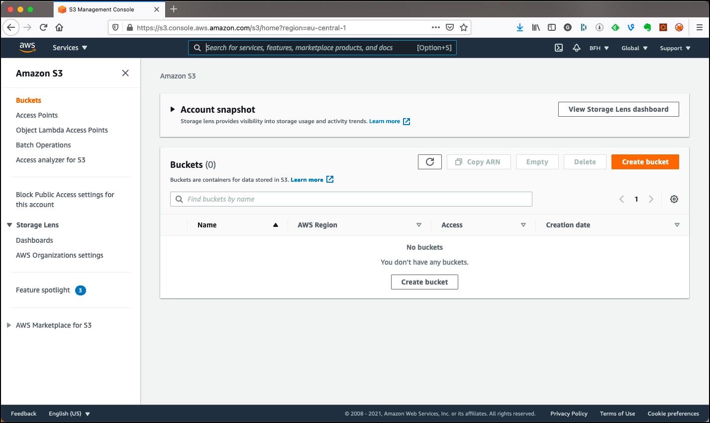

> **What you should see:** The S3 console showing a list of your existing buckets (empty if this is a fresh account) and the **Create bucket** button in the top-right area.

We will first use the browser based UI to create buckets and upload objects.

### Create a Bucket

Before we can upload the files to MinIO, we first have to create a bucket.

Click on **Create bucket** 

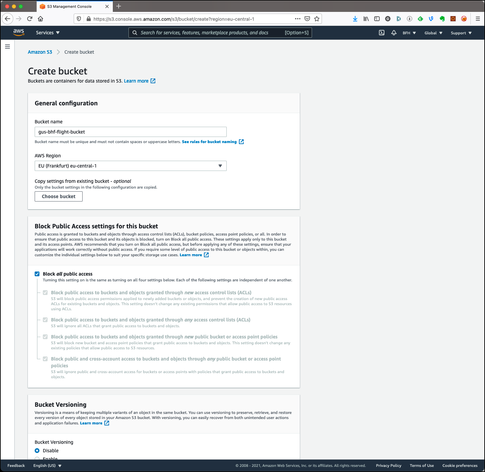

Enter `<useralias>-bfh-flight-bucket` into the **Bucket name** field. Make sure to replace <useralias> by your alias. Remember, bucket names have to be globally unique.

Chose the **AWS Region** where you want the bucket to be. Unselect **Block all public access** if you want the objects in the bucket to be publicly accessible. 

If you want versioning on your objects, enable **Bucket Versioning**.

Click on **Create bucket** at the bottom of the page.

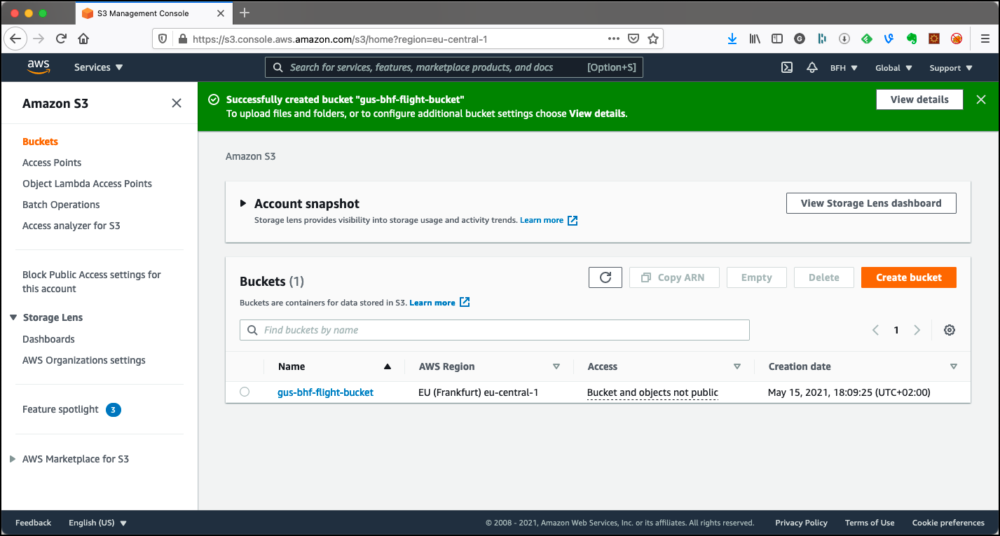

> **What you should see:** The new bucket (e.g. `<useralias>-bfh-flight-bucket`) now appears in the bucket list on the S3 console home page.

> **What just happened?** S3 bucket names are globally unique across all AWS accounts — if someone else already owns the name you chose you will get an error. The region you selected determines where the data physically resides and affects latency and data-sovereignty compliance.

### Upload objects to the S3 bucket

In order to upload files via the browser-based S3 console, the files need to be available locally (from where you run the browser). Therefore first download this [flight-data.zip](https://github.com/gschmutz/hadoop-spark-workshop/raw/master/00-environment/data/flight-data.zip) zip file and unzip it to a local folder. 

To upload a file we can use the browser-based UI. On the s3 console, click on the bucket created before and you will see the object details page as shown below. 

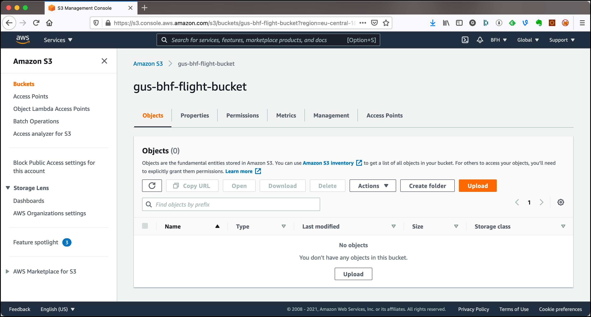

In this stage, with an empty bucket, you either create a folder using the **Create Folder** button or upload objects using the **Upload** button.   

Let's upload our first objects by clicking on **Upload**.

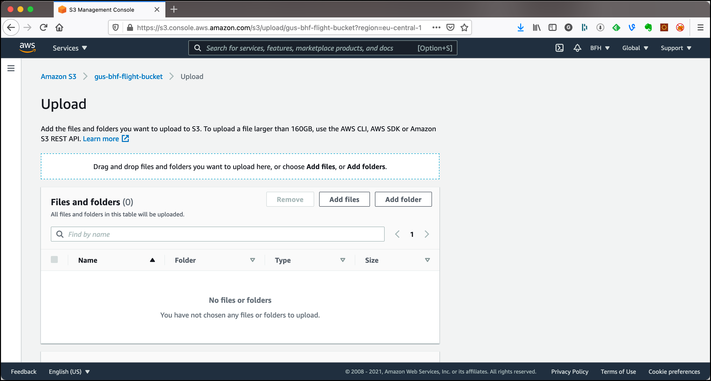

You can either click on **Add files** to add single files or **Add folder** to upload the complete folder with all the files within.

Let's upload the whole `flight-data` folder created by unzipping the file downloaded before. 

Click on **Add folder** and the file browser will appear. Navigate to the place you have unzipped the data, select the `flight-data` folder and click **Upload**. 

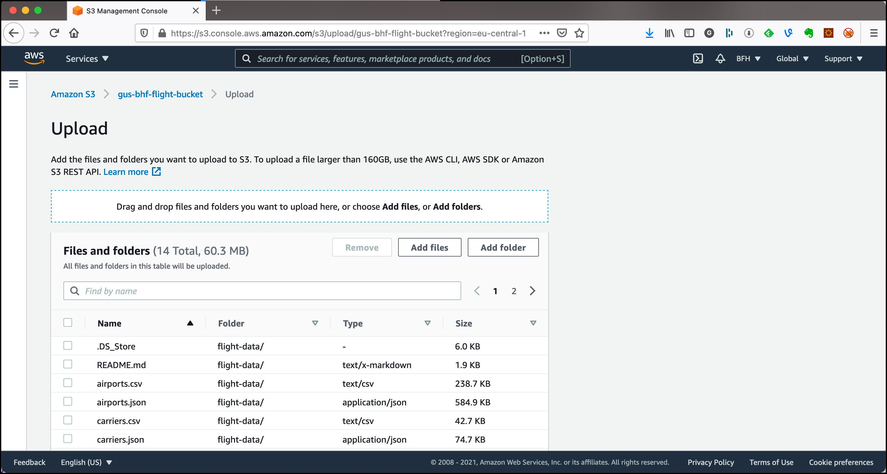

Scroll all the way down and click on **Upload**. The Upload status page will appear with a status bar showing the progress of the upload. After a while you should get the **Upload succeeded** green bar as shown below. You can also see that 60.3 MB have been uploaded in total. 

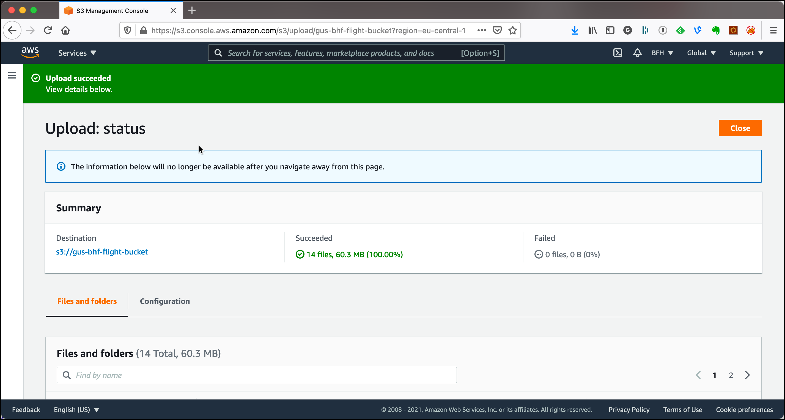

> **What you should see:** A green **Upload succeeded** banner and a summary showing the total number of files and bytes uploaded (approximately 60.3 MB for the full flight-data folder).

Click on **Close** to return to the bucket overview page. 

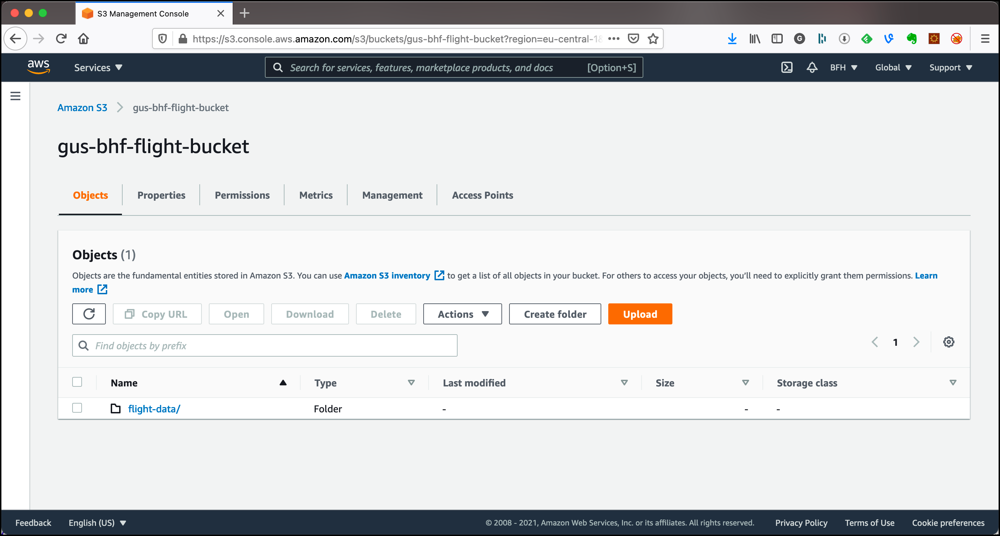

> **What you should see:** The `flight-data` folder listed as an object prefix inside the bucket.

You can see the folder `flight-data` which we have successfully uploaded. To view the objects, click onto the folder link. Inside the `flight-data` folder, there is a `.DS_Store` file (a mac artefact) which was part of the ZIP file, but is not needed at all. We can delete it by selecting it (click on the check box left to the name)

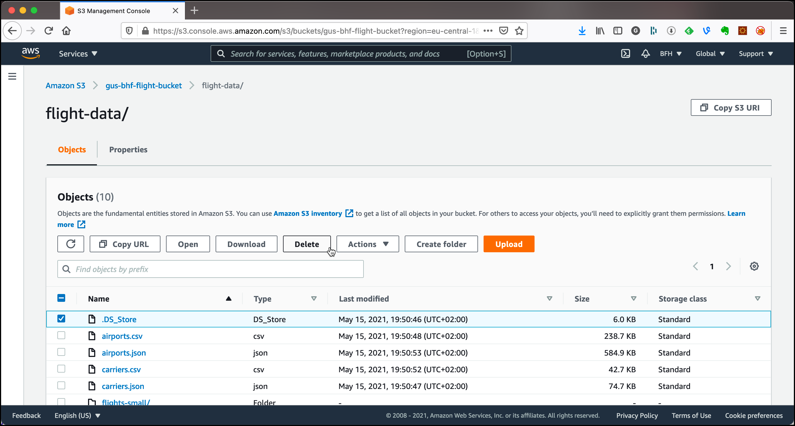

and click on **Delete**. When deleting an object or folder through the S3 console, you have to confirm it. After entering the "passphrase" `permanently delete` into the **To confirm deletion, ...**, the **Delete objects** button will appear. 

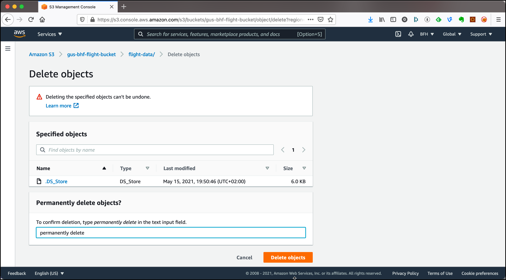
 
Click on it and the object will get deleted. You will see a confirmation page like the one bellow.

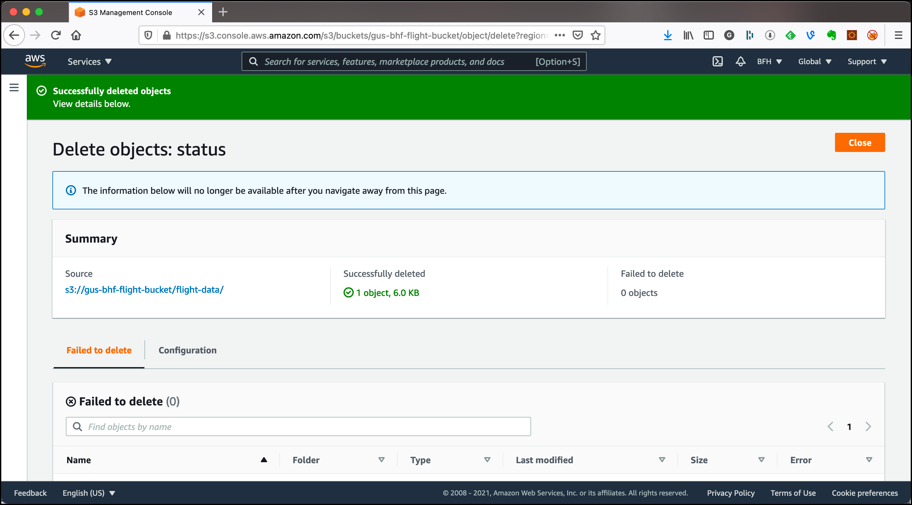

> **What you should see:** A green **Delete succeeded** confirmation page showing the `.DS_Store` object was successfully removed.

> **What just happened?** S3 requires you to type `permanently delete` as a safety guard — there is no recycle bin or undo for object deletion (unless bucket versioning is enabled).

### Using S3 Select

With Amazon S3 we cannot only access objects over the key and get the full object, but we can also use a query language to only return part of the content. This only works if the content is structured and the format is either CSV, JSON or Apache Parquet. 

Let's test that with the `carriers.csv` object. Navigate to `flight-data` folder and select the `carriers.csv` object. Select **Query with S3 Select** from the **Actions** drop down list.

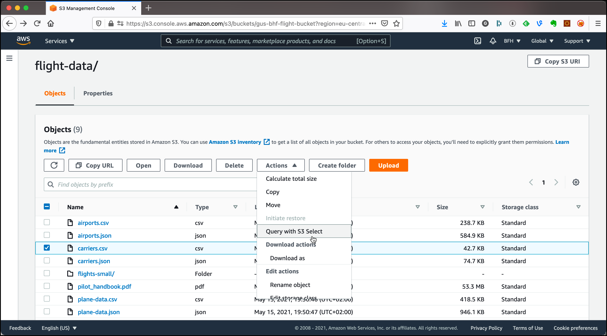

On the **Query with S3 Select** page, select **CSV** as the **Format**, **Comma** as the **CSV delimiter**, click on **Exclude the first line of CSV data** and select **None** for the **Compression**. Leave the **Output settings** as is. 

Scroll down to the **SQL Query** area and extend the SQL statement shown with a where clause, so that only United Airlines is returned: `SELECT * FROM s3object s where s.code='UA'`.

Click on **Run SQL query** and the result will be shown in the **Query results** section.

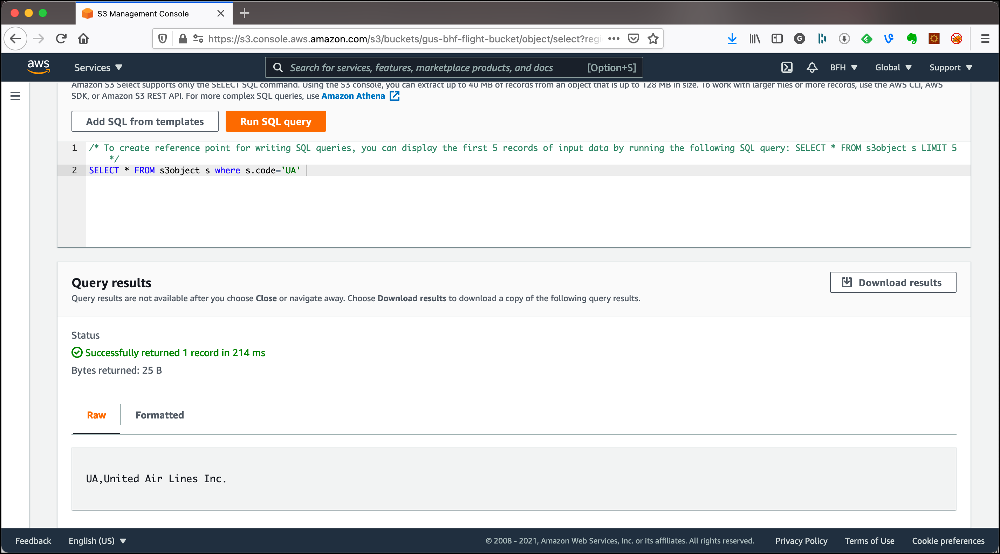

> **What you should see:** A single row returned in the **Query results** section — the United Airlines entry from `carriers.csv` — without downloading the entire file.

> **What just happened?** S3 Select pushes the filter predicate down to the S3 service itself, so only the matching rows are transferred over the network. For large files this dramatically reduces both data transfer costs and latency compared to downloading the full object.

You can click on **Download results** to download it using the format specified in the **Output settings**.

S3 Select provides a simple way to execute SQL queries directly on data stored in Amazon S3 or Amazon S3 Glacier. S3 Select can run against data stored in S3, enabling us to use this feature to process data uploaded to S3.

### Create Access Credentials

If we want to access the data in our bucket from outside, we have to create the necessary access credentials. 

In the menu on the top right, select the user (`BFH` in this setting, will be different in your environment) and click on **My Security Credentials**. 

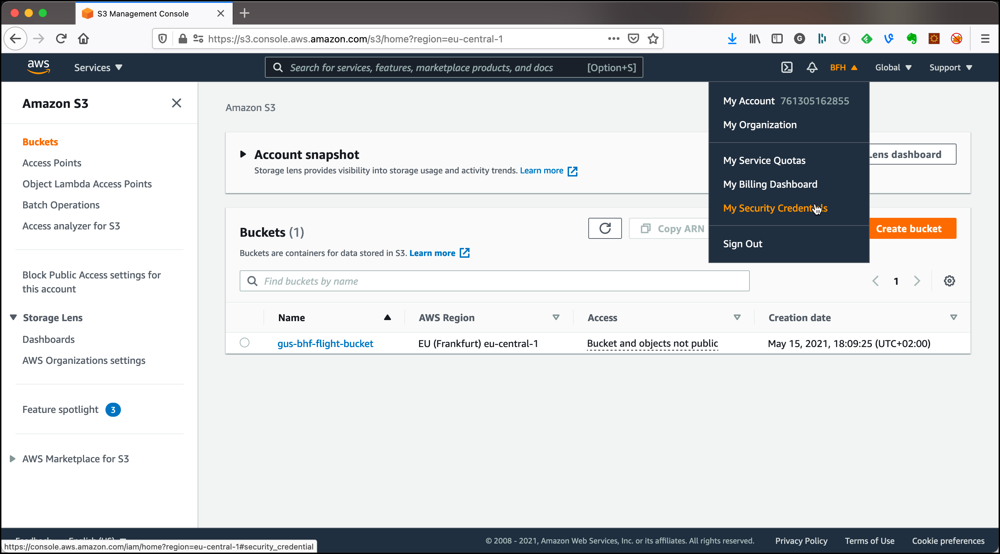

On the **Your Security Credentials** page, select **Users** in the menu to the left.

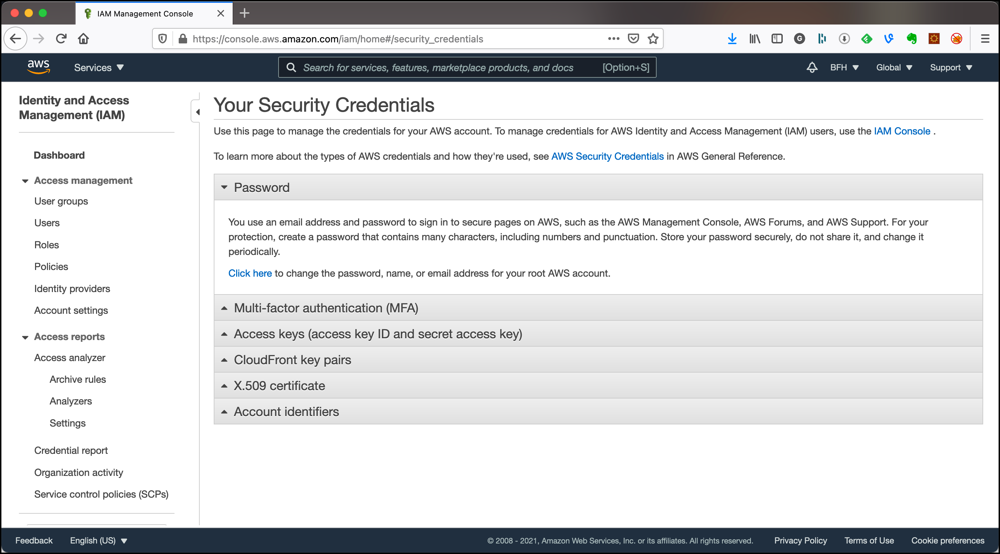

The list of **IAM users** appears, which is empty in my case here. 

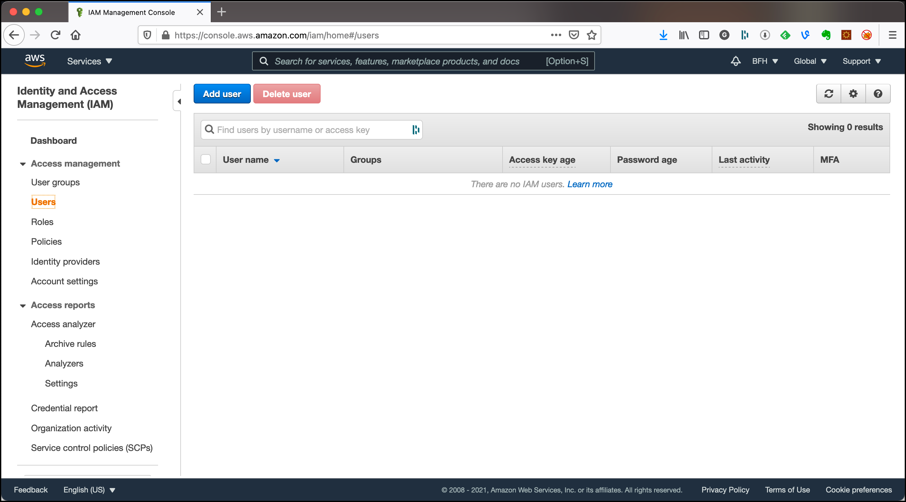

Click **Add user** 

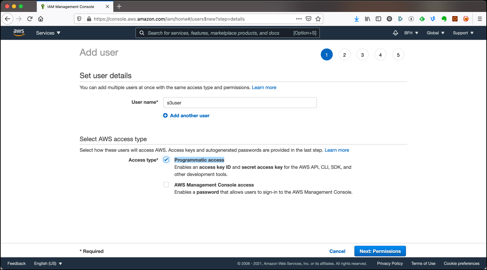

Enter `s3user`into the **User name** field and select the **Programmatic access** check box. Click **Next: Permissions**. 

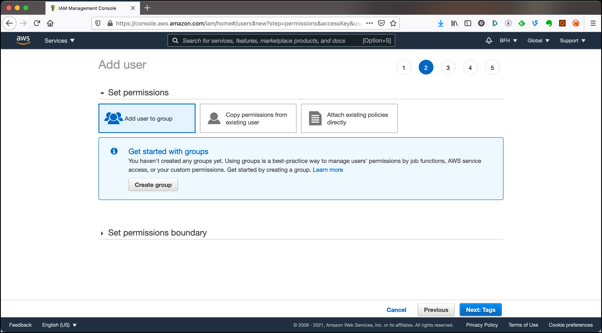

The **Add user to group** is selected by default, but there is not yet a group we can use. Click on **Create group** to create one. 

Enter `s3access` into the **Group name** and enter `s3` into **Filter policies**. 

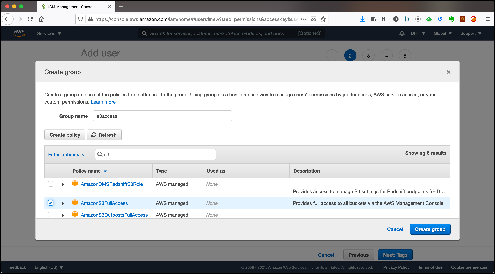

Select the `AmazonS3FullAccess` **Policy name** and click on **Create group**. 

Back on the **Add user** page, click **Next: Tags** and **Next: Review** and **Create user**. You should see the **Success** message.

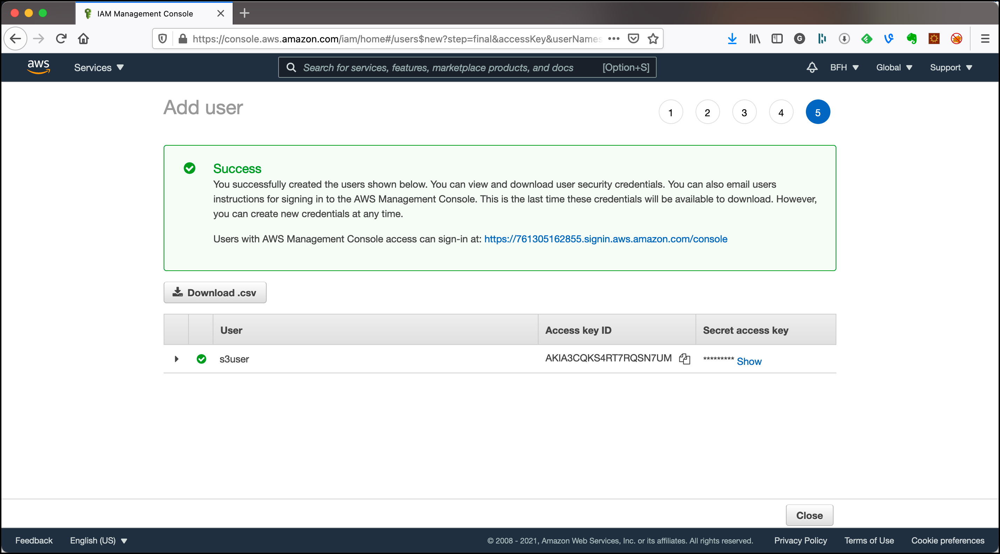

> **What you should see:** A green **Success** banner with the new user `s3user` listed, along with the **Access key ID** and a masked **Secret access key**.

Click on the **show** link to show view the **Secret access key**. It is important to save that value in a safe place, as it can never be displayed after the page is closed. You will need **Access key ID** and **Secret access key** for accessing S3 from external.

> **What just happened?** You created an IAM user with programmatic access only (no AWS Console login). Attaching the `AmazonS3FullAccess` policy via a group gives the user full read/write access to all S3 buckets in the account. The secret access key is shown only once — if lost, you must generate a new key pair.

Click on **Close** and you see the newly created user `s3user` in the list of users.

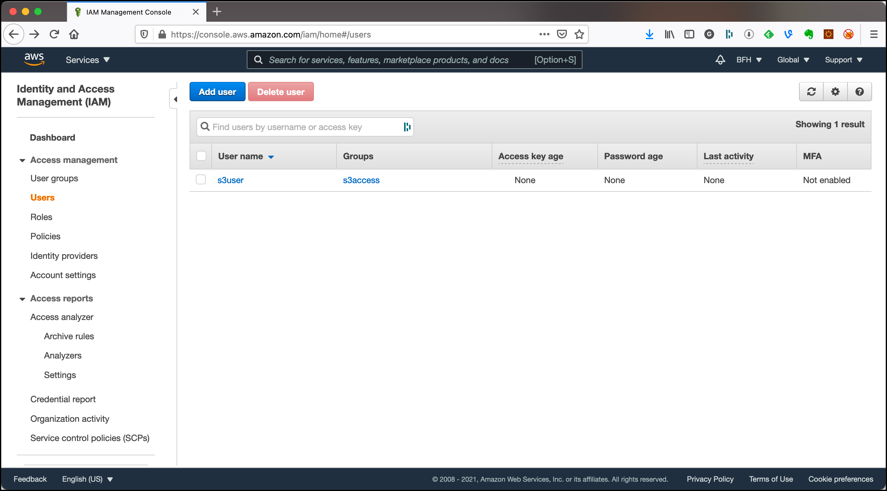

### Using the AWS CLI	to work with S3

Before we can use the AWS CLI, we have to install it. We can do that on the Ubuntu terminal using

```
sudo apt-get install awscli
```

For other environments, consult the documentation [here](https://docs.aws.amazon.com/cli/latest/userguide/install-cliv2.html).

You can view the version of the CLI by using `aws --version`

```
ubuntu@ip-172-26-3-90:~$ aws --version
aws-cli/1.18.69 Python/3.8.5 Linux/5.4.0-1018-aws botocore/1.16.19
```

> **What you should see:** The installed AWS CLI version, Python version, and platform. Any `1.x` or `2.x` version works for these exercises.

To use the AWS CLI, make sure that you have the necessary access credentials available. You can create them as shown in the previous section. Configure the CLI using the `configure` command. 

```
aws configure
```

Enter the values for **AWS Access Key ID** and **AWS Secret Access Key** saved above and enter `eu-central-1` for the **Default region name** and accept the default for **Default output format**.  

> **What you should see:** Four prompts — `AWS Access Key ID`, `AWS Secret Access Key`, `Default region name`, and `Default output format`. After entering the values the prompt returns with no further output, indicating the credentials were saved to `~/.aws/credentials`.

Now you can use the `s3` command to work with S3. Enter `aws s3 help` to see the documentation.

To see all the buckets enter `aws s3 ls`

```
ubuntu@ip-172-26-3-90:~$ aws s3 ls
2021-05-15 16:09:26 gus-bhf-flight-bucket
```

> **What you should see:** A list of all S3 buckets accessible with your credentials, including the `<useralias>-bfh-flight-bucket` created earlier.

You can use the `aws s3 ls help` command to get the documentation for just the `ls` subcommand. 

To see all the objects inside the bucket, use the `--recursive` parameter.

```
ubuntu@ip-172-26-3-90:~$ aws s3 ls --recursive gus-bhf-flight-bucket
2021-05-15 17:50:48       1952 flight-data/README.md
2021-05-15 17:50:48     244438 flight-data/airports.csv
2021-05-15 17:50:53     598901 flight-data/airports.json
2021-05-15 17:50:52      43758 flight-data/carriers.csv
2021-05-15 17:50:47      76537 flight-data/carriers.json
2021-05-15 17:50:52     980792 flight-data/flights-small/flights_2008_4_1.csv
2021-05-15 17:50:51     981534 flight-data/flights-small/flights_2008_4_2.csv
2021-05-15 17:50:49     998020 flight-data/flights-small/flights_2008_5_1.csv
2021-05-15 17:50:50    1002531 flight-data/flights-small/flights_2008_5_2.csv
2021-05-15 17:50:51     989831 flight-data/flights-small/flights_2008_5_3.csv
2021-05-15 17:50:45   55888790 flight-data/pilot_handbook.pdf
2021-05-15 17:50:46     428558 flight-data/plane-data.csv
2021-05-15 17:50:47     968807 flight-data/plane-data.json
```

> **What you should see:** All uploaded objects listed with their last-modified timestamp, size in bytes, and full key path — confirming everything from the `flight-data` folder was uploaded successfully.

> **What just happened?** Without `--recursive`, `aws s3 ls` shows only the top-level prefixes (folders). With `--recursive` it flattens the entire key namespace and lists every individual object, which is useful for auditing bucket contents or scripting bulk operations.
