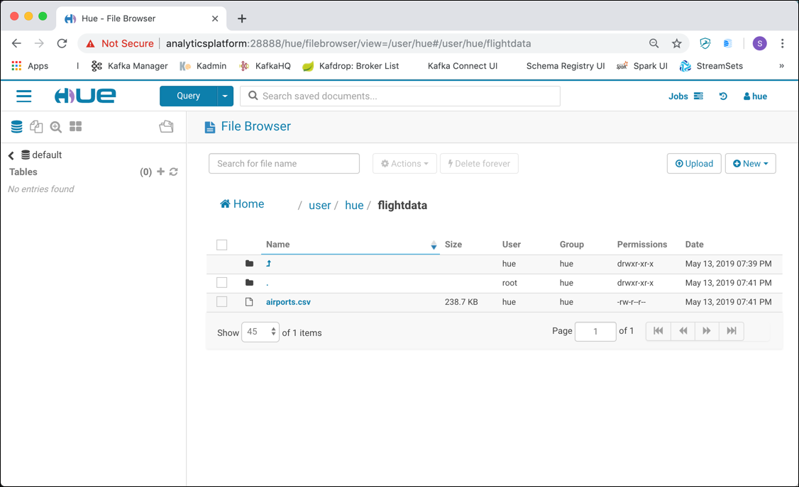

# Loading Data Into HDFS

## Introduction
In this section, you will download the sensor data and load that into HDFS using the Hue File Browser. From there you can perform tasks like create directories, navigate file systems and upload files to HDFS. In addition, you’ll perform a few other file-related tasks as well.  

The Hadoop Distributed File System (HDFS) is a core component of Apache Hadoop and is designed to store large files with streaming data access patterns, running on clusters of commodity hardware. 

We assume that the **Analytics platform** described [here](../01-environment) is running and accessible. 

##	 Accessing HDFS

There various ways for accessing HDFS. In this workshop we will use the following

 * **Hadoop Command** - accessing HDFS from the command line
 * **Hue** - a browser based GUI for working with a Hadoop cluster
  
### Using the Hadoop Command with the File System Shell

The [Hadoop Command](https://hadoop.apache.org/docs/current/hadoop-project-dist/hadoop-common/CommandsManual.html) allows us to work with Hadoop and HDFS through the command line. 
In this workshop we are going to use the [File System Shell](https://hadoop.apache.org/docs/current/hadoop-project-dist/hadoop-common/FileSystemShell.html).  We can use it to create a directory, upload files, move files, delete files or folder and many more. You can access it using the `hadoop fs` command. 

In our environment, the Hadoop command is accessible inside the `namenode` container. To access the help for the `fs` command, enter

```
docker exec -ti namenode hadoop fs
```

and you should get the help page in return

```
bigdata@bigdata:~$ docker exec -ti namenode hadoop fs
Usage: hadoop fs [generic options]
	[-appendToFile <localsrc> ... <dst>]
	[-cat [-ignoreCrc] <src> ...]
	[-checksum <src> ...]
	[-chgrp [-R] GROUP PATH...]
	[-chmod [-R] <MODE[,MODE]... | OCTALMODE> PATH...]
	[-chown [-R] [OWNER][:[GROUP]] PATH...]
	[-copyFromLocal [-f] [-p] [-l] <localsrc> ... <dst>]
	[-copyToLocal [-p] [-ignoreCrc] [-crc] <src> ... <localdst>]
	[-count [-q] [-h] <path> ...]
	[-cp [-f] [-p | -p[topax]] <src> ... <dst>]
	[-createSnapshot <snapshotDir> [<snapshotName>]]
	[-deleteSnapshot <snapshotDir> <snapshotName>]
	[-df [-h] [<path> ...]]
	[-du [-s] [-h] <path> ...]
	[-expunge]
	[-find <path> ... <expression> ...]
	[-get [-p] [-ignoreCrc] [-crc] <src> ... <localdst>]
	[-getfacl [-R] <path>]
	[-getfattr [-R] {-n name | -d} [-e en] <path>]
	[-getmerge [-nl] <src> <localdst>]
	[-help [cmd ...]]
	[-ls [-d] [-h] [-R] [<path> ...]]
	[-mkdir [-p] <path> ...]
	[-moveFromLocal <localsrc> ... <dst>]
	[-moveToLocal <src> <localdst>]
	[-mv <src> ... <dst>]
	[-put [-f] [-p] [-l] <localsrc> ... <dst>]
	[-renameSnapshot <snapshotDir> <oldName> <newName>]
	[-rm [-f] [-r|-R] [-skipTrash] <src> ...]
	[-rmdir [--ignore-fail-on-non-empty] <dir> ...]
	[-setfacl [-R] [{-b|-k} {-m|-x <acl_spec>} <path>]|[--set <acl_spec> <path>]]
	[-setfattr {-n name [-v value] | -x name} <path>]
	[-setrep [-R] [-w] <rep> <path> ...]
	[-stat [format] <path> ...]
	[-tail [-f] <file>]
	[-test -[defsz] <path>]
	[-text [-ignoreCrc] <src> ...]
	[-touchz <path> ...]
	[-truncate [-w] <length> <path> ...]
	[-usage [cmd ...]]

Generic options supported are
-conf <configuration file>     specify an application configuration file
-D <property=value>            use value for given property
-fs <local|namenode:port>      specify a namenode
-jt <local|resourcemanager:port>    specify a ResourceManager
-files <comma separated list of files>    specify comma separated files to be copied to the map reduce cluster
-libjars <comma separated list of jars>    specify comma separated jar files to include in the classpath.
-archives <comma separated list of archives>    specify comma separated archives to be unarchived on the compute machines.

The general command line syntax is
bin/hadoop command [genericOptions] [commandOptions]
```

So to get a directory listing of the folder `user` in HDFS, you would use

```
docker exec -ti namenode hadoop fs -ls /user
```

to get back a result similar to this

```
bigdata@bigdata:~$ docker exec -ti namenode hadoop fs -ls /user
Found 3 items
drwxr-xr-x   - gus  gus                 0 2019-05-13 17:54 /user/gus
drwxr-xr-x   - root supergroup          0 2019-05-13 15:59 /user/hive
drwxr-xr-x   - hue  hue                 0 2019-05-13 18:19 /user/hue
```

### Using Hue

[Hue](http://gethue.com/) is a web-based interactive query editor in the Hadoop stack that lets you visualise and share data.

In a browser window navigate to <http://analyticsplatform:28888> and sign in with user `hue` and password `hue`. You should be forwarded to the **Hue** homepage. 

If asked for the tour through Hue, either follow it, or just close the window. You should end up on the Hue homepage.


To access the File Browser, navigate to the menu by clicking on the "hamburger" icon in the top left corner and select **Browsers** | **Files**


The file browser will show up on the details pane to the right


The browser is positioned on the users home folder, which is `/user/hue` because we are logged-in as user `hue`.

## Working with HDFS 

We are going to upload some files using both the **Hadoop File Shell** as well as **Hue**. In practice you would choose the one fitting the use case best. 

We will be using data of airports and carriers, available here [/01-environment/docker/data-transfer/flightdata](../01-environment/docker/data-transfer/flightdata).

### Creating folders

To create a new folder in *Hue*, make sure that you are on the folder `/user/hue` and click on the **New** button in the File Browser to the right and select **Directory**.


Enter `flightdata` into the **Directory Name** and click **Create**. We will use this folder for holding some files we upload later.

To create the folder with the **Hadoop File Command** use the `mkdir` command instead

```
docker exec -ti namenode hadoop fs -mkdir /user/hue/flightdata
```

### Uploading flightdata files

Now with the directories in place, we can start uploading data. The files we upload here are rather small and part of the GitHub checkout. You can find them in the folder [/01-environment/docker/data-transfer/flightdata](../01-environment/docker/data-transfer/flightdata).

We can use **Hue** to upload files, but only if they do not exceed 100 MB in size. To upload a file, navigate into the `flightdata` directory and then click on **Upload**. Now you can either drag-and-drop the files to be uploaded or click on **Select files** to use the file browser to select the files to be uploaded.

Let's start with the `airports.csv` file and drag it to the pop-up window


the file should now show up in the `flightdata` folder



Now let's use the **Hadoop File Command** to upload the `carriers.csv` file as well.. 

```
docker exec -ti namenode hadoop fs -copyFromLocal /data-transfer/flightdata/carriers.csv /user/hue/flightdata/
```

### Viewing directory content

To see a listing of files we have uploaded from the command line, just perform 

```
docker exec -ti namenode hadoop fs -ls /user/hue/flightdata/
```

and you should see an output similar to the one below.

```
bigdata@bigdata:~$ docker exec -ti namenode hadoop fs -ls /user/hue/flightdata/
Found 2 items
-rw-r--r--   3 hue  hue     244438 2019-05-13 19:41 /user/hue/flightdata/airports.csv
-rw-r--r--   3 root hue      43758 2019-05-13 19:55 /user/hue/flightdata/carriers.csv
```

Of course we can see the same in **Hue** as well. 

### Viewing content of a file

To view the content of a file in **Hue**, just click on the file in the **File Browser**


and you should see the contents of the file as well as its metadata in a new window


You can use the controls at the top to page through the content of the file. 

To show the content of the file from the **Hadoop File Command` you use the `cat` command. 

```
docker exec -ti namenode hadoop fs -cat /user/hue/flightdata/carriers.csv | head
```

because we pipe the result of the `cat` command into head, we only see the first 10 rows

```
bigdata@bigdata:~$ docker exec -ti namenode hadoop fs -cat /user/hue/flightdata/carriers.csv | head
Code,Description
"02Q","Titan Airways"
"04Q","Tradewind Aviation"
"05Q","Comlux Aviation, AG"
"06Q","Master Top Linhas Aereas Ltd."
"07Q","Flair Airlines Ltd."
"09Q","Swift Air, LLC"
"0BQ","DCA"
"0CQ","ACM AIR CHARTER GmbH"
"0FQ","Maine Aviation Aircraft Charter, LLC"
```

### Copying files

In **Hue** you can find various operations on file and directory level in the **Action** drop-down menu in the top menu bar. To make a copy of the `airports.csv` file, select the file and select **Action** and navigate to **Copy**


In the pop-up window enter the path of the new file into the edit field and click **Copy**


A copy of the file is made and put into the same folder. 

To copy the `carriers.csv` file using the **Hadoop File Command**, perform the following command

```
docker exec -ti namenode hadoop fs -cp /user/hue/flightdata/carriers.csv /user/hue/flightdata/carriers.csv.save
```

### Download a file from HDFS to the local filesystem

To download a file in **Hue**, select the `airports.csv.save` file in the **File Browser** and click **Actions** and **Download**. 


The file will end up in the downloads folder of your browser.


To download the `carriers.csv.save` file using the **Hadoop File Command**, perform the following command

```
docker exec -ti namenode hadoop fs -copyToLocal /user/hue/flightdata/carriers.save.csv /data-transfer
```

the file should end up in the `data-transfer' folder on the docker machine. 

```
ls 01-environment/docker/data-transfer/
```

### Removing files

To remove a file in **Hue**, select the file and click **Delete Forever**. 


Confirm the delete by clicking on **Yes** and the file will be removed immediately. 


To delete the `carriers.csv.save` file using the **Hadoop File Command**, perform the following command

```
docker exec -ti namenode hadoop fs -rm /user/hue/flightdata/carriers.csv.save
```

## Upload movie data for later use

We are going to upload data for the following entities: `basics`, `crew`, `principals` and `name`. Create a subfolder underneath `/user/hue/filmdata` for each entity

```
docker exec -ti namenode hadoop fs -mkdir /user/hue/filmdata/basics
docker exec -ti namenode hadoop fs -mkdir /user/hue/filmdata/crew
docker exec -ti namenode hadoop fs -mkdir /user/hue/filmdata/principals
docker exec -ti namenode hadoop fs -mkdir /user/hue/filmdata/name
```

First let's download the sample data

```
mkdir flight
cd flight
curl http://stat-computing.org/dataexpo/2009/2008.csv.bz2 -o 2008.csv.bz2
bzip2 -d 2008.csv.bz2

curl http://stat-computing.org/dataexpo/2009/airports.csv -o airports.csv
curl http://stat-computing.org/dataexpo/2009/plane-data.csv -o plane-data.csv
curl http://stat-computing.org/dataexpo/2009/carriers.csv -o carriers.csv

```
	


