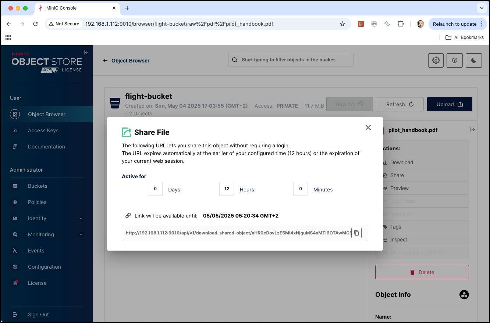
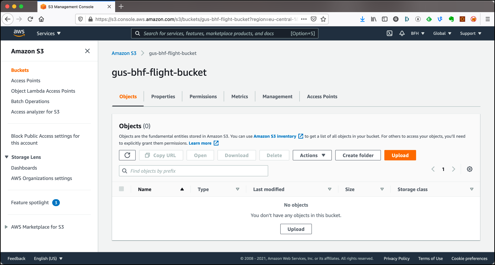
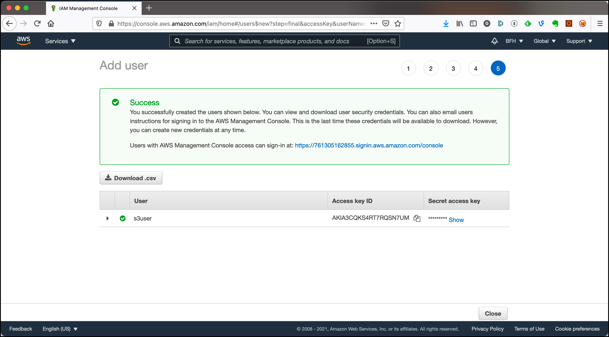

# Working with	Object Storage

In this workshop we will work with Object Storage for persistence, which can either be [MinIO](https://min.io/) which is part of the platform and used in this workshop, [Amazon S3](https://aws.amazon.com/s3/) which is also used in this workshop or any other cloud Object Storage solution. We will use object storage as a drop-in replacement for Hadoop HDFS.

We assume that the **Data platform** described [here](../01-environment) is running and accessible.

In this workshop, we will use the flight-data available in the `data-transfer` folder of the environment. 

The files prepared in `minio` by this workshop will be used later by other workshops. 

## Working with MinIO

### Volume Map data for MinIO container

If you want the data to persist even after you shutdown the docker-compose stack, then you might want to add an additional value mapping to the `minio` service (this is of less use if you have provisioned the stack on **AWS Lightsail**). 

```bash
    volumes:
      - './container-volume/minio/data/:/data'
```

### Accessing MinIO

[MinIO](https://min.io/) is an object storage server released under Apache License v2.0. It is compatible with Amazon S3 cloud storage service. It is best suited for storing unstructured data such as photos, videos, log files, backups and container / VM images. Size of an object can range from a few KBs to a maximum of 5TB.

There are various ways for accessing MinIO

 * **S3cmd** - a command line S3 client for working with S3 compliant object stores
 * **MinIO MC** - the MinIO command line utility
 * **MinIO UI** - a browser based GUI for working with MinIO

These are only a few of the tools available to work with S3. And because an Object Store is in fact a drop-in replacement for HDFS, we can also use it from the tools in the Big Data ecosystem such as Hadoop Hive, Spark, ...

**Using S3cmd**

[S3cmd](https://s3tools.org/s3cmd) is a command line utility for working with S3. 

In our environment, S3cmd is accessible inside the `awscli` container.  

Running `s3cmd -h` will show the help page of s3cmd.

```bash
docker exec -ti awscli s3cmd -h
```

This can also be found on the [S3cmd usage page](https://s3tools.org/usage).

**Using MinIO MC**

In our environment, `mc` is accessible inside the `minio-mcs`.  

Running `mc -h` will show the help page of s3cmd.

```bash
docker exec -ti minio-mc mc -h
```

**Using MinIO Console**

In a browser window, navigate to <http://dataplatform:9000>. 

Enter `V42FCGRVMK24JJ8DHUYG` into the **Access Key** and  `bKhWxVF3kQoLY9kFmt91l+tDrEoZjqnWXzY9Eza` into the **Secret Key** field and click on the **Connect** button. The keys are defined in the `minio-1` service definition in the [docker-compose.yml](https://github.com/gschmutz/hadoop-spark-workshop/blob/master/01-environment/docker/docker-compose.yml) file. 

The MinIO Console dashboard page should now appear.
 


Now click on the **Buckets** menu item on the left.


Click on the **Create Bucket** button at the top right corner to create a new bucket.


### Create a Bucket using MinIO MC

Before we can upload the files to MinIO, we first have to create a bucket.

Here are the commands to perform when using the MinIO **mc** utility on the command line

```bash
docker exec -ti minio-mc mc mb minio-1/flight-bucket
```

**Note**: add the `--with-lock` if you want to enable object locking on the bucket.

and you should get the bucket created method as shown below

```bash
bigdata@bigdata:~$ docker exec -ti minio-mc mc mb minio-1/flight-bucket
Bucket created successfully `minio-1/flight-bucket`.
```

Navigate to the MinIO UI (<http://dataplatform:9000/buckets)>) and you should see the newly created bucket. 


or you could also use `s3cmd ls` to list all buckets.

```bash
docker exec -ti minio-mc mc ls minio-1
```

### Upload the Airport and Plane-Data CSV files to the new bucket

To upload a file we are going to use the `cp` command of the `minio-mc`. First for the `airports.csv`

```bash
docker exec -ti minio-mc mc cp /data-transfer/flight-data/airports.csv minio-1/flight-bucket/raw/airports/airports.csv
```

and then also for the `plane-data.csv` file. 

```bash
docker exec -ti minio-mc mc cp /data-transfer/flight-data/plane-data.csv minio-1/flight-bucket/raw/planes/plane-data.csv
```

Let's use the `s3cmd ls` command once more but now to display the content of the `flight-bucket`

```bash
docker exec -ti minio-mc mc ls minio-1/flight-bucket/
```

We can see that the bucket contains a directory with the name `raw`, which is the prefix we have used when uploading the data above. 

```bash
bigdata@bigdata:~$ docker exec -ti minio-mc mc ls minio-1/flight-bucket/
[2022-05-17 12:15:01 UTC]     0B raw/
```

If we use the `-r` argument

```bash
docker exec -ti minio-mc mc ls -r minio-1/flight-bucket/
```

we can see the objects with the hierarchy as well. 

```bash
bigdata@bigdata:~$ docker exec -ti minio-mc mc ls -r minio-1/flight-bucket/
[2022-05-17 12:13:15 UTC] 239KiB STANDARD raw/airports/airports.csv
[2022-05-17 12:13:35 UTC] 418KiB STANDARD raw/planes/plane-data.csv
```

you can also use the `tree` command to display it as a tree

```bash
docker exec -ti minio-mc mc tree minio-1/flight-bucket/
```

we can see the folder hierarchy as well. 

```bash
bigdata@bigdata:~$ docker exec -ti minio-mc mc tree minio-1/flight-bucket/
minio-1/flight-bucket/
└─ raw
   ├─ airports
   └─ planes
```

if we use the `--files` option we can see the files as well

```bash
docker exec -ti minio-mc mc tree --files minio-1/flight-bucket/
```

we can see the folder hierarchy as well. 

```bash
bigdata@bigdata:~$ docker exec -ti minio-mc mc tree --files minio-1/flight-bucket/
minio-1/flight-bucket/
minio-1/flight-bucket/
└─ raw
   ├─ airports
   │  └─ airports.csv
   └─ planes
      └─ plane-data.csv
```

We can see the same in the MinIO Browser.  


### Upload the Carriers JSON file to the new bucket

To upload a file we are going to use the `s3cmd put` command. First for the `carriers.json`

```bash
docker exec -ti awscli s3cmd put /data-transfer/flight-data/carriers.json s3://flight-bucket/raw/carriers/carriers.json
```

Check again in the MinIO Browser that the object has been uploaded.

### Upload the different Flights data CSV files to the new bucket

Next let's upload some flights data files, all documenting flights in April and May of 2008

```bash
docker exec -ti awscli s3cmd put /data-transfer/flight-data/flights-small/flights_2008_4_1.csv s3://flight-bucket/raw/flights/ &&
   docker exec -ti awscli s3cmd put /data-transfer/flight-data/flights-small/flights_2008_4_2.csv s3://flight-bucket/raw/flights/ &&
   docker exec -ti awscli s3cmd put /data-transfer/flight-data/flights-small/flights_2008_5_1.csv s3://flight-bucket/raw/flights/ &&
   docker exec -ti awscli s3cmd put /data-transfer/flight-data/flights-small/flights_2008_5_2.csv s3://flight-bucket/raw/flights/ &&
   docker exec -ti awscli s3cmd put /data-transfer/flight-data/flights-small/flights_2008_5_3.csv s3://flight-bucket/raw/flights/
```

All these objects are now available in the flight-bucket under the `raw/flights` path.


### Upload the Flight Handbook PDF file to the new bucket

Now after we have seen how to upload text files, let's also upload a binary file. In the `data-transfer/flight-data` we should have a `pilot-handbook.pdf` PDF file. Let's upload this into a pdf folder:

```bash
docker exec -ti minio-mc mc cp /data-transfer/flight-data/pilot_handbook.pdf minio-1/flight-bucket/raw/pdf/
```

You can see by the output that a multi-part upload has been performed:

```bash
$ docker exec -ti minio-mc mc cp /data-transfer/flight-data/pilot_handbook.pdf minio-1/flight-bucket/raw/pdf/
WARNING: pilot_handbook.pdf: Owner username not known. Storing UID=1000 instead.
WARNING: pilot_handbook.pdf: Owner groupname not known. Storing GID=1000 instead.
WARNING: Module python-magic is not available. Guessing MIME types based on file extensions.
upload: '/data-transfer/flight-data/pilot_handbook.pdf' -> 's3://flight-bucket/raw/pdf/pilot_handbook.pdf'  [part 1 of 4, 15MB] [1 of 1]
 15728640 of 15728640   100% in    0s    77.98 MB/s  done
upload: '/data-transfer/flight-data/pilot_handbook.pdf' -> 's3://flight-bucket/raw/pdf/pilot_handbook.pdf'  [part 2 of 4, 15MB] [1 of 1]
 15728640 of 15728640   100% in    0s    73.09 MB/s  done
upload: '/data-transfer/flight-data/pilot_handbook.pdf' -> 's3://flight-bucket/raw/pdf/pilot_handbook.pdf'  [part 3 of 4, 15MB] [1 of 1]
 15728640 of 15728640   100% in    0s    80.48 MB/s  done
upload: '/data-transfer/flight-data/pilot_handbook.pdf' -> 's3://flight-bucket/raw/pdf/pilot_handbook.pdf'  [part 4 of 4, 8MB] [1 of 1]
 8702870 of 8702870   100% in    0s    66.63 MB/s  done
```

The file has been upload, which you can again check using the MinIO browser.

The MinIO browser also allows you to get a sharable link for this object. Click on the **Share** action in the menu to the right of the object:


A pop-up window will appear from where you can copy the link by clicking on the **Copy** icon:



Copy the link into a Web-browser window (make sure to replace the `127.0.0.1:9000` by `<public-ip-address>:9010` and you should get the PDF rendered as shown in the image below


We can see that an object store can also handle binary objects such as images, pdfs, ... and that they can be retrieved over this URLs. 

## Working with Amazon S3

Navigate to the S3 console <https://s3.console.aws.amazon.com/s3>.


We will first use the browser based UI to create buckets and upload objects.

### Create a Bucket

Before we can upload the files to MinIO, we first have to create a bucket.

Click on **Create bucket** 


Enter `<useralias>-bfh-flight-bucket` into the **Bucket name** field. Make sure to replace <useralias> by your alias. Remember, bucket names have to be globally unique.

Chose the **AWS Region** where you want the bucket to be. Unselect **Block all public access** if you want the objects in the bucket to be publicly accessible. 

If you want versioning on your objects, enable **Bucket Versioning**.

Click on **Create bucket** at the bottom of the page.


### Upload objects to the S3 bucket

In order to upload files via the browser-based S3 console, the files need to be available locally (from where you run the browser). Therefore first download this [flight-data.zip](https://github.com/gschmutz/hadoop-spark-workshop/raw/master/01-environment/data/flight-data.zip) zip file and unzip it to a local folder. 

To upload a file we can use the browser-based UI. On the s3 console, click on the bucket created before and you will see the object details page as shown below. 



In this stage, with an empty bucket, you either create a folder using the **Create Folder** button or upload objects using the **Upload** button.   

Let's upload our first objects by clicking on **Upload**.


You can either click on **Add files** to add single files or **Add folder** to upload the complete folder with all the files within.

Let's upload the whole `flight-data` folder created by unzipping the file downloaded before. 

Click on **Add folder** and the file browser will appear. Navigate to the place you have unzipped the data, select the `flight-data` folder and click **Upload**. 


Scroll all the way down and click on **Upload**. The Upload status page will appear with a status bar showing the progress of the upload. After a while you should get the **Upload succeeded** green bar as shown below. You can also see that 60.3 MB have been uploaded in total. 


Click on **Close** to return to the bucket overview page. 


You can see the folder `flight-data` which we have successfully uploaded. To view the objects, click onto the folder link. Inside the `flight-data` folder, there is a `.DS_Store` file (a mac artefact) which was part of the ZIP file, but is not needed at all. We can delete it by selecting it (click on the check box left to the name)


and click on **Delete**. When deleting an object or folder through the S3 console, you have to confirm it. After entering the "passphrase" `permanently delete` into the **To confirm deletion, ...**, the **Delete objects** button will appear. 


 
Click on it and the object will get deleted. You will see a confirmation page like the one bellow.


### Using S3 Select

With Amazon S3 we cannot only access objects over the key and get the full object, but we can also use a query language to only return part of the content. This only works if the content is structured and the format is either CSV, JSON or Apache Parquet. 

Let's test that with the `carriers.csv` object. Navigate to `flight-data` folder and select the `carriers.csv` object. Select **Query with S3 Select** from the **Actions** drop down list.


On the **Query with S3 Select** page, select **CSV** as the **Format**, **Comma** as the **CSV delimiter**, click on **Exclude the first line of CSV data** and select **None** for the **Compression**. Leave the **Output settings** as is. 

Scroll down to the **SQL Query** area and extend the SQL statement shown with a where clause, so that only United Airlines is returned: `SELECT * FROM s3object s where s.code='UA'`.

Click on **Run SQL query** and the result will be shown in the **Query results** section.


You can click on **Download results** to download it using the format specified in the **Output settings**.

S3 Select provides a simple way to execute SQL queries directly on data stored in Amazon S3 or Amazon S3 Glacier. S3 Select can run against data stored in S3, enabling us to use this feature to process data uploaded to S3.

### Create Access Credentials

If we want to access the data in our bucket from outside, we have to create the necessary access credentials. 

In the menu on the top right, select the user (`BFH` in this setting, will be different in your environment) and click on **My Security Credentials**. 


On the **Your Security Credentials** page, select **Users** in the menu to the left.


The list of **IAM users** appears, which is empty in my case here. 


Click **Add user** 


Enter `s3user`into the **User name** field and select the **Programmatic access** check box. Click **Next: Permissions**. 


The **Add user to group** is selected by default, but there is not yet a group we can use. Click on **Create group** to create one. 

Enter `s3access` into the **Group name** and enter `s3` into **Filter policies**. 


Select the `AmazonS3FullAccess` **Policy name** and click on **Create group**. 

Back on the **Add user** page, click **Next: Tags** and **Next: Review** and **Create user**. You should see the **Success** message.



Click on the **show** link to show view the **Secret access key**. It is important to save that value in a safe place, as it can never be displayed after the page is closed. You will need **Access key ID** and **Secret access key** for accessing S3 from external.

Click on **Close** and you see the newly created user `s3user` in the list of users.


### Using the AWS CLI	to work with S3

Before we can use the AWS CLI, we have to install it. We can do that on the Ubuntu terminal using

```
sudo apt-get install awscli
```

For other environments, consult the documentation [here](https://docs.aws.amazon.com/cli/latest/userguide/install-cliv2.html).

You can view the version of the CLI by using `aws --version`

```
ubuntu@ip-172-26-3-90:~$ aws --version
aws-cli/1.18.69 Python/3.8.5 Linux/5.4.0-1018-aws botocore/1.16.19
```

To use the AWS CLI, make sure that you have the necessary access credentials available. You can create them as shown in the previous section. Configure the CLI using the `configure` command. 

```
aws configure
```

Enter the values for **AWS Access Key ID** and **AWS Secret Access Key** saved above and enter `eu-central-1` for the **Default region name** and accept the default for **Default output format**.  

Now you can use the `s3` command to work with S3. Enter `aws s3 help` to see the documentation.

To see all the buckets enter `aws s3 ls`

```
ubuntu@ip-172-26-3-90:~$ aws s3 ls
2021-05-15 16:09:26 gus-bhf-flight-bucket
```

You can use the `aws s3 ls help` command to get the documentation for just the `ls` subcommand. 

To see all the objects inside the bucket, use the `--recursive` parameter.

```
ubuntu@ip-172-26-3-90:~$ aws s3 ls --recursive gus-bhf-flight-bucket
2021-05-15 17:50:48       1952 flight-data/README.md
2021-05-15 17:50:48     244438 flight-data/airports.csv
2021-05-15 17:50:53     598901 flight-data/airports.json
2021-05-15 17:50:52      43758 flight-data/carriers.csv
2021-05-15 17:50:47      76537 flight-data/carriers.json
2021-05-15 17:50:52     980792 flight-data/flights-small/flights_2008_4_1.csv
2021-05-15 17:50:51     981534 flight-data/flights-small/flights_2008_4_2.csv
2021-05-15 17:50:49     998020 flight-data/flights-small/flights_2008_5_1.csv
2021-05-15 17:50:50    1002531 flight-data/flights-small/flights_2008_5_2.csv
2021-05-15 17:50:51     989831 flight-data/flights-small/flights_2008_5_3.csv
2021-05-15 17:50:45   55888790 flight-data/pilot_handbook.pdf
2021-05-15 17:50:46     428558 flight-data/plane-data.csv
2021-05-15 17:50:47     968807 flight-data/plane-data.json
```


