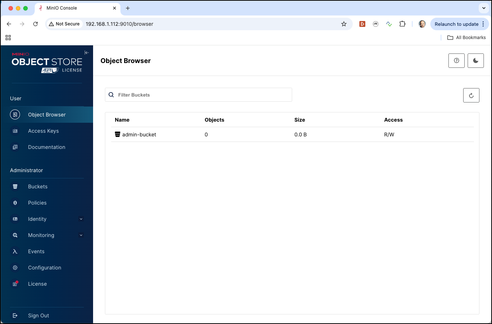
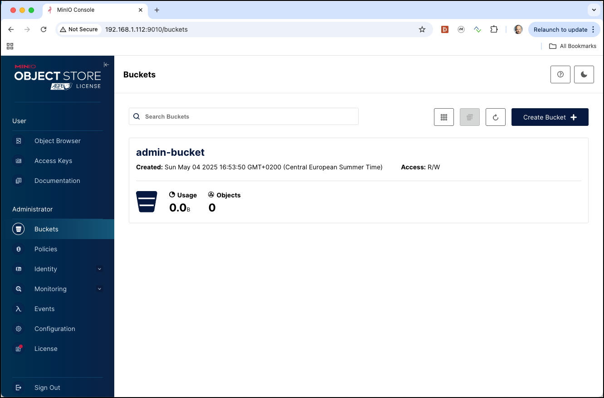
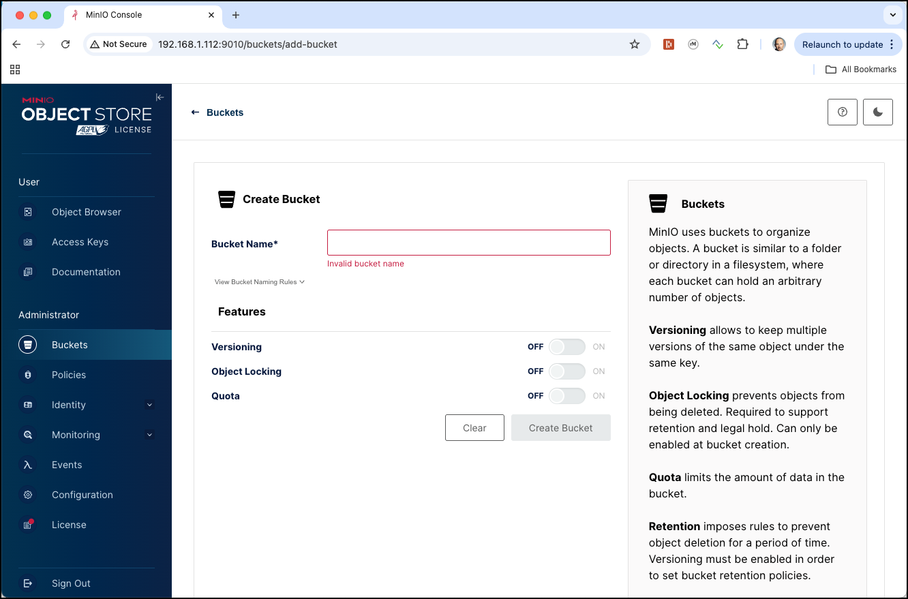
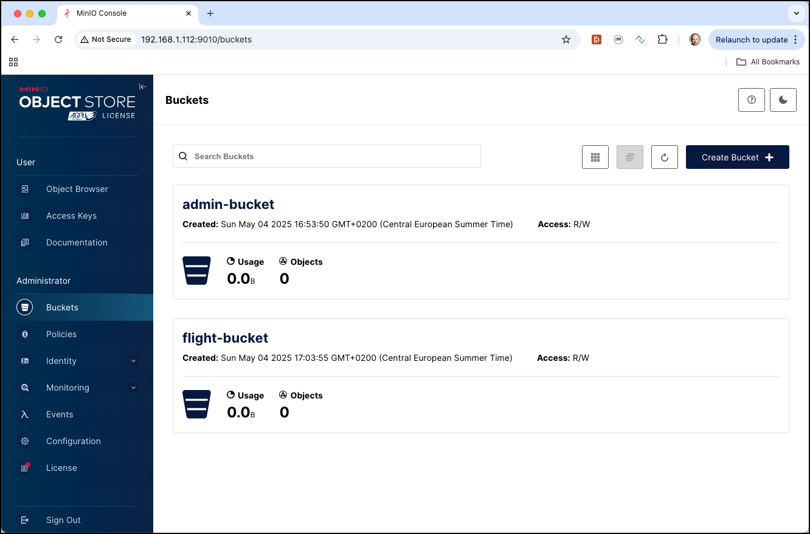
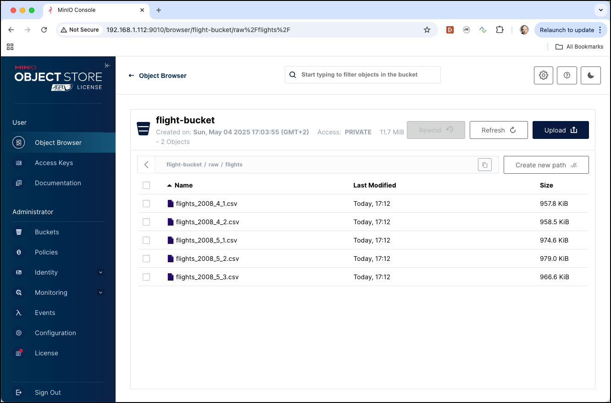
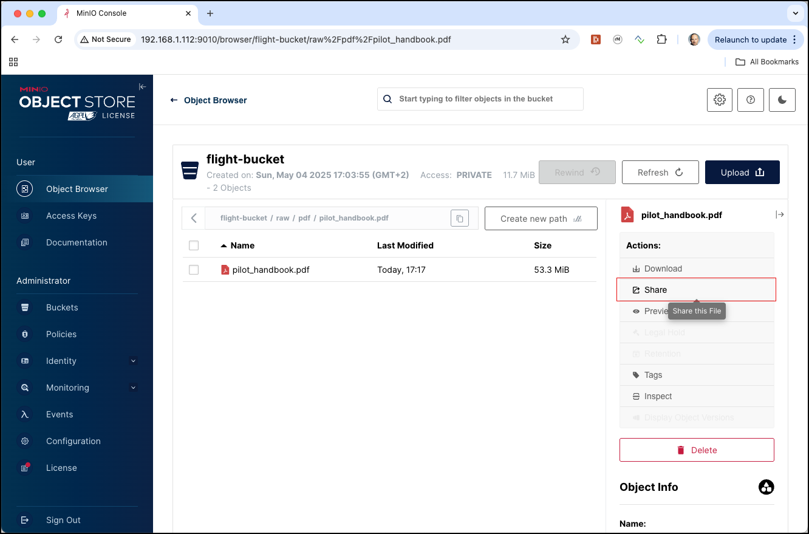
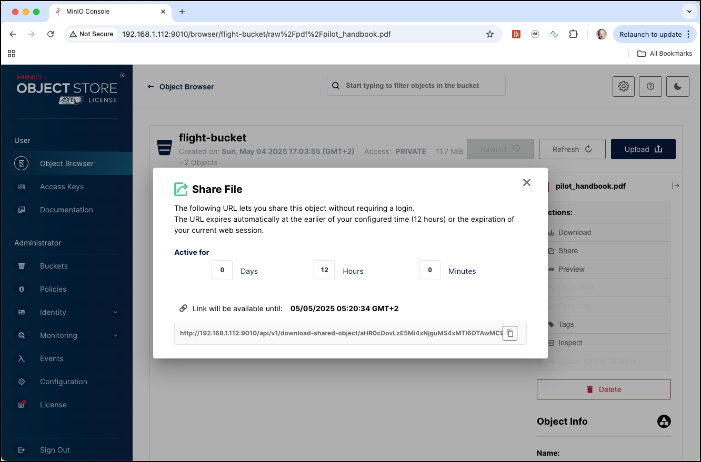

# Working with MinIO Object Storage

In this workshop we will work with [MinIO](https://min.io/) Object Storage to persist data. It will also be used in the other workshops and is configured as the default filesystem for Spark and ecosystem.

We assume that the **Data platform** described [here](../01-environment) is running and accessible.

In this workshop, we will use the `airports-data` and `flight-data` available in the `data-transfer` folder of the environment. 

These files will be used later by other workshops. 

## Using MinIO

### Volume Map data for MinIO container

If you want the data to persist even after you shutdown the docker-compose stack, then you might want to add an additional value mapping to the `minio` service (this is of less use if you have provisioned the stack on **AWS Lightsail**). 

```bash
    volumes:
      - './container-volume/minio/data/:/data'
```

### Accessing MinIO

[MinIO](https://min.io/) is an object storage server released under Apache License v2.0. It is compatible with Amazon S3 cloud storage service. It is best suited for storing unstructured data such as photos, videos, log files, backups and container / VM images. Size of an object can range from a few KBs to a maximum of 5TB.

There are various ways for accessing MinIO

 * **S3cmd** - a command line S3 client for working with S3 compliant object stores
 * **MinIO MC** - the MinIO command line utility
 * **MinIO UI** - a browser based GUI for working with MinIO

These are only a few of the tools available to work with S3. And because an Object Store is in fact a drop-in replacement for HDFS, we can also use it from the tools in the Big Data ecosystem such as Hadoop Hive, Spark, ...

**Using S3cmd**

[S3cmd](https://s3tools.org/s3cmd) is a command line utility for working with S3. 

In our environment, S3cmd is accessible inside the `awscli` container.  

Running `s3cmd -h` will show the help page of s3cmd.

```bash
docker exec -ti awscli s3cmd -h
```

This can also be found on the [S3cmd usage page](https://s3tools.org/usage).

**Using MinIO MC**

In our environment, `mc` is accessible inside the `minio-mcs`.  

Running `mc -h` will show the help page of s3cmd.

```bash
docker exec -ti minio-mc mc -h
```

**Using MinIO Console**

In a browser window, navigate to <http://dataplatform:9000>. 

Enter `admin` into the **Access Key** and  `abc123!abc123!` into the **Secret Key** field and click on the **Connect** button. The keys are defined in the `minio-1` service definition in the [docker-compose.yml](https://github.com/gschmutz/hadoop-spark-workshop/blob/master/01-environment/docker/docker-compose.yml) file. 

The MinIO Console dashboard page should now appear.
 


Now click on the **Buckets** menu item on the left.



Click on the **Create Bucket** button at the top right corner to create a new bucket.



### Create a Bucket using MinIO MC

Before we can upload the files to MinIO, we first have to create a new bucket. 

Here are the commands to perform when using the MinIO **mc** utility on the command line

```bash
docker exec -ti minio-mc mc mb minio-1/flight-bucket
```

**Note**: add the `--with-lock` if you want to enable object locking on the bucket.

and you should get the bucket created method as shown below

```bash
bigdata@bigdata:~$ docker exec -ti minio-mc mc mb minio-1/flight-bucket
Bucket created successfully `minio-1/flight-bucket`.
```

Navigate to the MinIO UI (<http://dataplatform:9000/buckets)>) and you should see the newly created bucket. 



or you can also use `s3cmd ls` to list all buckets.

```bash
docker exec -ti minio-mc mc ls minio-1
```

and you should get

```
bigdata@bigdata:~$ docker exec -ti minio-mc mc ls minio-1
[2025-05-04 14:53:50 UTC]     0B admin-bucket/
[2025-05-04 15:03:55 UTC]     0B flight-bucket/
```

The `admin-bucket` has been created when starting the platform. 

### Upload the Airport and Plane-Data CSV files to the new bucket

To upload a file we are going to use the `cp` command of the `minio-mc`. First for the `airports.csv`

```bash
docker exec -ti minio-mc mc cp /data-transfer/airport-data/airports.csv minio-1/flight-bucket/raw/airports/airports.csv
```

and then also for the `plane-data.csv` file. 

```bash
docker exec -ti minio-mc mc cp /data-transfer/flight-data/plane-data.csv minio-1/flight-bucket/raw/planes/plane-data.csv
```

Let's use the `s3cmd ls` command once more but now to display the content of the `flight-bucket`

```bash
docker exec -ti minio-mc mc ls minio-1/flight-bucket/
```

We can see that the bucket contains a directory with the name `raw`, which is the prefix we have used when uploading the data above. 

```bash
bigdata@bigdata:~$ docker exec -ti minio-mc mc ls minio-1/flight-bucket/
[2022-05-17 12:15:01 UTC]     0B raw/
```

If we use the `-r` argument

```bash
docker exec -ti minio-mc mc ls -r minio-1/flight-bucket/
```

we can see the objects with the hierarchy as well. 

```bash
bigdata@bigdata:~$ docker exec -ti minio-mc mc ls -r minio-1/flight-bucket/
[2025-05-04 15:06:52 UTC]  11MiB STANDARD raw/airports/airports.csv
[2025-05-04 15:07:02 UTC] 418KiB STANDARD raw/planes/plane-data.csv
```

you can also use the `tree` command to display it as a tree

```bash
docker exec -ti minio-mc mc tree minio-1/flight-bucket/
```

we can see the folder hierarchy as well. 

```bash
bigdata@bigdata:~$ docker exec -ti minio-mc mc tree minio-1/flight-bucket/
minio-1/flight-bucket/
└─ raw
   ├─ airports
   └─ planes
```

if we use the `--files` option we can see the files as well

```bash
docker exec -ti minio-mc mc tree --files minio-1/flight-bucket/
```

we can see the folder hierarchy as well. 

```bash
bigdata@bigdata:~$ docker exec -ti minio-mc mc tree --files minio-1/flight-bucket/
minio-1/flight-bucket/
minio-1/flight-bucket/
└─ raw
   ├─ airports
   │  └─ airports.csv
   └─ planes
      └─ plane-data.csv
```

We can see the same in the MinIO Browser. Navigate to **Object Browser** and click on the **flight-bucket** bucket and then on **raw** and **airports**:  


### Upload the Carriers JSON file to the new bucket

To upload the carriers JSON file we are going to use the `s3cmd put` command, which is available through the `awscli` docker container. 

First for the `carriers.json`

```bash
docker exec -ti awscli s3cmd put /data-transfer/flight-data/carriers.json s3://flight-bucket/raw/carriers/carriers.json
```

Check again in the MinIO Browser that the object has been uploaded.

### Upload the different Flights data CSV files to the new bucket

Next let's upload some flights data files, all documenting flights in April and May of 2008

```bash
docker exec -ti awscli s3cmd put /data-transfer/flight-data/flights-small/flights_2008_4_1.csv s3://flight-bucket/raw/flights/ &&
   docker exec -ti awscli s3cmd put /data-transfer/flight-data/flights-small/flights_2008_4_2.csv s3://flight-bucket/raw/flights/ &&
   docker exec -ti awscli s3cmd put /data-transfer/flight-data/flights-small/flights_2008_5_1.csv s3://flight-bucket/raw/flights/ &&
   docker exec -ti awscli s3cmd put /data-transfer/flight-data/flights-small/flights_2008_5_2.csv s3://flight-bucket/raw/flights/ &&
   docker exec -ti awscli s3cmd put /data-transfer/flight-data/flights-small/flights_2008_5_3.csv s3://flight-bucket/raw/flights/
```

All these objects are now available in the flight-bucket under the `raw/flights` path.



### Upload the Flight Handbook PDF file to the new bucket

Now after we have seen how to upload text files, let's also upload a binary file. In the `data-transfer/flight-data` there is the `pilot-handbook.pdf` PDF file. Let's upload this into a pdf folder:

```bash
docker exec -ti minio-mc mc cp /data-transfer/flight-data/pilot_handbook.pdf minio-1/flight-bucket/raw/pdf/
```

The file has been upload, which you can again check using the MinIO browser.

The MinIO browser also allows you to get a sharable link for this object. Click on the **Share** action in the menu to the right of the object:



A pop-up window will appear from where you can copy the link by clicking on the **Copy** icon:



Copy the link into a Web-browser window (make sure to replace the `127.0.0.1:9000` by `<public-ip-address>:9010` and you should get the PDF rendered as shown in the image below


We can see that an object store can also handle binary objects such as images, pdfs, ... and that they can be retrieved over this URLs. 


