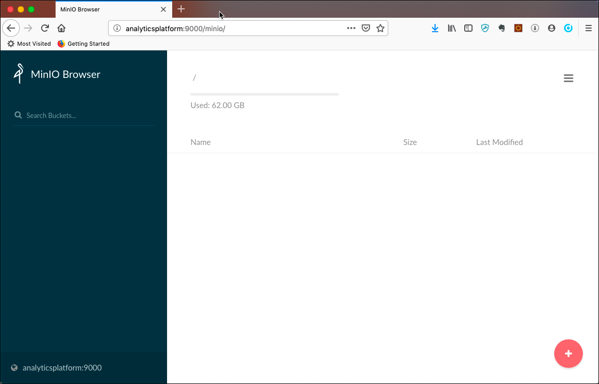
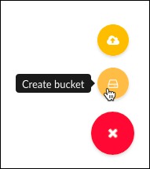
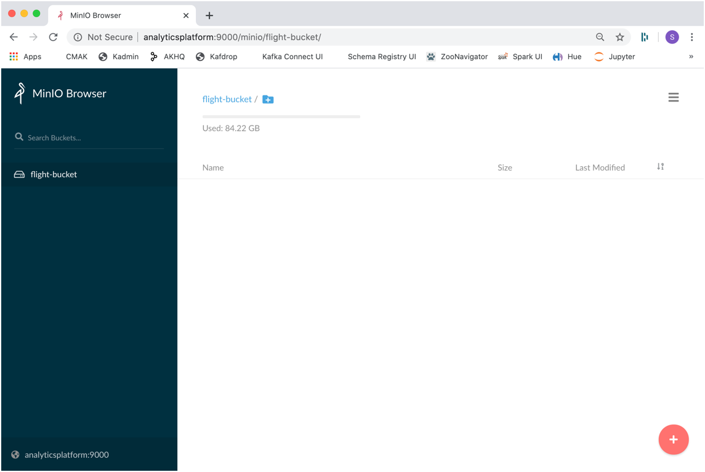
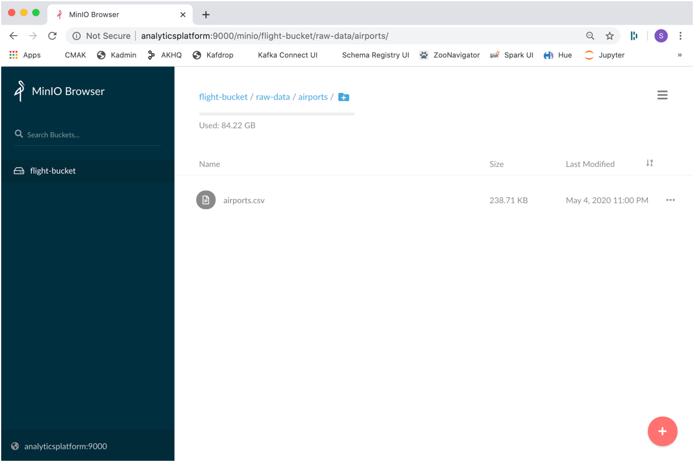

# Working with MinIO 	Object Storage

In this workshop we will work with Object Storage for persistence, which can either be [MinIO](https://min.io/) as shown in the workshop, [Amazon S3](https://aws.amazon.com/s3/) or any other cloud Object Storage solution. We will use object storage as a drop-in replacement for Hadoop HDFS.

We assume that the **Data platform** described [here](../01-environment) is running and accessible. 

In this workshop, we will use the flight-data available in the data-transfer folder of the environment. The files prepared here will be used later by the other workshops. 

## Volume Map data for Minio container

If you want the data to persist even after you shutdown the docker-compose stack, then you might want to add an additional value mapping to the `minio` service (this is of less use if you have provisioned the stack on **AWS Lightsail**). 

```
    volumes:
      - './container-volume/minio/data/:/data'
```

##	 Accessing MinIO

[MinIO](https://min.io/) is an object storage server released under Apache License v2.0. It is compatible with Amazon S3 cloud storage service. It is best suited for storing unstructured data such as photos, videos, log files, backups and container / VM images. Size of an object can range from a few KBs to a maximum of 5TB.

There are various ways for accessing MinIO

 * **S3cmd** - a command line S3 client for working with S3 compliant object stores
 * **MinIO UI** - a browser based GUI for working with MinIO
 * **Apache Zeppelin** - a browser based GUI for working with various tools of the Big Data ecosystem

These are only a few of the tools available to work with S3. And because an Object Store is in fact a drop-in replacement for HDFS, we can also use it from the tools in the Big Data ecosystem such as Hadoop Hive, Spark, ...

### Using S3cmd

[S3cmd](https://s3tools.org/s3cmd) is a command line utility for working with S3. 

In our environment, S3cmd is accessible inside the `awscli` as well as the `zeppelin` container.  

Running `s3cmd -h` will show the help page of s3cmd.

```
docker exec -ti awscli s3cmd -h
```

This can also be found on the [S3cmd usage page](https://s3tools.org/usage).

### Using MinIO UI

In a browser window, navigate to <http://dataplatform:9000> and you should see login screen. Enter `V42FCGRVMK24JJ8DHUYG` into the **Access Key** and  `bKhWxVF3kQoLY9kFmt91l+tDrEoZjqnWXzY9Eza` into the **Secret Key** field and click on the **Connect** button.  
The MinIO homepage should now appear.
 


Click on the **+** icon at the lower right corner to either perform an **Create bucket** or **Upload file** action.



### Using Apache Zeppelin

Zeppelin is a web-based notebook that enables interactive data analytics. From within the `sh` interpreter the `s3cmd` is available. 

In a browser window navigate to <http://dataplatform:28080> and you should see the Apache Zeppelin homepage. Click on the **Login** button  in the top right corner and enter `admin` into the **User Name** field and `abc123!` into the **Password** field. 

Here you can use `s3cmd` from within a cell in a notebook using the `%sh` interpreter.


##	 Upload data to Object Storage

Let's upload the files of the Hive workshop to the object storage. 

First we have to create a bucket.

### Create a Bucket

Here are the commands to perform when using the **S3cmd** on the command line

```
docker exec -ti awscli s3cmd mb s3://flight-bucket
```

and you should get the bucket created method as shown below

```
bigdata@bigdata:~$ docker exec -ti awscli s3cmd mb s3://flight-bucket
Bucket 's3://flight-bucket/' created
```

Navigate to the MinIO UI (<http://dataplatform:9000>) and you should see the newly created bucket in the left. 



or you could also use `s3cmd ls` to list all buckets.

```
docker exec -ti awscli s3cmd ls s3://
```

### Upload the files to the bucket

To upload a file we are going to use the `s3cmd put` command. First for the `airports.csv`

```
docker exec -ti awscli s3cmd put /data-transfer/flight-data/airports.csv s3://flight-bucket/raw-data/airports/airports.csv
```

and then also for the `plane-data.csv` file. 

```
docker exec -ti awscli s3cmd put /data-transfer/flight-data/plane-data.csv s3://flight-bucket/raw-data/planes/plane-data.csv
```

Let's use the `s3cmd ls` command once more but now to display the content of the `flight-bucket`

```
docker exec -ti awscli s3cmd ls s3://flight-bucket/
```

We can see that the bucket contains a directory with the name `raw-data`, which is the prefix we have used when uploading the data above. 

```
bigdata@bigdata:~$ docker exec -ti awscli s3cmd ls s3://flight-bucket/
                       DIR   s3://flight-bucket/raw-data/
```

If we use the `-r` argument

```
docker exec -ti awscli s3cmd ls -r  s3://flight-bucket/
```

we can see the objects with the hierarchy as well. 

```
bigdata@bigdata:~$ docker exec -ti awscli s3cmd ls -r  s3://flight-bucket/
2020-05-04 21:00    244438   s3://flight-bucket/raw-data/airports/airports.csv
2020-05-04 21:01    428558   s3://flight-bucket/raw-data/planes/plane-data.csv
```

We can see the same in the MinioUI.  



