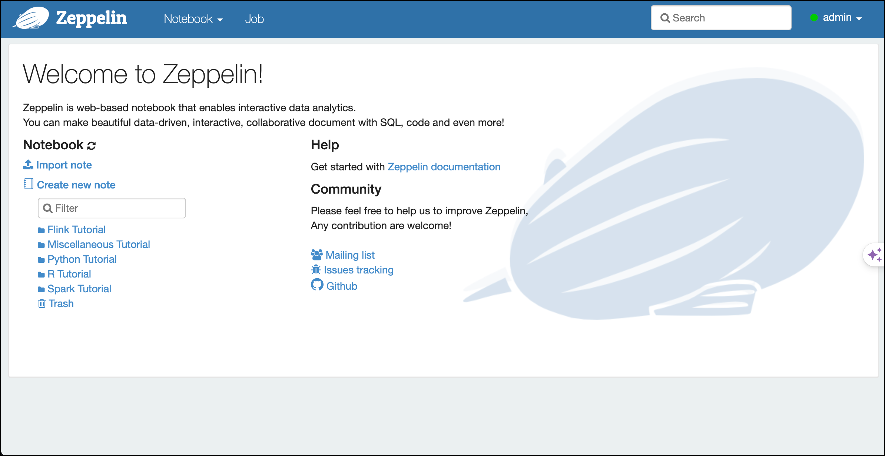
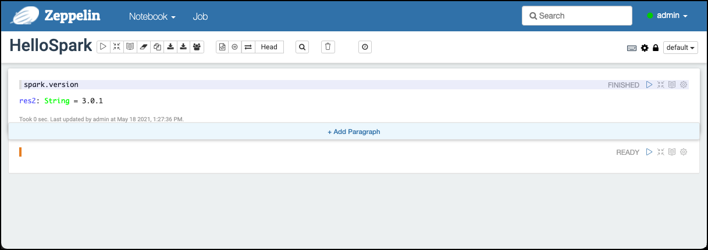
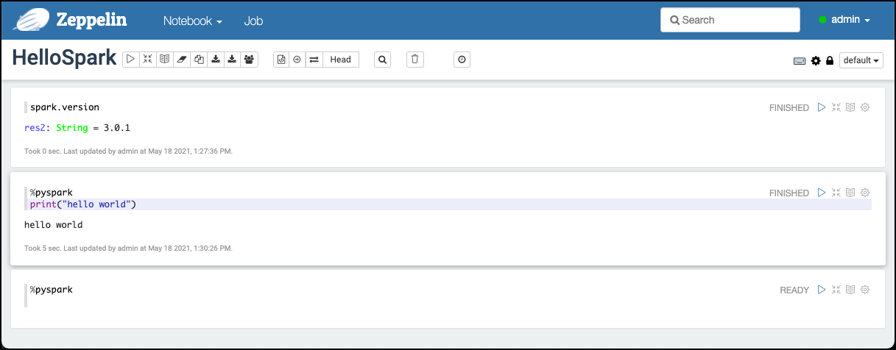
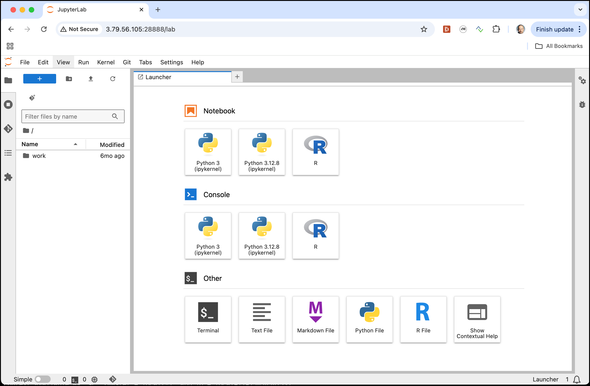
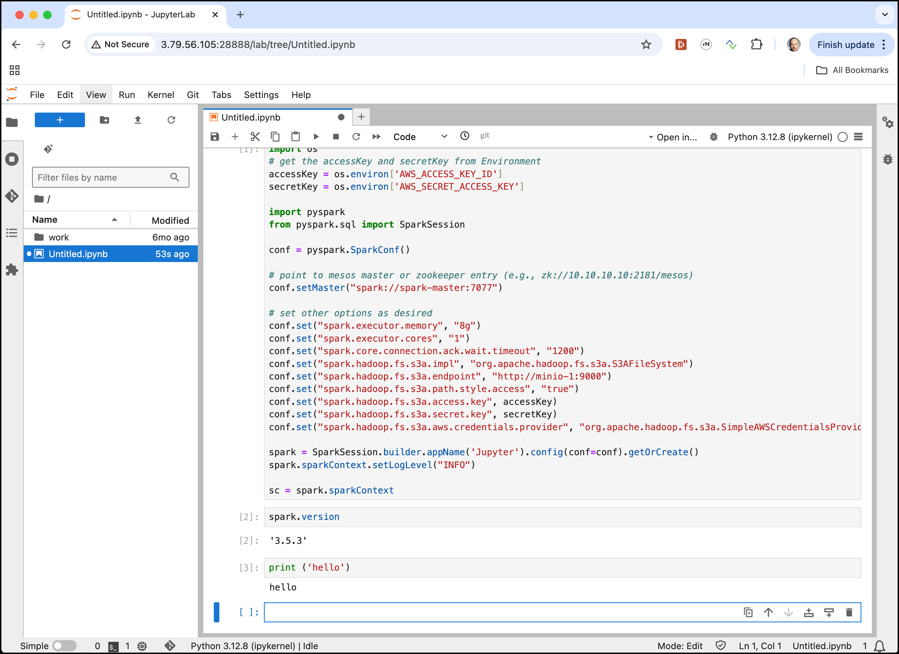
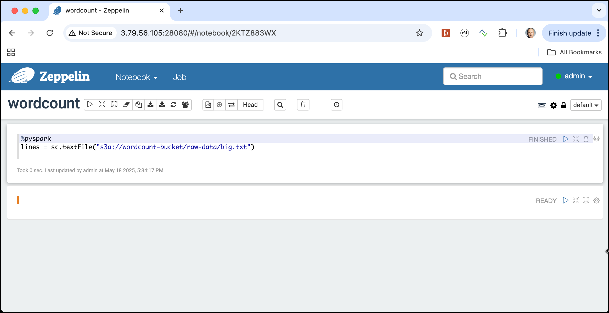
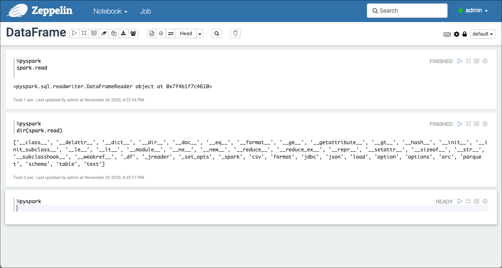

# Getting Started using Spark RDD and DataFrames

In this workshop we will work with [Apache Spark](https://spark.apache.org/) and implement some basic operations using the Spark DataFrame API for Python. 

We assume that the **Data platform** described [here](../01-environment) is running and accessible. 

##	 Accessing Spark

[Apache Spark](https://spark.apache.org/) is a fast, in-memory data processing engine with elegant and expressive development APIs in Scala, Java, and Python that allow data workers to efficiently execute machine learning algorithms that require fast iterative access to datasets. Spark on Apache Hadoop YARN enables deep integration with Hadoop and other YARN enabled workloads in the enterprise.

You can run batch application such as MapReduce types jobs or iterative algorithms that build upon each other. You can also run interactive queries and process streaming data with your application. Spark also provides a number of libraries which you can easily use to expand beyond the basic Spark capabilities such as Machine Learning algorithms, SQL, streaming, and graph processing. Spark runs on Hadoop clusters such as Hadoop YARN or Kubernetes, or even in a Standalone Mode with its own scheduler.

There are various ways for accessing Spark

 * **PySpark** - accessing Hive from the command line
 * **Apache Zeppelin** - a browser based GUI for working with various tools of the Big Data ecosystem
 * **Jupyter** - a browser based GUI for working with a Python and Spark

There is also the option to use **Thrift Server** to execute Spark SQL from any tool supporting SQL. But this is not covered in this workshop.

### Using the Python API through PySpark

The [PySpark API](https://spark.apache.org/docs/latest/api/python/index.html) allows us to work with Spark through the command line. 

In our environment, PySpark is accessible inside the `spark-master` container. 

To avoid problems with not being able to write to `spark/logs` folder, execute once the following statement in a terminal:

```bash
cd $DATAPLATFORM_HOME
sudo chmod 777 container-volume/spark/logs
```

Now to start PySpark use the `pyspark` command. 

```bash
docker exec -ti spark-master pyspark
```

and you should end up on the **pyspark** command prompt `>>>` as shown below

```bash
bigdata@bigdata:~$ docker exec -ti spark-master pyspark

Python 3.12.8 (main, Dec  4 2024, 00:26:17) [GCC 12.2.0] on linux
Type "help", "copyright", "credits" or "license" for more information.
:: loading settings :: url = jar:file:/opt/bitnami/spark/jars/ivy-2.5.1.jar!/org/apache/ivy/core/settings/ivysettings.xml
Ivy Default Cache set to: /opt/bitnami/spark/.ivy2/cache
The jars for the packages stored in: /opt/bitnami/spark/.ivy2/jars
org.postgresql#postgresql added as a dependency
org.apache.spark#spark-avro_2.12 added as a dependency
graphframes#graphframes added as a dependency
:: resolving dependencies :: org.apache.spark#spark-submit-parent-a03e809f-bd0c-4692-8dc5-c0ee43d96331;1.0
        confs: [default]
        found org.postgresql#postgresql;42.3.4 in central
        found org.checkerframework#checker-qual;3.5.0 in central
        found org.apache.spark#spark-avro_2.12;3.5.2 in central
        found org.tukaani#xz;1.9 in central
        found graphframes#graphframes;0.8.4-spark3.5-s_2.12 in spark-packages
        found org.slf4j#slf4j-api;1.7.16 in central
:: resolution report :: resolve 607ms :: artifacts dl 19ms
        :: modules in use:
        graphframes#graphframes;0.8.4-spark3.5-s_2.12 from spark-packages in [default]
        org.apache.spark#spark-avro_2.12;3.5.2 from central in [default]
        org.checkerframework#checker-qual;3.5.0 from central in [default]
        org.postgresql#postgresql;42.3.4 from central in [default]
        org.slf4j#slf4j-api;1.7.16 from central in [default]
        org.tukaani#xz;1.9 from central in [default]
        ---------------------------------------------------------------------
        |                  |            modules            ||   artifacts   |
        |       conf       | number| search|dwnlded|evicted|| number|dwnlded|
        ---------------------------------------------------------------------
        |      default     |   6   |   0   |   0   |   0   ||   6   |   0   |
        ---------------------------------------------------------------------
:: retrieving :: org.apache.spark#spark-submit-parent-a03e809f-bd0c-4692-8dc5-c0ee43d96331
        confs: [default]
        0 artifacts copied, 6 already retrieved (0kB/11ms)
25/05/18 10:44:10 WARN NativeCodeLoader: Unable to load native-hadoop library for your platform... using builtin-java classes where applicable
Setting default log level to "WARN".
To adjust logging level use sc.setLogLevel(newLevel). For SparkR, use setLogLevel(newLevel).
Welcome to
      ____              __
     / __/__  ___ _____/ /__
    _\ \/ _ \/ _ `/ __/  '_/
   /__ / .__/\_,_/_/ /_/\_\   version 3.5.3
      /_/

Using Python version 3.12.8 (main, Dec  4 2024 00:26:17)
Spark context Web UI available at http://3.79.56.105:4040
Spark context available as 'sc' (master = local[*], app id = local-1747565056739).
SparkSession available as 'spark'.
>>> 
```

You have an active `SparkSession` available as the `spark` variable. Enter any valid command, just to test we can ask Spark for the version which is installed. 

```bash
spark.version
```

and we should get the version back

```bash
>>> spark.version
'3.5.3'
```

You can use `pyspark` for this workshop. But there are also two other, browser-based tools which are much more comfortable to use and which additionally allow to store the different steps as a notebook for later re-use. 

### Using Apache Zeppelin (used for this workshop)

[Apache Zeppelin](https://zeppelin.apache.org/) is a Web-based notebook that enables data-driven,
interactive data analytics and collaborative documents with SQL, Scala, Python, R and more. It is installed as part of the dataplatform.  

In a browser window, navigate to <http://dataplatform:28080> and you should see the Apache Zeppelin homepage. Click on **Login** and use `admin` as the **User Name** and `changeme` as the **Password** and click on **Login**. 



Now let's create a new Notebook to perform some Spark actions by clicking on the **Create new note** link. 

Enter `HelloSpark` into the **Note Name** field and leave the **Default Interpreter** set to **spark** and click **Create**. 

You should be brought forward to an empty notebook with an empty paragraph. Again let's use the `spark.version` command by adding it to the empty cell and hit **Shift** + **Enter** to execute the statement.  



By default the Spark Zeppelin interpreter will be using the Scala API. To switch to the Python API, use the following directive `%pyspark` at the beginning of the cell. This will be the new default for the interpreter



Zeppelin allows for mixing different interpreters in one and the same Notebook, whereas one interpreter always being the default (the one chosen when creating the notebook, **spark** in our case). 

You can use Apache Zeppelin to perform the workshop below. The other option is to use **Jupyter**. 

### Using Jupyter (optional)

In a browser window, navigate to <http://dataplatform:28888>. 
Enter `abc123!` into the **Password or token** field and click **Log in**. 

You should be forwarded to the **Jupyter** homepage. Click on the **Python 3.12.8** icon in the **Notebook** section to create a new notebook using the **Python 3.12.8** kernel (it's important to use exactly the same python version as on the Spark cluster).


  
You will be forwarded to an empty notebook with a first empty cell. 

Here you can enter your commands. In contrast to **Apache Zeppelin**, we don't have an active Spark Session at hand. We first have to create one. 

Add the following code to the first cell

```python
import os
# get the accessKey and secretKey from Environment
accessKey = os.environ['AWS_ACCESS_KEY_ID']
secretKey = os.environ['AWS_SECRET_ACCESS_KEY']

import pyspark
from pyspark.sql import SparkSession

conf = pyspark.SparkConf()

# point to mesos master or zookeeper entry (e.g., zk://10.10.10.10:2181/mesos)
conf.setMaster("spark://spark-master:7077")

# set other options as desired
conf.set("spark.executor.memory", "8g")
conf.set("spark.executor.cores", "1")
conf.set("spark.core.connection.ack.wait.timeout", "1200")
conf.set("spark.hadoop.fs.s3a.impl", "org.apache.hadoop.fs.s3a.S3AFileSystem")
conf.set("spark.hadoop.fs.s3a.endpoint", "http://minio-1:9000")
conf.set("spark.hadoop.fs.s3a.path.style.access", "true")
conf.set("spark.hadoop.fs.s3a.access.key", accessKey)
conf.set("spark.hadoop.fs.s3a.secret.key", secretKey)
conf.set("spark.hadoop.fs.s3a.aws.credentials.provider", "org.apache.hadoop.fs.s3a.SimpleAWSCredentialsProvider")

spark = SparkSession.builder.appName('Jupyter').config(conf=conf).getOrCreate()
spark.sparkContext.setLogLevel("INFO")

sc = spark.sparkContext
```

Execute it by entering **Shift** + **Enter**. 

If you check the code you can see that we connect to the Spark Master and get a session on the "spark cluster", available through the `spark` variable. The Spark Context is available as variable `sc`.

First, execute `spark.version` in another shell to show the Spark version in place. 

Also execute a python command `print ("hello")` just to see that you are executing python. 



You can use Jupyter to perform the workshop. 

## Working with Spark Resilient Distributed Datasets (RDDs)

Spark’s primary core abstraction is called a **Resilient Distributed Dataset** or **RDD**. 

It is a distributed collection of elements that is parallelised across the cluster. In other words, a RDD is an immutable collection of objects that is partitioned and distributed across multiple physical nodes of a YARN cluster and that can be operated in parallel.

There are three methods for creating a RDD:

 1. Parallelise an existing collection. This means that the data already resides within Spark and can now be operated on in parallel. 
 2. Create a RDD by referencing a dataset. This dataset can come from any storage source supported by Hadoop such as HDFS, Cassandra, HBase etc.
 3. Create a RDD by transforming an existing RDD to create a new RDD.

We will be using the 2nd method in this workshop.

First let's upload the data needed for this workshop, using the techniques we have learned in the [Working with MinIO Object Storage](../02-object-storage/README.md) when working with MinIO Object Storage.

### Upload Raw Data to MinIO

First create a new bucket `wordcount-bucket` for the data

```bash
docker exec -ti minio-mc mc mb minio-1/wordcount-bucket
```

And then upload the `big.txt` into the new bucket 

```bash
docker exec -ti minio-mc mc cp /data-transfer/wordcount/big.txt minio-1/wordcount-bucket/raw-data/
```

Now with the data either available in MinIO, let's use the data using Spark RDDs.

### Implement Wordcount using Spark Python API

In this section we will see how Word Count can be implemented using the Spark Python API.

You can use either one of the three different ways described above to access the Spark Python environment. 

Just copy and paste the commands either into the **PySpark** command line or into the paragraphs in **Zeppelin** or **Jupyter**. In Zeppelin you have to switch to Python interpreter by using the following directive `%spark.pyspark` on each paragraph.

In **Jupyter** make sure to get the connection to spark using the script shown before.

To work with **Zeppelin**, naviagte to <http://dataplatform:28080> and login as user `admin` with password `changme`. Click on **Notebook** and select **Create new note**. Enter `wordcount` into **Note Name** and select **Spark** for the **Default Interpreter** and click **Create**.

To start, let's read the data into an RDD. Copy the following line into the empty cell (i.e. paragraph) and add the `%pyspark` directive to specifiy that we want to work with pyspark. 

```python
lines = sc.textFile("s3a://wordcount-bucket/raw-data/big.txt")
```



Click on Shift-Enter to execute the cell.

Next let's split the line into words and flat map it

```python
words = lines.flatMap(lambda line: line.split(" "))
```

Reduce by key to get the counts by word and number. 
```python
counts = words.map(lambda word: (word,1)).reduceByKey(lambda a, b : a + b)
```

So far all of the operations are **transform** operations and executed in a lazy fashion. 

Now let's save the counts to a file on MinIO object storage. This is an **action** and will start execution on Spark. Make sure to remove the output folder in case it already exists

```python
counts.saveAsTextFile("s3a://wordcount-bucket/result-data")
```

To view the number of distinct values in counts.

```python
counts.count()
```

To check the results in MinIO, do an ls to see the result and use the MinIO browser to download the object to the local machine.

```bash
docker exec -it minio-mc mc ls minio-1/wordcount-bucket/result-data
```

and you should see a result similar to the one below. Here two result files were created, as we run the spark job in parallel:

```bash
ubuntu@ip-172-26-1-38:~$ docker exec -it minio-mc mc ls minio-1/wordcount-bucket/result-data
[2024-05-20 18:41:54 UTC]     0B STANDARD _SUCCESS
[2024-05-20 18:41:53 UTC] 658KiB STANDARD part-00000
[2024-05-20 18:41:53 UTC] 655KiB STANDARD part-00001
```

This finishes this simple Python implementation of a word count in Spark using Spark's Resilient Distributed Datasets (RDD).
 
## Working with Spark DataFrames

The data needed here has been uploaded to MinIO in the **Working with RDD** section. 

You can use either one of the three different ways described above (**PySpark**, **Apache Zeppelin** or **Jupyter**) to access the Spark Python environment. Don't forget to add the `%pyspark` directive when using **Apache Zeppelin**.

For Zeppelin you can find a complete Notebook inside the [`zeppelin`](https://github.com/gschmutz/hadoop-spark-workshop/tree/master/03-spark-getting-started/zeppelin) folder. 

The following statements assume that they are used from within Zeppelin, that's why you find the `%pyspark` directives. Create a new notebook in Zeppelin, as we have learned before. 

First let's see the `spark.read` method, which is part of the `DataFrameReader`. The following statement shows that:

```python
spark.read
```

We can easily display the methods it eposes, such as `text()`, `json()` and many others using the `dir` command:

```python
dir (spark.read)
```

and you see the method shown below the cell



In this workshop we will be using the `text()` operation. 

Let's start by reading the data from object storage into a `bookDF` DataFrame, using the `read.text` with the address of the object in minio

```python
bookDF = spark.read.text("s3a://wordcount-bucket/raw-data/big.txt")
bookDF
```

A DataFrame with a single value of type string is returned.

We can easily display the schema in a more readable way:

```python
bookDF.printSchema()
```

To display the data behind the DataFrame, we can use the `show()` method. If used without any parameters, by default a maximum of 20 rows is shown. 

```python
bookDF.show()
```

We can also change it to `10` records and truncate them to 50 characters:

```python
bookDF.show(10, truncate=50)
```

Next we tokenize each word, by splitting on a single space character, return a list of words:

```python
from pyspark.sql.functions import split

linesDF = bookDF.select(split(bookDF.value, " ").alias("line"))
linesDF.show(5)
```

the result will look similar to the one below

```
+--------------------+
|                line|
+--------------------+
|[The, Project, Gu...|
|[by, Sir, Arthur,...|
|[(#15, in, our, s...|
|                  []|
|[Copyright, laws,...|
+--------------------+
only showing top 5 rows
```

Using the `bookDF.value` we are able to select a specific column out from the DataFrame. There are alternative approaches, as shown next. They all get the same result:

```python
from pyspark.sql.functions import col

bookDF.select(bookDF.value) 
bookDF.select(bookDF["value"]) 
bookDF.select(col("value"))
```

Print the schema and we can see that a line is an array of string elements, i.e. the single words

```python
linesDF.printSchema()
```

Not let's reshape the result by exploding the array of words into rows of words. We again show the result using the `show()` method.

```python
from pyspark.sql.functions import explode, col

wordsDF = linesDF.select(explode(col("line")).alias("word"))
wordsDF.show(15)
```

With the table of words, we next use the `lower` function to change the case to all lowercase. 

```python
from pyspark.sql.functions import lower 
wordsLowerDF = wordsDF.select(lower(col("word")).alias("word_lower"))

wordsLowerDF.show()
```

Now using `regexp_extract()` function we make sure that only words are kept (only letters a - z). 

```python
from pyspark.sql.functions import regexp_extract 
wordsCleanDF = wordsLowerDF.select( regexp_extract(col("word_lower"), "[a-z]*", 0).alias("word") )

wordsCleanDF.show()
```

Next let's remove empty words, by just applying a `where` operation:

```python
wordsNonNullDF = wordsCleanDF.where(col("word") != "")

wordsNonNullDF.show()
```

With that we are finally ready to group by word and return the count by word

```python
resultsDF = wordsNonNullDF.groupby(col("word")).count()
resultsDF
```

Finally we order the counts in descending order and only show the top 10 word counts. 

```python
resultsDF.orderBy("count", ascending=False).show(10)
```
