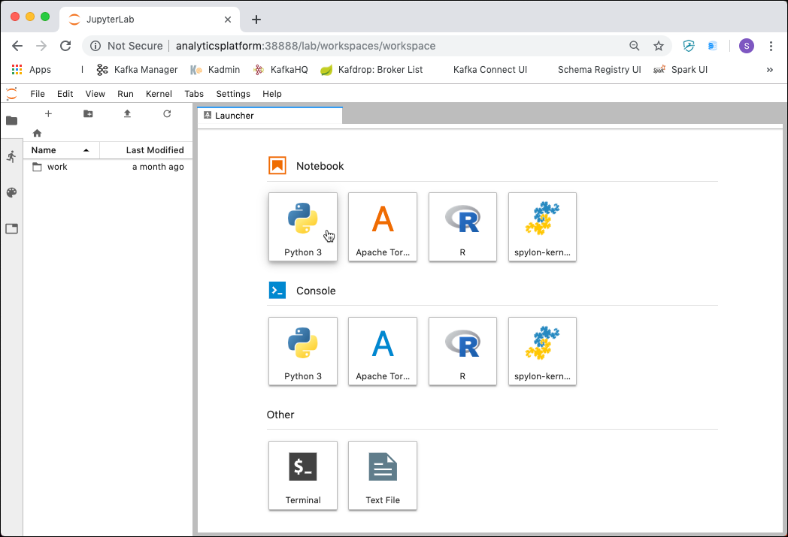
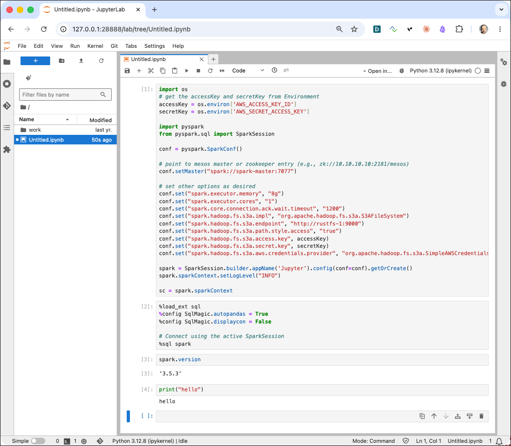

# Getting Started using Spark RDD and DataFrames

In this workshop we will work with [Apache Spark](https://spark.apache.org/) and implement some basic operations using the Spark DataFrame API for Python. 

We assume that the **Data platform** described [here](../00-environment) is running and accessible. 

## Table of Contents

- [What you will learn](#what-you-will-learn)
- [Prerequisites](#prerequisites)
- [Accessing Spark](#accessing-spark)
  - [Using the Python API through PySpark](#using-the-python-api-through-pyspark)
  - [Using Jupyter](#using-jupyter)
- [Load Source Data to Object Storage](#load-source-data-to-object-storage)
- [Working with Spark Resilient Distributed Datasets (RDDs)](#working-with-spark-resilient-distributed-datasets-rdds)
- [Working with Spark DataFrames](#working-with-spark-dataframes)

## What you will learn

- How to access Apache Spark through PySpark (CLI) and Jupyter Notebook
- How Spark's Resilient Distributed Datasets (RDDs) work and when to use them
- How to implement a word count using the RDD API (`flatMap`, `map`, `reduceByKey`)
- How to read and write data from/to object storage using the `s3a://` scheme
- How to use the Spark DataFrame API to read text, split, explode, clean, and aggregate words
- The difference between lazy transformations and actions in Spark

## Prerequisites

- The **Data Platform** described [here](../00-environment) is running and accessible
- Workshop 1b ([Working with RustFS Object Storage](../01b-rustfs-object-storage)) completed, or at minimum the `rustfs-mc` container available to upload data
- To avoid problems with not being able to write to `spark/logs` folder, execute once the following statement in a terminal:

```bash
cd $DATAPLATFORM_HOME
sudo chmod 777 container-volume/spark/logs
```

## Accessing Spark

[Apache Spark](https://spark.apache.org/) is a fast, in-memory data processing engine with elegant and expressive development APIs in Scala, Java, and Python that allow data workers to efficiently execute machine learning algorithms that require fast iterative access to datasets. Spark on Apache Hadoop YARN enables deep integration with Hadoop and other YARN enabled workloads in the enterprise.

You can run batch application such as MapReduce types jobs or iterative algorithms that build upon each other. You can also run interactive queries and process streaming data with your application. Spark also provides a number of libraries which you can easily use to expand beyond the basic Spark capabilities such as Machine Learning algorithms, SQL, streaming, and graph processing. Spark runs on Hadoop clusters such as Hadoop YARN or Kubernetes, or even in a Standalone Mode with its own scheduler.

There are various ways for accessing Spark

 * **PySpark** - accessing Spark from the command line
 * **Jupyter** - a browser based GUI for working with Python and Spark

There is also the option to use **Thrift Server** to execute Spark SQL from any tool supporting SQL. But this is not covered in this workshop.

### Using the Python API through PySpark

The [PySpark API](https://spark.apache.org/docs/latest/api/python/index.html) allows us to work with Spark through the command line. 

In our environment, PySpark is accessible inside the `spark-master` container. 


Now to start PySpark use the `pyspark` command. 

In a terminal window (uising `wetty`)

```bash
docker exec -ti spark-master pyspark
```

and you should end up on the **pyspark** command prompt `>>>` as shown below

```bash
bigdata@bigdata:~$ docker exec -ti spark-master pyspark

Python 3.12.8 (main, Dec  4 2024, 00:26:17) [GCC 12.2.0] on linux
Type "help", "copyright", "credits" or "license" for more information.
:: loading settings :: url = jar:file:/opt/bitnami/spark/jars/ivy-2.5.1.jar!/org/apache/ivy/core/settings/ivysettings.xml
Ivy Default Cache set to: /opt/bitnami/spark/.ivy2/cache
The jars for the packages stored in: /opt/bitnami/spark/.ivy2/jars
org.postgresql#postgresql added as a dependency
org.apache.spark#spark-avro_2.12 added as a dependency
graphframes#graphframes added as a dependency
:: resolving dependencies :: org.apache.spark#spark-submit-parent-a03e809f-bd0c-4692-8dc5-c0ee43d96331;1.0
        confs: [default]
        found org.postgresql#postgresql;42.3.4 in central
        found org.checkerframework#checker-qual;3.5.0 in central
        found org.apache.spark#spark-avro_2.12;3.5.2 in central
        found org.tukaani#xz;1.9 in central
        found graphframes#graphframes;0.8.4-spark3.5-s_2.12 in spark-packages
        found org.slf4j#slf4j-api;1.7.16 in central
:: resolution report :: resolve 607ms :: artifacts dl 19ms
        :: modules in use:
        graphframes#graphframes;0.8.4-spark3.5-s_2.12 from spark-packages in [default]
        org.apache.spark#spark-avro_2.12;3.5.2 from central in [default]
        org.checkerframework#checker-qual;3.5.0 from central in [default]
        org.postgresql#postgresql;42.3.4 from central in [default]
        org.slf4j#slf4j-api;1.7.16 from central in [default]
        org.tukaani#xz;1.9 from central in [default]
        ---------------------------------------------------------------------
        |                  |            modules            ||   artifacts   |
        |       conf       | number| search|dwnlded|evicted|| number|dwnlded|
        ---------------------------------------------------------------------
        |      default     |   6   |   0   |   0   |   0   ||   6   |   0   |
        ---------------------------------------------------------------------
:: retrieving :: org.apache.spark#spark-submit-parent-a03e809f-bd0c-4692-8dc5-c0ee43d96331
        confs: [default]
        0 artifacts copied, 6 already retrieved (0kB/11ms)
25/05/18 10:44:10 WARN NativeCodeLoader: Unable to load native-hadoop library for your platform... using builtin-java classes where applicable
Setting default log level to "WARN".
To adjust logging level use sc.setLogLevel(newLevel). For SparkR, use setLogLevel(newLevel).
Welcome to
      ____              __
     / __/__  ___ _____/ /__
    _\ \/ _ \/ _ `/ __/  '_/
   /__ / .__/\_,_/_/ /_/\_\   version 4.1.1
      /_/

Using Python version 3.10.12 (main, Nov  4 2025 08:48:33)
Spark context Web UI available at http://3.71.39.194:4040
Spark context available as 'sc' (master = local[*], app id = local-1787861021643).
SparkSession available as 'spark'
>>> 
```

> **What you should see:** The Spark ASCII logo, the version number (`3.5.3`), and the `>>>` prompt — confirming PySpark started successfully with both a `SparkSession` (`spark`) and a `SparkContext` (`sc`) already initialised.

You have an active `SparkSession` available as the `spark` variable. Enter any valid command, just to test we can ask Spark for the version which is installed. 

```bash
spark.version
```

and we should get the version back

```bash
>>> spark.version
'4.1.1'
```

> **What you should see:** The string `'4.1.1.'` (or whichever Spark version is installed), confirming the session is live and responding.

You can use `pyspark` for this workshop. But there is also a browser-based tool which is much more comfortable to use and which additionally allows to store the different steps as a notebook for later re-use. 

### Using Jupyter

In a browser window, navigate to <http://dataplatform:28888>. 

Enter `abc123!` into the **Password or token** field and click **Log in**. 

> **What you should see:** The Jupyter file browser showing the workspace directory contents.

You should be forwarded to the **Jupyter** homepage. Click on the **Python 3.12.8** icon in the **Notebook** section to create a new notebook using the **Python 3.12.8** kernel (it's important to use exactly the same python version as on the Spark cluster).


  
You will be forwarded to an empty notebook with a first empty cell. 

Here you can enter your commands. We first have to create a Spark Session, which is also more realistic, as we have to do that in "real-life" as well. 

We can either do that via Spark Connect (modern way since Spark 3.5) or creating a Spark Session in the more traditional way. Spark Connect is available on our platform, so that is the preferred option in general. But if you want to work with RDDs (the first section below), then you need a Spark Context and that is not supported by Spark Connect. Spark Connect only supports working with the more modern DataFrames. So if this is the case, then use the 2nd option to connect from Jupyter to spark.

Add one of the following code blocks into the first cell

 * for **Spark Connect**

```
from pyspark.sql import SparkSession:

spark = SparkSession.builder \
    .remote("sc://spark-connect:15002") \
    .appName("Jupyter") \
    .getOrCreate()
```

 * for the **traditional Spark Session** option:

```python
import os
# get the accessKey and secretKey from Environment
accessKey = os.environ['AWS_ACCESS_KEY_ID']
secretKey = os.environ['AWS_SECRET_ACCESS_KEY']

import pyspark
from pyspark.sql import SparkSession

conf = pyspark.SparkConf()

# point to mesos master or zookeeper entry (e.g., zk://10.10.10.10:2181/mesos)
conf.setMaster("spark://spark-master:7077")

# set other options as desired
conf.set("spark.executor.memory", "8g")
conf.set("spark.executor.cores", "1")
conf.set("spark.core.connection.ack.wait.timeout", "1200")
conf.set("spark.hadoop.fs.s3a.impl", "org.apache.hadoop.fs.s3a.S3AFileSystem")
conf.set("spark.hadoop.fs.s3a.endpoint", "http://rustfs-1:9000")
conf.set("spark.hadoop.fs.s3a.path.style.access", "true")
conf.set("spark.hadoop.fs.s3a.access.key", accessKey)
conf.set("spark.hadoop.fs.s3a.secret.key", secretKey)
conf.set("spark.hadoop.fs.s3a.aws.credentials.provider", "org.apache.hadoop.fs.s3a.SimpleAWSCredentialsProvider")
conf.set("spark.sql.catalogImplementation", "hive")
conf.set("spark.sql.warehouse.dir", "s3a://flight-bucket/warehouse")
conf.set("spark.hadoop.hive.metastore.uris", "thrift://hive-metastore:9083")

spark = SparkSession.builder.appName('Jupyter').config(conf=conf).getOrCreate()
spark.sparkContext.setLogLevel("INFO")

sc = spark.sparkContext
```

Execute it by entering **Shift** + **Enter**. 

> **What you should see:** The cell executes without error and a `SparkSession` object reference is printed below it. Some INFO log lines may appear. The `spark` and `sc` variables are now available for use in subsequent cells.

If you check the code you can see that we connect to the Spark Master and get a session on the "spark cluster", available through the `spark` variable. The Spark Context is available as variable `sc`.

Also enable sql magic by executing the following commands in a new cell (this will enable the `%%sql` directive to execute plain SQL statements)

```python
%load_ext sql
%config SqlMagic.autopandas = True
%config SqlMagic.displaycon = False

# Connect using the active SparkSession
%sql spark
```

Now, execute `spark.version` in another cell to show the Spark version in place. 

Also execute a python command `print ("hello")` just to see that you are executing python. 



> **What you should see:** No visible output — the SQL magic extension loads silently. After this cell, you can use `%%sql` at the top of any cell to run SQL directly against Spark. We will use this in a later workshop.

You are now set up to use **Jupyter** for performing the workshop. 

## Load Source Data to Object Storage

First let's upload the data needed for this workshop, using the techniques we have learned in the [Working with RustFS Object Storage](../01b-rustfs-object-storage/README.md) when working with Object Storage.

First create a new bucket `wordcount-bucket` for the data

```bash
docker exec -ti rustfs-mc mc mb rustfs-1/wordcount-bucket
```

> **What you should see:** Bucket created successfully \`rustfs-1/wordcount-bucket\`.

And then upload the `big.txt` into the new bucket 

```bash
docker exec -ti rustfs-mc mc cp /data-transfer/wordcount/big.txt rustfs-1/wordcount-bucket/raw-data/book/
```

> **What you should see:** A progress bar and a confirmation line showing `big.txt` was uploaded to `rustfs-1/wordcount-bucket/raw-data/book/`.

Now with the data either available in Object Storage, let's use the data using Spark RDDs.

## Working with Spark Resilient Distributed Datasets (RDDs)

Spark's primary core abstraction is called a **Resilient Distributed Dataset** or **RDD**. 

It is a distributed collection of elements that is parallelised across the cluster. In other words, a RDD is an immutable collection of objects that is partitioned and distributed across multiple physical nodes of a YARN cluster and that can be operated in parallel.

There are three methods for creating a RDD:

 1. Parallelise an existing collection. This means that the data already resides within Spark and can now be operated on in parallel. 
 2. Create a RDD by referencing a dataset. This dataset can come from any storage source supported by Hadoop such as HDFS, Cassandra, HBase etc.
 3. Create a RDD by transforming an existing RDD to create a new RDD.

We will be using the 2nd method in this workshop.

In this section we will see how Word Count can be implemented using the Spark Python API.

You can paste the commands into the **PySpark** command line or into a cell in **Jupyter**. In Jupyter, make sure to first create an active Spark session using the script shown above.

To start, let's read the data into an RDD. Copy the following line into the empty cell and press **Shift-Enter** to execute:

```python
lines = sc.textFile("s3a://wordcount-bucket/raw-data/book/big.txt")
```

> **What you should see:** No output — `textFile` is a transformation that records where to find the data but does not read it yet. Spark is lazy: no work happens until an action is called.

Next let's split the line into words and flat map it

```python
words = lines.flatMap(lambda line: line.split(" "))
```

> **What you should see:** No output — `flatMap` is also a transformation. The operation is recorded in Spark's execution plan but no data is processed yet.

Reduce by key to get the counts by word and number. 
```python
counts = words.map(lambda word: (word,1)).reduceByKey(lambda a, b : a + b)
```

> **What you should see:** No output — `map` and `reduceByKey` are transformations. At this point Spark has built a DAG (Directed Acyclic Graph) of all three steps but executed nothing.

> **What just happened?** This is Spark's **lazy evaluation** model. Transformations like `textFile`, `flatMap`, `map`, and `reduceByKey` only define *what* to compute — they don't trigger any actual work. This allows Spark to optimise the full pipeline before executing it.

So far all of the operations are **transform** operations and executed in a lazy fashion. 

Now let's save the counts to object storage. This is an **action** and will start execution on Spark. Make sure to remove the output folder in case it already exists

```python
counts.saveAsTextFile("s3a://wordcount-bucket/result-data")
```

> **What you should see:** Spark now executes the entire pipeline. You will see progress output (stage counters, task counts) as Spark reads `big.txt`, splits lines, maps words, shuffles for `reduceByKey`, and writes the result to Object Storage. This is the first point where actual computation occurs.

> **What just happened?** `saveAsTextFile` is an **action** — it forces Spark to materialise the full RDD by executing all upstream transformations at once. Spark reads the file from object storage, applies the word count pipeline, and writes the result back as two `part-*` files (one per partition).

To view the number of distinct values in counts.

```python
counts.count()
```

> **What you should see:** A single integer — the total number of distinct words found in `big.txt`. Note that running this re-executes the pipeline from scratch unless the RDD has been cached (`.cache()`).

To check the results in Object Storage, do an `ls` in a terminal window to see the different objects in the S3 folder

```bash
docker exec -it rustfs-mc mc ls rustfs-1/wordcount-bucket/result-data
```

and you should see a result similar to the one below. We can see that two result files were created, as we run the spark job in parallel:

```bash
ubuntu@ip-172-26-1-38:~$ docker exec -it rustfs-mc mc ls rustfs-1/wordcount-bucket/result-data
[2026-04-02 18:25:00 UTC]     0B STANDARD _SUCCESS
[2026-04-02 18:25:00 UTC] 657KiB STANDARD part-00000
[2026-04-02 18:25:00 UTC] 656KiB STANDARD part-00001
```

> **What you should see:** Three objects — a zero-byte `_SUCCESS` marker (confirming the job completed without errors) and two `part-*` files containing the word count results, one per Spark partition.

> **What just happened?** Spark writes output in parallel — each partition produces its own `part-*` file. The `_SUCCESS` file is written last as a job-completion signal, commonly used by downstream tools to check whether the output is complete and safe to read.

This finishes this simple Python implementation of a word count in Spark using Spark's Resilient Distributed Datasets (RDD). 

Next let's do a wordcount using Spark DataFrames.
 
## Working with Spark DataFrames

The data needed here has been uploaded to Object Storage at the beginning. 

You can use either **PySpark** from the command line or **Jupyter** for the following steps. In Jupyter, create the Spark context the same way as before.

First let's see the `spark.read` method, which is part of the `DataFrameReader`. The following statement shows that:

```python
spark.read
```

We can easily display the methods it eposes, such as `text()`, `json()` and many others using the `dir` command:

```python
dir (spark.read)
```

> **What you should see:** A list of method names available on the `DataFrameReader`, including `csv`, `json`, `parquet`, `text`, `orc`, and many others.

In this workshop we will be using the `text()` operation. 

Let's start by reading the data from object storage into a `bookDF` DataFrame, using the `read.text` with the address of the object in Object Storage

```python
bookDF = spark.read.text("s3a://wordcount-bucket/raw-data/book/")
bookDF
```

> **Note:** The path points to the **folder** (`raw-data/book/`), not to a specific file. Spark reads all files in that prefix as a single dataset. This means you don't need to know the exact filename, and if you later add more text files to the folder they will automatically be included in the next run.

> **What you should see:** A `DataFrame` object reference printed (e.g. `DataFrame[value: string]`) — no data is loaded yet. Like RDD transformations, `read.text` is lazy.

A DataFrame with a single value of type string is returned.

We can easily display the schema in a more readable way:

```python
bookDF.printSchema()
```

and you will see a simple schema with just one value (representing the line of the txt file read above)

```
root
 |-- value: string (nullable = true)
```

> **What you should see:** A single-field schema — each line of the text file maps to one `value` string column.

To display the data behind the DataFrame, we can use the `show()` method. 

```python
bookDF.show()
```

If used without any parameters, by default a maximum of 20 rows is shown. 

> **What you should see:** The first 20 lines of `big.txt` displayed as a table with a single `value` column. This is the first action that triggers Spark to actually read the file from Object Storage.

We can also change it to `10` records and truncate each record at `200` characters:

```python
bookDF.show(10, truncate=200)
```

> **What you should see:** The first 10 lines of the file, each truncated at 200 characters if longer.

Next we tokenize each word, by splitting on a single space character, return a list of words:

```python
from pyspark.sql.functions import split

linesDF = bookDF.select(split(bookDF.value, " ").alias("line"))
linesDF.show(5)
```

the result will look similar to the one below

```
+--------------------+
|                line|
+--------------------+
|[The, Project, Gu...|
|[by, Sir, Arthur,...|
|[(#15, in, our, s...|
|                  []|
|[Copyright, laws,...|
+--------------------+
only showing top 5 rows
```

> **What you should see:** Each line of text has been converted into an array of words (split on space). The `line` column contains an array type — notice the square brackets and comma-separated words.

Using the `bookDF.value` we are able to select a specific column out from the DataFrame. There are alternative approaches, as shown next. They all get the same result:

```python
from pyspark.sql.functions import col

bookDF.select(bookDF.value) 
bookDF.select(bookDF["value"]) 
bookDF.select(col("value"))
```

Print the schema of the resulting `linesDF` dataframe and we can see that a line is an array of string elements, i.e. the single words

```python
linesDF.printSchema()
```

```
root
 |-- line: array (nullable = true)
 |    |-- element: string (containsNull = false)
```

> **What you should see:** The `line` column is now of type `array<string>` — each element of the array is one word from the original line.

Not let's reshape the result by exploding the array of words into rows of words. We again show the result using the `show()` method

```python
from pyspark.sql.functions import explode, col

wordsDF = linesDF.select(explode(col("line")).alias("word"))
wordsDF.show(15)
```

and you should see the following result:

```
+----------+
|      word|
+----------+
|       The|
|   Project|
| Gutenberg|
|     EBook|
|        of|
|       The|
|Adventures|
|        of|
|  Sherlock|
|    Holmes|
|        by|
|       Sir|
|    Arthur|
|     Conan|
|     Doyle|
+----------+
only showing top 15 rows
```

> **What you should see:** Each word is now on its own row — the arrays have been "exploded" into individual records. The DataFrame has gone from one row per line to one row per word.

> **What just happened?** `explode` is the DataFrame equivalent of `flatMap` in the RDD API — it takes each element of an array column and turns it into a separate row, expanding the number of rows from ~lines to ~words.

With the table of words, we next use the `lower` function to change the case to all lowercase

```python
from pyspark.sql.functions import lower 
wordsLowerDF = wordsDF.select(lower(col("word")).alias("word_lower"))

wordsLowerDF.show()
```

and you should see the following result:

```
+----------+
|word_lower|
+----------+
|       the|
|   project|
| gutenberg|
|     ebook|
|        of|
|       the|
|adventures|
|        of|
|  sherlock|
|    holmes|
|        by|
|       sir|
|    arthur|
|     conan|
|     doyle|
|      (#15|
|        in|
|       our|
|    series|
|        by|
+----------+
only showing top 20 rows
```

> **What you should see:** All words in lowercase. Notice `(#15` is still present — punctuation and special characters are not yet removed.

Now using `regexp_extract()` function we make sure that only words are kept (only letters a - z)

```python
from pyspark.sql.functions import regexp_extract 
wordsCleanDF = wordsLowerDF.select( regexp_extract(col("word_lower"), "[a-z]*", 0).alias("word") )

wordsCleanDF.show()
```

and you should see the following result:

```
+----------+
|      word|
+----------+
|       the|
|   project|
| gutenberg|
|     ebook|
|        of|
|       the|
|adventures|
|        of|
|  sherlock|
|    holmes|
|        by|
|       sir|
|    arthur|
|     conan|
|     doyle|
|          |
|        in|
|       our|
|    series|
|        by|
+----------+
only showing top 20 rows
```

> **What you should see:** Punctuation and numbers have been stripped — `(#15` became an empty string `""`. Empty strings will be filtered out in the next step.

Next let's remove empty words, by just applying a `where` operation:

```python
wordsNonNullDF = wordsCleanDF.where(col("word") != "")

wordsNonNullDF.show()
```

> **What you should see:** The same word list as before but with the empty string rows removed — all remaining rows contain at least one letter.

With that we are finally ready to group by word and return the count by word

```python
resultsDF = wordsNonNullDF.groupby(col("word")).count()
resultsDF
```

> **What you should see:** A `DataFrame` object reference — no computation happens yet. `groupBy` and `count` are a transformation and an aggregation, both lazy until an action triggers execution.

Finally we order the counts in descending order and only show the top 10 word counts 

```python
resultsDF.orderBy("count", ascending=False).show(10)
```

and you should see the following result:

```
+----+-----+
|word|count|
+----+-----+
| the|78176|
|  of|39956|
| and|37619|
|  to|28550|
|  in|21669|
|   a|20666|
|that|12102|
|  he|12047|
| was|11346|
|  it|10170|
+----+-----+
only showing top 10 rows
```

> **What you should see:** The top 10 most frequent words in the text, dominated by common English stop words (`the`, `of`, `and`, ...). The `show(10)` call is the action that triggers Spark to execute the entire DataFrame pipeline from reading the file through to the final aggregation and sort.

> **What just happened?** The full DataFrame pipeline — read → split → explode → lowercase → regex clean → filter → groupBy → count → orderBy — was executed in a single optimised job. Spark's Catalyst query optimiser rearranges and combines these steps into an efficient physical plan before running them, which is the key advantage of the DataFrame API over raw RDDs.
