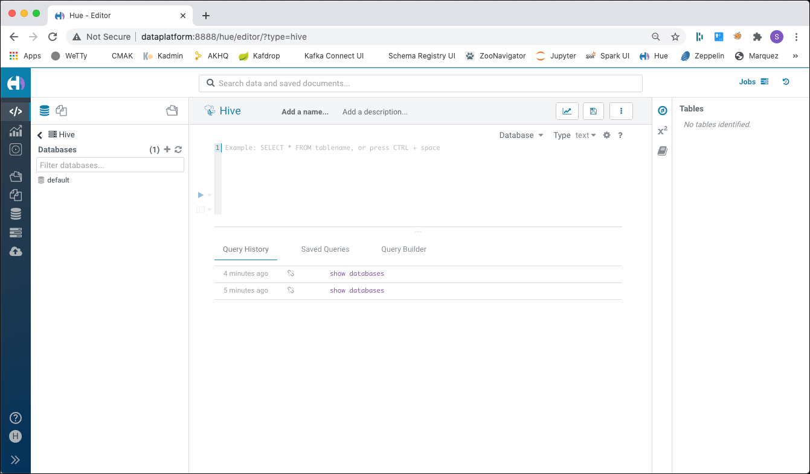
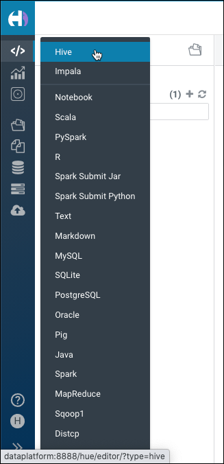
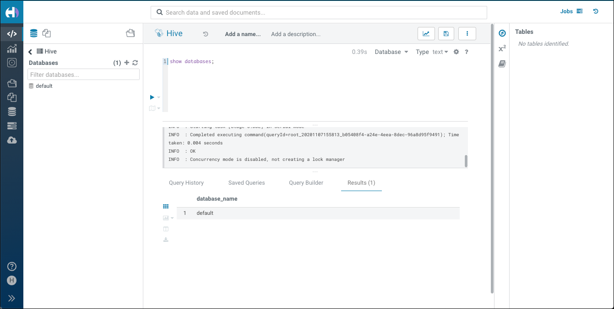
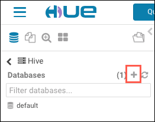
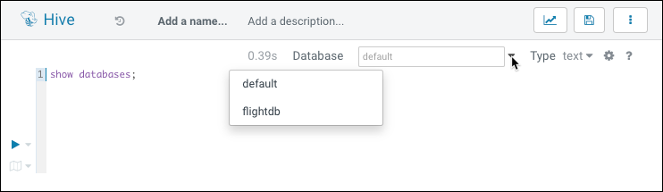
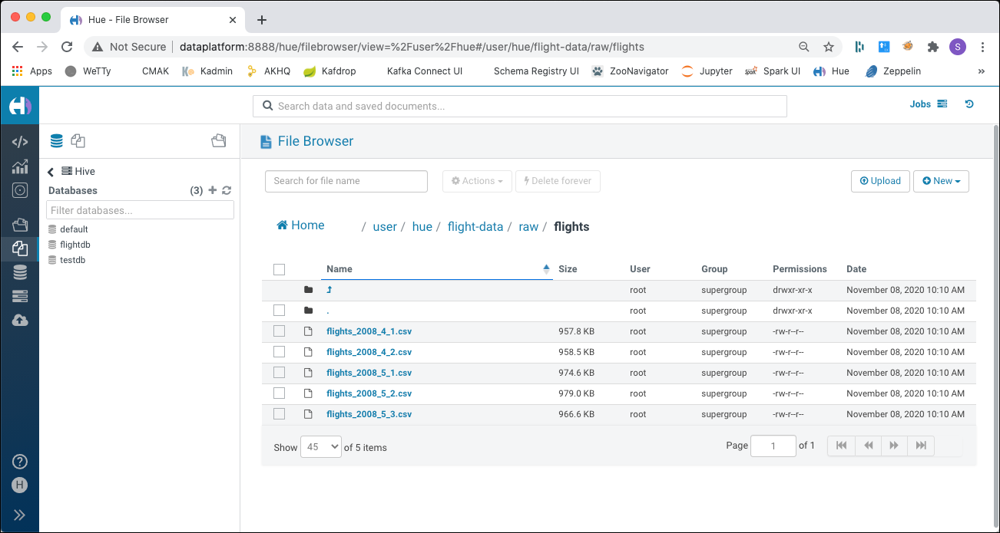

# Data Manipulation with Hive

For this workshop you have to start a platform using the `hdfs` flavour in the init script.

## Introduction

In this workshop we will work with [Apache Hive](https://hive.apache.org/) to analyse data through SQL.

Hive is an SQL like query language that enables analysts familiar with SQL to run queries on large volumes of data. Hive has three main functions: data summarisation, query and analysis. Hive provides tools that enable easy data extraction, transformation and loading (ETL).

We assume that the **Analytics platform** described [here](../01-environment) is running and accessible. 

##	 Accessing Hive

The Apache Hive ™ data warehouse software facilitates reading, writing, and managing large datasets residing in distributed storage using SQL. Structure can be projected onto data already in storage. A command line tool and JDBC driver are provided to connect users to Hive.

There are various ways for accessing Hive. In this workshop we will use the following

 * **Hive CLI** - accessing Hive from the command line
 * **Hue** - a browser based GUI for working with a Hadoop cluster

There would also be the option to use **HiveServer2** and use Hive from any tool supporting ODBC or JDBC. But this is not covered in this workshop.

### Using the Hive CLI

The [Hadoop CLI](https://cwiki.apache.org/confluence/display/Hive/LanguageManual+Cli) allows us to work with Hadoop and HDFS through the command line. 
We can use it to create tables, load data into a table and query from tables.

In our environment, the Hadoop command is accessible inside the `hive-server` container. To connect to the Hive over the Hive CLI use the `hive` command. To get the help page run

```bash
docker exec -ti hive-server hive -h
```

and you should get the help page in return

```bash
$ docker exec -ti hive-server hive -h
SLF4J: Class path contains multiple SLF4J bindings.
SLF4J: Found binding in [jar:file:/opt/hive/lib/log4j-slf4j-impl-2.6.2.jar!/org/slf4j/impl/StaticLoggerBinder.class]
SLF4J: Found binding in [jar:file:/opt/hadoop-2.7.4/share/hadoop/common/lib/slf4j-log4j12-1.7.10.jar!/org/slf4j/impl/StaticLoggerBinder.class]
SLF4J: See http://www.slf4j.org/codes.html#multiple_bindings for an explanation.
SLF4J: Actual binding is of type [org.apache.logging.slf4j.Log4jLoggerFactory]
Unrecognized option: -h
usage: hive
 -d,--define <key=value>          Variable substitution to apply to Hive
                                  commands. e.g. -d A=B or --define A=B
    --database <databasename>     Specify the database to use
 -e <quoted-query-string>         SQL from command line
 -f <filename>                    SQL from files
 -H,--help                        Print help information
    --hiveconf <property=value>   Use value for given property
    --hivevar <key=value>         Variable substitution to apply to Hive
                                  commands. e.g. --hivevar A=B
 -i <filename>                    Initialization SQL file
 -S,--silent                      Silent mode in interactive shell
 -v,--verbose                     Verbose mode (echo executed SQL to the
                                  console)
```

To connect to Hive, just use the command without the `-h` option

```bash
docker exec -ti hive-server hive
```

Now on the command prompt `hive>` you can enter the hive commands. Let's list the available databases.

```sql
hive> show databases;
OK
default
Time taken: 0.94 seconds, Fetched: 2 row(s)
hive> 
```

### Using Hue

[Hue](http://gethue.com/) is a web-based interactive query editor in the Hadoop stack that lets you visualise and share data.

In a browser window, navigate to <http://dataplatform:8888> and sign in with user `hue` and password `hue`. You should be forwarded to the **Hive** window. 



If asked for the tour through Hue, either follow it, or just close the window. 

If you don't see the **Hive** window, then you can navigate to it using the menu bar on the left



Enter the commands into the query window and execute it either using the **>** icon to the left or hitting **CTRL + ENTER** on the keyboard. You can also use the `show databases` command to display the Hive databases here.



## First steps with Hive

Hive supports two different types of Hive tables, the **Hive Managed Tables** and the **Hive External Tables**.

Let's create a `test1.csv` in the `data-transfer` folder on the Data Platform. Either use the terminal or the visual code-server <http://dataplatform:28140> (for the code-server, the password is `abc123!`). 

```csv
id,text
1,HDFS
2,MapReduce
3,Hive
4,Pig
5,Spark
```

In a terminal window, connect to Hive CLI 

```bash
docker exec -ti hive-server hive
```

and create a new database

```sql
CREATE DATABASE testdb;
USE testdb;
```

### Working with Hive Managed Tables

First let's see how Hive Managed table work. Such a table is managed by hive and the data for these tables are held inside the Hive Warehouse in the HDFS folder `/user/hive/warehouse`.

To load the data into the Hive managed table, we first copy it into Copy the file to HDFS under `/user/hue/test-data` 

In the Hive CLI create the managed table

```sql
CREATE TABLE test_hive_wh (id INTEGER, text string)
	ROW FORMAT DELIMITED
	FIELDS TERMINATED BY ','
	STORED AS TEXTFILE
	TBLPROPERTIES ("skip.header.line.count"="1");
```
It reflects the format of the CSV file `test1.csv`. 

Let’s review some aspects of the **CREATE TABLE** statements issued above. If you have an SQL background this statement should seem very familiar except for the last 3 lines after the columns definition:

* The **ROW FORMAT** clause specifies each row is terminated by the new line character.
* The **FIELDS TERMINATED BY** clause specifies that the fields associated with the
table (in our case, the two CSV files) are to be delimited by a comma.
* The **STORED AS** clause specifies that the table will be stored in the TEXTFILE
format.

For details on these clauses consult the [Apache Hive Language Manual](https://cwiki.apache.org/confluence/display/Hive/LanguageManual+DDL).

If you query from the table, you will see now rows returned. 

```sql
SELECT * FROM test_hive_wh;
```

We have only created the table, but there are no data files "behind" that table. You can check the HDFS folder to see that it is empty using the following command

```bash
docker exec -ti namenode hadoop fs -ls -R /user/hive/warehouse
```

we can see that there is a folder `test_hive_wh` inside the `testdb.db` folder, reflecting the name of the table and the database.

```bash
ubuntu@ip-172-26-1-182:~$ docker exec -ti namenode hadoop fs -ls -R /user/hive/warehouse
drwxr-xr-x   - root supergroup          0 2020-11-08 09:50 /user/hive/warehouse/testdb.db
drwxr-xr-x   - root supergroup          0 2020-11-08 09:50 /user/hive/warehouse/testdb.db/test_hive_wh
```

Now let's load the data from the data-transfer folder into the Hive managed table

```bash
LOAD DATA LOCAL INPATH '/data-transfer/test1.csv'  OVERWRITE INTO TABLE test_hive_wh;
```

Now let's query from the table

```sql
SELECT * FROM test_hive_wh;
```

and you should see the following result

```sql
hive> SELECT * FROM test_hive_wh;
OK
1       HDFS
2       MapReduce
3       Hive
4       Pig
5       Spark
Time taken: 0.123 seconds, Fetched: 5 row(s)
```

The data has been copied into the Hive warehouse folder, which you can see by executing the following statement from a terminal window

```bash
docker exec -ti namenode hadoop fs -ls -R /user/hive/warehouse
```

you should see the following structure

```bash
ubuntu@ip-172-26-6-34:~/hadoop-spark-workshop/01-environment/docker-hdfs$ docker exec -ti namenode hadoop fs -ls -R /user/hive/warehouse
drwxr-xr-x   - root supergroup          0 2020-11-07 17:20 /user/hive/warehouse/testdb.db
drwxr-xr-x   - root supergroup          0 2020-11-07 20:40 /user/hive/warehouse/testdb.db/test_hive_wh
-rw-r--r--   3 root supergroup         48 2020-11-07 20:40 /user/hive/warehouse/testdb.db/test_hive_wh/test1.csv
```

If you drop the table, then the data in the warehouse will also be deleted. Execute the `DROP TABLE` statement in Hive CLI

```bash
docker exec -ti hive-server hive -e "DROP TABLE testdb.test_hive_wh"
```

and then check the warehouse folder again

```bash
docker exec -ti namenode hadoop fs -ls -R /user/hive/warehouse
```

and you can see that the file is gone, it has been deleted due to the `DROP TABLE`

```bash
ubuntu@ip-172-26-6-34:~/hadoop-spark-workshop/01-environment/docker-hdfs$ docker exec -ti namenode hadoop fs -ls -R /user/hive/warehouse
drwxr-xr-x   - root supergroup          0 2020-11-07 20:55 /user/hive/warehouse/testdb.db
```

Manage tables manage the lifecycle of the data behind the table. Now let's see the other type of Hive tables, the external tables. 

### Working with External tables

An external table does not managed the data behind the table. Let's see that in action. 

First we copy the exact same file manually into a new HDFS folder

```bash
docker exec -ti namenode hadoop fs -mkdir -p /user/hue/test-data

docker exec -ti namenode hadoop fs -copyFromLocal /data-transfer/test1.csv /user/hue/test-data
```

And then we create the external table wrapping the data in the folder. Open the Hive CLI

```bash
docker exec -ti hive-server hive
```

change into the `testdb` database and create the table

```sql
USE testdb;

CREATE EXTERNAL TABLE test_hive_ext (id INTEGER, text string)
	ROW FORMAT DELIMITED
	FIELDS TERMINATED BY ','
	STORED AS TEXTFILE
	LOCATION "hdfs://namenode:9000/user/hue/test-data"
	TBLPROPERTIES ("skip.header.line.count"="1");
```

Compared to the managed table above, we use the additional `EXTERNAL` keyword and we specify the location of the data for that table. The location is the folder, which holds the data as one or more files. 

Now lets query the data

```sql
SELECT * FROM test_hive_ext;
```

and we should see the following result

```sqk
hive> select * from test_hive_ext;
OK
1       HDFS
2       MapReduce
3       Hive
4       Pig
5       Spark
Time taken: 2.17 seconds, Fetched: 5 row(s)
```

if we now drop the table

```bash
docker exec -ti hive-server hive -e "DROP TABLE testdb.test_ext"
```

we can see that the data is not touched

```bash
docker exec -ti namenode hadoop fs -ls -R /user/hue/test-data
```

which shows the result of the `hadoop fs -ls -R`

```bash
ubuntu@ip-172-26-6-34:~/hadoop-spark-workshop/01-environment/docker-hdfs$ docker exec -ti namenode hadoop fs -ls -R /user/hue/test-data
-rw-r--r--   3 root supergroup         48 2020-11-07 21:13 /user/hue/test-data/test1.csv
```

### What happens if the `CREATE TABLE` is not correct?

If something in the mapping of the tables to the files in HDFS is wrong, then you will get just NULL values back.

Let's demonstrate that with an additional column, for which there is no data in the file

```sql
CREATE EXTERNAL TABLE test_hive_ext_too_many_cols (id INTEGER, text string, nonexisting string)
	ROW FORMAT DELIMITED
	FIELDS TERMINATED BY ','
	STORED AS TEXTFILE
	LOCATION "hdfs://namenode:9000/user/hue/test-data"
	TBLPROPERTIES ("skip.header.line.count"="1");
```

and you will see that the 3rd column is all `NULL`

```sql
hive> select * from test_hive_ext_too_many_cols;
OK
1       HDFS    NULL
2       MapReduce       NULL
3       Hive    NULL
4       Pig     NULL
5       Spark   NULL
Time taken: 0.116 seconds, Fetched: 5 row(s)
```

What happens if we use a wrong datatype for a column?

```sql
CREATE EXTERNAL TABLE test_hive_ext_wrong_datatype (id INTEGER, wrongdatatype INTEGER)
	ROW FORMAT DELIMITED
	FIELDS TERMINATED BY ','
	STORED AS TEXTFILE
	LOCATION "hdfs://namenode:9000/user/hue/test-data"
	TBLPROPERTIES ("skip.header.line.count"="1");
```

you can see that all `NULL` values are returned in that case

```sql
hive> select * from test_hive_ext_wrong_datatype;
OK
1       NULL
2       NULL
3       NULL
4       NULL
5       NULL
Time taken: 0.128 seconds, Fetched: 5 row(s)
```

What if there is a wrong format applied to the underlaying file. We specify a `;` for the field delimiter, which is obviously wrong. 

```sql
CREATE EXTERNAL TABLE test_hive_ext_wrong_format (id INTEGER, text string)
	ROW FORMAT DELIMITED
	FIELDS TERMINATED BY ';'
	STORED AS TEXTFILE
	LOCATION "hdfs://namenode:9000/user/hue/test-data"
	TBLPROPERTIES ("skip.header.line.count"="1");
```

in that case the result is all `NULL`

```sql
hive> select * from test_hive_ext_wrong_format;
OK
NULL    NULL
NULL    NULL
NULL    NULL
NULL    NULL
NULL    NULL
Time taken: 0.107 seconds, Fetched: 5 row(s)
```

It is important to realise that a `NULL` value can also be a correct result, if there is no data available for a given column. So you have to be careful when you analyse your query results, it could be as well be an error in your table mapping. 

## Using Hive for working with the Flight Data

Apache Hive presents a relational view of data in HDFS and ensures that users need not worry about where or in what format their data is stored. Hive can display data from RCFile format, text files, ORC, JSON, parquet, sequence files and many of other formats in a tabular view. 

Through the use of SQL you can view your data as a table and create queries like you would in an RDBMS.

The data for this workshop has been uploaded to HDFS in the [HDFS Workshop](../02-hdfs/README.md). If you haven't done that, then just execute the following statements to have the files in place:

Create the folders in HDFS

```bash
docker exec -ti namenode hadoop fs -mkdir -p /user/hue/flight-data/raw/airports &&
  docker exec -ti namenode hadoop fs -mkdir -p /user/hue/flight-data/raw/plane-data &&
  docker exec -ti namenode hadoop fs -mkdir -p /user/hue/flight-data/raw/carriers && 
  docker exec -ti namenode hadoop fs -mkdir -p /user/hue/flight-data/raw/flights
```

and upload the data

```bash
docker exec -ti namenode hadoop fs -copyFromLocal /data-transfer/flight-data/airports.csv /user/hue/flight-data/raw/airports &&
	docker exec -ti namenode hadoop fs -copyFromLocal /data-transfer/flight-data/carriers.json /user/hue/flight-data/raw/carriers &&

	docker exec -ti namenode hadoop fs -copyFromLocal /data-transfer/flight-data/plane-data.csv /user/hue/flight-data/raw/plane-data &&

	docker exec -ti namenode hadoop fs -copyFromLocal /data-transfer/flight-data/flights-small/flights_2008_4_1.csv /data-transfer/flight-data/flights-small/flights_2008_4_2.csv /data-transfer/flight-data/flights-small/flights_2008_5_1.csv /data-transfer/flight-data/flights-small/flights_2008_5_2.csv /data-transfer/flight-data/flights-small/flights_2008_5_3.csv  /user/hue/flight-data/raw/flights
```

### Create a Database for the Flight Data

First let's create a Hive database for holding the tables.

You can either use the `CREATE DATABASE` statement in **Hive CLI** or **Hue**

```sql
CREATE DATABASE flightdb;
```

Or in Hue there is also a graphical way using the **+** sign next to the Databases list on the left side.



To see the databases in place, execute the following command in either **Hive CLI** or **Hue** 

```sql
SHOW databases;
```

In **Hue** you can also click on the refresh icon, next to the **Databases**.


### Create Hive tables on the raw data

Now that you are familiar with the Hive User View, let’s create the initial staging tables for the airport and flights data. In this section we will learn how to create two Hive tables: `airports_raw`, `flights_raw`.

First we are going to create the two tables to stage the data in their original CSV text format and then we will create two more tables where we will optimise the storage with ORC. 


The following statements can either be executed using the Hive CLI or the **Hue Query Editor**. Screenshots of how to use it via **Hue** will be shown together with the description of the various tasks. 

Make sure that you switch to the `flightdb` database created above, before you perform the next steps. You can either to it in **Hive CLI** using

```sql
use flightdb;
```

or in **Hue** using the Drop-Down on the top of the Query Editor



#### Create Table AIRPORTS_RAW for staging initial load

To create the table named `airports_raw` execute the following `CREATE TABLE` statement

```sql
DROP TABLE IF EXISTS airports_raw;

CREATE EXTERNAL TABLE airports_raw (iata string, airport string, city string, state string, country string, latitude double, longitude double)
   ROW FORMAT SERDE 'org.apache.hadoop.hive.serde2.OpenCSVSerde'
	STORED AS TEXTFILE
	LOCATION "hdfs://namenode:9000/user/hue/flight-data/raw/airports"
	TBLPROPERTIES ("skip.header.line.count"="1");
```

We create it as an external table over the data file in the HDFS folder `user/hue/flight-data/raw/airports`. We have to use the `org.apache.hadoop.hive.serde2.OpenCSVSerde` serde class, in order to remove the `"` characters in the csv file. 

Let's see that it actually works by querying for the first 10 airports

```sql
SELECT * FROM airports_raw
LIMIT 10;
```

you should see a result similar to the one below

```sql
hive> SELECT * FROM airports_raw
    > LIMIT 10;
OK
00M     Thigpen         Bay Springs     MS      USA     31.95376472     -89.23450472
00R     Livingston Municipal    Livingston      TX      USA     30.68586111     -95.01792778
00V     Meadow Lake     Colorado Springs        CO      USA     38.94574889     -104.5698933
01G     Perry-Warsaw    Perry   NY      USA     42.74134667     -78.05208056
01J     Hilliard Airpark        Hilliard        FL      USA     30.6880125      -81.90594389
01M     Tishomingo County       Belmont MS      USA     34.49166667     -88.20111111
02A     Gragg-Wade      Clanton AL      USA     32.85048667     -86.61145333
02C     Capitol Brookfield      WI      USA     43.08751        -88.17786917
02G     Columbiana County       East Liverpool  OH      USA     40.67331278     -80.64140639
03D     Memphis Memorial        Memphis MO      USA     40.44725889     -92.22696056
Time taken: 0.13 seconds, Fetched: 10 row(s)
```

#### Create Table `flights_raw` for Staging Initial Load

Now create the `flights_raw ` table in the same way as the `airports_raw`, except that we are using the `OpenCSVSerde` format class. 

```sql
DROP TABLE IF EXISTS fligths_raw;

CREATE EXTERNAL TABLE flights_raw (year integer
									 , month integer
								    , day_of_month integer
								    , day_of_week integer
								    , dep_time integer
								    , crs_dep_time integer
								    , arr_time integer
								    , crs_arr_time integer
								    , unique_carrier string
								    , flight_num string
								    , tail_num string
								    , actual_elapsed_time integer
								    , crs_elapsed_time integer
								    , air_time integer
								    , arr_delay integer
								    , dep_delay integer
								    , origin string
								    , dest string
								    , distance integer
								    , taxi_in integer
								    , taxi_out integer
								    , cancelled string
								    , cancellation_code string
								    , diverted integer
								    , carrier_delay integer
								    , weather_delay integer
								    , nas_deleay integer
								    , security_delay integer
								    , late_aircraft_delay integer) 
	ROW FORMAT SERDE 'org.apache.hadoop.hive.serde2.OpenCSVSerde'
	STORED AS TEXTFILE
	LOCATION 'hdfs://namenode:9000/user/hue/flight-data/raw/flights';
```

We can also see that we specify `/user/hue/flight-data/raw/flights` as the HDFS folder for where the data is located. Let's see the content of this folder:



We can see that there are multiple files inside the `flights` folder. All these files together make up the data behind the table. 

Let's see that it works by using a query on the new table, again limiting the result to 10 rows

```sql
SELECT * FROM flights_raw
LIMIT 10;
```

we can see 10 flights of 2008

```sql
hive> SELECT * FROM flights_raw
    > LIMIT 10;
OK
2008    4       3       4       1201    1140    1352    1305    WN      165     N333SW  111     85      97      47      21     MCI      BNA     491     6       8       N               N       21      0       26      0       0
2008    4       3       4       1845    1815    2023    1940    WN      214     N326SW  98      85      83      43      30     MCI      BNA     491     6       9       N               N       0       0       13      0       30
2008    4       3       4       2159    2155    2328    2315    WN      314     N384SW  89      80      75      13      4      MCI      BNA     491     7       7       N               N       NA      NA      NA      NA      NA
2008    4       3       4       757     800     929     925     WN      2634    N505SW  92      85      68      4       -3     MCI      BNA     491     9       15      N               N       NA      NA      NA      NA      NA
2008    4       3       4       1314    1240    1621    1605    WN      633     N301SW  127     145     117     16      34     MCI      BWI     967     3       7       N               N       16      0       0       0       0
2008    4       3       4       2126    1935    30      2255    WN      2008    N789SW  124     140     109     95      111    MCI      BWI     967     7       8       N               N       56      0       0       0       39
2008    4       3       4       713     710     1017    1030    WN      2453    N268WN  124     140     112     -13     3      MCI      BWI     967     4       8       N               N       NA      NA      NA      NA      NA
2008    4       3       4       740     735     908     910     WN      11      N332SW  88      95      77      -2      5      MCI      DAL     461     4       7       N               N       NA      NA      NA      NA      NA
2008    4       3       4       924     910     1052    1040    WN      19      N678AA  88      90      76      12      14     MCI      DAL     461     4       8       N               N       NA      NA      NA      NA      NA
2008    4       3       4       1132    1040    1301    1210    WN      25      N254WN  89      90      77      51      52     MCI      DAL     461     4       8       N               N       48      0       0       0       3
Time taken: 2.148 seconds, Fetched: 10 row(s)
```

What if we want to now the number of flights we have in total in the 5 files we have uploaded to HDFS?
It is as simple as using a `SELECT COUNT(*) ...`

```sql
SELECT COUNT(*) FROM flights_raw;
```

If we execute that statement, for the first time we will not get an immediate result but will see that a Map/Reduce job is started, which after a while will return the result of `50000`.

```sql
hive> select count(*) from flights_raw;
Query ID = root_20201108104559_352e6eaa-e64f-42cc-bb32-c5bc9b21c65b
Total jobs = 1
Launching Job 1 out of 1
Number of reduce tasks determined at compile time: 1
In order to change the average load for a reducer (in bytes):
  set hive.exec.reducers.bytes.per.reducer=<number>
In order to limit the maximum number of reducers:
  set hive.exec.reducers.max=<number>
In order to set a constant number of reducers:
  set mapreduce.job.reduces=<number>
Starting Job = job_1604832285090_0001, Tracking URL = http://18.197.190.251:18088/proxy/application_1604832285090_0001/
Kill Command = /opt/hadoop-3.1.2/bin/mapred job  -kill job_1604832285090_0001
Hadoop job information for Stage-1: number of mappers: 1; number of reducers: 1
2020-11-08 10:46:15,073 Stage-1 map = 0%,  reduce = 0%
2020-11-08 10:46:21,375 Stage-1 map = 100%,  reduce = 0%, Cumulative CPU 3.34 sec
2020-11-08 10:46:28,594 Stage-1 map = 100%,  reduce = 100%, Cumulative CPU 5.56 sec
MapReduce Total cumulative CPU time: 5 seconds 560 msec
Ended Job = job_1604832285090_0001
MapReduce Jobs Launched: 
Stage-Stage-1: Map: 1  Reduce: 1   Cumulative CPU: 5.56 sec   HDFS Read: 4970632 HDFS Write: 105 SUCCESS
Total MapReduce CPU Time Spent: 5 seconds 560 msec
OK
50000
Time taken: 30.513 seconds, Fetched: 1 row(s)
```

We have a total of 50'000 flights in the `flights_raw` table, which is correct, as each single file holds 10'000 rows.

If we want to see the MapReduce Job running on the Hadoop cluster, we can navigate to <http://dataplatform:18088> while the job is running and see a screen similar to the one below.


So far we have seen rather simple SQL statements. But of course we can also do aggregations and joins. 

Let's see how many airports we have by country

```sql
SELECT country, count(*)
FROM airports_raw
GROUP BY country;
```

Again a MapReduce job will get started, which you can see in the output shown below

```sql
hive> SELECT country, count(*)
    > FROM airports_raw
    > GROUP BY country;
Query ID = root_20201108195935_a427a3eb-e309-41bc-93f9-d15c10b02f3f
Total jobs = 1
Launching Job 1 out of 1
Number of reduce tasks not specified. Estimated from input data size: 1
In order to change the average load for a reducer (in bytes):
  set hive.exec.reducers.bytes.per.reducer=<number>
In order to limit the maximum number of reducers:
  set hive.exec.reducers.max=<number>
In order to set a constant number of reducers:
  set mapreduce.job.reduces=<number>
Starting Job = job_1604864370455_0003, Tracking URL = http://resourcemanager:8088/proxy/application_1604864370455_0003/
Kill Command = /opt/hadoop-3.1.2/bin/mapred job  -kill job_1604864370455_0003
Hadoop job information for Stage-1: number of mappers: 1; number of reducers: 1
2020-11-08 19:59:44,187 Stage-1 map = 0%,  reduce = 0%
2020-11-08 19:59:50,369 Stage-1 map = 100%,  reduce = 0%, Cumulative CPU 2.51 sec
2020-11-08 19:59:56,548 Stage-1 map = 100%,  reduce = 100%, Cumulative CPU 4.46 sec
MapReduce Total cumulative CPU time: 4 seconds 460 msec
Ended Job = job_1604864370455_0003
MapReduce Jobs Launched: 
Stage-Stage-1: Map: 1  Reduce: 1   Cumulative CPU: 4.46 sec   HDFS Read: 257993 HDFS Write: 228 SUCCESS
Total MapReduce CPU Time Spent: 4 seconds 460 msec
OK
Federated States of Micronesia  1
N Mariana Islands       1
Palau   1
Thailand        1
USA     3372
Time taken: 22.247 seconds, Fetched: 5 row(s)
```

Most of the airports in the database are in the US.

Last but not least let's join the `flights_raw` table to the `airports_raw` table to enrich the airport codes with the name of the airport, once for the origin and once for the destination.

```sql
SELECT ao.airport, ao.city, ad.airport, ad.city, f.*
FROM flights_raw  AS f
LEFT JOIN airports_raw AS ao
ON (f.origin = ao.iata)
LEFT JOIN airports_raw AS ad
ON (f.dest = ad.iata)
LIMIT 5;
```

We limit it to 5 so we don't get 50'000 rows back. 

```sql
hive> SELECT ao.airport, ao.city, ad.airport, ad.city, f.*
    > FROM flights_raw  AS f
    > LEFT JOIN airports_raw AS ao
    > ON (f.origin = ao.iata)
    > LEFT JOIN airports_raw AS ad
    > ON (f.dest = ad.iata)
    > LIMIT 5;
No Stats for flightdb@flights_raw, Columns: taxi_in, distance, year, tail_num, origin, dep_delay, nas_deleay, dest, day_of_month, flight_num, diverted, taxi_out, crs_arr_time, actual_elapsed_time, air_time, weather_delay, day_of_week, arr_delay, dep_time, crs_elapsed_time, cancellation_code, unique_carrier, crs_dep_time, month, late_aircraft_delay, cancelled, arr_time, security_delay, carrier_delay
No Stats for flightdb@airports_raw, Columns: iata, city, airport
No Stats for flightdb@airports_raw, Columns: iata, city, airport
Query ID = root_20201108200202_91cab1b5-a89f-45e7-8317-144b230d8a7e
Total jobs = 1
WARNING: HADOOP_PREFIX has been replaced by HADOOP_HOME. Using value of HADOOP_PREFIX.
SLF4J: Found binding in [jar:file:/opt/hadoop-3.1.2/share/hadoop/common/lib/slf4j-log4j12-1.7.25.jar!/org/slf4j/impl/StaticLoggerBinder.class]
SLF4J: See http://www.slf4j.org/codes.html#multiple_bindings for an explanation.
SLF4J: Actual binding is of type [org.apache.logging.slf4j.Log4jLoggerFactory]
2020-11-08 20:02:11     Dump the side-table for tag: 1 with group count: 3376 into file: file:/tmp/root/f68dc3b3-4765-4bdb-bde4-76403134563c/hive_2020-11-08_20-02-02_660_7199246875091384267-1/-local-10005/HashTable-Stage-5/MapJoin-mapfile31--.hashtable
Execution completed successfully
MapredLocal task succeeded
Launching Job 1 out of 1
Number of reduce tasks is set to 0 since there's no reduce operator
Starting Job = job_1604864370455_0005, Tracking URL = http://resourcemanager:8088/proxy/application_1604864370455_0005/
Kill Command = /opt/hadoop-3.1.2/bin/mapred job  -kill job_1604864370455_0005
Hadoop job information for Stage-5: number of mappers: 1; number of reducers: 0
2020-11-08 20:02:19,073 Stage-5 map = 0%,  reduce = 0%
2020-11-08 20:02:25,237 Stage-5 map = 100%,  reduce = 0%, Cumulative CPU 3.12 sec
MapReduce Total cumulative CPU time: 3 seconds 120 msec
Ended Job = job_1604864370455_0005
MapReduce Jobs Launched: 
Stage-Stage-5: Map: 1   Cumulative CPU: 3.12 sec   HDFS Read: 726692 HDFS Write: 993 SUCCESS
Total MapReduce CPU Time Spent: 3 seconds 120 msec
OK
Kansas City International       Kansas City     Nashville International Nashville       2008    4       3       4       1201    1140    13521305     WN      165     N333SW  111     85      97      47      21      MCI     BNA     491     6       8       N               N       21  26       0       0
Kansas City International       Kansas City     Nashville International Nashville       2008    4       3       4       1845    1815    20231940     WN      214     N326SW  98      85      83      43      30      MCI     BNA     491     6       9       N               N       0   13       0       30
Kansas City International       Kansas City     Nashville International Nashville       2008    4       3       4       2159    2155    23282315     WN      314     N384SW  89      80      75      13      4       MCI     BNA     491     7       7       N               N       NA  NA       NA      NA      NA
Kansas City International       Kansas City     Nashville International Nashville       2008    4       3       4       757     800     929 925      WN      2634    N505SW  92      85      68      4       -3      MCI     BNA     491     9       15      N               N       NA  NA       NA      NA      NA
Kansas City International       Kansas City     Baltimore-Washington International      Baltimore       2008    4       3       4       13141240     1621    1605    WN      633     N301SW  127     145     117     16      34      MCI     BWI     967     3       7       N           16       0       0       0       0
Time taken: 23.654 seconds, Fetched: 5 row(s)
```

#### Create a new Table `flights_ref` materializing the join

Let's store the result of the join shown before in a new table

```sql
CREATE TABLE flights_ref
STORED AS PARQUET 
AS
SELECT ao.airport as airport_origin
	, ao.city as city_origin
	, ad.airport as airport_dest
	, ad.city as city_dest
	, f.*
FROM flights_raw  AS f
LEFT JOIN airports_raw AS ao
ON (f.origin = ao.iata)
LEFT JOIN airports_raw AS ad
ON (f.dest = ad.iata)
```

We store it in format `Parquet` in the Hive Warehouse (located at `/user/hive/warehouse`).