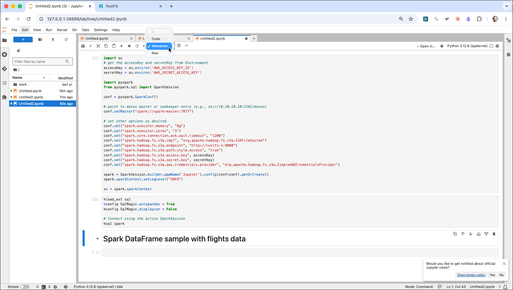
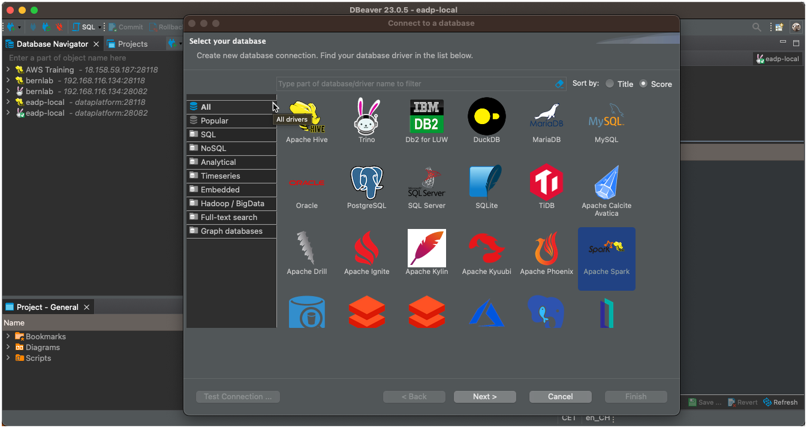
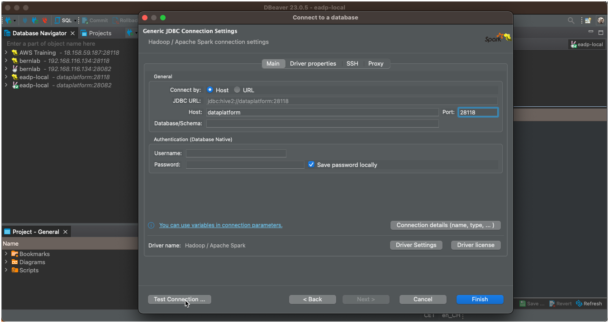
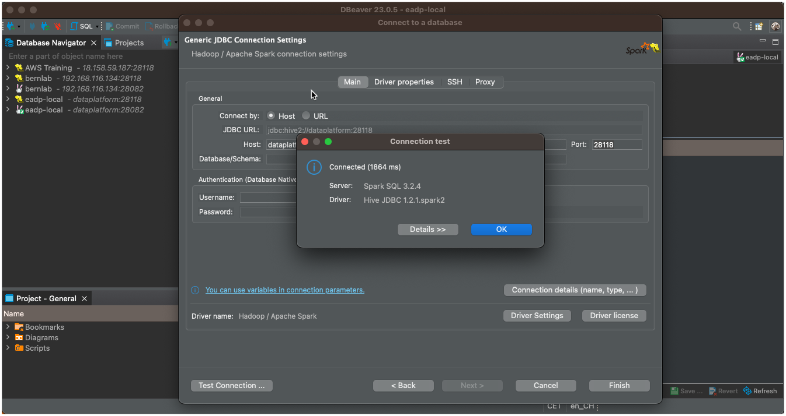
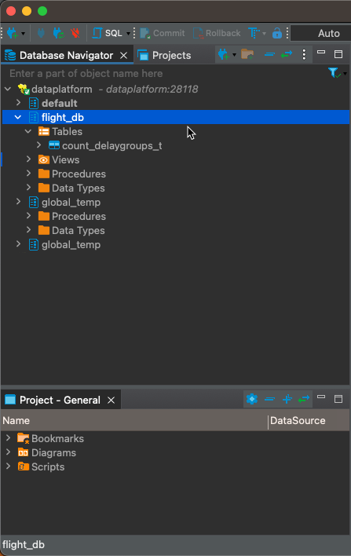
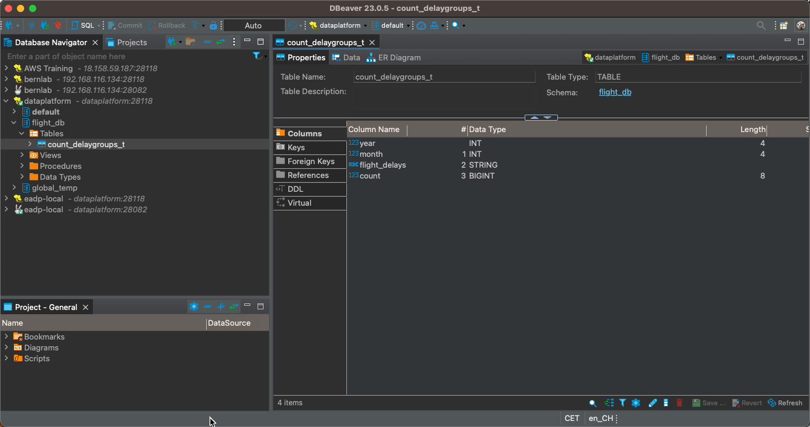
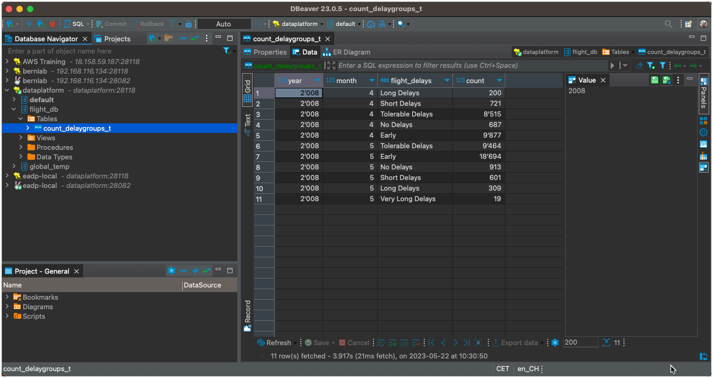
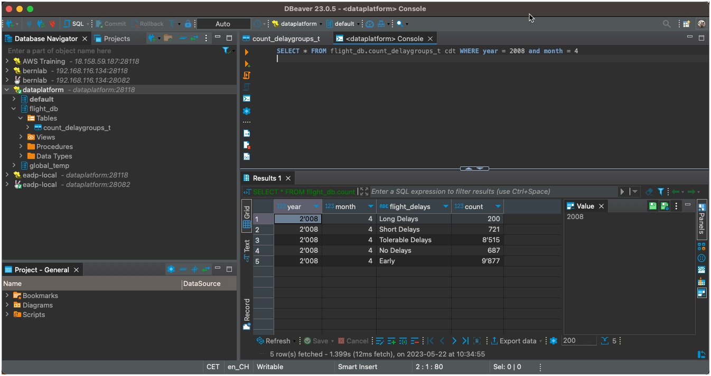

# Data Reading and Writing using DataFrames

In this workshop we will use [Apache Spark](https://spark.apache.org/) DataFrames and Spark SQL to work with (semi-)structured data.

We assume that the **Data Platform** described [here](../00-environment) is running and accessible. 

The same flight and airport data as in the [Object Storage Workshop](../02-object-storage/README.md) will be used. We will show later how to re-upload the files, if you no longer have them available.

We assume that you have done Workshop 3 **Getting Started using Spark RDD and DataFrames**, where you have learnt how to use Spark from either `pyspark` or Jupyter Notebook. 

## Table of Contents

- [What you will learn](#what-you-will-learn)
- [Prerequisites](#prerequisites)
- [Load the data, if no longer available](#prepare-the-data-if-no-longer-available)
- [Create a new Jupyter notebook](#create-a-new-jupyter-notebook)
- [Working with the Airport Data](#working-with-the-airport-data)
- [Working with Carriers Data](#working-with-carriers-data)
- [Working with Flights Data](#working-with-flights-data)
- [Use SparkSQL to work with the data](#use-sparksql-to-work-with-the-data)
- [Use Spark SQL to join flights with airports](#use-spark-sql-to-join-flights-with-airports)
- [Use Spark SQL to perform analytics on the data](#use-spark-sql-to-perform-analytics-on-the-data)
- [Provide delay classification as permanent table](#provide-delay-classification-as-permanent-table)
- [Use Spark Thriftserver to query the table from outside of Spark](#use-spark-thriftserver-to-query-the-table-from-outside-of-spark)
- [Use Spark Thriftserver from a standalone SQL Tool (optional)](#use-spark-thriftserver-from-a-standalone-sql-tool-optional)
- [Using Python User-Defined Functions (UDF) in Spark SQL](#using-python-user-defined-functions-udf-in-spark-sql)

## What you will learn

- How to read structured data (CSV, JSON) from Object Storage into Spark DataFrames with schema inference
- How to define explicit schemas using `StructType` and `StructField`
- How to transform and join multiple DataFrames using the DataFrame API and Spark SQL
- How to write DataFrames to object storage in different formats (JSON, Parquet) with partitioning
- How to use Spark SQL to run analytical queries against in-memory tables
- The difference between the raw and refined data layers in a data lake

## Prerequisites

- The **Data Platform** described [here](../00-environment) is running and accessible
- Workshop 3 ([Getting Started using Spark RDD and DataFrames](../03-spark-getting-started)) completed
- Airport, plane, carrier, and flight data uploaded to Object Storage (instructions provided if needed)

## Load the data, if no longer available

The data needed here has been uploaded in workshop 2 - [Working with RustFS Object Storage](01b-rustfs-object-storage). You can skip this section, if you still have the data available in Object Storage. We show both `s3cmd` and the `mc` version of the commands:

Create the flight bucket by executing the following command in a terminal window (i.e. wetty):

```bash
docker exec -ti awscli s3cmd mb s3://flight-bucket
```

Upload all data

```bash
# Airports
docker exec -ti awscli s3cmd put /data-transfer/airport-data/airports.csv s3://flight-bucket/raw/airports/airports.csv

# Plane Data
docker exec -ti awscli s3cmd put /data-transfer/flight-data/plane-data.csv s3://flight-bucket/raw/planes/plane-data.csv

# Carriers
docker exec -ti awscli s3cmd put /data-transfer/flight-data/carriers.json s3://flight-bucket/raw/carriers/carriers.json

 #Flights
docker exec -ti awscli s3cmd put /data-transfer/flight-data/flights-small/flights_2008_4_1.csv s3://flight-bucket/raw/flights/ &&
   docker exec -ti awscli s3cmd put /data-transfer/flight-data/flights-small/flights_2008_4_2.csv s3://flight-bucket/raw/flights/ &&
   docker exec -ti awscli s3cmd put /data-transfer/flight-data/flights-small/flights_2008_5_1.csv s3://flight-bucket/raw/flights/ &&
   docker exec -ti awscli s3cmd put /data-transfer/flight-data/flights-small/flights_2008_5_2.csv s3://flight-bucket/raw/flights/ &&
   docker exec -ti awscli s3cmd put /data-transfer/flight-data/flights-small/flights_2008_5_3.csv s3://flight-bucket/raw/flights/
```

## Create a new Jupyter notebook

Navigate to <http://dataplatform:28888> and on the Jupyter login page enter `abc123!` for the **Password or token** and click on **Log in**. 

Create a new notebook by clicking on the **Python 3.12.8 (ipykernel)** icon.

To connect to Spark, execute one of the following 2 blocks in the 1st cell.

We can either do that via Spark Connect (available since Spark 3.4) or by creating a Spark Session in the more traditional way. Spark Connect is available, so that is the preferred option for most cells.

> **Note:** The sections on permanent tables (`CREATE DATABASE`, `CREATE TABLE`) require a Hive metastore connection. In our setup this is the case, the Spark Connect server is configured with a Hive metastore. When using the **traditional Spark Session** option instead, you have all of that under control, but need to provide more configurations.

Add one of the following code blocks into the first cell

 1. for **Spark Connect**

```python
from pyspark.sql import SparkSession

spark = SparkSession.builder \
    .remote("sc://spark-connect:15002") \
    .appName("Jupyter") \
    .getOrCreate()
```

 2. for the **traditional Spark Session** option:

```python
import os
# get the accessKey and secretKey from Environment
accessKey = os.environ['AWS_ACCESS_KEY_ID']
secretKey = os.environ['AWS_SECRET_ACCESS_KEY']

import pyspark
from pyspark.sql import SparkSession

conf = pyspark.SparkConf()

# point to mesos master or zookeeper entry (e.g., zk://10.10.10.10:2181/mesos)
conf.setMaster("spark://spark-master:7077")

# set other options as desired
conf.set("spark.executor.memory", "8g")
conf.set("spark.executor.cores", "1")
conf.set("spark.core.connection.ack.wait.timeout", "1200")
conf.set("spark.hadoop.fs.s3a.impl", "org.apache.hadoop.fs.s3a.S3AFileSystem")
conf.set("spark.hadoop.fs.s3a.endpoint", "http://rustfs-1:9000")
conf.set("spark.hadoop.fs.s3a.path.style.access", "true")
conf.set("spark.hadoop.fs.s3a.access.key", accessKey)
conf.set("spark.hadoop.fs.s3a.secret.key", secretKey)
conf.set("spark.hadoop.fs.s3a.aws.credentials.provider", "org.apache.hadoop.fs.s3a.SimpleAWSCredentialsProvider")
conf.set("spark.sql.catalogImplementation", "hive")
conf.set("spark.sql.warehouse.dir", "s3a://flight-bucket/warehouse")
conf.set("spark.hadoop.hive.metastore.uris", "thrift://hive-metastore:9083")

spark = SparkSession.builder.appName('Jupyter').config(conf=conf).getOrCreate()
spark.sparkContext.setLogLevel("INFO")
```

Now enable sql magic on the Spark connection by executing the following commands in a new cell (this will enable the `%%sql` directive to execute plain SQL statements)

```python
%load_ext sql
%config SqlMagic.autopandas = True
%config SqlMagic.displaycon = False

# Connect using the active SparkSession
%sql spark
```

### Add some Markdown first

Navigate to the first cell and start with a title. Change the drop-down in the menu bar from **Code** to **Markdown** and enter:

```
# Spark DataFrame sample with flights data
```

Press **Shift** + **Enter** to render. The markdown code should now be rendered as a Heading-1 title.



## Working with the Airport Data

Now let's work with the Airports data, which we have uploaded to `s3://flight-bucket/raw/airports/`. 

First we have to import the Spark Python API.

```python
from pyspark.sql.types import *
```

> **What you should see:** No output — the import executes silently. The PySpark type classes are now available in subsequent cells.

Next let's import the flights data into a DataFrame and show the first 5 rows. We use `header=true` to use the header line for naming the columns and specify to infer the schema
 
```python
airportsRawDF = spark.read.csv("s3a://flight-bucket/raw/airports", 
    	sep=",", inferSchema="true", header="true")
airportsRawDF.show(5)
```

> **What just happened?:** with RustFS in place of MinIO we get a `java.io.FileNotFoundException: No such file or directory: s3a://flight-bucket/raw/airports/airports_2.csv/95a10df7-eadf-4ece-87a6-8853bc3f146f`. It is not clear why that happens as with MinIO that piece of code worked fine. 

We can solve the issue by not inferring the schema but create the schema upfront instead. 

```python
airportSchema = "`id` INTEGER, `ident` STRING, `type` STRING, `name` STRING, \
    `latitude_deg` DOUBLE, `longitude_deg` DOUBLE, `elevation_ft` INTEGER, \
    `continent` STRING, `iso_country` STRING, `iso_region` STRING, \
    `municipality` STRING, `scheduled_service` STRING, `gps_code` STRING, \
    `iata_code` STRING, `local_code` STRING, `home_link` STRING, \
    `wikipedia_link` STRING, `keywords` STRING"
```

Now adapt the spark read to `inferSchema="false"` and add the schema. 

```python
airportsRawDF = spark.read.csv("s3a://flight-bucket/raw/airports", 
    	sep=",", inferSchema="false", header="true", schema=airportSchema)
airportsRawDF.show(5)
```

The output will show the header line followed by the 5 data lines.

Now let's display the schema, which in that case matches of course the schema we defined before:

```	python
airportsRawDF.printSchema()
```

You can see that both string as well as double datatypes have been used and that the names of the columns are derived from the header row of the CSV file. 

```python
root
 |-- id: integer (nullable = true)
 |-- ident: string (nullable = true)
 |-- type: string (nullable = true)
 |-- name: string (nullable = true)
 |-- latitude_deg: double (nullable = true)
 |-- longitude_deg: double (nullable = true)
 |-- elevation_ft: integer (nullable = true)
 |-- continent: string (nullable = true)
 |-- iso_country: string (nullable = true)
 |-- iso_region: string (nullable = true)
 |-- municipality: string (nullable = true)
 |-- scheduled_service: string (nullable = true)
 |-- gps_code: string (nullable = true)
 |-- iata_code: string (nullable = true)
 |-- local_code: string (nullable = true)
 |-- home_link: string (nullable = true)
 |-- wikipedia_link: string (nullable = true)
 |-- keywords: string (nullable = true)
``` 

> **Production note:** Defining an explicit schema rather than using `inferSchema="true"` is strongly recommended for production pipelines. Schema inference requires Spark to do an extra full scan of the data just to determine column types — this doubles the number of S3 reads and slows startup. More importantly, inferred types can silently change if the source data changes (e.g. a column that only contained integers in the sample suddenly contains strings), causing downstream failures that are hard to trace. An explicit schema makes the contract clear, fails fast on unexpected input, and costs nothing at runtime.

Next let's ask for the total number of rows in the dataset. 

```python
airportsRawDF.count()
```

> **What you should see:** The integer `81193` — the total number of airport records in the dataset.

You can also transform data easily into another format, just by writing the DataFrame out to a new file or object. 

Let's create a JSON representation of the data in the refined folder. 

```python
airportsRawDF.write.json("s3a://flight-bucket/refined/airports")
```

> **What you should see:** No output in the cell — the write is an action that executes silently. Check in Object Storage to confirm the JSON files were created under `refined/airports/`.

> **What just happened?** Spark writes one JSON file per partition in parallel. Each file contains newline-delimited JSON records (not a JSON array). The `refined/` prefix represents the next layer of the data lake — data that has been read, validated, and stored in a more queryable format.

Check that the file has been written to Object Storage using either one of the techniques seen before. 

## Working with Carriers Data

Now let's work with the Carriers data, which we have uploaded to `s3://flight-bucket/raw/carriers/`.

The carriers data is stored as a JSON file. Unlike the airports CSV, the file contains a **JSON array** — all records are wrapped in a single `[...]` block — so we need to pass `multiLine=True` when reading it.

```python
carriersRawDF = spark.read.json("s3a://flight-bucket/raw/carriers/carriers.json", multiLine=True)
carriersRawDF.show(5)
```

You should see the first 5 carrier records:

```
+----+--------------------+
|Code|         Description|
+----+--------------------+
| 02Q|       Titan Airways|
| 04Q|  Tradewind Aviation|
| 05Q| Comlux Aviation, AG|
| 06Q|Master Top Linhas...|
| 07Q| Flair Airlines Ltd.|
+----+--------------------+
only showing top 5 rows

```

> **What you should see:** Two columns — `Code` (the carrier IATA code) and `Description` (the airline name) — with 5 rows displayed.

Now let's display the schema:

```python
carriersRawDF.printSchema()
```

```
root
 |-- Code: string (nullable = true)
 |-- Description: string (nullable = true)
```

> **What just happened?** Even though a handful of `Code` values in the raw file are stored as JSON numbers (e.g. `16`, `17`), Spark infers the column as `string` because the majority of values are strings. If you need strict typing you can again define a schema explicitly:
> ```python
> from pyspark.sql.types import StructType, StructField, StringType
> carrierSchema = StructType([
>     StructField("Code",        StringType(), True),
>     StructField("Description", StringType(), True),
> ])
> carriersRawDF = spark.read.json("s3a://flight-bucket/raw/carriers/carriers.json",
>     multiLine=True, schema=carrierSchema)
> ```

Next let's ask for the total number of carrier records:

```python
carriersRawDF.count()
```

> **What you should see:** The total number of carrier entries in the dataset.

## Working with Flights Data

Let's now start working with the Flights data, which we have uploaded with the various files within the `s3://flight-bucket/raw/flights/`.

Let's see the data in the `flight-bucket` bucket in Object Storage. In a terminal window execute the following `s3cmd` 

```
docker exec -ti awscli s3cmd ls -r s3://flight-bucket/raw/flights/
```

You should see the five files inside the `flights` folder

```
ubuntu@ip-172-26-9-171:~/bigdata-spark-workshop/00-environment/docker$ docker exec -ti awscli s3cmd ls -r s3://flight-bucket/raw/flights/
2025-05-18 16:12       980792  s3://flight-bucket/raw/flights/flights_2008_4_1.csv
2025-05-18 16:12       981534  s3://flight-bucket/raw/flights/flights_2008_4_2.csv
2025-05-18 16:12       998020  s3://flight-bucket/raw/flights/flights_2008_5_1.csv
2025-05-18 16:12      1002531  s3://flight-bucket/raw/flights/flights_2008_5_2.csv
2025-05-18 16:12       989831  s3://flight-bucket/raw/flights/flights_2008_5_3.csv
```

> **What you should see:** Five CSV files listed under `raw/flights/`, each approximately 1 MB, covering April and May 2008.

The CSV files in this case do not contain a header line, therefore we cannot use the technique to derive the schema from the header. 

We first have to manually define a schema, like we did with the airports to avoid the error. We can do it using the DSL option, as shown in the next code block. 

```python
flightSchema = """`year` INTEGER, `month` INTEGER, `dayOfMonth` INTEGER,  `dayOfWeek` INTEGER, `depTime` INTEGER, `crsDepTime` INTEGER, `arrTime` INTEGER, `crsArrTime` INTEGER, `uniqueCarrier` STRING, `flightNum` STRING, `tailNum` STRING, `actualElapsedTime` INTEGER,
                   `crsElapsedTime` INTEGER, `airTime` INTEGER, `arrDelay` INTEGER,`depDelay` INTEGER,`origin` STRING, `destination` STRING, `distance` INTEGER, `taxiIn` INTEGER, `taxiOut` INTEGER, `cancelled` STRING, `cancellationCode` STRING, `diverted` STRING, 
                   `carrierDelay` STRING, `weatherDelay` STRING, `nasDelay` STRING, `securityDelay` STRING, `lateAircraftDelay` STRING"""
```

> **What you should see:** No output — the schema string is stored in a Python variable and will be passed to the CSV reader in the next step.

Now we can import the flights data into a DataFrame using this schema and show the first 5 rows. 

We use  to use the header line for naming the columns and specify to infer the schema. We specify `schema=fligthSchema` to use the schema from above.  

```python
flightsRawDF = spark.read.csv("s3a://flight-bucket/raw/flights", 
    	sep=",", inferSchema="false", header="false", schema=flightSchema)
flightsRawDF.show(5)
```
	
The output will show the header line followed by the 5 data lines.

> **What you should see:** A table with 5 rows of flight data with 29 columns — year, month, day, departure/arrival times, carrier, flight number, origin, destination, distance, and delay fields.

Let's also see the schema, which is not very surprising

```	python
flightsRawDF.printSchema()
```

The result should be a rather large schema only shown here partially. You can see that both string as well as integer datatypes have been used and that the names of the columns are derived from the header row of the CSV file. 

```python
root
 |-- year: integer (nullable = true)
 |-- month: integer (nullable = true)
 |-- dayOfMonth: integer (nullable = true)
 |-- dayOfWeek: integer (nullable = true)
 |-- depTime: integer (nullable = true)
 |-- crsDepTime: integer (nullable = true)
 |-- arrTime: integer (nullable = true)
 |-- crsArrTime: integer (nullable = true)
 |-- uniqueCarrier: string (nullable = true)
 |-- flightNum: string (nullable = true)
 |-- tailNum: string (nullable = true)
 |-- actualElapsedTime: integer (nullable = true)
 |-- crsElapsedTime: integer (nullable = true)
 |-- airTime: integer (nullable = true)
 |-- arrDelay: integer (nullable = true)
 |-- depDelay: integer (nullable = true)
 |-- origin: string (nullable = true)
 |-- destination: string (nullable = true)
 |-- distance: integer (nullable = true)
 |-- taxiIn: integer (nullable = true)
 |-- taxiOut: integer (nullable = true)
 |-- cancelled: string (nullable = true)
 |-- cancellationCode: string (nullable = true)
 |-- diverted: string (nullable = true)
 |-- carrierDelay: string (nullable = true)
 |-- weatherDelay: string (nullable = true)
 |-- nasDelay: string (nullable = true)
 |-- securityDelay: string (nullable = true)
 |-- lateAircraftDelay: string (nullable = true)
```

> **What you should see:** A 29-column schema matching the field names defined in `flightSchema`, with integer types for numeric columns and string types for delay reason codes.

Next let's ask for the total number of rows in the dataset
 
```python
flightsRawDF.count()
```

> **What you should see:** The integer `50000` — 10,000 flight records per file across the five CSV files.

You can also transform data easily into another format, just by writing the DataFrame out to a new file or object. 

Let's create a Parquet representation of the data in the refined folder. Additionally we partition the data by `year` and `month`. 

```python
flightsRawDF.write.partitionBy("year","month").parquet("s3a://flight-bucket/refined/flights")
```

> **What you should see:** No cell output — the write executes silently. Check Object Storage to confirm the Parquet files were created under `refined/flights/year=2008/month=4/` and `refined/flights/year=2008/month=5/`.

> **What just happened?** Spark wrote the data in Parquet format with Hive-style partitioning — each partition becomes a separate folder named `year=<value>/month=<value>/`. This allows Spark (and other tools like Trino/Hive) to skip entire partitions when a query filters on `year` or `month`, dramatically reducing I/O.

In a terminal window, check that the file has been written to Object Storage using the `s3cmd`. 

```bash
docker exec -ti awscli s3cmd ls -r s3://flight-bucket/refined/flights
```	

and you should see an output similar to

```bash
ubuntu@ip-172-26-9-171:~/bigdata-spark-workshop/00-environment/docker$ docker exec -ti awscli s3cmd ls -r s3://flight-bucket/refined/flights
2026-04-02 18:56            0  s3://flight-bucket/refined/flights/_SUCCESS
2026-04-02 18:56       377251  s3://flight-bucket/refined/flights/year=2008/month=4/part-00001-78e4939e-cf76-476c-a699-222d75714fcc.c000.snappy.parquet
2026-04-02 18:56       461116  s3://flight-bucket/refined/flights/year=2008/month=5/part-00000-78e4939e-cf76-476c-a699-222d75714fcc.c000.snappy.parquet
```	

> **What you should see:** A `_SUCCESS` marker plus one Snappy-compressed Parquet file per partition — one for month 4 and one for month 5. The Parquet files are much smaller than the original CSVs due to columnar compression.

Should you want to execute the write a 2nd time, then you first have to delete the output folder, otherwise the 2nd execution of the write will throw an error. 

**Note**: If you want to rerun the creation of the data, then you first have to remove the folder using the following command

```bash
docker exec -ti awscli s3cmd rm -r s3://flight-bucket/refined/flights
```
	
By now we have imported the airports and flights data and made it available as a Data Frame. 

Additionally we have also stored the data to a file in json format. 

## Use SparkSQL to work with the data

First let's read the data from the parquet refined structure just created before. 

```python
flightsRefinedDF = spark.read.format("parquet").load("s3a://flight-bucket/refined/flights")
```

> **What you should see:** No output — reading Parquet is also lazy. Spark records the source path and schema but reads no data yet.

With the `flightsRefinedDF` DataFrame in place, register the two DataFrames as temporary tables in Spark SQL

```python
flightsRefinedDF.createOrReplaceTempView("flights")
airportsRawDF.createOrReplaceTempView("airports")
```

> **What you should see:** No output — `createOrReplaceTempView` registers the DataFrames as named views in the Spark SQL catalogue without executing any queries.

We can always display the registered tables by using the following statement:

```python
spark.sql("show tables").show()
```

> **What you should see:** A table listing `airports` and `flights` as temporary views (with `isTemporary = true`).

We can use `spark.sql()` to now execute an SELECT statement using one of the two tables

```python
spark.sql("SELECT * FROM airports").show()
```

and you will see part of the data as a table

```
+------+-----+-------------+--------------------+------------------+-------------------+------------+---------+-----------+----------+------------+-----------------+--------+---------+----------+--------------------+--------------------+--------+
|    id|ident|         type|                name|      latitude_deg|      longitude_deg|elevation_ft|continent|iso_country|iso_region|municipality|scheduled_service|gps_code|iata_code|local_code|           home_link|      wikipedia_link|keywords|
+------+-----+-------------+--------------------+------------------+-------------------+------------+---------+-----------+----------+------------+-----------------+--------+---------+----------+--------------------+--------------------+--------+
|  6523|  00A|     heliport|   Total RF Heliport|         40.070985|         -74.933689|          11|       NA|         US|     US-PA|    Bensalem|               no|    K00A|     NULL|       00A|https://www.pennd...|                NULL|    NULL|
...
+------+-----+-------------+--------------------+------------------+-------------------+------------+---------+-----------+----------+------------+-----------------+--------+---------+----------+--------------------+--------------------+--------+
only showing top 20 rows
```

> **What you should see:** The first 20 rows of the airports table with all 18 columns. The wide table will likely wrap in the terminal.

You can use the `%%sql` cell magic in Jupyter to directly perform a SQL statement without having to wrap it in a `spark.sql()` statement. This simplifies ad-hoc testing quite a bit.

```sql
%%sql
SELECT * 
FROM airports
```

> **What you should see:** A paginated, scrollable table showing all airport columns with proper alignment — much more readable than the raw `show()` output.

Let's see some other SQL statement in action, first with a `GROUP BY`

```sql
SELECT iso_country, iso_region, count(*)
FROM airports
GROUP BY iso_country,  iso_region
```

> **What you should see:** One row per country/region combination, with a count of airports in each region. There will be many rows covering countries worldwide.

If we only want to see the ones for the USA, we add a `WHERE` clause

```sql
SELECT iso_country, iso_region, count(*)
FROM airports
WHERE iso_country = 'US'
GROUP BY iso_country,  iso_region
```

> **What you should see:** Rows for US regions only (e.g. `US-CA`, `US-TX`, `US-FL`, ...) with their airport counts, filtered down from the full global result.

Once a SQL statement is producing the right result, you can wrap it in a `spark.sql()` using the convenient triple double quotes.

```sql
usAirportsByStateDF = spark.sql("""
			SELECT iso_country, iso_region, count(*)
			FROM airports
			WHERE iso_country = 'US'
			GROUP BY iso_country,  iso_region
          """)
usAirportsByStateDF.show()
```

> **What you should see:** The same US airports-by-region result, now stored as a DataFrame in `usAirportsByStateDF` and printed via `show()`.

You can now use the data frame and persist it to S3 if you wish. We will see that in use below.

**Note**: If you perform a SELECT on the flights table using one or more of the partition columns, the query will prune the non-used partitions and only read the necessary files for the needed partitions

```sql
%%sql
SELECT * 
FROM flights
WHERE year = 2008 
AND month = 04
```

> **What you should see:** Only April 2008 flight records — approximately 20,000 rows. Spark reads only the `year=2008/month=4/` partition folder and skips `year=2008/month=5/` entirely.

> **What just happened?** This is **partition pruning** — because the data was written with `partitionBy("year","month")`, Spark maps the `WHERE year = 2008 AND month = 04` predicate directly to the folder path `year=2008/month=4/` and never opens the other partition. For large datasets this can reduce I/O by orders of magnitude.

As an alternative to specifying SQL statement as a string, Data Frames provide a domain-specific language for structured data manipulation. These operations are also referred as "untyped transformations" in contrast to "typed transformations" come with strongly typed Scala/Java Datasets.

In Python, it's possible to access a DataFrame's columns either by attribute (df.age) or by indexing (df['age']). While the former is convenient for interactive data exploration, users are highly encouraged to use the latter form, which is future proof and won't break with column names that are also attributes on the DataFrame class.

```
airportsRawDF.select(airportsRawDF['iso_country'], airportsRawDF['iso_region']) \
    .filter(airportsRawDF['iso_country'] == "US") \
    .groupBy("iso_country", "iso_region") \
    .count() \
    .show()
```

> **What you should see:** The same US airports-by-region result as the SQL query above — the DataFrame API and Spark SQL compile to the same physical execution plan.

## Use Spark SQL to join flights with airports

Last but not least let's use the `airports` table to enrich the values returned by the `flights` table so we have more information on the origin and destination airport. 

If we know SQL, we know that this can be done using a JOIN between two tables. The same syntax is also valid in Spark SQL. Following the techniques learned above, let's first test it using the `%%sql` cell magic.

```sql
%%sql
SELECT ao.name AS origin_airport
		, ao.type AS origin_type
		, ao.municipality AS orign_municipality
		, ad.name AS destination_airport
		, ad.type AS destination_type
		, ad.municipality AS destination_municipality
		, f.*
FROM flights  AS f
LEFT JOIN airports AS ao
ON (f.origin = ao.iata_code)
LEFT JOIN airports AS ad
ON (f.destination = ad.iata_code)
```

> **What you should see:** Flight rows enriched with origin and destination airport names, types, and municipalities — replacing raw IATA codes like `ATL` with `Hartsfield-Jackson Atlanta International Airport`.

As soon as we are happy, we can again wrap it in a `spark.sql()` statement. 

```sql
flightEnrichedDF = spark.sql("""
		SELECT ao.name AS origin_airport
				, ao.type AS origin_type
				, ao.municipality AS orign_municipality
				, ad.name AS destination_airport
				, ad.type AS destination_type
				, ad.municipality AS destination_municipality
				, f.*
		FROM flights  AS f
		LEFT JOIN airports AS ao
		ON (f.origin = ao.iata_code)
		LEFT JOIN airports AS ad
		ON (f.destination = ad.iata_code)
		""")
```

> **What you should see:** No output — the SQL is captured as a lazy DataFrame. No join executes until an action is called.

Let's see the result behind the DataFrame

```python
flightEnrichedDF.show()
```

> **What you should see:** The first 20 enriched flight rows with airport name columns prepended to all the original flight columns.

Finally let's write the enriched structure as a result to object storage using again the Parquet format:

```python
flightEnrichedDF.write.partitionBy("year","month").parquet("s3a://flight-bucket/result/flights")
```

> **What you should see:** No cell output. This action triggers the full join and writes the enriched Parquet files to `result/flights/year=2008/month=4/` and `result/flights/year=2008/month=5/`.

To perform the same join using the domain-specific language, the statement looks like this

```python
from pyspark.sql.functions import col

# Create aliases for clarity
a_origin = airportsRawDF.alias("a_origin")
a_dest = airportsRawDF.alias("a_dest")

flightsRefinedDF.alias("f") \
    .join(a_origin, col("f.origin") == col("a_origin.iata_code"), "inner") \
    .join(a_dest, col("f.destination") == col("a_dest.iata_code"), "inner") \
    .select(
        col("a_origin.name").alias("origin_airport_name"),
        col("a_dest.name").alias("destination_airport_name"),
        "f.*",
    ) \
    .show()
```

> **What you should see:** The same enriched flight rows as the SQL join, with origin and destination airport names alongside all flight fields. Note this uses `inner` join so unmatched IATA codes are dropped (vs the `LEFT JOIN` above which keeps all flights).

## Use Spark SQL to perform analytics on the data

Let's see the the 10 longest flights in descending order with `origin` and `destination`

```sql
%%sql
SELECT origin, destination, distance 
FROM (SELECT origin, destination, MAX(distance) distance
      FROM flights
      GROUP BY origin, destination) 
ORDER BY distance DESC
LIMIT 10
```

> **What you should see:** The 10 origin-destination pairs with the greatest maximum distance, showing the longest routes in the dataset (e.g. transcontinental US routes).

Let's categorize the various delays

```sql
%%sql
SELECT arrDelay, origin, destination,
    CASE
         WHEN arrDelay > 360 THEN 'Very Long Delays'
         WHEN arrDelay > 120 AND arrDelay < 360 THEN 'Long Delays'
         WHEN arrDelay > 60 AND arrDelay < 120 THEN 'Short Delays'
         WHEN arrDelay > 0 and arrDelay < 60 THEN 'Tolerable Delays'
         WHEN arrDelay = 0 THEN 'No Delays'
         ELSE 'Early'
    END AS flight_delay
FROM flights
```

> **What you should see:** flight rows with a `flight_delay` classification column appended based on the arrival delay value.

and with that get an overview of the 

```sql
%%sql
SELECT year, month, flight_delay, count(*) AS count
FROM (
    SELECT year, month, arrDelay, origin, destination,
        CASE
             WHEN arrDelay > 360 THEN 'Very Long Delays'
             WHEN arrDelay > 120 AND arrDelay < 360 THEN 'Long Delays'
             WHEN arrDelay > 60 AND arrDelay < 120 THEN 'Short Delays'
             WHEN arrDelay > 0 and arrDelay < 60 THEN 'Tolerable Delays'
             WHEN arrDelay = 0 THEN 'No Delays'
             ELSE 'Early'
        END AS flight_delay
    FROM flights
)
GROUP BY year, month, flight_delay
```

> **What you should see:** A compact summary table — one row per year/month/delay-category combination, showing how many flights fall into each delay bucket for April and May 2008. `Early` and `Tolerable Delays` should be the largest categories.

## Provide delay classification as permanent table

So far we have only worked with temporary views, which are only visible while the Spark session is active and will be removed as soon as it is closed. 

But we can also create permanent tables which will survive a Spark session. First we have to create a database 

```sql
%%sql
CREATE DATABASE IF NOT EXISTS flight_db;
```

> **What you should see:** No output (or a confirmation message) — the database `flight_db` is created in Spark's metastore and will persist across sessions.

and then we create the table within that database

```sql
%%sql
CREATE TABLE flight_db.count_delaygroups_t
AS
SELECT year, month, flight_delay, count(*) AS count
FROM (
    SELECT year, month, arrDelay, origin, destination,
        CASE
             WHEN arrDelay > 360 THEN 'Very Long Delays'
             WHEN arrDelay > 120 AND arrDelay < 360 THEN 'Long Delays'
             WHEN arrDelay > 60 AND arrDelay < 120 THEN 'Short Delays'
             WHEN arrDelay > 0 and arrDelay < 60 THEN 'Tolerable Delays'
             WHEN arrDelay = 0 THEN 'No Delays'
             ELSE 'Early'
        END AS flight_delay
             FROM flights
)
GROUP BY year, month, flight_delay
```

> **What you should see:** No output — the `CREATE TABLE AS SELECT` executes the aggregation and persists the result as a permanent Parquet-backed table in `flight_db`.

> **What just happened?** Unlike `createOrReplaceTempView`, a `CREATE TABLE` writes data to the metastore and to object storage, making the table available to any Spark session that connects to the same metastore — including the Thrift Server queried in the next section.

If we execute a `show tables` command

```sql
%%sql
show tables from flight_db;
```

> **What you should see:** Three entries — `airports` and `flights` as temporary views (isTemporary=true) and `count_delaygroups_t` as a permanent table (isTemporary=false).

Let's see that by connecting to the `spark-sql` CLI. In a terminal window execute

```bash
docker exec -it spark-master spark-sql
```

On the command prompt, enter `show databases;` and you can see the database `flight_db` just created

```bash
spark-sql> show databases;
2023-05-22 07:55:09,506 INFO codegen.CodeGenerator: Code generated in 243.684976 ms
2023-05-22 07:55:09,576 INFO codegen.CodeGenerator: Code generated in 13.384262 ms
default
flight_db
Time taken: 3.358 seconds, Fetched 2 row(s)
2023-05-22 07:55:09,653 INFO thriftserver.SparkSQLCLIDriver: Time taken: 3.358 seconds, Fetched 2 row(s)
spark-sql>
```

> **What you should see:** Two databases listed — `default` and `flight_db` — confirming the database created in Jupyter is visible from the CLI as well (both share the same metastore).

switch to the database and 

```sql
use flight_db;
```

and perform a `show tables;` to prove that the table is in fact permanent

```bash
spark-sql> show tables;
count_delaygroups_t
Time taken: 0.062 seconds, Fetched 1 row(s)
2023-05-22 07:56:47,840 INFO thriftserver.SparkSQLCLIDriver: Time taken: 0.062 seconds, Fetched 1 row(s)
spark-sql>
```

> **What you should see:** `count_delaygroups_t` listed — confirming the table persists across Spark sessions and is accessible from any client connected to the same metastore.

Now check that the data is in fact available by executing

```sql
SELECT * FROM count_delaygroups_t LIMIT 10;
```

and you should see a result similar to that shown below

```bash
spark-sql (flight_db)> select * from count_delaygroups_t LIMIT 10;
25/05/18 17:13:14 WARN SessionState: METASTORE_FILTER_HOOK will be ignored, since hive.security.authorization.manager is set to instance of HiveAuthorizerFactory.
2008    5       Tolerable Delays        9464
2008    5       Early   18694
2008    5       No Delays       913
2008    5       Short Delays    601
2008    5       Long Delays     309
2008    5       Very Long Delays        19
2008    4       Long Delays     200
2008    4       Short Delays    721
2008    4       Tolerable Delays        8515
2008    4       No Delays       687
Time taken: 1.599 seconds, Fetched 10 row(s)
spark-sql (flight_db)> 
```

> **What you should see:** 10 rows of delay group counts for year 2008 months 4 and 5, confirming the permanent table is queryable from the CLI. The WARN line about `METASTORE_FILTER_HOOK` is harmless and can be ignored.

There are is a WARN log messages but we can also see the 10 results we asked for. This is not really usable but it proofs the fact that we have made the results available for querying over SQL. 

## Use Spark Thriftserver to query the table from outside of Spark

The Thrift JDBC/ODBC Server (aka Spark Thrift Server or STS) is Spark SQL's port of Apache Hive's HiveServer2 that allows JDBC/ODBC clients to execute SQL queries over JDBC and ODBC protocols on Apache Spark.

With Spark Thrift Server, business users can work with their Business Intelligence (BI) tools, e.g. Tableau or Microsoft Excel, and connect to Apache Spark using the ODBC or JDBC API.

We can test the JDBC/ODBC server easily using the Beeline CLI.

In a terminal window perform

```bash 
docker exec -ti spark-thriftserver /opt/bitnami/spark/bin/beeline
```

and connect to Spark Thrift Server 

```sql
!connect jdbc:hive2://spark-thriftserver:10000
```

Enter empty string for `username` and `password`

and you should get to the thriftserver command prompt:

```bash
beeline> !connect jdbc:hive2://spark-thriftserver:10000
Connecting to jdbc:hive2://spark-thriftserver:10000
Enter username for jdbc:hive2://spark-thriftserver:10000: 
Enter password for jdbc:hive2://spark-thriftserver:10000: 
Connected to: Spark SQL (version 3.5.3)
Driver: Hive JDBC (version 2.3.9)
Transaction isolation: TRANSACTION_REPEATABLE_READ
0: jdbc:hive2://spark-thriftserver:10000> 
```

> **What you should see:** The Beeline prompt `0: jdbc:hive2://spark-thriftserver:10000>` confirming a successful JDBC connection to Spark SQL via the Thrift Server.

> **What just happened?** The Spark Thrift Server exposes Spark SQL over the standard HiveServer2 JDBC/ODBC protocol. Any tool that can connect to Hive — Beeline, DBeaver, Tableau, Power BI — can now query Spark DataFrames and permanent tables without needing a Spark client library.

Now let's again issue a query on the `flight_db.count_delaygroups_t` table

```sql
SELECT * FROM flight_db.count_delaygroups_t limit 10;
```

and we get the same result, just formatted a bit nicer

```sql
0: jdbc:hive2://spark-thriftserver:10000> select * from flight_db.count_delaygroups_t limit 10;
+-------+--------+-------------------+--------+
| year  | month  |   flight_delay    | count  |
+-------+--------+-------------------+--------+
| 2008  | 4      | Long Delays       | 200    |
| 2008  | 4      | Short Delays      | 721    |
| 2008  | 4      | Tolerable Delays  | 8515   |
| 2008  | 4      | No Delays         | 687    |
| 2008  | 4      | Early             | 9877   |
| 2008  | 5      | Tolerable Delays  | 9464   |
| 2008  | 5      | Early             | 18694  |
| 2008  | 5      | No Delays         | 913    |
| 2008  | 5      | Short Delays      | 601    |
| 2008  | 5      | Long Delays       | 309    |
+-------+--------+-------------------+--------+
10 rows selected (7.898 seconds)
```

> **What you should see:** The same 10 delay-group rows as before, now displayed in Beeline's formatted ASCII table with column headers and a row count footer.

## Use Spark Thriftserver from a standalone SQL Tool (optional)

You can also use a standalone SQL Tool or BI tool, as long as it supports **Hive** or **Spark SQL**. 

This is the case with [DBeaver](https://dbeaver.io/), which is a Fat-GUI application and therefore cannot be part of the Docker Compose stack. You need to install it on your local machine, if you want to perform that step. 

To create a connection to the Spark Thriftserver from DBeaver, click on the **+** icon in the top left corner, select the **Apache Spark** database driver



and click **Next >**.

On the **Connect to a database** screen enter `dataplatform` for the **Host** and `28118` for the port 



and click **Test Connection ...** and DBeaver will ask you for downloading the JDBC driver (the first time). Confirm that and you should see a successful message 



> **What you should see:** A green **Connected** confirmation dialog showing the Spark SQL server version, confirming DBeaver can reach the Thrift Server over JDBC.

Click **OK** and **Finish** to close the **Connect to a database** window.

Use the **Database Navigator** to drill down into the new connection



> **What you should see:** The connection tree expanded to show the `flight_db` database and its `count_delaygroups_t` table alongside the `default` database.

Double-click on the `count_delaygroups_t` table to see the metadata of the table.  



Navigate to the **Data** tab and you should see the same data as before



> **What you should see:** The delay group counts displayed in DBeaver's grid view — the same data queried through a standard BI tool connected via JDBC, no Spark client needed.

You can of course also use the SQL Console to execute ad-hoc SQL statements. In the **Database Navigator**, right-click on the database and select **SQL Editor** | **Open SQL console**. Start entering a SELECT statement and you get help by DBeaver's IntelliSense feature.



## Using Python User-Defined Functions (UDF) in Spark SQL

In Apache Spark SQL, you can create a User-Defined Function (UDF) in Python using PySpark to extend the built-in SQL functions with your own logic.

Instead of calculating the delay classifciation in SQL using the CASE expression as shown above, we can also make the classification more reusable by creating a user-defined function (UDF). UDFs are scalar functions that return a single output value, similar to built-in functions, we seen above.

First create a python function with the delay classification logic

```python
from pyspark.sql.functions import udf

def classify_delay(delay):
    if delay > 360:
        return 'Very Long Delays'
    elif 120 < delay <= 360:
        return 'Long Delays'
    elif 60 < delay <= 120:
        return 'Short Delays'
    elif 0 < delay <= 60:
        return 'Tolerable Delays'
    elif delay == 0:
        return 'No Delays'
    else:
        return 'Early'
```

> **What you should see:** No output — the Python function is defined in the local scope and is ready to be wrapped as a Spark UDF.

Register it as a Spark UDF

```python
from pyspark.sql.functions import udf
from pyspark.sql.types import StringType

classify_delay_udf = udf(classify_delay, StringType())
spark.udf.register("classify_delay", classify_delay_udf)
```

> **What you should see:** The UDF object reference printed (e.g. `<function classify_delay at 0x...>`). The UDF is now registered under the name `classify_delay` and can be used in `spark.sql()` calls.

> **What just happened?** `udf()` wraps the Python function so Spark knows its return type (`StringType`). `spark.udf.register` makes it available by name in SQL strings. Each row's `arrDelay` value will be passed to the Python function and the returned string written into the new column.

And then you can use it in Spark SQL. We can rewrite the `SELECT` statement from above using the UDF instead of the CASE expression. 

```python
spark.sql("""
       SELECT arrDelay
       , 	origin
       , 	destination
       , 	classify_delay(arrDelay) AS flight_delay
       FROM flights
       """
   ).show()
```

and in the result we can see the output from the custom UDF

```
+--------+------+-----------+----------------+
|arrDelay|origin|destination|    flight_delay|
+--------+------+-----------+----------------+
|       8|   ATL|        FLL|Tolerable Delays|
|      15|   ATL|        FLL|Tolerable Delays|
|      -6|   ATL|        FLL|           Early|
|      57|   ATL|        FLL|Tolerable Delays|
|      -3|   ATL|        FLL|           Early|
|      -8|   ATL|        FNT|           Early|
|      10|   ATL|        FNT|Tolerable Delays|
|      -3|   ATL|        FNT|           Early|
|       6|   ATL|        FNT|Tolerable Delays|
|       9|   ATL|        GPT|Tolerable Delays|
|      34|   ATL|        GPT|Tolerable Delays|
|      -4|   ATL|        HOU|           Early|
|       2|   ATL|        HOU|Tolerable Delays|
|      13|   ATL|        HOU|Tolerable Delays|
|      51|   ATL|        HOU|Tolerable Delays|
|       7|   ATL|        HOU|Tolerable Delays|
|      -8|   ATL|        HOU|           Early|
|     -13|   ATL|        HPN|           Early|
|      -5|   ATL|        HPN|           Early|
|      -2|   ATL|        HPN|           Early|
+--------+------+-----------+----------------+
only showing top 20 rows
```

> **What you should see:** The first 20 flight rows with the `flight_delay` classification applied by the Python UDF — identical output to the CASE expression version but now the logic lives in a reusable Python function.

> **What just happened?** Spark serialises the Python UDF and ships it to each executor, where it is called once per row. While convenient, Python UDFs have overhead compared to built-in Spark functions (which run on the JVM) — for high-performance production pipelines, prefer built-in functions or Pandas UDFs when possible.
