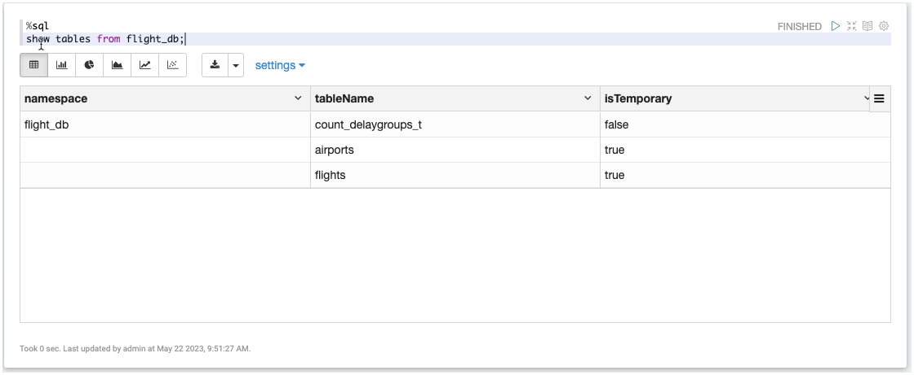

# Data Reading and Writing using DataFrames

In this workshop we will work with [Apache Spark](https://spark.apache.org/) DataFrames and Spark SQL.

We assume that the **Data Platform** described [here](../01-environment) is running and accessible. 

The same data as in the [Object Storage Workshop](../02-object-storage/README.md) will be used. We will show later how to re-upload the files, if you no longer have them available.

We assume that you have done Workshop 3 **Getting Started using Spark RDD and DataFrames**, where you have learnt how to use Spark form either `pyspark`, Apache Zeppelin or Jupyter Notebook. 
 
## Prepare the data, if no longer available

The data needed here has been uploaded in workshop 2 - [Working with MinIO Object Storage](02-object-storage). You can skip this section, if you still have the data available in MinIO. We show both `s3cmd` and the `mc` version of the commands:

Create the flight bucket:

```bash
docker exec -ti awscli s3cmd mb s3://flight-bucket
```

or with `mc`
 
```bash
docker exec -ti minio-mc mc mb minio-1/flight-bucket
```

**Airports:**

```bash
docker exec -ti awscli s3cmd put /data-transfer/flight-data/airports.csv s3://flight-bucket/raw/airports/airports.csv
```

or with `mc`

```bash
docker exec -ti minio-mc mc cp /data-transfer/flight-data/airports.csv minio-1/flight-bucket/raw/airports/airports.csv
```

**Plane-Data:**

```bash
docker exec -ti awscli s3cmd put /data-transfer/flight-data/plane-data.csv s3://flight-bucket/raw/planes/plane-data.csv
```

or with `mc`

```bash
docker exec -ti minio-mc mc cp /data-transfer/flight-data/plane-data.csv minio-1/flight-bucket/raw/planes/plane-data.csv
```

**Carriers:**

```bash
docker exec -ti awscli s3cmd put /data-transfer/flight-data/carriers.json s3://flight-bucket/raw/carriers/carriers.json
```

or with `mc`

```bash
docker exec -ti minio-mc mc cp /data-transfer/flight-data/carriers.json minio-1/flight-bucket/raw/carriers/carriers.json
```

**Flights:**

```bash
docker exec -ti awscli s3cmd put /data-transfer/flight-data/flights-small/flights_2008_4_1.csv s3://flight-bucket/raw/flights/ &&
   docker exec -ti awscli s3cmd put /data-transfer/flight-data/flights-small/flights_2008_4_2.csv s3://flight-bucket/raw/flights/ &&
   docker exec -ti awscli s3cmd put /data-transfer/flight-data/flights-small/flights_2008_5_1.csv s3://flight-bucket/raw/flights/ &&
   docker exec -ti awscli s3cmd put /data-transfer/flight-data/flights-small/flights_2008_5_2.csv s3://flight-bucket/raw/flights/ &&
   docker exec -ti awscli s3cmd put /data-transfer/flight-data/flights-small/flights_2008_5_3.csv s3://flight-bucket/raw/flights/
```

or with `mc`

```bash
docker exec -ti minio-mc mc cp /data-transfer/flight-data/flights-small/flights_2008_4_1.csv minio-1/flight-bucket/raw/flights/ &&
   docker exec -ti minio-mc mc cp /data-transfer/flight-data/flights-small/flights_2008_4_2.csv minio-1/flight-bucket/raw/flights/ &&
   docker exec -ti minio-mc mc cp /data-transfer/flight-data/flights-small/flights_2008_5_1.csv minio-1/flight-bucket/raw/flights/ &&
   docker exec -ti minio-mc mc cp /data-transfer/flight-data/flights-small/flights_2008_5_2.csv minio-1/flight-bucket/raw/flights/ &&
   docker exec -ti minio-mc mc cp /data-transfer/flight-data/flights-small/flights_2008_5_3.csv minio-1/flight-bucket/raw/flights/
```

## Create a new Zeppelin notebook

For this workshop we will be using Zeppelin discussed above. In a browser window, navigate to <http://dataplatform:28080> and you should see the Apache Zeppelin homepage. Click on **Login** and use `admin` as the **User Name** and `changeme` as the **Password** and click on **Login**. 

But you can easily adapt it to use either **PySpark** or **Apache Jupyter**.

In a browser window, navigate to <http://dataplatform:28080>.

Now let's create a new notebook by clicking on the **Create new note** link and set the **Note Name** to `SparkDataFrame` and set the **Default Interpreter** to `spark`. 

Click on **Create Note** and a new Notebook is created with one cell which is empty. 

### Add some Markdown first

Navigate to the first cell and start with a title. By using the `%md` directive we can switch to the Markdown interpreter, which can be used for displaying static text.

```
%md # Spark DataFrame sample with flights data
```

Click on the **>** symbol on the right or enter **Shift** + **Enter** to run the paragraph.

The markdown code should now be rendered as a Heading-1 title.

## Working with the Airport Data

First add another title, this time as a Heading-2.

```
%md ## Working with the Airport data
```

Now let's work with the Airports data, which we have uploaded to `s3://flight-bucket/raw/airports/`. 

First we have to import the spark python API. 

```python
%pyspark
from pyspark.sql.types import *
```

Next let’s import the flights data into a DataFrame and show the first 5 rows. We use header=true to use the header line for naming the columns and specify to infer the schema
 
```python
%pyspark
airportsRawDF = spark.read.csv("s3a://flight-bucket/raw/airports", 
    	sep=",", inferSchema="true", header="true")
airportsRawDF.show(5)
```

The output will show the header line followed by the 5 data lines.


Now let’s display the schema, which has been derived from the data:

```	python
%pyspark
airportsRawDF.printSchema()
```

You can see that both string as well as double datatypes have been used and that the names of the columns are derived from the header row of the CSV file. 

```python
root
 |-- iata: string (nullable = true)
 |-- airport: string (nullable = true)
 |-- city: string (nullable = true)
 |-- state: string (nullable = true)
 |-- country: string (nullable = true)
 |-- lat: double (nullable = true)
 |-- long: double (nullable = true)
``` 
 
Next let’s ask for the total number of rows in the dataset. Should return a total of **3376**. 

```python
%pyspark
airportsRawDF.count()
```

You can also transform data easily into another format, just by writing the DataFrame out to a new file or object. 

Let’s create a JSON representation of the data in the refined folder. 

```python
%pyspark
airportsRawDF.write.json("s3a://flight-bucket/refined/airports")
```

Check that the file has been written to MinIO using either one of the techniques seen before. 

 
## Working with Flights Data

First add another title, this time as a Heading-2.

```python
%md ## Working with the Flights data
```

Let’s now start working with the Flights data, which we have uploaded with the various files within the `s3://flight-bucket/raw/flights/`.

Navigate to the first cell and start with a title. By using the `%md` directive we can switch to the Markdown interpreter, which can be used for displaying static text.
 
Make sure that the data is in the right place. 

```
docker exec -ti awscli s3cmd ls -r s3://flight-bucket/raw/flights/
```

You should see the five files inside the `flights` folder

```
ubuntu@ip-172-26-3-90:~$ docker exec -ti awscli s3cmd ls -r s3://flight-bucket/raw/flights/

2021-05-15 15:26       980792  s3://flight-bucket/raw/flights/flights_2008_4_1.csv
2021-05-15 15:26       981534  s3://flight-bucket/raw/flights/flights_2008_4_2.csv
2021-05-15 15:26       998020  s3://flight-bucket/raw/flights/flights_2008_5_1.csv
2021-05-15 15:26      1002531  s3://flight-bucket/raw/flights/flights_2008_5_2.csv
2021-05-15 15:26       989831  s3://flight-bucket/raw/flights/flights_2008_5_3.csv
```

The CSV files in this case do not contain a header line, therefore we cannot use the same technique as before with the airports and derive the schema from the header. 

We first have to manually define a schema. One way is to use a DSL as shown in the next code block. 

```python
%pyspark
flightSchema = """`year` INTEGER, `month` INTEGER, `dayOfMonth` INTEGER,  `dayOfWeek` INTEGER, `depTime` INTEGER, `crsDepTime` INTEGER, `arrTime` INTEGER, `crsArrTime` INTEGER, `uniqueCarrier` STRING, `flightNum` STRING, `tailNum` STRING, `actualElapsedTime` INTEGER,
                   `crsElapsedTime` INTEGER, `airTime` INTEGER, `arrDelay` INTEGER,`depDelay` INTEGER,`origin` STRING, `destination` STRING, `distance` INTEGER, `taxiIn` INTEGER, `taxiOut` INTEGER, `cancelled` STRING, `cancellationCode` STRING, `diverted` STRING, 
                   `carrierDelay` STRING, `weatherDelay` STRING, `nasDelay` STRING, `securityDelay` STRING, `lateAircraftDelay` STRING"""
```

Now we can import the flights data into a DataFrame using this schema and show the first 5 rows. 

We use  to use the header line for naming the columns and specify to infer the schema. We specify `schema=fligthSchema` to use the schema from above.  

```python
%pyspark
flightsRawDF = spark.read.csv("s3a://flight-bucket/raw/flights", 
    	sep=",", inferSchema="false", header="false", schema=flightSchema)
flightsRawDF.show(5)
```
	
The output will show the header line followed by the 5 data lines.


Let’s also see the schema, which is not very surprising

```	python
%pyspark
flightsRawDF.printSchema()
```

The result should be a rather large schema only shown here partially. You can see that both string as well as integer datatypes have been used and that the names of the columns are derived from the header row of the CSV file. 

```python
root
 |-- year: integer (nullable = true)
 |-- month: integer (nullable = true)
 |-- dayOfMonth: integer (nullable = true)
 |-- dayOfWeek: integer (nullable = true)
 |-- depTime: integer (nullable = true)
 |-- crsDepTime: integer (nullable = true)
 |-- arrTime: integer (nullable = true)
 |-- crsArrTime: integer (nullable = true)
 |-- uniqueCarrier: string (nullable = true)
 |-- flightNum: string (nullable = true)
 |-- tailNum: string (nullable = true)
 |-- actualElapsedTime: integer (nullable = true)
 |-- crsElapsedTime: integer (nullable = true)
 |-- airTime: integer (nullable = true)
 |-- arrDelay: integer (nullable = true)
 |-- depDelay: integer (nullable = true)
 |-- origin: string (nullable = true)
 |-- destination: string (nullable = true)
 |-- distance: integer (nullable = true)
 |-- taxiIn: integer (nullable = true)
 |-- taxiOut: integer (nullable = true)
 |-- cancelled: string (nullable = true)
 |-- cancellationCode: string (nullable = true)
 |-- diverted: string (nullable = true)
 |-- carrierDelay: string (nullable = true)
 |-- weatherDelay: string (nullable = true)
 |-- nasDelay: string (nullable = true)
 |-- securityDelay: string (nullable = true)
 |-- lateAircraftDelay: string (nullable = true)
```
	
Next let’s ask for the total number of rows in the dataset. Should return **50'000**. 

```python
%pyspark
flightsRawDF.count()
```
	
You can also transform data easily into another format, just by writing the DataFrame out to a new file or object. 

Let’s create a Parquet representation of the data in the refined folder. Additionally we partition the data by `year` and `month`. 

```python
%pyspark
flightsRawDF.write.partitionBy("year","month").parquet("s3a://flight-bucket/refined/flights")
```

Check that the file has been written to MinIO using the s3cmd. 

```bash
docker exec -ti awscli s3cmd ls -r s3://flight-bucket/refined/flights
```	
	
Should you want to execute the write a 2nd time, then you first have to delete the output folder, otherwise the 2nd execution of the write will throw an error. 

You can remove it using the following s3cmd

```bash
docker exec -ti awscli s3cmd rm -r s3://flight-bucket/refined/flights
```
	
By now we have imported the airports and flights data and made it available as a Data Frame. 

Additionally we have also stored the data to a file in json format. 

## Use SparkSQL to work with the data

First let's read the data from the parquet refined structure just created before. 

```python
%pyspark
flightsRefinedDF = spark.read.format("parquet").load("s3a://flight-bucket/refined/flights")
```

With the `flightsRefinedDF` DataFrame in place, register the two DataFrames as temporary tables in Spark SQL

```python
%pyspark
flightsRefinedDF.createOrReplaceTempView("flights")
airportsRawDF.createOrReplaceTempView("airports")
```

We can always display the registered tables by using the following statement:

```python
%pyspark
spark.sql("show tables").show()
```

We can use `spark.sql()` to now execute an SELECT statement using one of the two tables

```python
%pyspark
spark.sql("SELECT * FROM airports").show()
```

But in Zeppelin, testing such a statement is even easier. You can use the `%sql` directive to directly perform an SQL statement without having to wrap it in a `spark.sql()` statement. This simplifies ad-hoc testing quite a bit. 

```sql
%sql
SELECT * 
FROM airports
```

Let's see a `GROUP BY` in action

```sql
%sql
SELECT country, state, count(*)
FROM airports
GROUP BY country, state
```

If we only want to see the ones for the USA, we add a `WHERE` clause

```sql
%sql
SELECT country, state, count(*)
FROM airports
WHERE country = 'USA'
GROUP BY country, state
```

Once you are ready, you can wrap it in a `spark.sql()` using the convenient tripe double quotes. 

```sql
%pyspark
usAirportsByStateDF = spark.sql("""
        SELECT country, state, count(*)
        FROM airports
        WHERE country = 'USA'
        GROUP BY country, state
          """)
usAirportsByStateDF.show()
```

If you perform a SELECT on the flights table using one or more of the partition columns, the query will prune the non-used partitions and only read the necessary files for the needed partitions

```sql
%sql
SELECT * 
FROM flights
WHERE year = 2008 
AND month = 04
```

As an alternative to specifying SQL statement as a string, Data Frames provide a domain-specific language for structured data manipulation. These operations are also referred as “untyped transformations” in contrast to “typed transformations” come with strongly typed Scala/Java Datasets.

In Python, it’s possible to access a DataFrame’s columns either by attribute (df.age) or by indexing (df['age']). While the former is convenient for interactive data exploration, users are highly encouraged to use the latter form, which is future proof and won’t break with column names that are also attributes on the DataFrame class.

```
%pyspark
airportsRawDF.select(airportsRawDF['country'], airportsRawDF['state']) \
    .filter(airportsRawDF['country'] == "USA") \
    .groupBy("country", "state") \
    .count() \
    .show()
```

## Use Spark SQL to join flights with airports

Last but not least let's use the `airports` table to enrich the values returned by the `flights` table so we have more information on the origin and destination airport. 

If we know SQL, we know that this can be done using a JOIN between two tables. The same syntax is also valid in Spark SQL. Following the techniques learned above, let's first test it using the handy %sql directive. 

```sql
%sql
SELECT ao.airport AS origin_airport
		, ao.city AS origin_city
		, ad.airport AS desitination_airport
		, ad.city AS destination_city
		, f.*
FROM flights  AS f
LEFT JOIN airports AS ao
ON (f.origin = ao.iata)
LEFT JOIN airports AS ad
ON (f.destination = ad.iata)
```

As soon as we are happy, we can again wrap it in a `spark.sql()` statement. 

```sql
%pyspark
flightEnrichedDF = spark.sql("""
		SELECT ao.airport AS origin_airport
				, ao.city AS origin_city
				, ad.airport AS desitination_airport
				, ad.city AS destination_city
				, f.*
		FROM flights  AS f
		LEFT JOIN airports AS ao
		ON (f.origin = ao.iata)
		LEFT JOIN airports AS ad
		ON (f.destination = ad.iata)
		""")
```

Let's see the result behind the DataFrame

```python
%pyspark
flightEnrichedDF.show()
```

Finally let's write the enriched structure as a result to object storage using again the Parquet format:

```python
%pyspark
flightEnrichedDF.write.partitionBy("year","month").parquet("s3a://flight-bucket/result/flights")
```
## Use Spark SQL to perform analytics on the data

Let's see the the 10 longest flights in descending order with `origin` and `destination`

```sql
%sql
SELECT origin, destination, distance 
FROM (SELECT origin, destination, MAX(distance) distance
      FROM flights
      GROUP BY origin, destination) 
ORDER BY distance DESC
LIMIT 10
```

Let's categorize the various delays

```sql
%sql
SELECT arrDelay, origin, destination,
    CASE
         WHEN arrDelay > 360 THEN 'Very Long Delays'
         WHEN arrDelay > 120 AND arrDelay < 360 THEN 'Long Delays'
         WHEN arrDelay > 60 AND arrDelay < 120 THEN 'Short Delays'
         WHEN arrDelay > 0 and arrDelay < 60 THEN 'Tolerable Delays'
         WHEN arrDelay = 0 THEN 'No Delays'
         ELSE 'Early'
    END AS flight_delays
         FROM flights
```

and with that get an overview of the 

```sql
%sql
SELECT year, month, flight_delays, count(*) AS count
FROM (
    SELECT year, month, arrDelay, origin, destination,
        CASE
             WHEN arrDelay > 360 THEN 'Very Long Delays'
             WHEN arrDelay > 120 AND arrDelay < 360 THEN 'Long Delays'
             WHEN arrDelay > 60 AND arrDelay < 120 THEN 'Short Delays'
             WHEN arrDelay > 0 and arrDelay < 60 THEN 'Tolerable Delays'
             WHEN arrDelay = 0 THEN 'No Delays'
             ELSE 'Early'
        END AS flight_delays
             FROM flights
)
GROUP BY year, month, flight_delays
```


## Provide result as permanent table

```sql
%sql
CREATE DATABASE IF NOT EXISTS flight_db;
```

```sql
%sql
CREATE TABLE flight_db.count_delaygroups_t
AS
SELECT year, month, flight_delays, count(*) AS count
FROM (
    SELECT year, month, arrDelay, origin, destination,
        CASE
             WHEN arrDelay > 360 THEN 'Very Long Delays'
             WHEN arrDelay > 120 AND arrDelay < 360 THEN 'Long Delays'
             WHEN arrDelay > 60 AND arrDelay < 120 THEN 'Short Delays'
             WHEN arrDelay > 0 and arrDelay < 60 THEN 'Tolerable Delays'
             WHEN arrDelay = 0 THEN 'No Delays'
             ELSE 'Early'
        END AS flight_delays
             FROM flights
)
GROUP BY year, month, flight_delays
```

If we execute a `show tables` command

```sql
show tables from flight_db;
```

we can see the two temporary tables with the additional permanent table just created:



Let's see that by connecting to the `spark-sql` CLI

```bash
docker exec -it spark-master spark-sql
```

On the command prompt, enter `show databases` and you can see the database `flight_db` just created

```bash
spark-sql> show databases;
2023-05-22 07:55:09,506 INFO codegen.CodeGenerator: Code generated in 243.684976 ms
2023-05-22 07:55:09,576 INFO codegen.CodeGenerator: Code generated in 13.384262 ms
default
flight_db
Time taken: 3.358 seconds, Fetched 2 row(s)
2023-05-22 07:55:09,653 INFO thriftserver.SparkSQLCLIDriver: Time taken: 3.358 seconds, Fetched 2 row(s)
spark-sql>
```

switch to the database and 

```sql
use flight_db;
```

and perform a `show tables` to prove that the table is in fact permanent

```bash
spark-sql> show tables;
count_delaygroups_t
Time taken: 0.062 seconds, Fetched 1 row(s)
2023-05-22 07:56:47,840 INFO thriftserver.SparkSQLCLIDriver: Time taken: 0.062 seconds, Fetched 1 row(s)
spark-sql>
```

Now check that the data is in fact available:

```bash
spark-sql> select * from count_delaygroups_t LIMIT 10;
2023-05-22 07:57:58,876 INFO sqlstd.SQLStdHiveAccessController: Created SQLStdHiveAccessController for session context : HiveAuthzSessionContext [sessionString=d7e08f1a-9e0d-4f22-8cd0-8da63256684c, clientType=HIVECLI]
2023-05-22 07:57:58,881 WARN session.SessionState: METASTORE_FILTER_HOOK will be ignored, since hive.security.authorization.manager is set to instance of HiveAuthorizerFactory.
2023-05-22 07:57:58,925 INFO hive.metastore: Trying to connect to metastore with URI thrift://hive-metastore:9083
2023-05-22 07:57:58,949 INFO hive.metastore: Opened a connection to metastore, current connections: 1
2023-05-22 07:57:58,960 INFO hive.metastore: Connected to metastore.
2023-05-22 07:57:59,242 INFO memory.MemoryStore: Block broadcast_0 stored as values in memory (estimated size 521.3 KiB, free 365.8 MiB)
2023-05-22 07:57:59,606 INFO memory.MemoryStore: Block broadcast_0_piece0 stored as bytes in memory (estimated size 55.5 KiB, free 365.7 MiB)
2023-05-22 07:57:59,610 INFO storage.BlockManagerInfo: Added broadcast_0_piece0 in memory on spark-master:35737 (size: 55.5 KiB, free: 366.2 MiB)
2023-05-22 07:57:59,617 INFO spark.SparkContext: Created broadcast 0 from
2023-05-22 07:58:00,197 INFO mapred.FileInputFormat: Total input files to process : 1
2023-05-22 07:58:00,232 INFO spark.SparkContext: Starting job: main at NativeMethodAccessorImpl.java:0
2023-05-22 07:58:00,259 INFO scheduler.DAGScheduler: Got job 0 (main at NativeMethodAccessorImpl.java:0) with 1 output partitions
2023-05-22 07:58:00,259 INFO scheduler.DAGScheduler: Final stage: ResultStage 0 (main at NativeMethodAccessorImpl.java:0)
2023-05-22 07:58:00,260 INFO scheduler.DAGScheduler: Parents of final stage: List()
2023-05-22 07:58:00,262 INFO scheduler.DAGScheduler: Missing parents: List()
2023-05-22 07:58:00,271 INFO scheduler.DAGScheduler: Submitting ResultStage 0 (MapPartitionsRDD[4] at main at NativeMethodAccessorImpl.java:0), which has no missing parents
2023-05-22 07:58:00,382 INFO memory.MemoryStore: Block broadcast_1 stored as values in memory (estimated size 11.1 KiB, free 365.7 MiB)
2023-05-22 07:58:00,391 INFO memory.MemoryStore: Block broadcast_1_piece0 stored as bytes in memory (estimated size 5.7 KiB, free 365.7 MiB)
2023-05-22 07:58:00,393 INFO storage.BlockManagerInfo: Added broadcast_1_piece0 in memory on spark-master:35737 (size: 5.7 KiB, free: 366.2 MiB)
2023-05-22 07:58:00,395 INFO spark.SparkContext: Created broadcast 1 from broadcast at DAGScheduler.scala:1474
2023-05-22 07:58:00,416 INFO scheduler.DAGScheduler: Submitting 1 missing tasks from ResultStage 0 (MapPartitionsRDD[4] at main at NativeMethodAccessorImpl.java:0) (first 15 tasks are for partitions Vector(0))
2023-05-22 07:58:00,418 INFO scheduler.TaskSchedulerImpl: Adding task set 0.0 with 1 tasks resource profile 0
2023-05-22 07:58:00,472 INFO scheduler.TaskSetManager: Starting task 0.0 in stage 0.0 (TID 0) (172.19.0.23, executor 0, partition 0, PROCESS_LOCAL, 4592 bytes) taskResourceAssignments Map()
2023-05-22 07:58:00,855 INFO storage.BlockManagerInfo: Added broadcast_1_piece0 in memory on 172.19.0.23:46775 (size: 5.7 KiB, free: 912.3 MiB)
2023-05-22 07:58:01,889 INFO storage.BlockManagerInfo: Added broadcast_0_piece0 in memory on 172.19.0.23:46775 (size: 55.5 KiB, free: 912.2 MiB)
2023-05-22 07:58:06,479 INFO scheduler.TaskSetManager: Finished task 0.0 in stage 0.0 (TID 0) in 6027 ms on 172.19.0.23 (executor 0) (1/1)
2023-05-22 07:58:06,485 INFO scheduler.TaskSchedulerImpl: Removed TaskSet 0.0, whose tasks have all completed, from pool
2023-05-22 07:58:06,491 INFO scheduler.DAGScheduler: ResultStage 0 (main at NativeMethodAccessorImpl.java:0) finished in 6.194 s
2023-05-22 07:58:06,505 INFO scheduler.DAGScheduler: Job 0 is finished. Cancelling potential speculative or zombie tasks for this job
2023-05-22 07:58:06,515 INFO scheduler.TaskSchedulerImpl: Killing all running tasks in stage 0: Stage finished
2023-05-22 07:58:06,520 INFO scheduler.DAGScheduler: Job 0 finished: main at NativeMethodAccessorImpl.java:0, took 6.287210 s
2023-05-22 07:58:06,540 INFO spark.SparkContext: Starting job: main at NativeMethodAccessorImpl.java:0
2023-05-22 07:58:06,541 INFO scheduler.DAGScheduler: Got job 1 (main at NativeMethodAccessorImpl.java:0) with 1 output partitions
2023-05-22 07:58:06,541 INFO scheduler.DAGScheduler: Final stage: ResultStage 1 (main at NativeMethodAccessorImpl.java:0)
2023-05-22 07:58:06,541 INFO scheduler.DAGScheduler: Parents of final stage: List()
2023-05-22 07:58:06,542 INFO scheduler.DAGScheduler: Missing parents: List()
2023-05-22 07:58:06,548 INFO scheduler.DAGScheduler: Submitting ResultStage 1 (MapPartitionsRDD[4] at main at NativeMethodAccessorImpl.java:0), which has no missing parents
2023-05-22 07:58:06,559 INFO memory.MemoryStore: Block broadcast_2 stored as values in memory (estimated size 11.1 KiB, free 365.7 MiB)
2023-05-22 07:58:06,565 INFO memory.MemoryStore: Block broadcast_2_piece0 stored as bytes in memory (estimated size 5.7 KiB, free 365.7 MiB)
2023-05-22 07:58:06,566 INFO storage.BlockManagerInfo: Added broadcast_2_piece0 in memory on spark-master:35737 (size: 5.7 KiB, free: 366.2 MiB)
2023-05-22 07:58:06,567 INFO spark.SparkContext: Created broadcast 2 from broadcast at DAGScheduler.scala:1474
2023-05-22 07:58:06,569 INFO scheduler.DAGScheduler: Submitting 1 missing tasks from ResultStage 1 (MapPartitionsRDD[4] at main at NativeMethodAccessorImpl.java:0) (first 15 tasks are for partitions Vector(1))
2023-05-22 07:58:06,569 INFO scheduler.TaskSchedulerImpl: Adding task set 1.0 with 1 tasks resource profile 0
2023-05-22 07:58:06,572 INFO scheduler.TaskSetManager: Starting task 0.0 in stage 1.0 (TID 1) (172.19.0.15, executor 1, partition 1, PROCESS_LOCAL, 4592 bytes) taskResourceAssignments Map()
2023-05-22 07:58:06,868 INFO storage.BlockManagerInfo: Added broadcast_2_piece0 in memory on 172.19.0.15:45257 (size: 5.7 KiB, free: 912.3 MiB)
2023-05-22 07:58:08,206 INFO storage.BlockManagerInfo: Added broadcast_0_piece0 in memory on 172.19.0.15:45257 (size: 55.5 KiB, free: 912.2 MiB)
2023-05-22 07:58:12,465 INFO scheduler.TaskSetManager: Finished task 0.0 in stage 1.0 (TID 1) in 5894 ms on 172.19.0.15 (executor 1) (1/1)
2023-05-22 07:58:12,466 INFO scheduler.TaskSchedulerImpl: Removed TaskSet 1.0, whose tasks have all completed, from pool
2023-05-22 07:58:12,467 INFO scheduler.DAGScheduler: ResultStage 1 (main at NativeMethodAccessorImpl.java:0) finished in 5.917 s
2023-05-22 07:58:12,467 INFO scheduler.DAGScheduler: Job 1 is finished. Cancelling potential speculative or zombie tasks for this job
2023-05-22 07:58:12,467 INFO scheduler.TaskSchedulerImpl: Killing all running tasks in stage 1: Stage finished
2023-05-22 07:58:12,468 INFO scheduler.DAGScheduler: Job 1 finished: main at NativeMethodAccessorImpl.java:0, took 5.928024 s
2008	4	Long Delays	200
2008	4	Short Delays	721
2008	4	Tolerable Delays	8515
2008	4	No Delays	687
2008	4	Early	9877
2008	5	Tolerable Delays	9464
2008	5	Early	18694
2008	5	No Delays	913
2008	5	Short Delays	601
2008	5	Long Delays	309
Time taken: 14.019 seconds, Fetched 10 row(s)
```

There are quite a lot of INFO log messages but at the end we see the 10 results we asked for. This is not really usable but it proofs the fact that we have made the results available for querying over SQL. 

## Use Spark Thriftserver to query the table from outside of Spark

The Thrift JDBC/ODBC Server (aka Spark Thrift Server or STS) is Spark SQL’s port of Apache Hive’s HiveServer2 that allows JDBC/ODBC clients to execute SQL queries over JDBC and ODBC protocols on Apache Spark.

With Spark Thrift Server, business users can work with their Business Intelligence (BI) tools, e.g. Tableau or Microsoft Excel, and connect to Apache Spark using the ODBC or JDBC API.

We can test the JDBC/ODBC server easily using the Beeline CLI.

In a terminal window perform

```bash 
docker exec -ti spark-thriftserver /spark/bin/beeline
```

and connect to Spark Thrift Server (enter blank for username and password)

```sql
!connect jdbc:hive2://spark-thriftserver:10000
```

and you should get to the thriftserver command prompt:

```bash
$ docker exec -ti spark-thriftserver /spark/bin/beeline
Beeline version 2.3.9 by Apache Hive
beeline> !connect jdbc:hive2://spark-thriftserver:10000
Connecting to jdbc:hive2://spark-thriftserver:10000
Enter username for jdbc:hive2://spark-thriftserver:10000:
Enter password for jdbc:hive2://spark-thriftserver:10000:
2023-05-22 08:04:29,694 INFO jdbc.Utils: Supplied authorities: spark-thriftserver:10000
2023-05-22 08:04:29,695 INFO jdbc.Utils: Resolved authority: spark-thriftserver:10000
Connected to: Spark SQL (version 3.2.4)
Driver: Hive JDBC (version 2.3.9)
Transaction isolation: TRANSACTION_REPEATABLE_READ
0: jdbc:hive2://spark-thriftserver:10000>
```

Now let's again issue a query on the `flight_db.count_delaygroups_t` table

```sql
select * from flight_db.count_delaygroups_t limit 10;
```

and we get the same result, just formatted a bit nicer

```sql
0: jdbc:hive2://spark-thriftserver:10000> select * from flight_db.count_delaygroups_t limit 10;
+-------+--------+-------------------+--------+
| year  | month  |   flight_delays   | count  |
+-------+--------+-------------------+--------+
| 2008  | 4      | Long Delays       | 200    |
| 2008  | 4      | Short Delays      | 721    |
| 2008  | 4      | Tolerable Delays  | 8515   |
| 2008  | 4      | No Delays         | 687    |
| 2008  | 4      | Early             | 9877   |
| 2008  | 5      | Tolerable Delays  | 9464   |
| 2008  | 5      | Early             | 18694  |
| 2008  | 5      | No Delays         | 913    |
| 2008  | 5      | Short Delays      | 601    |
| 2008  | 5      | Long Delays       | 309    |
+-------+--------+-------------------+--------+
10 rows selected (7.898 seconds)
```

## Use Spark Thriftserver from an SQL Tool (optional)

You can also use an SQL Tool, as long as it supports **Hive** or **Spark SQL**. This is the case with [DBeaver](https://dbeaver.io/), which is a Rich-Client and therefore cannot be part of the Docker Compose stack. You need to install it on your local machine, if you want to perform that step. 

To create a connection to the Spark Thriftserver from DBeaver, click on the **+** icon in the top left corner, select the **Apache Spark** database driver


and click **Next >**.

On the **Connect to a database** screen enter `dataplatform` for the **Host** and `` for the port 


and click **Test Connection ...** and you should see a successful message 


Click **OK** and **Finish** to close the **Connect to a database** window.

Use the **Database Navigator** to drill down into the new connection


Double-click on the `count_delaygroups_t` table to see the metadata of the table.  


Navigate to the **Data** tab and you should see the same data as before


You could of course also use the SQL Console to execute ad-hoc SQL statements. In the **Database Navigator**, right-click on the database and select **SQL Editor** | **Open SQL console**. Start entering a SELECT statement and you get help by DBeaver's IntelliSense feature.


