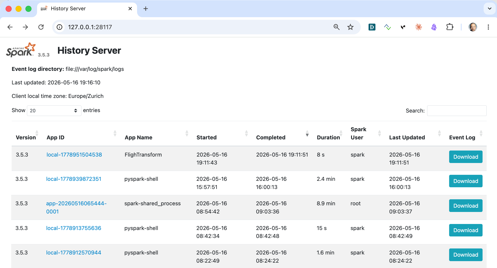
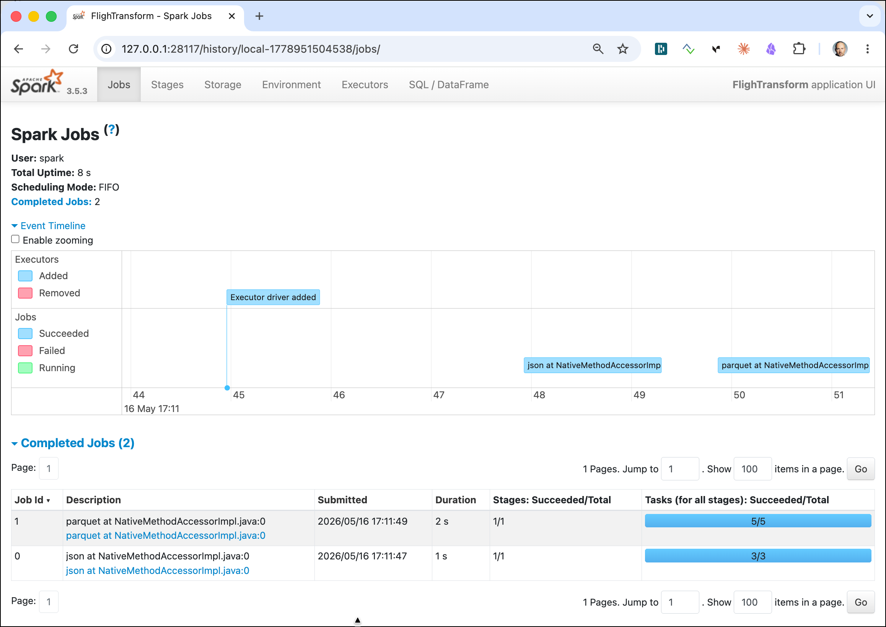

# Creating and running a self-contained Spark Application

In this workshop we will create a Spark Application to submit to a Spark cluster. The application will perform the logic to create the `refined` layer as seen in [Workshop 4 - Data Reading and Writing using DataFrames](../04-spark-dataframe).

The workshop is written in a way that it has to be executed on the same machine where the dataplatform is running. 

## Table of Contents

- [What you will learn](#what-you-will-learn)
- [Prerequisites](#prerequisites)
- [Upload the data, if no longer available](#prepare-the-data-if-no-longer-available)
- [Create the self-contained Spark Application](#create-the-self-contained-spark-application)
- [Execute the application on the Spark Cluster using the `spark-submit` command](#execute-the-application-on-the-spark-cluster-using-the-spark-submit-command)
- [Verify the output in Object Storage](#verify-the-output-in-object-storage)
- [Inspect the completed job in the Spark History Server](#inspect-the-completed-job-in-the-spark-history-server)
- [Tuning the application with spark-submit options](#tuning-the-application-with-spark-submit-options)

## What you will learn

- How to structure a PySpark application as a self-contained Python script
- How to accept command-line arguments in a Spark application using `argparse`
- How to submit an application to the Spark cluster using `spark-submit`
- How to package the application so it runs on workers with access to Object Storage (S3A)
- How Spark applications differ from interactive notebook usage
- How to verify the output written to Object Storage after a job completes
- How to use the Spark History Server to inspect completed jobs
- How to control executor resources and target the cluster via `spark-submit` options

## Prerequisites

- The **Data Platform** described [here](../00-environment) is running and accessible
- Workshop 4 ([Data Reading and Writing using DataFrames](../04-spark-dataframe)) completed
- Access to a terminal on the machine running the data platform

## Upload the data, if no longer available

The data needed here has been uploaded in workshop 2 - [Working with RustFS Object Storage](01b-rustfs-object-storage). You can skip this section, if you still have the data available in Object Storage. We show both `s3cmd` and the `mc` version of the commands:

Create the flight bucket:

```bash
docker exec -ti awscli s3cmd mb s3://flight-bucket
```

Upload all data

```bash
# Airports
docker exec -ti awscli s3cmd put /data-transfer/airport-data/airports.csv s3://flight-bucket/raw/airports/airports.csv

# Plane Data
docker exec -ti awscli s3cmd put /data-transfer/flight-data/plane-data.csv s3://flight-bucket/raw/planes/plane-data.csv

# Carriers
docker exec -ti awscli s3cmd put /data-transfer/flight-data/carriers.json s3://flight-bucket/raw/carriers/carriers.json

 #Flights
docker exec -ti awscli s3cmd put /data-transfer/flight-data/flights-small/flights_2008_4_1.csv s3://flight-bucket/raw/flights/ &&
   docker exec -ti awscli s3cmd put /data-transfer/flight-data/flights-small/flights_2008_4_2.csv s3://flight-bucket/raw/flights/ &&
   docker exec -ti awscli s3cmd put /data-transfer/flight-data/flights-small/flights_2008_5_1.csv s3://flight-bucket/raw/flights/ &&
   docker exec -ti awscli s3cmd put /data-transfer/flight-data/flights-small/flights_2008_5_2.csv s3://flight-bucket/raw/flights/ &&
   docker exec -ti awscli s3cmd put /data-transfer/flight-data/flights-small/flights_2008_5_3.csv s3://flight-bucket/raw/flights/
```

## Create the self-contained Spark Application

To create a Spark application using Python, we will be using PySpark, the Python API for Apache Spark.

First let's create a folder for the Spark application (**Note**: make sure that `DATAPLAFORM_HOME` environment variable points to the folder which contains the `docker-compose.yml` of the dataplatform)

```bash
cd $DATAPLATFORM_HOME
mkdir -p ./data-transfer/app
```

> **What you should see:** No output — the directory is created silently. You can confirm with `ls ./data-transfer/app`.

Create a file, e.g. `prep_refined.py` and save it into the `./data-transfer/app` folder

Use Nano or any other editor available to edit the file 

`nano ./data-transfer/app/prep_refined.py` 

and copy the following code into editor window.

```python
import argparse

from pyspark.sql import SparkSession
from pyspark.sql.types import *

def main(s3_bucket: str, s3_raw_path: str, s3_refined_path: str):

    spark = SparkSession\
        .builder\
        .appName("FlighTransform")\
        .getOrCreate()
        
    s3_raw_uri = f"s3a://{s3_bucket}/{s3_raw_path}"    
    s3_refined_uri = f"s3a://{s3_bucket}/{s3_refined_path}" 
    print(f"Reading data from raw {s3_raw_uri} and writing to refined {s3_refined_uri}")
    
    airportSchema = "`id` INTEGER, `ident` STRING, `type` STRING, `name` STRING, \
        `latitude_deg` DOUBLE, `longitude_deg` DOUBLE, `elevation_ft` INTEGER, \
        `continent` STRING, `iso_country` STRING, `iso_region` STRING, \
        `municipality` STRING, `scheduled_service` STRING, `gps_code` STRING, \
        `iata_code` STRING, `local_code` STRING, `home_link` STRING, \
        `wikipedia_link` STRING, `keywords` STRING"

    airportsRawDF = spark.read.csv(f"{s3_raw_uri}/airports", \
    			sep=",", inferSchema="false", header="true", schema=airportSchema)
    airportsRawDF.write.mode("overwrite").json(f"{s3_refined_uri}/airports")

    flightSchema = """`year` INTEGER, `month` INTEGER, `dayOfMonth` INTEGER,  `dayOfWeek` INTEGER, `depTime` INTEGER, `crsDepTime` INTEGER, `arrTime` INTEGER, `crsArrTime` INTEGER, `uniqueCarrier` STRING, `flightNum` STRING, `tailNum` STRING, `actualElapsedTime` INTEGER,\
                   `crsElapsedTime` INTEGER, `airTime` INTEGER, `arrDelay` INTEGER,`depDelay` INTEGER,`origin` STRING, `destination` STRING, `distance` INTEGER, `taxiIn` INTEGER, `taxiOut` INTEGER, `cancelled` STRING, `cancellationCode` STRING, `diverted` STRING,
                   `carrierDelay` STRING, `weatherDelay` STRING, `nasDelay` STRING, `securityDelay` STRING, `lateAircraftDelay` STRING"""
                   
    flightsRawDF = spark.read.csv(f"{s3_raw_uri}/flights", \
    			sep=",", inferSchema="false", header="false", schema=flightSchema)

    flightsRawDF.write.mode("overwrite").partitionBy("year","month").parquet(f"{s3_refined_uri}/flights")

    spark.stop()
    
if __name__ == "__main__":
    """
    Usage:
        spark-submit spark_app.py --s3-bucket <bucket-name> --s3-raw-path <path/to/data> --s3-refined-path <path/to/data>

    Example:
        spark-submit spark_app.py --s3-bucket my-data-bucket --s3-raw-path <path/to/data> --s3-refined-path <path/to/data>
    """
    parser = argparse.ArgumentParser(description="Spark App with S3 input")
    parser.add_argument("--s3-bucket", required=True, help="S3 bucket name (without s3a://)")
    parser.add_argument("--s3-raw-path", required=True, help="Path in the S3 bucket to the raw data")
    parser.add_argument("--s3-refined-path", required=True, help="Path in the S3 bucket to the refined data")
    args = parser.parse_args()

    main(args.s3_bucket, args.s3_raw_path, args.s3_refined_path)   
```

Save it by hitting `Ctrl-O` and exit by hitting `Ctrl-X`.

> **What just happened?** Unlike a Zeppelin and similar to what we used in Jupyter, this is a standalone Python script that creates its own `SparkSession` at startup and calls `spark.stop()` when done. The `argparse` block at the bottom lets it accept command-line arguments from `spark-submit`, making it reusable across different bucket/path configurations without editing the code.

The application accepts 3 parameters to specify the S3 bucket name, the raw folder and the refined folder.

## Execute the application on the Spark Cluster using the `spark-submit` command

Before we submit the application, let's make sure that the `refined` folder does not exists. Otherwise we will get an error when trying to write to the folder. 

```bash
docker exec -ti awscli s3cmd del --recursive s3://flight-bucket/refined
```

> **What you should see:** One `delete:` line per object removed from the `refined/` prefix. If the folder did not exist yet, no output is shown — that is fine.

Now we can submit it using `spark-submit` CLI, which is part of the `spark-master` docker container. 

```bash
docker exec -it spark-master spark-submit /data-transfer/app/prep_refined.py --s3-bucket flight-bucket --s3-raw-path raw --s3-refined-path refined
```

and you should see the following successful execution

```
ubuntu@ip-172-26-9-12:~/bigdata-spark-workshop/00-environment/docker$ docker exec -it spark-master spark-submit /data-transfer/app/prep_refined.py --s3-bucket flight-bucket --s3-raw-path raw --s3-refined-path refined
:: loading settings :: url = jar:file:/opt/bitnami/spark/jars/ivy-2.5.1.jar!/org/apache/ivy/core/settings/ivysettings.xml
Ivy Default Cache set to: /opt/bitnami/spark/.ivy2/cache
The jars for the packages stored in: /opt/bitnami/spark/.ivy2/jars
org.apache.spark#spark-avro_2.12 added as a dependency
io.delta#delta-spark_2.12 added as a dependency
io.delta#delta-storage added as a dependency
io.graphframes#graphframes-spark3_2.12 added as a dependency
io.graphframes#graphframes-graphx-spark3_2.12 added as a dependency
io.delta#delta-spark_2.12 added as a dependency
io.delta#delta-storage added as a dependency
:: resolving dependencies :: org.apache.spark#spark-submit-parent-2d2623a1-7546-441a-8b8c-0d2d053a3e36;1.0
	confs: [default]
	found org.apache.spark#spark-avro_2.12;3.5.3 in central
	found org.tukaani#xz;1.9 in central
	found io.delta#delta-spark_2.12;3.3.2 in central
	found io.delta#delta-storage;3.3.2 in central
	found org.antlr#antlr4-runtime;4.9.3 in central
	found io.graphframes#graphframes-spark3_2.12;0.10.1 in central
	found io.graphframes#graphframes-graphx-spark3_2.12;0.10.1 in central
:: resolution report :: resolve 208ms :: artifacts dl 8ms
	:: modules in use:
	io.delta#delta-spark_2.12;3.3.2 from central in [default]
	io.delta#delta-storage;3.3.2 from central in [default]
	io.graphframes#graphframes-graphx-spark3_2.12;0.10.1 from central in [default]
	io.graphframes#graphframes-spark3_2.12;0.10.1 from central in [default]
	org.antlr#antlr4-runtime;4.9.3 from central in [default]
	org.apache.spark#spark-avro_2.12;3.5.3 from central in [default]
	org.tukaani#xz;1.9 from central in [default]
	---------------------------------------------------------------------
	|                  |            modules            ||   artifacts   |
	|       conf       | number| search|dwnlded|evicted|| number|dwnlded|
	---------------------------------------------------------------------
	|      default     |   7   |   0   |   0   |   0   ||   7   |   0   |
	---------------------------------------------------------------------
:: retrieving :: org.apache.spark#spark-submit-parent-2d2623a1-7546-441a-8b8c-0d2d053a3e36
	confs: [default]
	0 artifacts copied, 7 already retrieved (0kB/5ms)
26/05/16 17:11:43 WARN NativeCodeLoader: Unable to load native-hadoop library for your platform... using builtin-java classes where applicable
26/05/16 17:11:43 INFO SparkContext: Running Spark version 3.5.3
26/05/16 17:11:43 INFO SparkContext: OS info Linux, 7.0.5-orbstack-00330-ge3df4e19b0a0-dirty, aarch64
26/05/16 17:11:43 INFO SparkContext: Java version 17.0.13
26/05/16 17:11:43 INFO ResourceUtils: ==============================================================
26/05/16 17:11:43 INFO ResourceUtils: No custom resources configured for spark.driver.
26/05/16 17:11:43 INFO ResourceUtils: ==============================================================
26/05/16 17:11:43 INFO SparkContext: Submitted application: FlighTransform
26/05/16 17:11:43 INFO ResourceProfile: Default ResourceProfile created, executor resources: Map(cores -> name: cores, amount: 1, script: , vendor: , memory -> name: memory, amount: 2048, script: , vendor: , offHeap -> name: offHeap, amount: 0, script: , vendor: ), task resources: Map(cpus -> name: cpus, amount: 1.0)
26/05/16 17:11:43 INFO ResourceProfile: Limiting resource is cpu
26/05/16 17:11:43 INFO ResourceProfileManager: Added ResourceProfile id: 0
26/05/16 17:11:44 INFO SecurityManager: Changing view acls to: spark
26/05/16 17:11:44 INFO SecurityManager: Changing modify acls to: spark
26/05/16 17:11:44 INFO SecurityManager: Changing view acls groups to:
26/05/16 17:11:44 INFO SecurityManager: Changing modify acls groups to:
26/05/16 17:11:44 INFO SecurityManager: SecurityManager: authentication disabled; ui acls disabled; users with view permissions: spark; groups with view permissions: EMPTY; users with modify permissions: spark; groups with modify permissions: EMPTY
26/05/16 17:11:44 INFO Utils: Successfully started service 'sparkDriver' on port 37905.
26/05/16 17:11:44 INFO SparkEnv: Registering MapOutputTracker
26/05/16 17:11:44 INFO SparkEnv: Registering BlockManagerMaster
26/05/16 17:11:44 INFO BlockManagerMasterEndpoint: Using org.apache.spark.storage.DefaultTopologyMapper for getting topology information
26/05/16 17:11:44 INFO BlockManagerMasterEndpoint: BlockManagerMasterEndpoint up
26/05/16 17:11:44 INFO SparkEnv: Registering BlockManagerMasterHeartbeat
26/05/16 17:11:44 INFO DiskBlockManager: Created local directory at /tmp/blockmgr-2d28a05f-03de-44d4-9236-fdda04e8a023
26/05/16 17:11:44 INFO MemoryStore: MemoryStore started with capacity 434.4 MiB
26/05/16 17:11:44 INFO SparkEnv: Registering OutputCommitCoordinator
26/05/16 17:11:44 INFO JettyUtils: Start Jetty 0.0.0.0:4040 for SparkUI
26/05/16 17:11:44 INFO Utils: Successfully started service 'SparkUI' on port 4040.
26/05/16 17:11:44 INFO SparkContext: Added JAR file:///opt/bitnami/spark/jars/iceberg-spark-runtime-3.5_2.12-1.10.1.jar at spark://spark-master:37905/jars/iceberg-spark-runtime-3.5_2.12-1.10.1.jar with timestamp 1778951503914
26/05/16 17:11:44 INFO SparkContext: Added JAR file:///opt/bitnami/spark/jars/delta-spark_2.12-3.3.2.jar at spark://spark-master:37905/jars/delta-spark_2.12-3.3.2.jar with timestamp 1778951503914
26/05/16 17:11:44 INFO SparkContext: Added JAR file:///opt/bitnami/spark/jars/delta-storage-3.3.2.jar at spark://spark-master:37905/jars/delta-storage-3.3.2.jar with timestamp 1778951503914
26/05/16 17:11:44 INFO SparkContext: Added JAR file:///opt/bitnami/spark/.ivy2/jars/org.apache.spark_spark-avro_2.12-3.5.3.jar at spark://spark-master:37905/jars/org.apache.spark_spark-avro_2.12-3.5.3.jar with timestamp 1778951503914
26/05/16 17:11:44 INFO SparkContext: Added JAR file:///opt/bitnami/spark/.ivy2/jars/io.delta_delta-spark_2.12-3.3.2.jar at spark://spark-master:37905/jars/io.delta_delta-spark_2.12-3.3.2.jar with timestamp 1778951503914
26/05/16 17:11:44 INFO SparkContext: Added JAR file:///opt/bitnami/spark/.ivy2/jars/io.delta_delta-storage-3.3.2.jar at spark://spark-master:37905/jars/io.delta_delta-storage-3.3.2.jar with timestamp 1778951503914
26/05/16 17:11:44 INFO SparkContext: Added JAR file:///opt/bitnami/spark/.ivy2/jars/io.graphframes_graphframes-spark3_2.12-0.10.1.jar at spark://spark-master:37905/jars/io.graphframes_graphframes-spark3_2.12-0.10.1.jar with timestamp 1778951503914
26/05/16 17:11:44 INFO SparkContext: Added JAR file:///opt/bitnami/spark/.ivy2/jars/io.graphframes_graphframes-graphx-spark3_2.12-0.10.1.jar at spark://spark-master:37905/jars/io.graphframes_graphframes-graphx-spark3_2.12-0.10.1.jar with timestamp 1778951503914
26/05/16 17:11:44 INFO SparkContext: Added JAR file:///opt/bitnami/spark/.ivy2/jars/org.tukaani_xz-1.9.jar at spark://spark-master:37905/jars/org.tukaani_xz-1.9.jar with timestamp 1778951503914
26/05/16 17:11:44 INFO SparkContext: Added JAR file:///opt/bitnami/spark/.ivy2/jars/org.antlr_antlr4-runtime-4.9.3.jar at spark://spark-master:37905/jars/org.antlr_antlr4-runtime-4.9.3.jar with timestamp 1778951503914
26/05/16 17:11:44 INFO SparkContext: Added file file:///opt/bitnami/spark/.ivy2/jars/org.apache.spark_spark-avro_2.12-3.5.3.jar at file:///opt/bitnami/spark/.ivy2/jars/org.apache.spark_spark-avro_2.12-3.5.3.jar with timestamp 1778951503914
26/05/16 17:11:44 INFO Utils: Copying /opt/bitnami/spark/.ivy2/jars/org.apache.spark_spark-avro_2.12-3.5.3.jar to /tmp/spark-8babd1e0-fb15-45c4-8ce5-a1d25b910d64/userFiles-19ee8f31-5160-4864-b1de-cee6c998ef50/org.apache.spark_spark-avro_2.12-3.5.3.jar
26/05/16 17:11:44 INFO SparkContext: Added file file:///opt/bitnami/spark/.ivy2/jars/io.delta_delta-spark_2.12-3.3.2.jar at file:///opt/bitnami/spark/.ivy2/jars/io.delta_delta-spark_2.12-3.3.2.jar with timestamp 1778951503914
26/05/16 17:11:44 INFO Utils: Copying /opt/bitnami/spark/.ivy2/jars/io.delta_delta-spark_2.12-3.3.2.jar to /tmp/spark-8babd1e0-fb15-45c4-8ce5-a1d25b910d64/userFiles-19ee8f31-5160-4864-b1de-cee6c998ef50/io.delta_delta-spark_2.12-3.3.2.jar
26/05/16 17:11:44 INFO SparkContext: Added file file:///opt/bitnami/spark/.ivy2/jars/io.delta_delta-storage-3.3.2.jar at file:///opt/bitnami/spark/.ivy2/jars/io.delta_delta-storage-3.3.2.jar with timestamp 1778951503914
26/05/16 17:11:44 INFO Utils: Copying /opt/bitnami/spark/.ivy2/jars/io.delta_delta-storage-3.3.2.jar to /tmp/spark-8babd1e0-fb15-45c4-8ce5-a1d25b910d64/userFiles-19ee8f31-5160-4864-b1de-cee6c998ef50/io.delta_delta-storage-3.3.2.jar
26/05/16 17:11:44 INFO SparkContext: Added file file:///opt/bitnami/spark/.ivy2/jars/io.graphframes_graphframes-spark3_2.12-0.10.1.jar at file:///opt/bitnami/spark/.ivy2/jars/io.graphframes_graphframes-spark3_2.12-0.10.1.jar with timestamp 1778951503914
26/05/16 17:11:44 INFO Utils: Copying /opt/bitnami/spark/.ivy2/jars/io.graphframes_graphframes-spark3_2.12-0.10.1.jar to /tmp/spark-8babd1e0-fb15-45c4-8ce5-a1d25b910d64/userFiles-19ee8f31-5160-4864-b1de-cee6c998ef50/io.graphframes_graphframes-spark3_2.12-0.10.1.jar
26/05/16 17:11:44 INFO SparkContext: Added file file:///opt/bitnami/spark/.ivy2/jars/io.graphframes_graphframes-graphx-spark3_2.12-0.10.1.jar at file:///opt/bitnami/spark/.ivy2/jars/io.graphframes_graphframes-graphx-spark3_2.12-0.10.1.jar with timestamp 1778951503914
26/05/16 17:11:44 INFO Utils: Copying /opt/bitnami/spark/.ivy2/jars/io.graphframes_graphframes-graphx-spark3_2.12-0.10.1.jar to /tmp/spark-8babd1e0-fb15-45c4-8ce5-a1d25b910d64/userFiles-19ee8f31-5160-4864-b1de-cee6c998ef50/io.graphframes_graphframes-graphx-spark3_2.12-0.10.1.jar
26/05/16 17:11:44 INFO SparkContext: Added file file:///opt/bitnami/spark/.ivy2/jars/org.tukaani_xz-1.9.jar at file:///opt/bitnami/spark/.ivy2/jars/org.tukaani_xz-1.9.jar with timestamp 1778951503914
26/05/16 17:11:44 INFO Utils: Copying /opt/bitnami/spark/.ivy2/jars/org.tukaani_xz-1.9.jar to /tmp/spark-8babd1e0-fb15-45c4-8ce5-a1d25b910d64/userFiles-19ee8f31-5160-4864-b1de-cee6c998ef50/org.tukaani_xz-1.9.jar
26/05/16 17:11:44 INFO SparkContext: Added file file:///opt/bitnami/spark/.ivy2/jars/org.antlr_antlr4-runtime-4.9.3.jar at file:///opt/bitnami/spark/.ivy2/jars/org.antlr_antlr4-runtime-4.9.3.jar with timestamp 1778951503914
26/05/16 17:11:44 INFO Utils: Copying /opt/bitnami/spark/.ivy2/jars/org.antlr_antlr4-runtime-4.9.3.jar to /tmp/spark-8babd1e0-fb15-45c4-8ce5-a1d25b910d64/userFiles-19ee8f31-5160-4864-b1de-cee6c998ef50/org.antlr_antlr4-runtime-4.9.3.jar
26/05/16 17:11:44 INFO Executor: Starting executor ID driver on host spark-master
26/05/16 17:11:44 INFO Executor: OS info Linux, 7.0.5-orbstack-00330-ge3df4e19b0a0-dirty, aarch64
26/05/16 17:11:44 INFO Executor: Java version 17.0.13
26/05/16 17:11:44 INFO Executor: Starting executor with user classpath (userClassPathFirst = false): ''
26/05/16 17:11:44 INFO Executor: Created or updated repl class loader org.apache.spark.util.MutableURLClassLoader@5ca004bf for default.
26/05/16 17:11:44 INFO Executor: Fetching file:///opt/bitnami/spark/.ivy2/jars/org.tukaani_xz-1.9.jar with timestamp 1778951503914
26/05/16 17:11:44 INFO Utils: /opt/bitnami/spark/.ivy2/jars/org.tukaani_xz-1.9.jar has been previously copied to /tmp/spark-8babd1e0-fb15-45c4-8ce5-a1d25b910d64/userFiles-19ee8f31-5160-4864-b1de-cee6c998ef50/org.tukaani_xz-1.9.jar
26/05/16 17:11:44 INFO Executor: Fetching file:///opt/bitnami/spark/.ivy2/jars/io.graphframes_graphframes-spark3_2.12-0.10.1.jar with timestamp 1778951503914
26/05/16 17:11:44 INFO Utils: /opt/bitnami/spark/.ivy2/jars/io.graphframes_graphframes-spark3_2.12-0.10.1.jar has been previously copied to /tmp/spark-8babd1e0-fb15-45c4-8ce5-a1d25b910d64/userFiles-19ee8f31-5160-4864-b1de-cee6c998ef50/io.graphframes_graphframes-spark3_2.12-0.10.1.jar
26/05/16 17:11:44 INFO Executor: Fetching file:///opt/bitnami/spark/.ivy2/jars/io.delta_delta-storage-3.3.2.jar with timestamp 1778951503914
26/05/16 17:11:44 INFO Utils: /opt/bitnami/spark/.ivy2/jars/io.delta_delta-storage-3.3.2.jar has been previously copied to /tmp/spark-8babd1e0-fb15-45c4-8ce5-a1d25b910d64/userFiles-19ee8f31-5160-4864-b1de-cee6c998ef50/io.delta_delta-storage-3.3.2.jar
26/05/16 17:11:44 INFO Executor: Fetching file:///opt/bitnami/spark/.ivy2/jars/io.delta_delta-spark_2.12-3.3.2.jar with timestamp 1778951503914
26/05/16 17:11:44 INFO Utils: /opt/bitnami/spark/.ivy2/jars/io.delta_delta-spark_2.12-3.3.2.jar has been previously copied to /tmp/spark-8babd1e0-fb15-45c4-8ce5-a1d25b910d64/userFiles-19ee8f31-5160-4864-b1de-cee6c998ef50/io.delta_delta-spark_2.12-3.3.2.jar
26/05/16 17:11:44 INFO Executor: Fetching file:///opt/bitnami/spark/.ivy2/jars/org.antlr_antlr4-runtime-4.9.3.jar with timestamp 1778951503914
26/05/16 17:11:44 INFO Utils: /opt/bitnami/spark/.ivy2/jars/org.antlr_antlr4-runtime-4.9.3.jar has been previously copied to /tmp/spark-8babd1e0-fb15-45c4-8ce5-a1d25b910d64/userFiles-19ee8f31-5160-4864-b1de-cee6c998ef50/org.antlr_antlr4-runtime-4.9.3.jar
26/05/16 17:11:44 INFO Executor: Fetching file:///opt/bitnami/spark/.ivy2/jars/io.graphframes_graphframes-graphx-spark3_2.12-0.10.1.jar with timestamp 1778951503914
26/05/16 17:11:44 INFO Utils: /opt/bitnami/spark/.ivy2/jars/io.graphframes_graphframes-graphx-spark3_2.12-0.10.1.jar has been previously copied to /tmp/spark-8babd1e0-fb15-45c4-8ce5-a1d25b910d64/userFiles-19ee8f31-5160-4864-b1de-cee6c998ef50/io.graphframes_graphframes-graphx-spark3_2.12-0.10.1.jar
26/05/16 17:11:44 INFO Executor: Fetching file:///opt/bitnami/spark/.ivy2/jars/org.apache.spark_spark-avro_2.12-3.5.3.jar with timestamp 1778951503914
26/05/16 17:11:44 INFO Utils: /opt/bitnami/spark/.ivy2/jars/org.apache.spark_spark-avro_2.12-3.5.3.jar has been previously copied to /tmp/spark-8babd1e0-fb15-45c4-8ce5-a1d25b910d64/userFiles-19ee8f31-5160-4864-b1de-cee6c998ef50/org.apache.spark_spark-avro_2.12-3.5.3.jar
26/05/16 17:11:44 INFO Executor: Fetching spark://spark-master:37905/jars/io.graphframes_graphframes-spark3_2.12-0.10.1.jar with timestamp 1778951503914
26/05/16 17:11:44 INFO TransportClientFactory: Successfully created connection to spark-master/192.168.97.18:37905 after 23 ms (0 ms spent in bootstraps)
26/05/16 17:11:44 INFO Utils: Fetching spark://spark-master:37905/jars/io.graphframes_graphframes-spark3_2.12-0.10.1.jar to /tmp/spark-8babd1e0-fb15-45c4-8ce5-a1d25b910d64/userFiles-19ee8f31-5160-4864-b1de-cee6c998ef50/fetchFileTemp7440273425244338311.tmp
26/05/16 17:11:44 INFO Utils: /tmp/spark-8babd1e0-fb15-45c4-8ce5-a1d25b910d64/userFiles-19ee8f31-5160-4864-b1de-cee6c998ef50/fetchFileTemp7440273425244338311.tmp has been previously copied to /tmp/spark-8babd1e0-fb15-45c4-8ce5-a1d25b910d64/userFiles-19ee8f31-5160-4864-b1de-cee6c998ef50/io.graphframes_graphframes-spark3_2.12-0.10.1.jar
26/05/16 17:11:44 INFO Executor: Adding file:/tmp/spark-8babd1e0-fb15-45c4-8ce5-a1d25b910d64/userFiles-19ee8f31-5160-4864-b1de-cee6c998ef50/io.graphframes_graphframes-spark3_2.12-0.10.1.jar to class loader default
26/05/16 17:11:44 INFO Executor: Fetching spark://spark-master:37905/jars/io.delta_delta-spark_2.12-3.3.2.jar with timestamp 1778951503914
26/05/16 17:11:44 INFO Utils: Fetching spark://spark-master:37905/jars/io.delta_delta-spark_2.12-3.3.2.jar to /tmp/spark-8babd1e0-fb15-45c4-8ce5-a1d25b910d64/userFiles-19ee8f31-5160-4864-b1de-cee6c998ef50/fetchFileTemp12637429440853176443.tmp
26/05/16 17:11:44 INFO Utils: /tmp/spark-8babd1e0-fb15-45c4-8ce5-a1d25b910d64/userFiles-19ee8f31-5160-4864-b1de-cee6c998ef50/fetchFileTemp12637429440853176443.tmp has been previously copied to /tmp/spark-8babd1e0-fb15-45c4-8ce5-a1d25b910d64/userFiles-19ee8f31-5160-4864-b1de-cee6c998ef50/io.delta_delta-spark_2.12-3.3.2.jar
26/05/16 17:11:44 INFO Executor: Adding file:/tmp/spark-8babd1e0-fb15-45c4-8ce5-a1d25b910d64/userFiles-19ee8f31-5160-4864-b1de-cee6c998ef50/io.delta_delta-spark_2.12-3.3.2.jar to class loader default
26/05/16 17:11:44 INFO Executor: Fetching spark://spark-master:37905/jars/org.tukaani_xz-1.9.jar with timestamp 1778951503914
26/05/16 17:11:44 INFO Utils: Fetching spark://spark-master:37905/jars/org.tukaani_xz-1.9.jar to /tmp/spark-8babd1e0-fb15-45c4-8ce5-a1d25b910d64/userFiles-19ee8f31-5160-4864-b1de-cee6c998ef50/fetchFileTemp3760954312906096000.tmp
26/05/16 17:11:44 INFO Utils: /tmp/spark-8babd1e0-fb15-45c4-8ce5-a1d25b910d64/userFiles-19ee8f31-5160-4864-b1de-cee6c998ef50/fetchFileTemp3760954312906096000.tmp has been previously copied to /tmp/spark-8babd1e0-fb15-45c4-8ce5-a1d25b910d64/userFiles-19ee8f31-5160-4864-b1de-cee6c998ef50/org.tukaani_xz-1.9.jar
26/05/16 17:11:44 INFO Executor: Adding file:/tmp/spark-8babd1e0-fb15-45c4-8ce5-a1d25b910d64/userFiles-19ee8f31-5160-4864-b1de-cee6c998ef50/org.tukaani_xz-1.9.jar to class loader default
26/05/16 17:11:44 INFO Executor: Fetching spark://spark-master:37905/jars/org.antlr_antlr4-runtime-4.9.3.jar with timestamp 1778951503914
26/05/16 17:11:44 INFO Utils: Fetching spark://spark-master:37905/jars/org.antlr_antlr4-runtime-4.9.3.jar to /tmp/spark-8babd1e0-fb15-45c4-8ce5-a1d25b910d64/userFiles-19ee8f31-5160-4864-b1de-cee6c998ef50/fetchFileTemp3700092648268181061.tmp
26/05/16 17:11:44 INFO Utils: /tmp/spark-8babd1e0-fb15-45c4-8ce5-a1d25b910d64/userFiles-19ee8f31-5160-4864-b1de-cee6c998ef50/fetchFileTemp3700092648268181061.tmp has been previously copied to /tmp/spark-8babd1e0-fb15-45c4-8ce5-a1d25b910d64/userFiles-19ee8f31-5160-4864-b1de-cee6c998ef50/org.antlr_antlr4-runtime-4.9.3.jar
26/05/16 17:11:44 INFO Executor: Adding file:/tmp/spark-8babd1e0-fb15-45c4-8ce5-a1d25b910d64/userFiles-19ee8f31-5160-4864-b1de-cee6c998ef50/org.antlr_antlr4-runtime-4.9.3.jar to class loader default
26/05/16 17:11:44 INFO Executor: Fetching spark://spark-master:37905/jars/iceberg-spark-runtime-3.5_2.12-1.10.1.jar with timestamp 1778951503914
26/05/16 17:11:44 INFO Utils: Fetching spark://spark-master:37905/jars/iceberg-spark-runtime-3.5_2.12-1.10.1.jar to /tmp/spark-8babd1e0-fb15-45c4-8ce5-a1d25b910d64/userFiles-19ee8f31-5160-4864-b1de-cee6c998ef50/fetchFileTemp4843666241771028912.tmp
26/05/16 17:11:44 INFO Executor: Adding file:/tmp/spark-8babd1e0-fb15-45c4-8ce5-a1d25b910d64/userFiles-19ee8f31-5160-4864-b1de-cee6c998ef50/iceberg-spark-runtime-3.5_2.12-1.10.1.jar to class loader default
26/05/16 17:11:44 INFO Executor: Fetching spark://spark-master:37905/jars/org.apache.spark_spark-avro_2.12-3.5.3.jar with timestamp 1778951503914
26/05/16 17:11:44 INFO Utils: Fetching spark://spark-master:37905/jars/org.apache.spark_spark-avro_2.12-3.5.3.jar to /tmp/spark-8babd1e0-fb15-45c4-8ce5-a1d25b910d64/userFiles-19ee8f31-5160-4864-b1de-cee6c998ef50/fetchFileTemp14077588250962309002.tmp
26/05/16 17:11:44 INFO Utils: /tmp/spark-8babd1e0-fb15-45c4-8ce5-a1d25b910d64/userFiles-19ee8f31-5160-4864-b1de-cee6c998ef50/fetchFileTemp14077588250962309002.tmp has been previously copied to /tmp/spark-8babd1e0-fb15-45c4-8ce5-a1d25b910d64/userFiles-19ee8f31-5160-4864-b1de-cee6c998ef50/org.apache.spark_spark-avro_2.12-3.5.3.jar
26/05/16 17:11:44 INFO Executor: Adding file:/tmp/spark-8babd1e0-fb15-45c4-8ce5-a1d25b910d64/userFiles-19ee8f31-5160-4864-b1de-cee6c998ef50/org.apache.spark_spark-avro_2.12-3.5.3.jar to class loader default
26/05/16 17:11:44 INFO Executor: Fetching spark://spark-master:37905/jars/io.delta_delta-storage-3.3.2.jar with timestamp 1778951503914
26/05/16 17:11:44 INFO Utils: Fetching spark://spark-master:37905/jars/io.delta_delta-storage-3.3.2.jar to /tmp/spark-8babd1e0-fb15-45c4-8ce5-a1d25b910d64/userFiles-19ee8f31-5160-4864-b1de-cee6c998ef50/fetchFileTemp12148086345040986829.tmp
26/05/16 17:11:44 INFO Utils: /tmp/spark-8babd1e0-fb15-45c4-8ce5-a1d25b910d64/userFiles-19ee8f31-5160-4864-b1de-cee6c998ef50/fetchFileTemp12148086345040986829.tmp has been previously copied to /tmp/spark-8babd1e0-fb15-45c4-8ce5-a1d25b910d64/userFiles-19ee8f31-5160-4864-b1de-cee6c998ef50/io.delta_delta-storage-3.3.2.jar
26/05/16 17:11:44 INFO Executor: Adding file:/tmp/spark-8babd1e0-fb15-45c4-8ce5-a1d25b910d64/userFiles-19ee8f31-5160-4864-b1de-cee6c998ef50/io.delta_delta-storage-3.3.2.jar to class loader default
26/05/16 17:11:44 INFO Executor: Fetching spark://spark-master:37905/jars/delta-spark_2.12-3.3.2.jar with timestamp 1778951503914
26/05/16 17:11:44 INFO Utils: Fetching spark://spark-master:37905/jars/delta-spark_2.12-3.3.2.jar to /tmp/spark-8babd1e0-fb15-45c4-8ce5-a1d25b910d64/userFiles-19ee8f31-5160-4864-b1de-cee6c998ef50/fetchFileTemp589110733053566478.tmp
26/05/16 17:11:44 INFO Executor: Adding file:/tmp/spark-8babd1e0-fb15-45c4-8ce5-a1d25b910d64/userFiles-19ee8f31-5160-4864-b1de-cee6c998ef50/delta-spark_2.12-3.3.2.jar to class loader default
26/05/16 17:11:44 INFO Executor: Fetching spark://spark-master:37905/jars/delta-storage-3.3.2.jar with timestamp 1778951503914
26/05/16 17:11:44 INFO Utils: Fetching spark://spark-master:37905/jars/delta-storage-3.3.2.jar to /tmp/spark-8babd1e0-fb15-45c4-8ce5-a1d25b910d64/userFiles-19ee8f31-5160-4864-b1de-cee6c998ef50/fetchFileTemp1063728230059138821.tmp
26/05/16 17:11:44 INFO Executor: Adding file:/tmp/spark-8babd1e0-fb15-45c4-8ce5-a1d25b910d64/userFiles-19ee8f31-5160-4864-b1de-cee6c998ef50/delta-storage-3.3.2.jar to class loader default
26/05/16 17:11:44 INFO Executor: Fetching spark://spark-master:37905/jars/io.graphframes_graphframes-graphx-spark3_2.12-0.10.1.jar with timestamp 1778951503914
26/05/16 17:11:44 INFO Utils: Fetching spark://spark-master:37905/jars/io.graphframes_graphframes-graphx-spark3_2.12-0.10.1.jar to /tmp/spark-8babd1e0-fb15-45c4-8ce5-a1d25b910d64/userFiles-19ee8f31-5160-4864-b1de-cee6c998ef50/fetchFileTemp14257240969994950662.tmp
26/05/16 17:11:44 INFO Utils: /tmp/spark-8babd1e0-fb15-45c4-8ce5-a1d25b910d64/userFiles-19ee8f31-5160-4864-b1de-cee6c998ef50/fetchFileTemp14257240969994950662.tmp has been previously copied to /tmp/spark-8babd1e0-fb15-45c4-8ce5-a1d25b910d64/userFiles-19ee8f31-5160-4864-b1de-cee6c998ef50/io.graphframes_graphframes-graphx-spark3_2.12-0.10.1.jar
26/05/16 17:11:44 INFO Executor: Adding file:/tmp/spark-8babd1e0-fb15-45c4-8ce5-a1d25b910d64/userFiles-19ee8f31-5160-4864-b1de-cee6c998ef50/io.graphframes_graphframes-graphx-spark3_2.12-0.10.1.jar to class loader default
26/05/16 17:11:44 INFO Utils: Successfully started service 'org.apache.spark.network.netty.NettyBlockTransferService' on port 37687.
26/05/16 17:11:44 INFO NettyBlockTransferService: Server created on spark-master:37687
26/05/16 17:11:44 INFO BlockManager: Using org.apache.spark.storage.RandomBlockReplicationPolicy for block replication policy
26/05/16 17:11:44 INFO BlockManagerMaster: Registering BlockManager BlockManagerId(driver, spark-master, 37687, None)
26/05/16 17:11:44 INFO BlockManagerMasterEndpoint: Registering block manager spark-master:37687 with 434.4 MiB RAM, BlockManagerId(driver, spark-master, 37687, None)
26/05/16 17:11:44 INFO BlockManagerMaster: Registered BlockManager BlockManagerId(driver, spark-master, 37687, None)
26/05/16 17:11:44 INFO BlockManager: Initialized BlockManager: BlockManagerId(driver, spark-master, 37687, None)
26/05/16 17:11:45 INFO SingleEventLogFileWriter: Logging events to file:/var/log/spark/logs/local-1778951504538.inprogress
Reading data from raw s3a://flight-bucket/raw and writing to refined s3a://flight-bucket/refined
26/05/16 17:11:45 INFO SharedState: Setting hive.metastore.warehouse.dir ('null') to the value of spark.sql.warehouse.dir.
26/05/16 17:11:45 WARN MetricsConfig: Cannot locate configuration: tried hadoop-metrics2-s3a-file-system.properties,hadoop-metrics2.properties
26/05/16 17:11:45 INFO MetricsSystemImpl: Scheduled Metric snapshot period at 10 second(s).
26/05/16 17:11:45 INFO MetricsSystemImpl: s3a-file-system metrics system started
26/05/16 17:11:45 INFO SharedState: Warehouse path is 's3a://admin-bucket/hive/warehouse'.
26/05/16 17:11:46 INFO InMemoryFileIndex: It took 44 ms to list leaf files for 1 paths.
26/05/16 17:11:47 INFO FileSourceStrategy: Pushed Filters:
26/05/16 17:11:47 INFO FileSourceStrategy: Post-Scan Filters:
26/05/16 17:11:47 WARN AbstractS3ACommitterFactory: Using standard FileOutputCommitter to commit work. This is slow and potentially unsafe.
26/05/16 17:11:47 INFO FileOutputCommitter: File Output Committer Algorithm version is 1
26/05/16 17:11:47 INFO FileOutputCommitter: FileOutputCommitter skip cleanup _temporary folders under output directory:false, ignore cleanup failures: false
26/05/16 17:11:47 INFO AbstractS3ACommitterFactory: Using Committer FileOutputCommitter{PathOutputCommitter{context=TaskAttemptContextImpl{JobContextImpl{jobId=job_202605161711475922585454669867156_0000}; taskId=attempt_202605161711475922585454669867156_0000_m_000000_0, status=''}; org.apache.hadoop.mapreduce.lib.output.FileOutputCommitter@551e990b}; outputPath=s3a://flight-bucket/refined/airports, workPath=s3a://flight-bucket/refined/airports/_temporary/0/_temporary/attempt_202605161711475922585454669867156_0000_m_000000_0, algorithmVersion=1, skipCleanup=false, ignoreCleanupFailures=false} for s3a://flight-bucket/refined/airports
26/05/16 17:11:47 INFO SQLHadoopMapReduceCommitProtocol: Using output committer class org.apache.hadoop.mapreduce.lib.output.FileOutputCommitter
26/05/16 17:11:47 INFO MemoryStore: Block broadcast_0 stored as values in memory (estimated size 217.2 KiB, free 434.2 MiB)
26/05/16 17:11:47 INFO MemoryStore: Block broadcast_0_piece0 stored as bytes in memory (estimated size 37.8 KiB, free 434.2 MiB)
26/05/16 17:11:47 INFO BlockManagerInfo: Added broadcast_0_piece0 in memory on spark-master:37687 (size: 37.8 KiB, free: 434.4 MiB)
26/05/16 17:11:47 INFO SparkContext: Created broadcast 0 from json at NativeMethodAccessorImpl.java:0
26/05/16 17:11:47 INFO FileSourceScanExec: Planning scan with bin packing, max size: 4194304 bytes, open cost is considered as scanning 4194304 bytes.
26/05/16 17:11:47 INFO SparkContext: Starting job: json at NativeMethodAccessorImpl.java:0
26/05/16 17:11:47 INFO DAGScheduler: Got job 0 (json at NativeMethodAccessorImpl.java:0) with 3 output partitions
26/05/16 17:11:47 INFO DAGScheduler: Final stage: ResultStage 0 (json at NativeMethodAccessorImpl.java:0)
26/05/16 17:11:47 INFO DAGScheduler: Parents of final stage: List()
26/05/16 17:11:47 INFO DAGScheduler: Missing parents: List()
26/05/16 17:11:47 INFO DAGScheduler: Submitting ResultStage 0 (MapPartitionsRDD[2] at json at NativeMethodAccessorImpl.java:0), which has no missing parents
26/05/16 17:11:48 INFO MemoryStore: Block broadcast_1 stored as values in memory (estimated size 231.6 KiB, free 433.9 MiB)
26/05/16 17:11:48 INFO MemoryStore: Block broadcast_1_piece0 stored as bytes in memory (estimated size 84.0 KiB, free 433.8 MiB)
26/05/16 17:11:48 INFO BlockManagerInfo: Added broadcast_1_piece0 in memory on spark-master:37687 (size: 84.0 KiB, free: 434.3 MiB)
26/05/16 17:11:48 INFO SparkContext: Created broadcast 1 from broadcast at DAGScheduler.scala:1585
26/05/16 17:11:48 INFO DAGScheduler: Submitting 3 missing tasks from ResultStage 0 (MapPartitionsRDD[2] at json at NativeMethodAccessorImpl.java:0) (first 15 tasks are for partitions Vector(0, 1, 2))
26/05/16 17:11:48 INFO TaskSchedulerImpl: Adding task set 0.0 with 3 tasks resource profile 0
26/05/16 17:11:48 INFO TaskSetManager: Starting task 0.0 in stage 0.0 (TID 0) (spark-master, executor driver, partition 0, PROCESS_LOCAL, 11222 bytes)
26/05/16 17:11:48 INFO TaskSetManager: Starting task 1.0 in stage 0.0 (TID 1) (spark-master, executor driver, partition 1, PROCESS_LOCAL, 11222 bytes)
26/05/16 17:11:48 INFO TaskSetManager: Starting task 2.0 in stage 0.0 (TID 2) (spark-master, executor driver, partition 2, PROCESS_LOCAL, 11222 bytes)
26/05/16 17:11:48 INFO Executor: Running task 0.0 in stage 0.0 (TID 0)
26/05/16 17:11:48 INFO Executor: Running task 2.0 in stage 0.0 (TID 2)
26/05/16 17:11:48 INFO Executor: Running task 1.0 in stage 0.0 (TID 1)
26/05/16 17:11:48 WARN AbstractS3ACommitterFactory: Using standard FileOutputCommitter to commit work. This is slow and potentially unsafe.
26/05/16 17:11:48 WARN AbstractS3ACommitterFactory: Using standard FileOutputCommitter to commit work. This is slow and potentially unsafe.
26/05/16 17:11:48 INFO FileOutputCommitter: File Output Committer Algorithm version is 1
26/05/16 17:11:48 INFO FileOutputCommitter: FileOutputCommitter skip cleanup _temporary folders under output directory:false, ignore cleanup failures: false
26/05/16 17:11:48 INFO FileOutputCommitter: File Output Committer Algorithm version is 1
26/05/16 17:11:48 WARN AbstractS3ACommitterFactory: Using standard FileOutputCommitter to commit work. This is slow and potentially unsafe.
26/05/16 17:11:48 INFO AbstractS3ACommitterFactory: Using Committer FileOutputCommitter{PathOutputCommitter{context=TaskAttemptContextImpl{JobContextImpl{jobId=job_202605161711473605016667276934376_0000}; taskId=attempt_202605161711473605016667276934376_0000_m_000002_2, status=''}; org.apache.hadoop.mapreduce.lib.output.FileOutputCommitter@1692c6f2}; outputPath=s3a://flight-bucket/refined/airports, workPath=s3a://flight-bucket/refined/airports/_temporary/0/_temporary/attempt_202605161711473605016667276934376_0000_m_000002_2, algorithmVersion=1, skipCleanup=false, ignoreCleanupFailures=false} for s3a://flight-bucket/refined/airports
26/05/16 17:11:48 INFO FileOutputCommitter: File Output Committer Algorithm version is 1
26/05/16 17:11:48 INFO FileOutputCommitter: FileOutputCommitter skip cleanup _temporary folders under output directory:false, ignore cleanup failures: false
26/05/16 17:11:48 INFO SQLHadoopMapReduceCommitProtocol: Using output committer class org.apache.hadoop.mapreduce.lib.output.FileOutputCommitter
26/05/16 17:11:48 INFO FileOutputCommitter: FileOutputCommitter skip cleanup _temporary folders under output directory:false, ignore cleanup failures: false
26/05/16 17:11:48 INFO AbstractS3ACommitterFactory: Using Committer FileOutputCommitter{PathOutputCommitter{context=TaskAttemptContextImpl{JobContextImpl{jobId=job_202605161711473605016667276934376_0000}; taskId=attempt_202605161711473605016667276934376_0000_m_000000_0, status=''}; org.apache.hadoop.mapreduce.lib.output.FileOutputCommitter@687130f4}; outputPath=s3a://flight-bucket/refined/airports, workPath=s3a://flight-bucket/refined/airports/_temporary/0/_temporary/attempt_202605161711473605016667276934376_0000_m_000000_0, algorithmVersion=1, skipCleanup=false, ignoreCleanupFailures=false} for s3a://flight-bucket/refined/airports
26/05/16 17:11:48 INFO SQLHadoopMapReduceCommitProtocol: Using output committer class org.apache.hadoop.mapreduce.lib.output.FileOutputCommitter
26/05/16 17:11:48 INFO FileScanRDD: Reading File path: s3a://flight-bucket/raw/airports/airports.csv, range: 8388608-11879081, partition values: [empty row]
26/05/16 17:11:48 INFO AbstractS3ACommitterFactory: Using Committer FileOutputCommitter{PathOutputCommitter{context=TaskAttemptContextImpl{JobContextImpl{jobId=job_202605161711473605016667276934376_0000}; taskId=attempt_202605161711473605016667276934376_0000_m_000001_1, status=''}; org.apache.hadoop.mapreduce.lib.output.FileOutputCommitter@54ae783e}; outputPath=s3a://flight-bucket/refined/airports, workPath=s3a://flight-bucket/refined/airports/_temporary/0/_temporary/attempt_202605161711473605016667276934376_0000_m_000001_1, algorithmVersion=1, skipCleanup=false, ignoreCleanupFailures=false} for s3a://flight-bucket/refined/airports
26/05/16 17:11:48 INFO SQLHadoopMapReduceCommitProtocol: Using output committer class org.apache.hadoop.mapreduce.lib.output.FileOutputCommitter
26/05/16 17:11:48 INFO FileScanRDD: Reading File path: s3a://flight-bucket/raw/airports/airports.csv, range: 4194304-8388608, partition values: [empty row]
26/05/16 17:11:48 INFO FileScanRDD: Reading File path: s3a://flight-bucket/raw/airports/airports.csv, range: 0-4194304, partition values: [empty row]
26/05/16 17:11:48 INFO CodeGenerator: Code generated in 153.980429 ms
26/05/16 17:11:49 INFO FileOutputCommitter: Saved output of task 'attempt_202605161711473605016667276934376_0000_m_000002_2' to s3a://flight-bucket/refined/airports/_temporary/0/task_202605161711473605016667276934376_0000_m_000002
26/05/16 17:11:49 INFO SparkHadoopMapRedUtil: attempt_202605161711473605016667276934376_0000_m_000002_2: Committed. Elapsed time: 125 ms.
26/05/16 17:11:49 INFO FileOutputCommitter: Saved output of task 'attempt_202605161711473605016667276934376_0000_m_000001_1' to s3a://flight-bucket/refined/airports/_temporary/0/task_202605161711473605016667276934376_0000_m_000001
26/05/16 17:11:49 INFO SparkHadoopMapRedUtil: attempt_202605161711473605016667276934376_0000_m_000001_1: Committed. Elapsed time: 130 ms.
26/05/16 17:11:49 INFO FileOutputCommitter: Saved output of task 'attempt_202605161711473605016667276934376_0000_m_000000_0' to s3a://flight-bucket/refined/airports/_temporary/0/task_202605161711473605016667276934376_0000_m_000000
26/05/16 17:11:49 INFO SparkHadoopMapRedUtil: attempt_202605161711473605016667276934376_0000_m_000000_0: Committed. Elapsed time: 110 ms.
26/05/16 17:11:49 INFO Executor: Finished task 2.0 in stage 0.0 (TID 2). 2545 bytes result sent to driver
26/05/16 17:11:49 INFO Executor: Finished task 1.0 in stage 0.0 (TID 1). 2502 bytes result sent to driver
26/05/16 17:11:49 INFO Executor: Finished task 0.0 in stage 0.0 (TID 0). 2502 bytes result sent to driver
26/05/16 17:11:49 INFO TaskSetManager: Finished task 2.0 in stage 0.0 (TID 2) in 1212 ms on spark-master (executor driver) (1/3)
26/05/16 17:11:49 INFO TaskSetManager: Finished task 1.0 in stage 0.0 (TID 1) in 1214 ms on spark-master (executor driver) (2/3)
26/05/16 17:11:49 INFO TaskSetManager: Finished task 0.0 in stage 0.0 (TID 0) in 1226 ms on spark-master (executor driver) (3/3)
26/05/16 17:11:49 INFO TaskSchedulerImpl: Removed TaskSet 0.0, whose tasks have all completed, from pool
26/05/16 17:11:49 INFO DAGScheduler: ResultStage 0 (json at NativeMethodAccessorImpl.java:0) finished in 1.350 s
26/05/16 17:11:49 INFO DAGScheduler: Job 0 is finished. Cancelling potential speculative or zombie tasks for this job
26/05/16 17:11:49 INFO TaskSchedulerImpl: Killing all running tasks in stage 0: Stage finished
26/05/16 17:11:49 INFO DAGScheduler: Job 0 finished: json at NativeMethodAccessorImpl.java:0, took 1.385206 s
26/05/16 17:11:49 INFO FileFormatWriter: Start to commit write Job 12b915b2-9c94-4e92-bc3a-fd7bf4a941f7.
26/05/16 17:11:49 INFO FileFormatWriter: Write Job 12b915b2-9c94-4e92-bc3a-fd7bf4a941f7 committed. Elapsed time: 304 ms.
26/05/16 17:11:49 INFO FileFormatWriter: Finished processing stats for write job 12b915b2-9c94-4e92-bc3a-fd7bf4a941f7.
26/05/16 17:11:49 INFO InMemoryFileIndex: It took 6 ms to list leaf files for 1 paths.
26/05/16 17:11:49 INFO FileSourceStrategy: Pushed Filters:
26/05/16 17:11:49 INFO FileSourceStrategy: Post-Scan Filters:
26/05/16 17:11:49 WARN SparkStringUtils: Truncated the string representation of a plan since it was too large. This behavior can be adjusted by setting 'spark.sql.debug.maxToStringFields'.
26/05/16 17:11:49 INFO ParquetUtils: Using default output committer for Parquet: org.apache.parquet.hadoop.ParquetOutputCommitter
26/05/16 17:11:49 INFO FileOutputCommitter: File Output Committer Algorithm version is 1
26/05/16 17:11:49 INFO FileOutputCommitter: FileOutputCommitter skip cleanup _temporary folders under output directory:false, ignore cleanup failures: false
26/05/16 17:11:49 INFO SQLHadoopMapReduceCommitProtocol: Using user defined output committer class org.apache.parquet.hadoop.ParquetOutputCommitter
26/05/16 17:11:49 INFO FileOutputCommitter: File Output Committer Algorithm version is 1
26/05/16 17:11:49 INFO FileOutputCommitter: FileOutputCommitter skip cleanup _temporary folders under output directory:false, ignore cleanup failures: false
26/05/16 17:11:49 INFO SQLHadoopMapReduceCommitProtocol: Using output committer class org.apache.parquet.hadoop.ParquetOutputCommitter
26/05/16 17:11:49 INFO CodeGenerator: Code generated in 18.662005 ms
26/05/16 17:11:49 INFO MemoryStore: Block broadcast_2 stored as values in memory (estimated size 217.2 KiB, free 433.6 MiB)
26/05/16 17:11:49 INFO MemoryStore: Block broadcast_2_piece0 stored as bytes in memory (estimated size 37.7 KiB, free 433.6 MiB)
26/05/16 17:11:49 INFO BlockManagerInfo: Added broadcast_2_piece0 in memory on spark-master:37687 (size: 37.7 KiB, free: 434.2 MiB)
26/05/16 17:11:49 INFO SparkContext: Created broadcast 2 from parquet at NativeMethodAccessorImpl.java:0
26/05/16 17:11:49 INFO FileSourceScanExec: Planning scan with bin packing, max size: 4194304 bytes, open cost is considered as scanning 4194304 bytes.
26/05/16 17:11:49 INFO SparkContext: Starting job: parquet at NativeMethodAccessorImpl.java:0
26/05/16 17:11:49 INFO DAGScheduler: Got job 1 (parquet at NativeMethodAccessorImpl.java:0) with 5 output partitions
26/05/16 17:11:49 INFO DAGScheduler: Final stage: ResultStage 1 (parquet at NativeMethodAccessorImpl.java:0)
26/05/16 17:11:49 INFO DAGScheduler: Parents of final stage: List()
26/05/16 17:11:49 INFO DAGScheduler: Missing parents: List()
26/05/16 17:11:49 INFO DAGScheduler: Submitting ResultStage 1 (MapPartitionsRDD[6] at parquet at NativeMethodAccessorImpl.java:0), which has no missing parents
26/05/16 17:11:49 INFO MemoryStore: Block broadcast_3 stored as values in memory (estimated size 243.7 KiB, free 433.4 MiB)
26/05/16 17:11:49 INFO MemoryStore: Block broadcast_3_piece0 stored as bytes in memory (estimated size 89.2 KiB, free 433.3 MiB)
26/05/16 17:11:49 INFO BlockManagerInfo: Added broadcast_3_piece0 in memory on spark-master:37687 (size: 89.2 KiB, free: 434.2 MiB)
26/05/16 17:11:49 INFO SparkContext: Created broadcast 3 from broadcast at DAGScheduler.scala:1585
26/05/16 17:11:49 INFO DAGScheduler: Submitting 5 missing tasks from ResultStage 1 (MapPartitionsRDD[6] at parquet at NativeMethodAccessorImpl.java:0) (first 15 tasks are for partitions Vector(0, 1, 2, 3, 4))
26/05/16 17:11:49 INFO TaskSchedulerImpl: Adding task set 1.0 with 5 tasks resource profile 0
26/05/16 17:11:49 INFO TaskSetManager: Starting task 0.0 in stage 1.0 (TID 3) (spark-master, executor driver, partition 0, PROCESS_LOCAL, 11229 bytes)
26/05/16 17:11:49 INFO TaskSetManager: Starting task 1.0 in stage 1.0 (TID 4) (spark-master, executor driver, partition 1, PROCESS_LOCAL, 11229 bytes)
26/05/16 17:11:49 INFO TaskSetManager: Starting task 2.0 in stage 1.0 (TID 5) (spark-master, executor driver, partition 2, PROCESS_LOCAL, 11229 bytes)
26/05/16 17:11:49 INFO TaskSetManager: Starting task 3.0 in stage 1.0 (TID 6) (spark-master, executor driver, partition 3, PROCESS_LOCAL, 11229 bytes)
26/05/16 17:11:49 INFO TaskSetManager: Starting task 4.0 in stage 1.0 (TID 7) (spark-master, executor driver, partition 4, PROCESS_LOCAL, 11229 bytes)
26/05/16 17:11:49 INFO Executor: Running task 0.0 in stage 1.0 (TID 3)
26/05/16 17:11:49 INFO Executor: Running task 1.0 in stage 1.0 (TID 4)
26/05/16 17:11:49 INFO Executor: Running task 2.0 in stage 1.0 (TID 5)
26/05/16 17:11:49 INFO Executor: Running task 4.0 in stage 1.0 (TID 7)
26/05/16 17:11:49 INFO Executor: Running task 3.0 in stage 1.0 (TID 6)
26/05/16 17:11:49 INFO CodeGenerator: Code generated in 7.125051 ms
26/05/16 17:11:49 INFO CodeGenerator: Code generated in 10.984284 ms
26/05/16 17:11:49 INFO CodeGenerator: Code generated in 7.462569 ms
26/05/16 17:11:49 INFO FileOutputCommitter: File Output Committer Algorithm version is 1
26/05/16 17:11:49 INFO FileOutputCommitter: FileOutputCommitter skip cleanup _temporary folders under output directory:false, ignore cleanup failures: false
26/05/16 17:11:49 INFO FileOutputCommitter: File Output Committer Algorithm version is 1
26/05/16 17:11:49 INFO FileOutputCommitter: FileOutputCommitter skip cleanup _temporary folders under output directory:false, ignore cleanup failures: false
26/05/16 17:11:49 INFO SQLHadoopMapReduceCommitProtocol: Using user defined output committer class org.apache.parquet.hadoop.ParquetOutputCommitter
26/05/16 17:11:49 INFO FileOutputCommitter: File Output Committer Algorithm version is 1
26/05/16 17:11:49 INFO FileOutputCommitter: FileOutputCommitter skip cleanup _temporary folders under output directory:false, ignore cleanup failures: false
26/05/16 17:11:49 INFO SQLHadoopMapReduceCommitProtocol: Using user defined output committer class org.apache.parquet.hadoop.ParquetOutputCommitter
26/05/16 17:11:49 INFO FileOutputCommitter: File Output Committer Algorithm version is 1
26/05/16 17:11:49 INFO FileOutputCommitter: FileOutputCommitter skip cleanup _temporary folders under output directory:false, ignore cleanup failures: false
26/05/16 17:11:49 INFO SQLHadoopMapReduceCommitProtocol: Using output committer class org.apache.parquet.hadoop.ParquetOutputCommitter
26/05/16 17:11:49 INFO FileScanRDD: Reading File path: s3a://flight-bucket/raw/flights/flights_2008_4_1.csv, range: 0-980792, partition values: [empty row]
26/05/16 17:11:49 INFO FileOutputCommitter: File Output Committer Algorithm version is 1
26/05/16 17:11:49 INFO FileOutputCommitter: FileOutputCommitter skip cleanup _temporary folders under output directory:false, ignore cleanup failures: false
26/05/16 17:11:49 INFO SQLHadoopMapReduceCommitProtocol: Using user defined output committer class org.apache.parquet.hadoop.ParquetOutputCommitter
26/05/16 17:11:49 INFO FileOutputCommitter: File Output Committer Algorithm version is 1
26/05/16 17:11:49 INFO FileOutputCommitter: FileOutputCommitter skip cleanup _temporary folders under output directory:false, ignore cleanup failures: false
26/05/16 17:11:49 INFO FileOutputCommitter: File Output Committer Algorithm version is 1
26/05/16 17:11:49 INFO SQLHadoopMapReduceCommitProtocol: Using output committer class org.apache.parquet.hadoop.ParquetOutputCommitter
26/05/16 17:11:49 INFO FileOutputCommitter: FileOutputCommitter skip cleanup _temporary folders under output directory:false, ignore cleanup failures: false
26/05/16 17:11:49 INFO FileScanRDD: Reading File path: s3a://flight-bucket/raw/flights/flights_2008_4_2.csv, range: 0-981534, partition values: [empty row]
26/05/16 17:11:49 INFO SQLHadoopMapReduceCommitProtocol: Using user defined output committer class org.apache.parquet.hadoop.ParquetOutputCommitter
26/05/16 17:11:49 INFO FileOutputCommitter: File Output Committer Algorithm version is 1
26/05/16 17:11:49 INFO FileOutputCommitter: FileOutputCommitter skip cleanup _temporary folders under output directory:false, ignore cleanup failures: false
26/05/16 17:11:49 INFO SQLHadoopMapReduceCommitProtocol: Using output committer class org.apache.parquet.hadoop.ParquetOutputCommitter
26/05/16 17:11:49 INFO FileScanRDD: Reading File path: s3a://flight-bucket/raw/flights/flights_2008_5_3.csv, range: 0-989831, partition values: [empty row]
26/05/16 17:11:49 INFO SQLHadoopMapReduceCommitProtocol: Using output committer class org.apache.parquet.hadoop.ParquetOutputCommitter
26/05/16 17:11:49 INFO FileOutputCommitter: File Output Committer Algorithm version is 1
26/05/16 17:11:49 INFO FileOutputCommitter: FileOutputCommitter skip cleanup _temporary folders under output directory:false, ignore cleanup failures: false
26/05/16 17:11:49 INFO SQLHadoopMapReduceCommitProtocol: Using user defined output committer class org.apache.parquet.hadoop.ParquetOutputCommitter
26/05/16 17:11:49 INFO FileOutputCommitter: File Output Committer Algorithm version is 1
26/05/16 17:11:49 INFO FileOutputCommitter: FileOutputCommitter skip cleanup _temporary folders under output directory:false, ignore cleanup failures: false
26/05/16 17:11:49 INFO SQLHadoopMapReduceCommitProtocol: Using output committer class org.apache.parquet.hadoop.ParquetOutputCommitter
26/05/16 17:11:49 INFO FileScanRDD: Reading File path: s3a://flight-bucket/raw/flights/flights_2008_5_1.csv, range: 0-998020, partition values: [empty row]
26/05/16 17:11:50 INFO CodeGenerator: Code generated in 20.147695 ms
26/05/16 17:11:50 INFO CodeGenerator: Code generated in 19.156555 ms
26/05/16 17:11:50 INFO FileScanRDD: Reading File path: s3a://flight-bucket/raw/flights/flights_2008_5_2.csv, range: 0-1002531, partition values: [empty row]
26/05/16 17:11:50 INFO BlockManagerInfo: Removed broadcast_1_piece0 on spark-master:37687 in memory (size: 84.0 KiB, free: 434.2 MiB)
26/05/16 17:11:50 INFO CodeGenerator: Code generated in 4.998822 ms
26/05/16 17:11:50 INFO CodeGenerator: Code generated in 26.857732 ms
26/05/16 17:11:50 INFO CodecConfig: Compression: SNAPPY
26/05/16 17:11:50 INFO CodecConfig: Compression: SNAPPY
26/05/16 17:11:50 INFO CodecConfig: Compression: SNAPPY
26/05/16 17:11:50 INFO CodecConfig: Compression: SNAPPY
26/05/16 17:11:50 INFO CodecConfig: Compression: SNAPPY
26/05/16 17:11:50 INFO CodecConfig: Compression: SNAPPY
26/05/16 17:11:50 INFO CodecConfig: Compression: SNAPPY
26/05/16 17:11:50 INFO CodecConfig: Compression: SNAPPY
26/05/16 17:11:50 INFO CodecConfig: Compression: SNAPPY
26/05/16 17:11:50 INFO CodecConfig: Compression: SNAPPY
26/05/16 17:11:50 INFO ParquetOutputFormat: ParquetRecordWriter [block size: 134217728b, row group padding size: 8388608b, validating: false]
26/05/16 17:11:50 INFO ParquetOutputFormat: ParquetRecordWriter [block size: 134217728b, row group padding size: 8388608b, validating: false]
26/05/16 17:11:50 INFO ParquetOutputFormat: ParquetRecordWriter [block size: 134217728b, row group padding size: 8388608b, validating: false]
26/05/16 17:11:50 INFO ParquetOutputFormat: ParquetRecordWriter [block size: 134217728b, row group padding size: 8388608b, validating: false]
26/05/16 17:11:50 INFO ParquetOutputFormat: ParquetRecordWriter [block size: 134217728b, row group padding size: 8388608b, validating: false]
26/05/16 17:11:50 INFO ParquetWriteSupport: Initialized Parquet WriteSupport with Catalyst schema:
{
  "type" : "struct",
  "fields" : [ {
    "name" : "dayOfMonth",
    "type" : "integer",
    "nullable" : true,
    "metadata" : { }
  }, {
    "name" : "dayOfWeek",
    "type" : "integer",
    "nullable" : true,
    "metadata" : { }
  }, {
    "name" : "depTime",
    "type" : "integer",
    "nullable" : true,
    "metadata" : { }
  }, {
    "name" : "crsDepTime",
    "type" : "integer",
    "nullable" : true,
    "metadata" : { }
  }, {
    "name" : "arrTime",
    "type" : "integer",
    "nullable" : true,
    "metadata" : { }
  }, {
    "name" : "crsArrTime",
    "type" : "integer",
    "nullable" : true,
    "metadata" : { }
  }, {
    "name" : "uniqueCarrier",
    "type" : "string",
    "nullable" : true,
    "metadata" : { }
  }, {
    "name" : "flightNum",
    "type" : "string",
    "nullable" : true,
    "metadata" : { }
  }, {
    "name" : "tailNum",
    "type" : "string",
    "nullable" : true,
    "metadata" : { }
  }, {
    "name" : "actualElapsedTime",
    "type" : "integer",
    "nullable" : true,
    "metadata" : { }
  }, {
    "name" : "crsElapsedTime",
    "type" : "integer",
    "nullable" : true,
    "metadata" : { }
  }, {
    "name" : "airTime",
    "type" : "integer",
    "nullable" : true,
    "metadata" : { }
  }, {
    "name" : "arrDelay",
    "type" : "integer",
    "nullable" : true,
    "metadata" : { }
  }, {
    "name" : "depDelay",
    "type" : "integer",
    "nullable" : true,
    "metadata" : { }
  }, {
    "name" : "origin",
    "type" : "string",
    "nullable" : true,
    "metadata" : { }
  }, {
    "name" : "destination",
    "type" : "string",
    "nullable" : true,
    "metadata" : { }
  }, {
    "name" : "distance",
    "type" : "integer",
    "nullable" : true,
    "metadata" : { }
  }, {
    "name" : "taxiIn",
    "type" : "integer",
    "nullable" : true,
    "metadata" : { }
  }, {
    "name" : "taxiOut",
    "type" : "integer",
    "nullable" : true,
    "metadata" : { }
  }, {
    "name" : "cancelled",
    "type" : "string",
    "nullable" : true,
    "metadata" : { }
  }, {
    "name" : "cancellationCode",
    "type" : "string",
    "nullable" : true,
    "metadata" : { }
  }, {
    "name" : "diverted",
    "type" : "string",
    "nullable" : true,
    "metadata" : { }
  }, {
    "name" : "carrierDelay",
    "type" : "string",
    "nullable" : true,
    "metadata" : { }
  }, {
    "name" : "weatherDelay",
    "type" : "string",
    "nullable" : true,
    "metadata" : { }
  }, {
    "name" : "nasDelay",
    "type" : "string",
    "nullable" : true,
    "metadata" : { }
  }, {
    "name" : "securityDelay",
    "type" : "string",
    "nullable" : true,
    "metadata" : { }
  }, {
    "name" : "lateAircraftDelay",
    "type" : "string",
    "nullable" : true,
    "metadata" : { }
  } ]
}
and corresponding Parquet message type:
message spark_schema {
  optional int32 dayOfMonth;
  optional int32 dayOfWeek;
  optional int32 depTime;
  optional int32 crsDepTime;
  optional int32 arrTime;
  optional int32 crsArrTime;
  optional binary uniqueCarrier (STRING);
  optional binary flightNum (STRING);
  optional binary tailNum (STRING);
  optional int32 actualElapsedTime;
  optional int32 crsElapsedTime;
  optional int32 airTime;
  optional int32 arrDelay;
  optional int32 depDelay;
  optional binary origin (STRING);
  optional binary destination (STRING);
  optional int32 distance;
  optional int32 taxiIn;
  optional int32 taxiOut;
  optional binary cancelled (STRING);
  optional binary cancellationCode (STRING);
  optional binary diverted (STRING);
  optional binary carrierDelay (STRING);
  optional binary weatherDelay (STRING);
  optional binary nasDelay (STRING);
  optional binary securityDelay (STRING);
  optional binary lateAircraftDelay (STRING);
}


26/05/16 17:11:50 INFO ParquetWriteSupport: Initialized Parquet WriteSupport with Catalyst schema:
{
  "type" : "struct",
  "fields" : [ {
    "name" : "dayOfMonth",
    "type" : "integer",
    "nullable" : true,
    "metadata" : { }
  }, {
    "name" : "dayOfWeek",
    "type" : "integer",
    "nullable" : true,
    "metadata" : { }
  }, {
    "name" : "depTime",
    "type" : "integer",
    "nullable" : true,
    "metadata" : { }
  }, {
    "name" : "crsDepTime",
    "type" : "integer",
    "nullable" : true,
    "metadata" : { }
  }, {
    "name" : "arrTime",
    "type" : "integer",
    "nullable" : true,
    "metadata" : { }
  }, {
    "name" : "crsArrTime",
    "type" : "integer",
    "nullable" : true,
    "metadata" : { }
  }, {
    "name" : "uniqueCarrier",
    "type" : "string",
    "nullable" : true,
    "metadata" : { }
  }, {
    "name" : "flightNum",
    "type" : "string",
    "nullable" : true,
    "metadata" : { }
  }, {
    "name" : "tailNum",
    "type" : "string",
    "nullable" : true,
    "metadata" : { }
  }, {
    "name" : "actualElapsedTime",
    "type" : "integer",
    "nullable" : true,
    "metadata" : { }
  }, {
    "name" : "crsElapsedTime",
    "type" : "integer",
    "nullable" : true,
    "metadata" : { }
  }, {
    "name" : "airTime",
    "type" : "integer",
    "nullable" : true,
    "metadata" : { }
  }, {
    "name" : "arrDelay",
    "type" : "integer",
    "nullable" : true,
    "metadata" : { }
  }, {
    "name" : "depDelay",
    "type" : "integer",
    "nullable" : true,
    "metadata" : { }
  }, {
    "name" : "origin",
    "type" : "string",
    "nullable" : true,
    "metadata" : { }
  }, {
    "name" : "destination",
    "type" : "string",
    "nullable" : true,
    "metadata" : { }
  }, {
    "name" : "distance",
    "type" : "integer",
    "nullable" : true,
    "metadata" : { }
  }, {
    "name" : "taxiIn",
    "type" : "integer",
    "nullable" : true,
    "metadata" : { }
  }, {
    "name" : "taxiOut",
    "type" : "integer",
    "nullable" : true,
    "metadata" : { }
  }, {
    "name" : "cancelled",
    "type" : "string",
    "nullable" : true,
    "metadata" : { }
  }, {
    "name" : "cancellationCode",
    "type" : "string",
    "nullable" : true,
    "metadata" : { }
  }, {
    "name" : "diverted",
    "type" : "string",
    "nullable" : true,
    "metadata" : { }
  }, {
    "name" : "carrierDelay",
    "type" : "string",
    "nullable" : true,
    "metadata" : { }
  }, {
    "name" : "weatherDelay",
    "type" : "string",
    "nullable" : true,
    "metadata" : { }
  }, {
    "name" : "nasDelay",
    "type" : "string",
    "nullable" : true,
    "metadata" : { }
  }, {
    "name" : "securityDelay",
    "type" : "string",
    "nullable" : true,
    "metadata" : { }
  }, {
    "name" : "lateAircraftDelay",
    "type" : "string",
    "nullable" : true,
    "metadata" : { }
  } ]
}
and corresponding Parquet message type:
message spark_schema {
  optional int32 dayOfMonth;
  optional int32 dayOfWeek;
  optional int32 depTime;
  optional int32 crsDepTime;
  optional int32 arrTime;
  optional int32 crsArrTime;
  optional binary uniqueCarrier (STRING);
  optional binary flightNum (STRING);
  optional binary tailNum (STRING);
  optional int32 actualElapsedTime;
  optional int32 crsElapsedTime;
  optional int32 airTime;
  optional int32 arrDelay;
  optional int32 depDelay;
  optional binary origin (STRING);
  optional binary destination (STRING);
  optional int32 distance;
  optional int32 taxiIn;
  optional int32 taxiOut;
  optional binary cancelled (STRING);
  optional binary cancellationCode (STRING);
  optional binary diverted (STRING);
  optional binary carrierDelay (STRING);
  optional binary weatherDelay (STRING);
  optional binary nasDelay (STRING);
  optional binary securityDelay (STRING);
  optional binary lateAircraftDelay (STRING);
}


26/05/16 17:11:50 INFO ParquetWriteSupport: Initialized Parquet WriteSupport with Catalyst schema:
{
  "type" : "struct",
  "fields" : [ {
    "name" : "dayOfMonth",
    "type" : "integer",
    "nullable" : true,
    "metadata" : { }
  }, {
    "name" : "dayOfWeek",
    "type" : "integer",
    "nullable" : true,
    "metadata" : { }
  }, {
    "name" : "depTime",
    "type" : "integer",
    "nullable" : true,
    "metadata" : { }
  }, {
    "name" : "crsDepTime",
    "type" : "integer",
    "nullable" : true,
    "metadata" : { }
  }, {
    "name" : "arrTime",
    "type" : "integer",
    "nullable" : true,
    "metadata" : { }
  }, {
    "name" : "crsArrTime",
    "type" : "integer",
    "nullable" : true,
    "metadata" : { }
  }, {
    "name" : "uniqueCarrier",
    "type" : "string",
    "nullable" : true,
    "metadata" : { }
  }, {
    "name" : "flightNum",
    "type" : "string",
    "nullable" : true,
    "metadata" : { }
  }, {
    "name" : "tailNum",
    "type" : "string",
    "nullable" : true,
    "metadata" : { }
  }, {
    "name" : "actualElapsedTime",
    "type" : "integer",
    "nullable" : true,
    "metadata" : { }
  }, {
    "name" : "crsElapsedTime",
    "type" : "integer",
    "nullable" : true,
    "metadata" : { }
  }, {
    "name" : "airTime",
    "type" : "integer",
    "nullable" : true,
    "metadata" : { }
  }, {
    "name" : "arrDelay",
    "type" : "integer",
    "nullable" : true,
    "metadata" : { }
  }, {
    "name" : "depDelay",
    "type" : "integer",
    "nullable" : true,
    "metadata" : { }
  }, {
    "name" : "origin",
    "type" : "string",
    "nullable" : true,
    "metadata" : { }
  }, {
    "name" : "destination",
    "type" : "string",
    "nullable" : true,
    "metadata" : { }
  }, {
    "name" : "distance",
    "type" : "integer",
    "nullable" : true,
    "metadata" : { }
  }, {
    "name" : "taxiIn",
    "type" : "integer",
    "nullable" : true,
    "metadata" : { }
  }, {
    "name" : "taxiOut",
    "type" : "integer",
    "nullable" : true,
    "metadata" : { }
  }, {
    "name" : "cancelled",
    "type" : "string",
    "nullable" : true,
    "metadata" : { }
  }, {
    "name" : "cancellationCode",
    "type" : "string",
    "nullable" : true,
    "metadata" : { }
  }, {
    "name" : "diverted",
    "type" : "string",
    "nullable" : true,
    "metadata" : { }
  }, {
    "name" : "carrierDelay",
    "type" : "string",
    "nullable" : true,
    "metadata" : { }
  }, {
    "name" : "weatherDelay",
    "type" : "string",
    "nullable" : true,
    "metadata" : { }
  }, {
    "name" : "nasDelay",
    "type" : "string",
    "nullable" : true,
    "metadata" : { }
  }, {
    "name" : "securityDelay",
    "type" : "string",
    "nullable" : true,
    "metadata" : { }
  }, {
    "name" : "lateAircraftDelay",
    "type" : "string",
    "nullable" : true,
    "metadata" : { }
  } ]
}
and corresponding Parquet message type:
message spark_schema {
  optional int32 dayOfMonth;
  optional int32 dayOfWeek;
  optional int32 depTime;
  optional int32 crsDepTime;
  optional int32 arrTime;
  optional int32 crsArrTime;
  optional binary uniqueCarrier (STRING);
  optional binary flightNum (STRING);
  optional binary tailNum (STRING);
  optional int32 actualElapsedTime;
  optional int32 crsElapsedTime;
  optional int32 airTime;
  optional int32 arrDelay;
  optional int32 depDelay;
  optional binary origin (STRING);
  optional binary destination (STRING);
  optional int32 distance;
  optional int32 taxiIn;
  optional int32 taxiOut;
  optional binary cancelled (STRING);
  optional binary cancellationCode (STRING);
  optional binary diverted (STRING);
  optional binary carrierDelay (STRING);
  optional binary weatherDelay (STRING);
  optional binary nasDelay (STRING);
  optional binary securityDelay (STRING);
  optional binary lateAircraftDelay (STRING);
}


26/05/16 17:11:50 INFO ParquetWriteSupport: Initialized Parquet WriteSupport with Catalyst schema:
{
  "type" : "struct",
  "fields" : [ {
    "name" : "dayOfMonth",
    "type" : "integer",
    "nullable" : true,
    "metadata" : { }
  }, {
    "name" : "dayOfWeek",
    "type" : "integer",
    "nullable" : true,
    "metadata" : { }
  }, {
    "name" : "depTime",
    "type" : "integer",
    "nullable" : true,
    "metadata" : { }
  }, {
    "name" : "crsDepTime",
    "type" : "integer",
    "nullable" : true,
    "metadata" : { }
  }, {
    "name" : "arrTime",
    "type" : "integer",
    "nullable" : true,
    "metadata" : { }
  }, {
    "name" : "crsArrTime",
    "type" : "integer",
    "nullable" : true,
    "metadata" : { }
  }, {
    "name" : "uniqueCarrier",
    "type" : "string",
    "nullable" : true,
    "metadata" : { }
  }, {
    "name" : "flightNum",
    "type" : "string",
    "nullable" : true,
    "metadata" : { }
  }, {
    "name" : "tailNum",
    "type" : "string",
    "nullable" : true,
    "metadata" : { }
  }, {
    "name" : "actualElapsedTime",
    "type" : "integer",
    "nullable" : true,
    "metadata" : { }
  }, {
    "name" : "crsElapsedTime",
    "type" : "integer",
    "nullable" : true,
    "metadata" : { }
  }, {
    "name" : "airTime",
    "type" : "integer",
    "nullable" : true,
    "metadata" : { }
  }, {
    "name" : "arrDelay",
    "type" : "integer",
    "nullable" : true,
    "metadata" : { }
  }, {
    "name" : "depDelay",
    "type" : "integer",
    "nullable" : true,
    "metadata" : { }
  }, {
    "name" : "origin",
    "type" : "string",
    "nullable" : true,
    "metadata" : { }
  }, {
    "name" : "destination",
    "type" : "string",
    "nullable" : true,
    "metadata" : { }
  }, {
    "name" : "distance",
    "type" : "integer",
    "nullable" : true,
    "metadata" : { }
  }, {
    "name" : "taxiIn",
    "type" : "integer",
    "nullable" : true,
    "metadata" : { }
  }, {
    "name" : "taxiOut",
    "type" : "integer",
    "nullable" : true,
    "metadata" : { }
  }, {
    "name" : "cancelled",
    "type" : "string",
    "nullable" : true,
    "metadata" : { }
  }, {
    "name" : "cancellationCode",
    "type" : "string",
    "nullable" : true,
    "metadata" : { }
  }, {
    "name" : "diverted",
    "type" : "string",
    "nullable" : true,
    "metadata" : { }
  }, {
    "name" : "carrierDelay",
    "type" : "string",
    "nullable" : true,
    "metadata" : { }
  }, {
    "name" : "weatherDelay",
    "type" : "string",
    "nullable" : true,
    "metadata" : { }
  }, {
    "name" : "nasDelay",
    "type" : "string",
    "nullable" : true,
    "metadata" : { }
  }, {
    "name" : "securityDelay",
    "type" : "string",
    "nullable" : true,
    "metadata" : { }
  }, {
    "name" : "lateAircraftDelay",
    "type" : "string",
    "nullable" : true,
    "metadata" : { }
  } ]
}
and corresponding Parquet message type:
message spark_schema {
  optional int32 dayOfMonth;
  optional int32 dayOfWeek;
  optional int32 depTime;
  optional int32 crsDepTime;
  optional int32 arrTime;
  optional int32 crsArrTime;
  optional binary uniqueCarrier (STRING);
  optional binary flightNum (STRING);
  optional binary tailNum (STRING);
  optional int32 actualElapsedTime;
  optional int32 crsElapsedTime;
  optional int32 airTime;
  optional int32 arrDelay;
  optional int32 depDelay;
  optional binary origin (STRING);
  optional binary destination (STRING);
  optional int32 distance;
  optional int32 taxiIn;
  optional int32 taxiOut;
  optional binary cancelled (STRING);
  optional binary cancellationCode (STRING);
  optional binary diverted (STRING);
  optional binary carrierDelay (STRING);
  optional binary weatherDelay (STRING);
  optional binary nasDelay (STRING);
  optional binary securityDelay (STRING);
  optional binary lateAircraftDelay (STRING);
}


26/05/16 17:11:50 INFO ParquetWriteSupport: Initialized Parquet WriteSupport with Catalyst schema:
{
  "type" : "struct",
  "fields" : [ {
    "name" : "dayOfMonth",
    "type" : "integer",
    "nullable" : true,
    "metadata" : { }
  }, {
    "name" : "dayOfWeek",
    "type" : "integer",
    "nullable" : true,
    "metadata" : { }
  }, {
    "name" : "depTime",
    "type" : "integer",
    "nullable" : true,
    "metadata" : { }
  }, {
    "name" : "crsDepTime",
    "type" : "integer",
    "nullable" : true,
    "metadata" : { }
  }, {
    "name" : "arrTime",
    "type" : "integer",
    "nullable" : true,
    "metadata" : { }
  }, {
    "name" : "crsArrTime",
    "type" : "integer",
    "nullable" : true,
    "metadata" : { }
  }, {
    "name" : "uniqueCarrier",
    "type" : "string",
    "nullable" : true,
    "metadata" : { }
  }, {
    "name" : "flightNum",
    "type" : "string",
    "nullable" : true,
    "metadata" : { }
  }, {
    "name" : "tailNum",
    "type" : "string",
    "nullable" : true,
    "metadata" : { }
  }, {
    "name" : "actualElapsedTime",
    "type" : "integer",
    "nullable" : true,
    "metadata" : { }
  }, {
    "name" : "crsElapsedTime",
    "type" : "integer",
    "nullable" : true,
    "metadata" : { }
  }, {
    "name" : "airTime",
    "type" : "integer",
    "nullable" : true,
    "metadata" : { }
  }, {
    "name" : "arrDelay",
    "type" : "integer",
    "nullable" : true,
    "metadata" : { }
  }, {
    "name" : "depDelay",
    "type" : "integer",
    "nullable" : true,
    "metadata" : { }
  }, {
    "name" : "origin",
    "type" : "string",
    "nullable" : true,
    "metadata" : { }
  }, {
    "name" : "destination",
    "type" : "string",
    "nullable" : true,
    "metadata" : { }
  }, {
    "name" : "distance",
    "type" : "integer",
    "nullable" : true,
    "metadata" : { }
  }, {
    "name" : "taxiIn",
    "type" : "integer",
    "nullable" : true,
    "metadata" : { }
  }, {
    "name" : "taxiOut",
    "type" : "integer",
    "nullable" : true,
    "metadata" : { }
  }, {
    "name" : "cancelled",
    "type" : "string",
    "nullable" : true,
    "metadata" : { }
  }, {
    "name" : "cancellationCode",
    "type" : "string",
    "nullable" : true,
    "metadata" : { }
  }, {
    "name" : "diverted",
    "type" : "string",
    "nullable" : true,
    "metadata" : { }
  }, {
    "name" : "carrierDelay",
    "type" : "string",
    "nullable" : true,
    "metadata" : { }
  }, {
    "name" : "weatherDelay",
    "type" : "string",
    "nullable" : true,
    "metadata" : { }
  }, {
    "name" : "nasDelay",
    "type" : "string",
    "nullable" : true,
    "metadata" : { }
  }, {
    "name" : "securityDelay",
    "type" : "string",
    "nullable" : true,
    "metadata" : { }
  }, {
    "name" : "lateAircraftDelay",
    "type" : "string",
    "nullable" : true,
    "metadata" : { }
  } ]
}
and corresponding Parquet message type:
message spark_schema {
  optional int32 dayOfMonth;
  optional int32 dayOfWeek;
  optional int32 depTime;
  optional int32 crsDepTime;
  optional int32 arrTime;
  optional int32 crsArrTime;
  optional binary uniqueCarrier (STRING);
  optional binary flightNum (STRING);
  optional binary tailNum (STRING);
  optional int32 actualElapsedTime;
  optional int32 crsElapsedTime;
  optional int32 airTime;
  optional int32 arrDelay;
  optional int32 depDelay;
  optional binary origin (STRING);
  optional binary destination (STRING);
  optional int32 distance;
  optional int32 taxiIn;
  optional int32 taxiOut;
  optional binary cancelled (STRING);
  optional binary cancellationCode (STRING);
  optional binary diverted (STRING);
  optional binary carrierDelay (STRING);
  optional binary weatherDelay (STRING);
  optional binary nasDelay (STRING);
  optional binary securityDelay (STRING);
  optional binary lateAircraftDelay (STRING);
}


26/05/16 17:11:50 INFO CodecPool: Got brand-new compressor [.snappy]
26/05/16 17:11:50 INFO CodecPool: Got brand-new compressor [.snappy]
26/05/16 17:11:50 INFO CodecPool: Got brand-new compressor [.snappy]
26/05/16 17:11:50 INFO CodecPool: Got brand-new compressor [.snappy]
26/05/16 17:11:50 INFO CodecPool: Got brand-new compressor [.snappy]
26/05/16 17:11:51 INFO FileOutputCommitter: Saved output of task 'attempt_202605161711495870819561699104343_0001_m_000002_5' to s3a://flight-bucket/refined/flights/_temporary/0/task_202605161711495870819561699104343_0001_m_000002
26/05/16 17:11:51 INFO SparkHadoopMapRedUtil: attempt_202605161711495870819561699104343_0001_m_000002_5: Committed. Elapsed time: 71 ms.
26/05/16 17:11:51 INFO FileOutputCommitter: Saved output of task 'attempt_202605161711495870819561699104343_0001_m_000004_7' to s3a://flight-bucket/refined/flights/_temporary/0/task_202605161711495870819561699104343_0001_m_000004
26/05/16 17:11:51 INFO SparkHadoopMapRedUtil: attempt_202605161711495870819561699104343_0001_m_000004_7: Committed. Elapsed time: 59 ms.
26/05/16 17:11:51 INFO Executor: Finished task 2.0 in stage 1.0 (TID 5). 3340 bytes result sent to driver
26/05/16 17:11:51 INFO Executor: Finished task 4.0 in stage 1.0 (TID 7). 3297 bytes result sent to driver
26/05/16 17:11:51 INFO TaskSetManager: Finished task 2.0 in stage 1.0 (TID 5) in 1357 ms on spark-master (executor driver) (1/5)
26/05/16 17:11:51 INFO TaskSetManager: Finished task 4.0 in stage 1.0 (TID 7) in 1357 ms on spark-master (executor driver) (2/5)
26/05/16 17:11:51 INFO FileOutputCommitter: Saved output of task 'attempt_202605161711495870819561699104343_0001_m_000000_3' to s3a://flight-bucket/refined/flights/_temporary/0/task_202605161711495870819561699104343_0001_m_000000
26/05/16 17:11:51 INFO SparkHadoopMapRedUtil: attempt_202605161711495870819561699104343_0001_m_000000_3: Committed. Elapsed time: 60 ms.
26/05/16 17:11:51 INFO Executor: Finished task 0.0 in stage 1.0 (TID 3). 3297 bytes result sent to driver
26/05/16 17:11:51 INFO FileOutputCommitter: Saved output of task 'attempt_202605161711495870819561699104343_0001_m_000001_4' to s3a://flight-bucket/refined/flights/_temporary/0/task_202605161711495870819561699104343_0001_m_000001
26/05/16 17:11:51 INFO SparkHadoopMapRedUtil: attempt_202605161711495870819561699104343_0001_m_000001_4: Committed. Elapsed time: 63 ms.
26/05/16 17:11:51 INFO Executor: Finished task 1.0 in stage 1.0 (TID 4). 3297 bytes result sent to driver
26/05/16 17:11:51 INFO TaskSetManager: Finished task 1.0 in stage 1.0 (TID 4) in 1401 ms on spark-master (executor driver) (3/5)
26/05/16 17:11:51 INFO TaskSetManager: Finished task 0.0 in stage 1.0 (TID 3) in 1402 ms on spark-master (executor driver) (4/5)
26/05/16 17:11:51 INFO FileOutputCommitter: Saved output of task 'attempt_202605161711495870819561699104343_0001_m_000003_6' to s3a://flight-bucket/refined/flights/_temporary/0/task_202605161711495870819561699104343_0001_m_000003
26/05/16 17:11:51 INFO SparkHadoopMapRedUtil: attempt_202605161711495870819561699104343_0001_m_000003_6: Committed. Elapsed time: 68 ms.
26/05/16 17:11:51 INFO Executor: Finished task 3.0 in stage 1.0 (TID 6). 3340 bytes result sent to driver
26/05/16 17:11:51 INFO TaskSetManager: Finished task 3.0 in stage 1.0 (TID 6) in 1491 ms on spark-master (executor driver) (5/5)
26/05/16 17:11:51 INFO TaskSchedulerImpl: Removed TaskSet 1.0, whose tasks have all completed, from pool
26/05/16 17:11:51 INFO DAGScheduler: ResultStage 1 (parquet at NativeMethodAccessorImpl.java:0) finished in 1.515 s
26/05/16 17:11:51 INFO DAGScheduler: Job 1 is finished. Cancelling potential speculative or zombie tasks for this job
26/05/16 17:11:51 INFO TaskSchedulerImpl: Killing all running tasks in stage 1: Stage finished
26/05/16 17:11:51 INFO DAGScheduler: Job 1 finished: parquet at NativeMethodAccessorImpl.java:0, took 1.518434 s
26/05/16 17:11:51 INFO FileFormatWriter: Start to commit write Job 8504f3e8-6e90-4af7-bd47-ecc7c8519736.
26/05/16 17:11:51 INFO FileFormatWriter: Write Job 8504f3e8-6e90-4af7-bd47-ecc7c8519736 committed. Elapsed time: 362 ms.
26/05/16 17:11:51 INFO FileFormatWriter: Finished processing stats for write job 8504f3e8-6e90-4af7-bd47-ecc7c8519736.
26/05/16 17:11:51 INFO SparkContext: SparkContext is stopping with exitCode 0.
26/05/16 17:11:51 INFO SparkUI: Stopped Spark web UI at http://127.0.0.1:4040
26/05/16 17:11:51 INFO MapOutputTrackerMasterEndpoint: MapOutputTrackerMasterEndpoint stopped!
26/05/16 17:11:51 INFO MemoryStore: MemoryStore cleared
26/05/16 17:11:51 INFO BlockManager: BlockManager stopped
26/05/16 17:11:51 INFO BlockManagerMaster: BlockManagerMaster stopped
26/05/16 17:11:51 INFO OutputCommitCoordinator$OutputCommitCoordinatorEndpoint: OutputCommitCoordinator stopped!
26/05/16 17:11:51 INFO SparkContext: Successfully stopped SparkContext
26/05/16 17:11:52 INFO ShutdownHookManager: Shutdown hook called
26/05/16 17:11:52 INFO ShutdownHookManager: Deleting directory /tmp/spark-8babd1e0-fb15-45c4-8ce5-a1d25b910d64/pyspark-9de05fb7-2377-4e03-89c0-9a1f2f3b49a2
26/05/16 17:11:52 INFO ShutdownHookManager: Deleting directory /tmp/spark-8babd1e0-fb15-45c4-8ce5-a1d25b910d64
26/05/16 17:11:52 INFO ShutdownHookManager: Deleting directory /tmp/spark-526d87fd-910b-42a0-8d2e-791ab756f819
26/05/16 17:11:52 INFO MetricsSystemImpl: Stopping s3a-file-system metrics system...
26/05/16 17:11:52 INFO MetricsSystemImpl: s3a-file-system metrics system stopped.
26/05/16 17:11:52 INFO MetricsSystemImpl: s3a-file-system metrics system shutdown complete.
```

> **What you should see:** The key line to look for in the output is `Reading data from raw s3a://flight-bucket/raw and writing to refined s3a://flight-bucket/refined` (the `print` statement in the app), followed by stage-completion messages for each job, and finally `SparkContext: Successfully stopped SparkContext` with exit code 0. The `WARN AbstractS3ACommitterFactory` messages about `FileOutputCommitter` are harmless.

## Verify the output in Object Storage

Once `spark-submit` returns, check that the refined data was actually written to RustFS.

List the airports output (JSON):

```bash
docker exec -ti awscli s3cmd ls s3://flight-bucket/refined/airports/
```

You should see one or more `.json` part files, for example:

```
2026-05-16 17:11            0  s3://flight-bucket/refined/airports/_SUCCESS
2026-05-16 17:11      8878411  s3://flight-bucket/refined/airports/part-00000-124cea3b-4b3b-4339-a793-d007300229bd-c000.json
2026-05-16 17:11      8588016  s3://flight-bucket/refined/airports/part-00001-124cea3b-4b3b-4339-a793-d007300229bd-c000.json
2026-05-16 17:11      7407241  s3://flight-bucket/refined/airports/part-00002-124cea3b-4b3b-4339-a793-d007300229bd-c000.json
```

List the flights output (Parquet, partitioned by year and month):

```bash
docker exec -ti awscli s3cmd ls --recursive s3://flight-bucket/refined/flights/
```

You should see Parquet files nested under `year=2008/month=4/` and `year=2008/month=5/` partition folders:

```
2026-05-16 17:11            0  s3://flight-bucket/refined/flights/_SUCCESS
2026-05-16 17:11       198203  s3://flight-bucket/refined/flights/year=2008/month=4/part-00003-4ee587d1-efd5-4f10-a37d-9c718f608f0b.c000.snappy.parquet
2026-05-16 17:11       218016  s3://flight-bucket/refined/flights/year=2008/month=4/part-00004-4ee587d1-efd5-4f10-a37d-9c718f608f0b.c000.snappy.parquet
2026-05-16 17:11       189410  s3://flight-bucket/refined/flights/year=2008/month=5/part-00000-4ee587d1-efd5-4f10-a37d-9c718f608f0b.c000.snappy.parquet
2026-05-16 17:11       190108  s3://flight-bucket/refined/flights/year=2008/month=5/part-00001-4ee587d1-efd5-4f10-a37d-9c718f608f0b.c000.snappy.parquet
2026-05-16 17:11       162962  s3://flight-bucket/refined/flights/year=2008/month=5/part-00002-4ee587d1-efd5-4f10-a37d-9c718f608f0b.c000.snappy.parquet
```

> **What just happened?** Spark wrote the flights DataFrame partitioned by `year` and `month`, creating one folder per partition value. This physical layout lets downstream queries filter by year or month without scanning every file — a key pattern for large datasets.

## Inspect the completed job in the Spark History Server

While the application is running, the Spark Web UI is available at `http://localhost:4040`. Once the job finishes and `spark.stop()` is called, that port closes. To review completed jobs use the **Spark History Server**, which replays event logs written during execution.

Open the History Server UI in your browser:

```
http://dataplatform:28117
```

You should see a list of completed applications. 



Click on the **FlighTransform** entry to open its detail view. 



From there you can explore:

- **Jobs** — the four jobs (two for schema inference, one for writing airports JSON, one for writing flights Parquet) with their durations
- **Stages** — individual stages within each job and how long each took
- **DAG Visualization** — the lineage graph Spark built for each stage
- **Executors** — memory and CPU usage per executor during the run

> **Tip:** If an application does not appear, the event log may not have been flushed yet. Wait a few seconds and refresh. The log location is configured via `spark.eventLog.dir` in the Spark defaults; in this platform it writes to `/var/log/spark/logs/` inside the `spark-master` container.

## Tuning the application with spark-submit options

The `spark-submit` command used above relied on the cluster's default resource settings. For larger datasets or when you want to control parallelism, pass resource flags explicitly.

**Target the cluster master explicitly** (recommended — makes the master URL visible in the command):

```bash
docker exec -it spark-master spark-submit \
  --master spark://spark-master:7077 \
  /data-transfer/app/prep_refined.py \
  --s3-bucket flight-bucket --s3-raw-path raw --s3-refined-path refined
```

**Allocate more memory and cores per executor:**

```bash
docker exec -it spark-master spark-submit \
  --master spark://spark-master:7077 \
  --executor-memory 2g \
  --executor-cores 2 \
  /data-transfer/app/prep_refined.py \
  --s3-bucket flight-bucket --s3-raw-path raw --s3-refined-path refined
```

**Common `spark-submit` flags:**

| Flag | Description |
|------|-------------|
| `--master spark://spark-master:7077` | Standalone cluster master URL |
| `--executor-memory 2g` | Memory allocated per executor (default: 1g) |
| `--executor-cores 2` | CPU cores per executor |
| `--driver-memory 1g` | Memory for the driver process |
| `--num-executors 2` | Total number of executors to launch |
| `--conf spark.sql.shuffle.partitions=8` | Override any Spark config property |

> **Note:** `--executor-memory` must not exceed the memory available on a worker node minus overhead. If the executor requests more than what a worker can offer, it will never be scheduled and the job will hang waiting for resources.

> **What just happened?** `spark-submit` packages the Python script, submits it to the Spark cluster as a batch job, and streams the driver logs to the terminal. Unlike an interactive notebook session, the application runs to completion and shuts Spark down — the SparkSession lifecycle is fully managed by the script itself. The four Spark jobs visible in the log correspond to: schema inference on airports CSV, reading airports, writing airports as JSON, and writing flights as partitioned Parquet.
