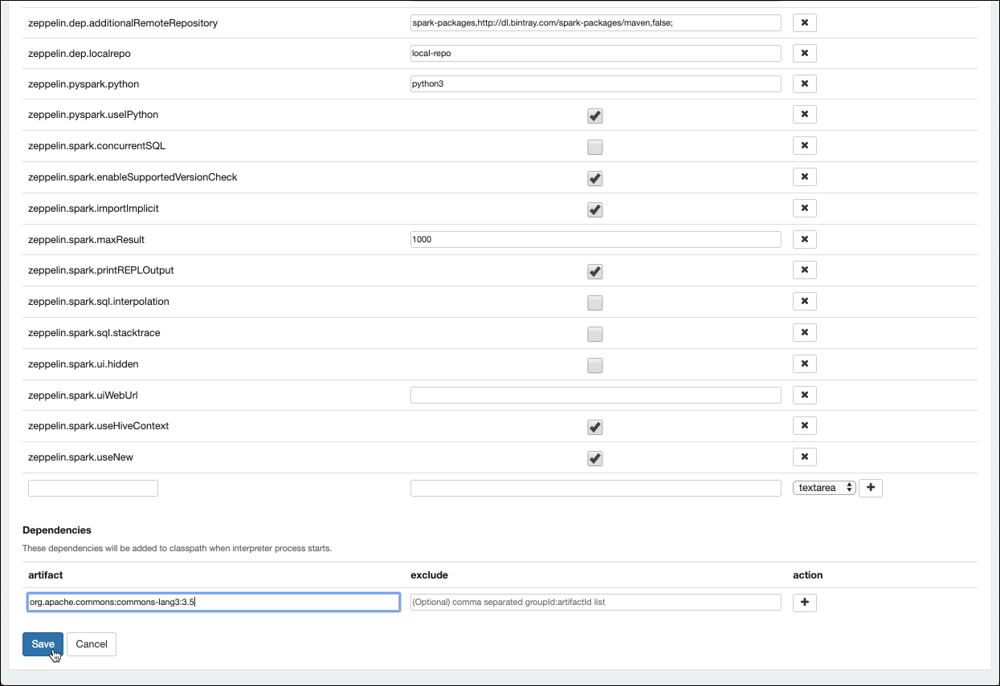
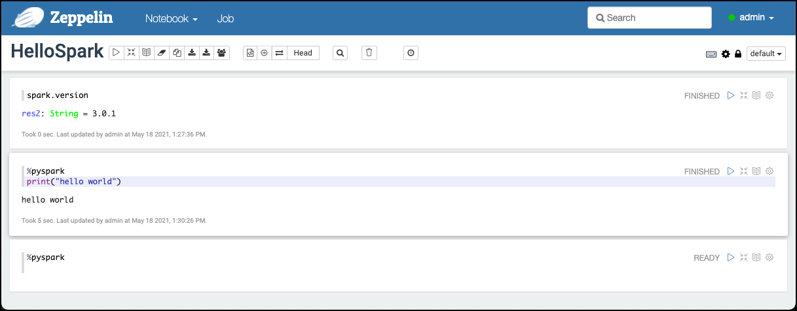

# Getting Started using Spark RDD and DataFrames

## Introduction

In this workshop we will work with [Apache Spark](https://spark.apache.org/) and implement some basic operations using the Spark DataFrame API for Python. 

We assume that the **Data platform** described [here](../01-environment) is running and accessible. 

##	 Accessing Spark

[Apache Spark](https://spark.apache.org/) is a fast, in-memory data processing engine with elegant and expressive development APIs in Scala, Java, and Python that allow data workers to efficiently execute machine learning algorithms that require fast iterative access to datasets. Spark on Apache Hadoop YARN enables deep integration with Hadoop and other YARN enabled workloads in the enterprise.

You can run batch application such as MapReduce types jobs or iterative algorithms that build upon each other. You can also run interactive queries and process streaming data with your application. Spark also provides a number of libraries which you can easily use to expand beyond the basic Spark capabilities such as Machine Learning algorithms, SQL, streaming, and graph processing. Spark runs on Hadoop clusters such as Hadoop YARN or Kubernetes, or even in a Standalone Mode with its own scheduler.

There are various ways for accessing Spark

 * **PySpark** - accessing Hive from the command line
 * **Apache Zeppelin** - a browser based GUI for working with various tools of the Big Data ecosystem
 * **Jupyter** - a browser based GUI for working with a Python and Spark

There is also the option to use **Thrift Server** to execute Spark SQL from any tool supporting SQL. But this is not covered in this workshop.

### Using the Python API through PySpark

The [PySpark API](https://spark.apache.org/docs/latest/api/python/index.html) allows us to work with Spark through the command line. 

In our environment, PySpark is accessible inside the `spark-master` container. To start PySpark use the `pyspark` command. 

```
docker exec -ti spark-master pyspark
```

and you should end up on the **pyspark** command prompt `>>>` as shown below

```
bigdata@bigdata:~$ docker exec -ti spark-master pyspark

Python 2.7.16 (default, Jan 14 2020, 07:22:06)
[GCC 8.3.0] on linux2
Type "help", "copyright", "credits" or "license" for more information.
Setting default log level to "WARN".
To adjust logging level use sc.setLogLevel(newLevel). For SparkR, use setLogLevel(newLevel).
Welcome to
      ____              __
     / __/__  ___ _____/ /__
    _\ \/ _ \/ _ `/ __/  '_/
   /__ / .__/\_,_/_/ /_/\_\   version 2.4.5
      /_/

Using Python version 2.7.16 (default, Jan 14 2020 07:22:06)
SparkSession available as 'spark'.
>>>
```

You have an active `SparkSession` available as the `spark` variable. Enter any valid command, just to test we can ask Spark for the version which is installed. 

```
>>> spark.version
u'2.4.5'
```

You can use `pyspark` for this workshop. But there are also two other, browser-based tools which are much more comfortable to use and which additionally allow to store the different steps as a notebook for later re-use. 

### Using Apache Zeppelin

In a browser window, navigate to <http://dataplatform:28080> and you should see the Apache Zeppelin homepage. Click on **Login** and use `admin` as the **User Name** and `abc123!` as the **Password** and click on **Login**. 

First let's finish the configuration of the Spark Interpreter. Click on the **admin** drop-down menu and select **Interpreter**


On the **Interpreters** page, navigate to the **Spark** interpreter. You can also enter `spark` into the search edit field and **Interpreters** will be filtered down to only one single item. 


Click on **edit** to change the configuration. 

Navigate to the **Properties** section and enter `1` into the **spark.cores.max** field and `8g` into the **spark.executor.memory** field. 


Then scroll all the way down to the bottom of the settings where you can see a **Dependency** section. Enter `org.apache.commons:commons-lang3:3.5` into the edit field below **artifact** and click **Save**



When asked to restart the interpreter, click **OK**. 

Now let's create a new Notebook to perform some Spark actions. Navigate back to the Zeppelin homepage and click on the **Create new note** link. 

Enter `HelloSpark` into the **Note Name** field and leave the **Default Interpreter** set to **spark** and click **Create**. 

You should be brought forward to an empty notebook with an empty paragraph. Again let's use the `spark.version` command by adding it to the empty cell and hit **Shift** + **Enter** to execute the statement.  


By default the Spark Zeppelin interpreter will be using the Scala API. To switch to the Python API, use the following directive `%pyspark` at the beginning of the cell. This will be the new default for the interpreter



Zeppelin allows for mixing different interpreters in one and the same Notebook, whereas one interpreter always being the default (the one chosen when creating the notebook, **spark** in our case). 

You can use the `%sh` interpreter to perform shell actions. We can use it for example to perform a hadoop filesystem action using the `hadoop fs` command (if you have HDFS running) or an `s3cmd` to perform an action on Object Storage, if MinIO is running. 

#### Working with HDFS (if installed)

For example to list the files in the `/user/hue/` folder on HDFS, we can perform the following command

```
%sh
hadoop fs -ls hdfs://namenode:9000/user/hue 
```

**Note**: the shell will be executed inside the `zeppelin` container. Therefore to work with HDFS, we have to provide a full HDFS link. 


#### Working with MinIO (if installed)

To list all the objects within the `flight-bucket`

```
%sh
s3cmd ls -r s3://flight-bucket
```

You can use Apache Zeppelin to perform the workshop below. The other option is to use **Jupyter**. 

### Using Jupyter

In a browser window navigate to <http://dataplatform:28888>. 
Enter `abc123!` into the **Password or token** field and click **Log in**. 

You should be forwarded to the **Jupyter** homepage. Click on the **Python 3** icon in the **Notebook** section to create a new notebook using the **Python 3** kernel.


  
You will be forwarded to an empty notebook with a first empty cell. 

Here you can enter your commands. In contrast to **Apache Zeppelin**, we don't have an active Spark Session at hand. We first have to create one. 

Add the following code to the first cell

```
import os
# make sure pyspark tells workers to use python3 not 2 if both are installed
#os.environ['PYSPARK_PYTHON'] = '/usr/bin/python3'

import pyspark
conf = pyspark.SparkConf()

# point to mesos master or zookeeper entry (e.g., zk://10.10.10.10:2181/mesos)
conf.setMaster("spark://spark-master:7077")

# set other options as desired
conf.set("spark.executor.memory", "8g")
conf.set("spark.executor.cores", "1")
conf.set("spark.core.connection.ack.wait.timeout", "1200")

from pyspark.sql import SparkSession
spark = SparkSession.builder.appName('abc').config(conf=conf).getOrCreate()
sc = spark.sparkContext
```

and execute it by entering **Shift** + **Enter**. 

If you check the code you can see that we connect to the Spark Master and get a session on the "spark cluster", available through the `spark` variable. The Spark Context is available as variable `sc`.

First execute `spark.version` in another shell to show the Spark version in place. 

Also execute a python command `print ("hello")` just to see that you are executing python. 


You can use Jupyter to perform the workshop. 


## Working with Spark Resilient Distributed Datasets (RDDs)

Spark’s primary core abstraction is called a **Resilient Distributed Dataset** or **RDD**. 

It is a distributed collection of elements that is parallelised across the cluster. In other words, a RDD is an immutable collection of objects that is partitioned and distributed across multiple physical nodes of a YARN cluster and that can be operated in parallel.

There are three methods for creating a RDD:

 1. Parallelise an existing collection. This means that the data already resides within Spark and can now be operated on in parallel. 
 * Create a RDD by referencing a dataset. This dataset can come from any storage source supported by Hadoop such as HDFS, Cassandra, HBase etc.
 * Create a RDD by transforming an existing RDD to create a new RDD.

We will be using the later two methods in this workshop.

First let's upload the data needed for this workshop, using the techniques we have learned in the [HDFS Workshop](../02-hdfs/README.md) when working with HDFS or [Working with MinIO Object Storage](../03-object-storage/README.md) when working with MinIO Object Storage.

### Upload Raw Data to HDFS

In the RDD workshop we are working with text data.

In HDFS under folder `/user/hue` create a new folder `wordcount` and upload the two files into that folder. 

Here are the commands to perform when using the **Hadoop Filesystem Command** on the command line

```
docker exec -ti namenode hadoop fs -mkdir -p /user/hue/wordcount/

docker exec -ti namenode hadoop fs -copyFromLocal /data-transfer/wordcount/big.txt /user/hue/wordcount/

docker exec -ti namenode hadoop fs -ls /user/hue/wordcount/
```

Of course you can also use **Hue** to upload the data as we have learned in the [HDFS Workshop](../02-hdfs/README.md).

### Upload Raw Data to MinIO

First create a bucket for the data

```
docker exec -ti awscli s3cmd mb s3://wordcount-bucket
```

And then copy the `big.txt` into the new bucket 

```
docker exec -ti awscli s3cmd put /data-transfer/wordcount/big.txt s3://wordcount-bucket/raw-data/
```

Now with the data either available in HDFS or MinIO, let's use the data using Spark RDDs.

### Implement Wordcount using Spark Python API

In this section we will see how Word Count can be implemented using the Spark Python API.

You can use either one of the three different ways described above to access the Spark Python environment. 

Just copy and paste the commands either into the **PySpark** command line or into the paragraphs in **Zeppelin** or **Jupyter**. In Zeppelin you have to switch to Python interpreter by using the following directive `%spark.pyspark` on each paragraph.

In **Jupyter** make sure to get the connection to spark using the script shown before. 

For data in HDFS, perform

```
lines = sc.textFile("hdfs://namenode:9000/user/hue/wordcount/big.txt")
```

and if data is in MinIO object storage, perform

```
lines = sc.textFile("s3a://wordcount-bucket/raw-data/big.txt")
```

Split the line into words and flat map it

```
words = lines.flatMap(lambda line: line.split(" "))
```

Reduce by key to get the counts by word and number

```
counts = words.map(lambda word: (word,1)).reduceByKey(lambda a, b : a + b)
```

Save the counts to a file on HDFS (in folder output) or on MinIO object storage. 

This is an action and will start execution on Spark. Make sure to remove the output folder in case it already exists

to write to HDFS:

```
counts.saveAsTextFile("hdfs://namenode:9000/user/hue/wordcount/result")
```
to write to MinIO object storage:

```
counts.saveAsTextFile("s3a://wordcount-bucket/result-data")
```

To view the number of distinct values in counts.

```
counts.count()
```

To check the results in HDFS or MinIO, perform the following commands. 

For HDFS, do an ls and a cat to display the content: 

```
docker exec -ti namenode hadoop fs -ls hdfs://namenode:9000/user/hue/wordcount/result

docker exec -ti namenode hadoop fs -cat hdfs://namenode:9000/user/hue/wordcount/result/part-00000 | more
```

For MinIO object storage, do an ls to see the result and use the MinIO browser to download the object to the local machine.

```
docker exec -ti awscli s3cmd ls -r s3://wordcount-bucket/result-data
```

This finishes this simple Python implementation of the word count in Spark using Spark's Resilient Distributed Datasets (RDD).
 
## Working with Spark DataFrames

The data needed here has been uploaded to MinIO in the Working with RDD section. 

You can use either one of the three different ways described above to access the Spark Python environment. 

For Zeppelin you can find a complete Notebook under the zeppelin folder. 

The following statements assume that they are used from within Zeppelin, that's why you find the `%pyspark` directives: 

First let's see the `spark.read`method, which is part of the DataFrameReader, which the following statement shows:

```
%pyspark
spark.read
```

We can easily display the methods it eposes, such as `text()`, `json()` and many others:

```
%pyspark
dir (spark.read)
```
in this workshop we will be using the `text()` operation. 

Let's start by reading the data from object storage into a `bookDF` DataFrame:

```
%pyspark
bookDF = spark.read.text("s3a://wordcount-bucket/raw-data/big.txt")
bookDF
```

A DataFrame with a single value of type string is returned.

We can easily display the schema in a more readable way:

```
%pyspark
bookDF.printSchema()
```

To display the data behind the DataFrame, we can use the `show()` method. If used without any parameters, by default a maximum of 20 rows is shown. 

```
%pyspark
bookDF.show()
```

We can also change it to `10` records and truncate them to 50 characters:

```
%pyspark
bookDF.show(10, truncate=50)
```

Next we tokenize each word, by splitting on a single space character, return a list of words:

```
%pyspark
from pyspark.sql.functions import split

linesDF = bookDF.select(split(bookDF.value, " ").alias("line"))
linesDF.show(5)
```

the result will look similar to the one below

```
+--------------------+
|                line|
+--------------------+
|[The, Project, Gu...|
|[by, Sir, Arthur,...|
|[(#15, in, our, s...|
|                  []|
|[Copyright, laws,...|
+--------------------+
only showing top 5 rows
```

Using the `bookDF.value` we are able to select a specific column out from the DataFrame. There are alternative approaches, as shown next. They all get the same result:

```
%pyspark
from pyspark.sql.functions import col

bookDF.select(bookDF.value) 
bookDF.select(bookDF["value"]) 
bookDF.select(col("value"))
```

Print the schema and we can see that a line is an array of string elements, i.e. the single words

```
%pyspark
linesDF.printSchema()
```

Not let's reshape the result by exploding the array of words into rows of words. We again show the result using the `show()` method.

```
from pyspark.sql.functions import explode, col

wordsDF = linesDF.select(explode(col("line")).alias("word"))
wordsDF.show(15)
```

With the table of words, we next use the `lower` function to change the case to all lowercase. 

```
%pyspark
from pyspark.sql.functions import lower 
wordsLowerDF = wordsDF.select(lower(col("word")).alias("word_lower"))

wordsLowerDF.show()
```

Now using `regexp_extract()` function we make sure that only words are kept (only letters a - z). 

```
%pyspark
from pyspark.sql.functions import regexp_extract 
wordsCleanDF = wordsLowerDF.select( regexp_extract(col("word_lower"), "[a-z]*", 0).alias("word") )

wordsCleanDF.show()
```

Next let's remove empty words, by just applying a `where` operation:

```
%pyspark
wordsNonNullDF = wordsCleanDF.where(col("word") != "")

wordsNonNullDF.show()
```

With that we are finally ready to group by word and return the count by word

```
%pyspark
resultsDF = wordsNonNullDF.groupby(col("word")).count()
resultsDF
```

Finally we order the counts in descending order and only show the top 10 word counts

```
%pyspark
resultsDF.orderBy("count", ascending=False).show(10)
```
