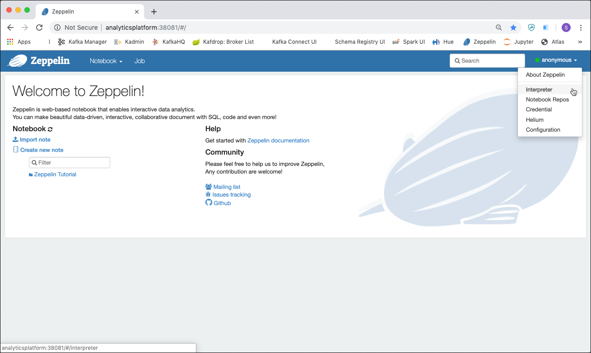
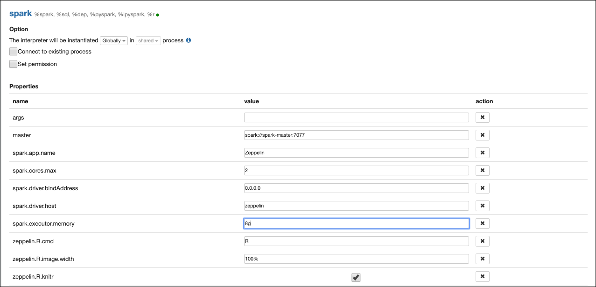
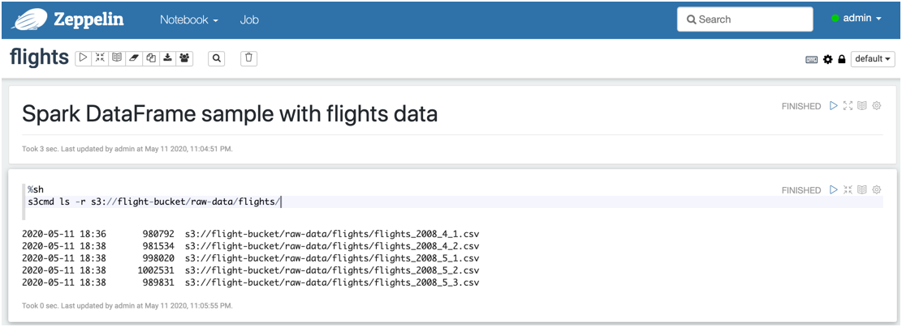
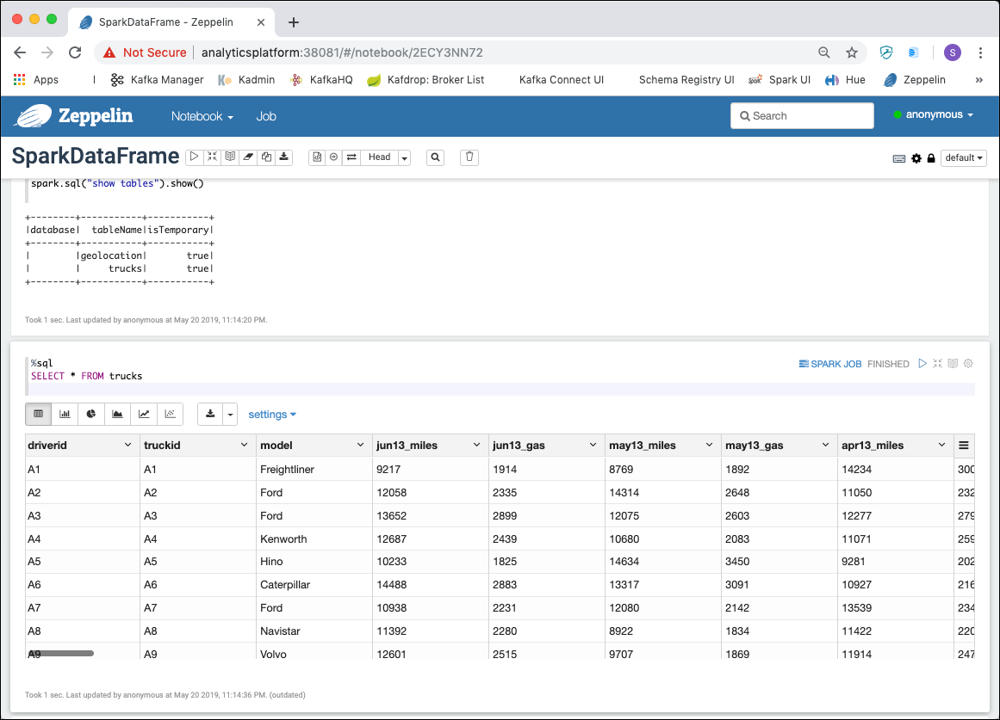

# Data Manipulation with Spark

## Introduction

In this workshop we will work with [Apache Spark](https://spark.apache.org/) and implement some basic operations using the Spark DataFrame API for Python. 

We assume that the **Analytics platform** described [here](../01-environment) is running and accessible. 

The same data as in the [Hive Workshop](../04-hive/README.md) will be used. 

##	 Accessing Spark

[Apache Spark](https://spark.apache.org/) is a fast, in-memory data processing engine with elegant and expressive development APIs in Scala, Java, and Python that allow data workers to efficiently execute machine learning algorithms that require fast iterative access to datasets. Spark on Apache Hadoop YARN enables deep integration with Hadoop and other YARN enabled workloads in the enterprise.

You can run batch application such as MapReduce types jobs or iterative algorithms that build upon each other. You can also run interactive queries and process streaming data with your application. Spark also provides a number of libraries which you can easily use to expand beyond the basic Spark capabilities such as Machine Learning algorithms, SQL, streaming, and graph processing. Spark runs on Hadoop clusters such as Hadoop YARN or Apache Mesos, or even in a Standalone Mode with its own scheduler.

There are various ways for accessing Spark

 * **PySpark** - accessing Hive from the commandline
 * **Apache Zeppelin** - a browser based GUI for working with various tools of the Big Data ecosystem
 * **Jupyter** - a browser based GUI for working with a Python and Spark

There is also the option to use **Thrift Server** to execute Spark SQL from any tool supporting SQL. But this is not covered in this workshop.

### Using the Python API through PySpark

The [PySpark API](https://spark.apache.org/docs/latest/api/python/index.html) allows us to work with Spark through the command line. 

In our environment, PySpark is accessible inside the `spark-master` container. To start PySpark use the `pyspark` command. 

```
docker exec -ti spark-master pyspark
```

and you should end up on the **pyspark** command prompt `>>>` as shown below

```
bigdata@bigdata:~$ docker exec -ti spark-master pyspark

Python 2.7.16 (default, Jan 14 2020, 07:22:06)
[GCC 8.3.0] on linux2
Type "help", "copyright", "credits" or "license" for more information.
Setting default log level to "WARN".
To adjust logging level use sc.setLogLevel(newLevel). For SparkR, use setLogLevel(newLevel).
Welcome to
      ____              __
     / __/__  ___ _____/ /__
    _\ \/ _ \/ _ `/ __/  '_/
   /__ / .__/\_,_/_/ /_/\_\   version 2.4.5
      /_/

Using Python version 2.7.16 (default, Jan 14 2020 07:22:06)
SparkSession available as 'spark'.
>>>
```

You have an active `SparkSession` available as the `spark` variable. Enter any valid command, just to test we can ask Spark for the version which is installed. 

```
>>> spark.version
u'2.4.5'
```

You can use `pyspark` for this workshop. But there are also two other, browser-based tools which are much more comfortable to use and which additionally allow to store the different steps as a notebook for later re-use. 

### Using Apache Zeppelin

In a browser window, navigate to <http://dataplatform:28080> and you should see the Apache Zeppelin homepage. 

First let's finish the configuration of the Spark Interpreter. Click on the **anonymous** drop-down menu and select **Interpreter**



On the **Interpreters** page, navigate to the **Spark** interpreter. You can also enter `spark` into the search edit field and **Interpreters** will be filtered down to only one single item. 


Click on **edit** to change the configuration. 

Navigate to the **Properties** section and enter `1` into the **spark.cores.max** field and `8g` into the **spark.executor.memory** field. 



Then scroll all the way down to the bottom of the settings where you can see a **Dependency** section. Enter `org.apache.commons:commons-lang3:3.5` into the edit field below **artifact** and click **Save**


When asked to restart the interpreter, click **OK**. 

Now let's create a new Notebook to perform some Spark actions. Navigate back to the Zeppelin homepage and click on the **Create new note** link. 

Enter `HelloSpark` into the **Note Name** field and leave the **Default Interpreter** set to **spark** and click **Create**. 

You should be brought forward to an empty notebook with an empty paragraph. Again let's use the `spark.version` command by adding it to the empty cell and hit **Shift** + **Enter** to execute the statement.  


By default the Spark Zeppelin interpreter will be using the Scala API. To switch to the Python API, use the following directive `%spark.pyspark` at the beginning of the cell. This will be the new default for the interpreter


Zeppelin allows for mixing different interpreters in one and the same Notebook, whereas one interpreter always being the default (the one chosen when creating the notebook, **spark** in our case). 

You can use the `%sh` interpreter to perform shell actions. We can use it for example to perform a hadoop filesystem action using the `hadoop fs` command (if you have HDFS running) or an `s3cmd` to perform an action on Object Storage, if MinIO is running. 

#### Working with HDFS (if installed)

For example to list the files in the `/user/hue/` folder on HDFS, we can perform the following command

```
%sh
hadoop fs -ls hdfs://namenode:9000/user/hue 
```

**Note**: the shell will be executed inside the `zeppelin` container. Therefore to work with HDFS, we have to provide a full HDFS link. 


#### Working with MinIO (if installed)

To list all the objects within the `flight-bucket

```
%sh
s3cmd ls -r s3://flight-bucket
```

You can use Apache Zeppelin to perform the workshop below. The other option is to use **Jupyter**. 

### Using Jupyter

In a browser window navigate to <http://dataplatform:28888>. 
Enter `abc123` into the **Password or token** field and click **Log in**. 

You should be forwarded to the **Jupyter** homepage. Click on the **Python 3** icon in the **Notebook** section to create a new notebook using the **Python 3** kernel.


  
You will be forwarded to an empty notebook with a first empty cell. 

Here you can enter your commands. In contrast to **Apache Zeppelin**, we don't have an active Spark Session at hand. We first have to create one. 

Add the following code to the first cell

```
import os
# make sure pyspark tells workers to use python3 not 2 if both are installed
#os.environ['PYSPARK_PYTHON'] = '/usr/bin/python3'

import pyspark
conf = pyspark.SparkConf()

# point to mesos master or zookeeper entry (e.g., zk://10.10.10.10:2181/mesos)
conf.setMaster("spark://spark-master:7077")

# set other options as desired
conf.set("spark.executor.memory", "8g")
conf.set("spark.executor.cores", "1")
conf.set("spark.core.connection.ack.wait.timeout", "1200")

from pyspark.sql import SparkSession
spark = SparkSession.builder.appName('abc').config(conf=conf).getOrCreate()
sc = spark.sparkContext
```

and execute it by entering **Shift** + **Enter**. 

If you check the code you can see that we connect to the Spark Master and get a session on the "spark cluster", available through the `spark` variable. The Spark Context is available as variable `sc`.

First execute `spark.version` in another shell to show the Spark version in place. 

Also execute a python command `print ("hello")` just to see that you are executing python. 


You can use Jupyter to perform the workshop. 


## Working with Spark Resilient Distributed Datasets (RDDs)

Spark’s primary core abstraction is called a **Resilient Distributed Dataset** or **RDD**. 

It is a distributed collection of elements that is parallelised across the cluster. In other words, a RDD is an immutable collection of objects that is partitioned and distributed across multiple physical nodes of a YARN cluster and that can be operated in parallel.

There are three methods for creating a RDD:

 1. Parallelise an existing collection. This means that the data already resides within Spark and can now be operated on in parallel. 
 * Create a RDD by referencing a dataset. This dataset can come from any storage source supported by Hadoop such as HDFS, Cassandra, HBase etc.
 * Create a RDD by transforming an existing RDD to create a new RDD.

We will be using the later two methods in this workshop.

First let's upload the data needed for this workshop, using the techniques we have learned in the [HDFS Workshop](../02-hdfs/README.md) when working with HDFS or [Working with MinIO Object Storage](../03-object-storage/README.md) when working with MinIO Object Storage.

The raw data can be downloaded 

### Upload Raw Data to HDFS

In the RDD workshop we are working with text data.

In HDFS under folder `/user/hue` create a new folder `wordcount` and upload the two files into that folder. 

Here are the commands to perform when using the **Hadoop Filesystem Command** on the command line

```
docker exec -ti namenode hadoop fs -mkdir -p /user/hue/wordcount/

docker exec -ti namenode hadoop fs -copyFromLocal /data-transfer/wordcount/big.txt /user/hue/wordcount/

docker exec -ti namenode hadoop fs -ls /user/hue/wordcount/
```

Of course you can also use **Hue** to upload the data as we have learned in the [HDFS Workshop](../02-hdfs/README.md).

### Upload Raw Data to MinIO

First create a bucket for the data

```
docker exec -ti awscli s3cmd mb s3://wordcount-bucket
```

And then copy the `big.txt` into the new bucket 

```
docker exec -ti awscli s3cmd put /data-transfer/wordcount/big.txt s3://wordcount-bucket/raw-data/
```

Now the data is either available in HDFS or MinIO, depending on your environment. Next we will work with the data from Spark RDDs.

### Implement Wordcount using Spark Python API

In this section we will see how Word Count can be implemented using the Spark Python API.

You can use either one of the three different ways described above to access the Spark Python environment. 

Just copy and paste the commands either into the **PySpark** command line or into the paragraphs in **Zeppelin** or **Jupyter**. In Zeppelin you have to switch to Python interpreter by using the following directive `%spark.pyspark` on each paragraph.

In **Jupyter** make sure to get the connection to spark using the script shown before. 

For data in HDFS, perform

```
lines = sc.textFile("hdfs://namenode:9000/user/hue/wordcount/big.txt")
```

and if data is in MinIO object storage, perform

```
lines = sc.textFile("s3a://wordcount-bucket/raw-data/big.txt")
```

Split the line into words and flat map it

```
words = lines.flatMap(lambda line: line.split(" "))
```

Reduce by key to get the counts by word and number

```
counts = words.map(lambda word: (word,1)).reduceByKey(lambda a, b : a + b)
```

Save the counts to a file on HDFS (in folder output) or on MinIO object storage. 

This is an action and will start execution on Spark. Make sure to remove the output folder in case it already exists

to write to HDFS:

```
counts.saveAsTextFile("hdfs://namenode:9000/user/hue/wordcount/result")
```
to write to MinIO object storage:

```
counts.saveAsTextFile("s3a://wordcount-bucket/result-data")
```

To view the number of distinct values in counts.

```
counts.count()
```

To check the results in HDFS or MinIO, perform the following commands. 

For HDFS, do an ls and a cat to display the content: 

```
docker exec -ti namenode hadoop fs -ls hdfs://namenode:9000/user/hue/wordcount/result

docker exec -ti namenode hadoop fs -cat hdfs://namenode:9000/user/hue/wordcount/result/part-00000 | more
```

For MinIO object storage, do an ls to see the result and use the MinIO browser to download the object to the local machine.

```
docker exec -ti awscli s3cmd ls -r s3://wordcount-bucket/result-data
```

This finishes the simple Python implementation of the word count in Spark.
 
## Working with Apache Spark Data Frames

The data needed here has been uploaded to MinIO in workshop 03-object-storage. If there are already loaded, you can skip the next section "(Re-)Upload Raw Data from Workshop 03".
 
### (Re-)Upload Raw Data from Workshop 03

In this workshop we are working with flight data. The files are available in the `data-transfer` folder. 

Airports:

```
docker exec -ti awscli s3cmd put /data-transfer/flight-data/airports.csv s3://flight-bucket/raw-data/airports/airports.csv
```

Plane-Data:

```
docker exec -ti awscli s3cmd put /data-transfer/flight-data/plane-data.csv s3://flight-bucket/raw-data/planes/plane-data.csv
```

Carriers:

```
docker exec -ti awscli s3cmd put /data-transfer/flight-data/carriers.json s3://flight-bucket/raw-data/carriers/carriers.json
```

Flights:

```
docker exec -ti awscli s3cmd put /data-transfer/flight-data/flights-small/flights_2008_4_1.csv s3://flight-bucket/raw-data/flights/

docker exec -ti awscli s3cmd put /data-transfer/flight-data/flights-small/flights_2008_4_2.csv s3://flight-bucket/raw-data/flights/

docker exec -ti awscli s3cmd put /data-transfer/flight-data/flights-small/flights_2008_5_1.csv s3://flight-bucket/raw-data/flights/

docker exec -ti awscli s3cmd put /data-transfer/flight-data/flights-small/flights_2008_5_2.csv s3://flight-bucket/raw-data/flights/

docker exec -ti awscli s3cmd put /data-transfer/flight-data/flights-small/flights_2008_5_3.csv s3://flight-bucket/raw-data/flights/
```

### Working with Flighs data using Spark DataFrames

For this workshop we will be using Zeppelin discussed above. 

But you can easily adapt it to use either **PySpark** or **Apache Jupyter**.

In a browser window, navigate to <http://dataplatform:28080> and make sure that you configure the **Spark** Interpreter as discussed above.

Now let's create a new notebook by clicking on the **Create new note** link and set the **Note Name** to `SparkDataFrame` and set the **Default Interpreter** to `spark`. 

Click on **Create Note** and a new Notebook is created with one cell which is empty. 

#### Add some Markdown first

Navigate to the first cell and start with a title. By using the `%md` directive we can switch to the Markdown interpreter, which can be used for displaying static text.

```
%md # Spark DataFrame sample with flights data
```

Click on the **>** symbol on the right or enter **Shift** + **Enter** to run the paragraph.

The markdown code should now be rendered as a Heading-1 title.

#### Working with Airports Data

First add another title, this time as a Heading-2.

```
%md ## Working with the Airport data
```

Now let's work with the Airports data, which we have uploaded to `s3://flight-bucket/raw-data/airports/`. Let's see the data by performing an `%sh` directive

```
%sh
s3cmd ls -r s3://flight-bucket/raw-data/airports/
```

We can see that there is one file for the airports data.


Now let’s start using some code. First we have to import the spark python API. 

```
%pyspark
from pyspark.sql.types import *
```

Next let’s import the flights data into a DataFrame and show the first 5 rows. We use header=true to use the header line for naming the columns and specify to infer the schema.  

```
%pyspark
airportsRawDF = spark.read.csv("s3a://flight-bucket/raw-data/airports", 
    	sep=",", inferSchema="true", header="true")
airportsRawDF.show(5)
```

The output will show the header line followed by the 5 data lines.


Now let’s display the schema, which has been derived from the data:

```	
%pyspark
airportsRawDF.printSchema()
```

You can see that both string as well as double datatypes have been used and that the names of the columns are derived from the header row of the CSV file. 

```
root
 |-- iata: string (nullable = true)
 |-- airport: string (nullable = true)
 |-- city: string (nullable = true)
 |-- state: string (nullable = true)
 |-- country: string (nullable = true)
 |-- lat: double (nullable = true)
 |-- long: double (nullable = true)
``` 
 
Next let’s ask for the total number of rows in the dataset. Should return a total of **3376**. 

```
%pyspark
airportsRawDF.count()
```
 
#### Working with Flights Data

First add another title, this time as a Heading-2.

```
%md ## Working with the Flights data
```

Let’s now start working with the Flights data, which we have uploaded with the various files within the `s3://flight-bucket/raw-data/flights/`.

Navigate to the first cell and start with a title. By using the `%md` directive we can switch to the Markdown interpreter, which can be used for displaying static text.
 
Make sure that the data is in the right place. You can use the directive `%sh` to execute a shell action.

```
%sh
s3cmd ls -r s3://flight-bucket/raw-data/flights/
```

You should see the five files inside the `flights` folder



The CSV files in this case do not contain a header line, therefore we can not use the same technique as before with the airports and derive the schema from the header. 

We first have to manually define a schema. One way is to use a DSL as shown in the next code block. 

```
%pyspark
flightSchema = """`year` INTEGER, `month` INTEGER, `dayOfMonth` INTEGER,  `dayOfWeek` INTEGER, `depTime` INTEGER, `crsDepTime` INTEGER, `arrTime` INTEGER, `crsArrTime` INTEGER, `uniqueCarrier` STRING, `flightNum` STRING, `tailNum` STRING, `actualElapsedTime` INTEGER,
                   `crsElapsedTime` INTEGER, `airTime` INTEGER, `arrDelay` INTEGER,`depDelay` INTEGER,`origin` STRING, `dest` STRING, `distance` INTEGER, `taxiIn` INTEGER, `taxiOut` INTEGER, `cancelled` STRING, `cancellationCode` STRING, `diverted` STRING, 
                   `carrierDelay` STRING, `weatherDelay` STRING, `nasDelay` STRING, `securityDelay` STRING, `lateAircraftDelay` STRING"""
```

Now we can import the flights data into a DataFrame using this schema and show the first 5 rows. 

We use  to use the header line for naming the columns and specify to infer the schema. We specify `schema=fligthSchema` to use the schema from above.  

```
%pyspark
flightsRawDF = spark.read.csv("s3a://flight-bucket/raw-data/flights", 
    	sep=",", inferSchema="false", header="false", schema=flightSchema)
flightsRawDF.show(5)
```
	
The output will show the header line followed by the 5 data lines.


Let’s also see the schema, which is not very surprising

```	
%pyspark
flightsRawDF.printSchema()
```

The result should be a rather large schema only shown here partially. You can see that both string as well as integer datatypes have been used and that the names of the columns are derived from the header row of the CSV file. 

```
root
 |-- year: integer (nullable = true)
 |-- month: integer (nullable = true)
 |-- dayOfMonth: integer (nullable = true)
 |-- dayOfWeek: integer (nullable = true)
 |-- depTime: integer (nullable = true)
 |-- crsDepTime: integer (nullable = true)
 |-- arrTime: integer (nullable = true)
 |-- crsArrTime: integer (nullable = true)
 |-- uniqueCarrier: string (nullable = true)
 |-- flightNum: string (nullable = true)
 |-- tailNum: string (nullable = true)
 |-- actualElapsedTime: integer (nullable = true)
 |-- crsElapsedTime: integer (nullable = true)
 |-- airTime: integer (nullable = true)
 |-- arrDelay: integer (nullable = true)
 |-- depDelay: integer (nullable = true)
 |-- origin: string (nullable = true)
 |-- dest: string (nullable = true)
 |-- distance: integer (nullable = true)
 |-- taxiIn: integer (nullable = true)
 |-- taxiOut: integer (nullable = true)
 |-- cancelled: string (nullable = true)
 |-- cancellationCode: string (nullable = true)
 |-- diverted: string (nullable = true)
 |-- carrierDelay: string (nullable = true)
 |-- weatherDelay: string (nullable = true)
 |-- nasDelay: string (nullable = true)
 |-- securityDelay: string (nullable = true)
 |-- lateAircraftDelay: string (nullable = true)
```
	
Next let’s ask for the total number of rows in the dataset. Should return **50'000**. 

```
%pyspark
flightsRawDF.count()
```
	
You can also transform data easily into another format, just by writing the DataFrame out to a new file or object. 

Let’s create a JSON representation of the data. We will write it to a refined folder. 

For HDFS:

```
%pyspark
flightsRawDF.write.json("hdfs://namenode:9000/user/hue/truckdata/truck.json")
```
	
For MinIO:

```
%pyspark
flightsRawDF.write.json("s3a://flight-bucket/refined-data/flights/flights.json")
```
	
	
Should you want to execute it a 2nd time, then you first have to delete the folder truck-json, otherwise the 2nd execution will throw an error. You can directly execute the remove from within Zeppelin, using the `%sh` directive. 

```
%sh
hadoop fs -rm -R hdfs://namenode:9000/user/hue/truckdata/truck.json
```
	
By now we have imported the truck data and made it available as the `trucksRawDF` Data Frame. We will use that data frame again later. 

Additionally we have also stored the data to a file in json format. 

### Working with the data using Spark SQL

Now we also have the geolocation available in the DataFrame. Let’s work with it using SQL. 

Add some markdown to start the new section

```
%md ## Let's use some SQL to work with the data
```

To use the data in a SQL statement, we can register the DataFrame as a temporary view. 

```
%pyspark
trucksRawDF.createOrReplaceTempView("trucks")
geolocationRawDF.createOrReplaceTempView("geolocation")
```

Temporary views in Spark SQL are session-scoped and will disappear if the session that creates it terminates. If you want to have a temporary view that is shared among all sessions and keep alive until the Spark application terminates, you can create a global temporary view. So instead of the above, you could also do

```
%pyspark
trucksRawDF.createGlobalTempView("trucks")
geolocationRawDF.createGlobalTempView("geolocation")
```

Global temporary view is tied to a system preserved database `global_temp`, and we must use the qualified name to refer it, e.g. SELECT * FROM `global_temp.geolocation`.


We can always ask for the table registered by executing the show tables SQL command.

```
%pyspark
spark.sql("show tables").show()
```

With the tables in place, we can execute SQL directly from a cell, by using the `%sql` directive. 

```
%sql
SELECT * FROM trucks
```

When executing such a cell, the output is shown in the nice grid view as shown in the screenshot below. 



This is very helpful for testing various versions of a SQL statement, until you are sure about the result. It's not just easier to work and refine the SQL statement, is also much easier to interpret the result, compared to the method of using `show()` on the data frame.

```
%pyspark 
spark.sql("SELECT * FROM trucks").show()
```

Play with some different statements on `geolocation`. Let's start with just showing the data

```
%sql
SELECT * FROM geolocation
```

With the result of the `geolocation` table, you will also get an error message saying that the output has been truncated to 1000 rows. 

You can also control this behaviour using the `LIMIT` clause of SQL

```
%sql
SELECT * FROM geolocation
LIMIT 10
```

To restrict on a given column value, just use the `WHERE` clause of SQL

```
%sql
SELECT * FROM geolocation WHERE event != 'normal'
```

Of course you can also to some more complex operations, i.e using `GROUP BY` with an aggregation operator (`COUNT` in this case):

```
%sql
SELECT driverid, COUNT(*) FROM geolocation 
WHERE event != 'normal'
GROUP BY driverid
ORDER BY COUNT(*) DESC
LIMIT 5
```

We have seen that we can register a DataFrame as a table and then use these tables directly in SQL. But the result of the SQL is “only” shown on the notebook. 

If we want to make use of SQL inside Spark, we can use the result of a SQL query to populate a new DataFrame. We can just take a statement we have previously tested using the `%sql` directive and execute it with a `spark.sql()` command. Using triple double-quotes allows us to specify the SQL over multiple lines, which allow a copy-paste from the version tested above.

```
%pyspark
unsafeDrivingDF = spark.sql("""
	                SELECT driverid, COUNT(*) occurance 
	                FROM geolocation WHERE event != 'normal'
	                GROUP BY driverid
	                ORDER BY COUNT(*) DESC
	                        """)
unsafeDrivingDF.show()
```

Again register the result as a temporary view named `unsafe_driving`

```
%pyspark
unsafeDrivingDF.createOrReplaceTempView("unsafe_driving")
```

### Transform the data using Spark SQL

Now let’s use that technique to do some restructuring (transformation) of the data. 

Again let’s name that section of the notebook, using some markdown. 

```
%md ## Restructure the Trucks data
```

We will use the same statement as with the Hive workshop to unpivot the data, so that the different values by month are no longer in one result line per driver but on separate result lines. 

Similar to the Hive workshop, we can use the `stack` function, together with the `LATERAL VIEW` command, which are both available in Spark SQL as well. For more info see [LATERAL VIEW](https://cwiki.apache.org/confluence/display/Hive/LanguageManual+LateralView) and [stack function](https://cwiki.apache.org/confluence/display/Hive/LanguageManual+LateralView).

Let’s again first just test it using the `%sql` directive. 

```
%sql
SELECT truckid, driverid, rdate, miles, gas, miles / gas mpg 
FROM trucks 
LATERAL VIEW stack(54, 
				'jun13',jun13_miles,jun13_gas,
				'may13',may13_miles,may13_gas,
				'apr13',apr13_miles,apr13_gas,
				'mar13',mar13_miles,mar13_gas,
				'feb13',feb13_miles,feb13_gas,
				'jan13',jan13_miles,jan13_gas,
				'dec12',dec12_miles,dec12_gas,
				'nov12',nov12_miles,nov12_gas,
				'oct12',oct12_miles,oct12_gas,
				'sep12',sep12_miles,sep12_gas,
				'aug12',aug12_miles,aug12_gas,
				'jul12',jul12_miles,jul12_gas,
				'jun12',jun12_miles,jun12_gas,
				'may12',may12_miles,may12_gas,
				'apr12',apr12_miles,apr12_gas,
				'mar12',mar12_miles,mar12_gas,
				'feb12',feb12_miles,feb12_gas,
				'jan12',jan12_miles,jan12_gas,
				'dec11',dec11_miles,dec11_gas,
				'nov11',nov11_miles,nov11_gas,
				'oct11',oct11_miles,oct11_gas,
				'sep11',sep11_miles,sep11_gas,
				'aug11',aug11_miles,aug11_gas,
				'jul11',jul11_miles,jul11_gas,
				'jun11',jun11_miles,jun11_gas,
				'may11',may11_miles,may11_gas,
				'apr11',apr11_miles,apr11_gas,
				'mar11',mar11_miles,mar11_gas,
				'feb11',feb11_miles,feb11_gas,
				'jan11',jan11_miles,jan11_gas,
				'dec10',dec10_miles,dec10_gas,
				'nov10',nov10_miles,nov10_gas,
				'oct10',oct10_miles,oct10_gas,
				'sep10',sep10_miles,sep10_gas,
				'aug10',aug10_miles,aug10_gas,
				'jul10',jul10_miles,jul10_gas,
				'jun10',jun10_miles,jun10_gas,
				'may10',may10_miles,may10_gas,
				'apr10',apr10_miles,apr10_gas,
				'mar10',mar10_miles,mar10_gas,
				'feb10',feb10_miles,feb10_gas,
				'jan10',jan10_miles,jan10_gas,
				'dec09',dec09_miles,dec09_gas,
				'nov09',nov09_miles,nov09_gas,
				'oct09',oct09_miles,oct09_gas,
				'sep09',sep09_miles,sep09_gas,
				'aug09',aug09_miles,aug09_gas,
				'jul09',jul09_miles,jul09_gas,
				'jun09',jun09_miles,jun09_gas,
				'may09',may09_miles,may09_gas,
				'apr09',apr09_miles,apr09_gas,
				'mar09',mar09_miles,mar09_gas,
				'feb09',feb09_miles,feb09_gas,
				'jan09',jan09_miles,jan09_gas ) dummyalias AS rdate, miles, gas
```

Once we are sure that it is working correctly, we can populate a new DataFrame with the results of the SQL query.

```
%pyspark
truckMileageDF = spark.sql("""
SELECT truckid, driverid, rdate, miles, gas, miles / gas mpg 
FROM trucks 
LATERAL VIEW stack(54, 
				'jun13',jun13_miles,jun13_gas,
				'may13',may13_miles,may13_gas,
				'apr13',apr13_miles,apr13_gas,
				'mar13',mar13_miles,mar13_gas,
				'feb13',feb13_miles,feb13_gas,
				'jan13',jan13_miles,jan13_gas,
				'dec12',dec12_miles,dec12_gas,
				'nov12',nov12_miles,nov12_gas,
				'oct12',oct12_miles,oct12_gas,
				'sep12',sep12_miles,sep12_gas,
				'aug12',aug12_miles,aug12_gas,
				'jul12',jul12_miles,jul12_gas,
				'jun12',jun12_miles,jun12_gas,
				'may12',may12_miles,may12_gas,
				'apr12',apr12_miles,apr12_gas,
				'mar12',mar12_miles,mar12_gas,
				'feb12',feb12_miles,feb12_gas,
				'jan12',jan12_miles,jan12_gas,
				'dec11',dec11_miles,dec11_gas,
				'nov11',nov11_miles,nov11_gas,
				'oct11',oct11_miles,oct11_gas,
				'sep11',sep11_miles,sep11_gas,
				'aug11',aug11_miles,aug11_gas,
				'jul11',jul11_miles,jul11_gas,
				'jun11',jun11_miles,jun11_gas,
				'may11',may11_miles,may11_gas,
				'apr11',apr11_miles,apr11_gas,
				'mar11',mar11_miles,mar11_gas,
				'feb11',feb11_miles,feb11_gas,
				'jan11',jan11_miles,jan11_gas,
				'dec10',dec10_miles,dec10_gas,
				'nov10',nov10_miles,nov10_gas,
				'oct10',oct10_miles,oct10_gas,
				'sep10',sep10_miles,sep10_gas,
				'aug10',aug10_miles,aug10_gas,
				'jul10',jul10_miles,jul10_gas,
				'jun10',jun10_miles,jun10_gas,
				'may10',may10_miles,may10_gas,
				'apr10',apr10_miles,apr10_gas,
				'mar10',mar10_miles,mar10_gas,
				'feb10',feb10_miles,feb10_gas,
				'jan10',jan10_miles,jan10_gas,
				'dec09',dec09_miles,dec09_gas,
				'nov09',nov09_miles,nov09_gas,
				'oct09',oct09_miles,oct09_gas,
				'sep09',sep09_miles,sep09_gas,
				'aug09',aug09_miles,aug09_gas,
				'jul09',jul09_miles,jul09_gas,
				'jun09',jun09_miles,jun09_gas,
				'may09',may09_miles,may09_gas,
				'apr09',apr09_miles,apr09_gas,
				'mar09',mar09_miles,mar09_gas,
				'feb09',feb09_miles,feb09_gas,
				'jan09',jan09_miles,jan09_gas ) dummyalias AS rdate, miles, gas
	""")
```

With such a large SQL statement, the tripple-quotes are really helpful!

Let’s print the schema of the new DataFrame.

```
%pyspark
truckMileageDF.printSchema()
```

We can also work on the DataFrame in a fluent-API style, for example to only show data of a given driver. This is just the programmatic version as an alternative for using SQL.

```
%pyspark
truckMileageDF.filter(truckMileageDF.driverid=="A3").show(10)
```

We have successfully transformed the truck data and made it available as a DataFrame in memory. If we want to persist it so that it is available for other consumers as well, we can write it to HDFS. 

### Write the result data to HDFS

Again let’s name that section of the notebook, using some markdown. 

```
%md ## Persist result data in HDFS
```

Let’s write the `truckMileageDF` DataFrame to HDFS. We could again use CSV or JSON to do that. 

But there are more efficient serialisation formats, such as **Parquet**, **ORC** or **Avro**. These have a lot of advantages if the file is later processed further.  

#### Using JSON

First we will see how we can save the result as a **JSON** formatted file. 

```
%pyspark
truckMileageDF.write.json('hdfs://namenode:9000/user/hue/truckdata/truckmileage-json')
```

and then check that the file has been written using the `hadoop fs` command

```
%sh
hadoop fs -ls -h hdfs://namenode:9000/user/hue/truckdata/truckmileage-parquet
```	

#### Using Parquet

Next let's save the result to a **Parquet** formatted file. We use a similar statement as above when we wrote JSON, just using the `parquet()` method instead.

```
%pyspark
truckMileageDF.write.parquet('hdfs://namenode:9000/user/hue/truckdata/truckmileage-parquet')
```

Let's see it has worked with another `hadoop fs` command

```
%sh
hadoop fs -ls -h hdfs://namenode:9000/user/hue/truckdata/truckmileage-parquet
```	
	
#### Using Apache ORC

To use an **ORC** formatted file, we use a similar statement as above but instead of the `parquet()` method we use the generic `format()` together with the `save()` method.

```
%pyspark
truckMileageDF.write.format("orc").save('hdfs://namenode:9000/user/hue/truckdata/truckmileage-orc')
```

Again let's see it it has worked with the `hadoop fs` command

```
%sh
hadoop fs -ls -h hdfs://namenode:9000/user/hue/truckdata/truckmileage-orc
```	

#### Using Apache Avro

We can also tryout the **Avro** format in a similar way

```
%pyspark
truckMileageDF.write.format("avro").save('hdfs://namenode:9000/user/hue/truckdata/truckmileage-avro')
```

Before executing, you also have to add the dependency `org.apache.spark:spark-avro_2.11:2.4.3` to the Spark interpreter.

Unfortunately that **does not currently** work due to [SPARK-26675](https://issues.apache.org/jira/browse/SPARK-26675?page=com.atlassian.jira.plugin.system.issuetabpanels%3Aall-tabpanel).

### Simple Analytics on the data using Spark SQL

Now let’s do some simple analytics on the data, both using SQL and the fluent-API. 

Again start with a new section my using some markdown. 

```
%md ## Apply some analytics on the data
```

Now register the truck mileage DataFrame as a table 

```
%pyspark
truckMileageDF.createOrReplaceTempView("truck_mileage")
```	

Calculate and display the average value of mpg by truck. Let’s first do it with SQL

```
%sql
SELECT truckid, avg(mpg) avgmpg
FROM truck_mileage
GROUP BY truckid
```

We can do the same in a programmatic way using the fluent API

```
%pyspark
avgMpgByTruck = truckMileageDF.groupBy("truckId").agg({"mpg":"avg"})
avgMpgByTruck.show()
```

Let’s calculate the total miles per driver, first testing the SQL statement using the %sql directive.

```
%sql
SELECT driverid, sum(miles) totmiles
FROM truck_mileage
GROUP BY driverid
```

Then create a DataFrame with the result and register a table at the same time.

```
%pyspark
spark.sql("""
	       SELECT driverid, sum(miles) totmiles
	       FROM truck_mileage
	       GROUP BY driverid
	       """).createOrReplaceTempView("driver_milage")
```

Let’s display all the views we have now available.

```
%pyspark
spark.sql("show tables").show()
```

Next let’s join the `unsafe_driving` view with the `driver_mileage` to see the number of occurrences and the total miles driven by the driver.

```
%sql
SELECT a.driverid,a.occurance,b.totmiles 
FROM unsafe_driving a
LEFT JOIN driver_milage b 
ON (a.driverid=b.driverid)
```

By extending the SQL statement from above (using it as an inline view), we can calculate a risk factor by driver. 

```
%sql
SELECT driverid, occurance, totmiles, totmiles/occurance riskfactor 
FROM (
	SELECT a.driverid,a.occurance,b.totmiles 
	FROM unsafe_driving a
	LEFT JOIN driver_milage b 
	ON (a.driverid=b.driverid)
)
```


