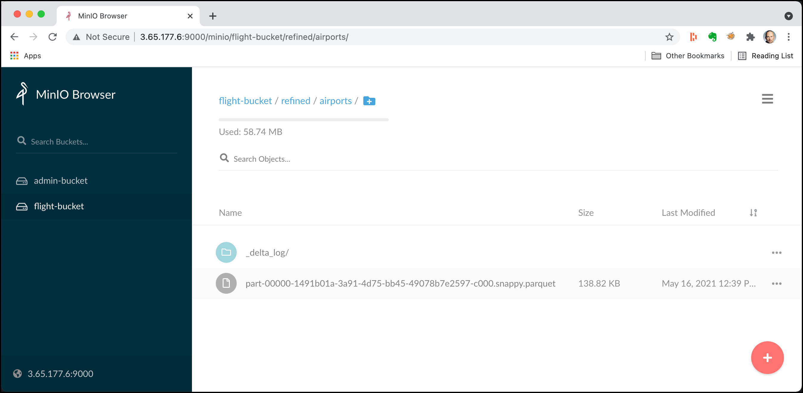

# Working with Delta Lake

For this workshop you have to start a platform using the `minio` flavour in the init script.

## Introduction

In this workshop we will work with [Delta Lake](https://delta.io/), an open-source storage format that brings ACID transactions to Apache Spark™ and big data workloads.. 

The same data as in the [Object Storage Workshop](../03-object-storage/README.md) will be used. We will show later how to re-upload the files, if you no longer have them available.

We assume that you have done Workshop 5 **Getting Started using Spark RDD and DataFrames**, where you have learnt how to use Spark form either `pyspark`, Apache Zeppelin or Jupyter Notebook. 
 
## Prepare the data, if no longer available

The data needed here has been uploaded in workshop 3 - [Working with MinIO Object Storage](03-object-storage). You can skip this section, if you still have the data available in MinIO. 

Create the flight bucket:

```bash
docker exec -ti awscli s3cmd mb s3://flight-bucket
```

Airports:

```bash
docker exec -ti awscli s3cmd put /data-transfer/flight-data/airports.csv s3://flight-bucket/raw/airports/airports.csv
```

Plane-Data:

```bash
docker exec -ti awscli s3cmd put /data-transfer/flight-data/plane-data.csv s3://flight-bucket/raw/planes/plane-data.csv
```

Carriers:

```bash
docker exec -ti awscli s3cmd put /data-transfer/flight-data/carriers.json s3://flight-bucket/raw/carriers/carriers.json
```

Flights:

```bash
docker exec -ti awscli s3cmd put /data-transfer/flight-data/flights-small/flights_2008_4_1.csv s3://flight-bucket/raw/flights/ &&
   docker exec -ti awscli s3cmd put /data-transfer/flight-data/flights-small/flights_2008_4_2.csv s3://flight-bucket/raw/flights/ &&
   docker exec -ti awscli s3cmd put /data-transfer/flight-data/flights-small/flights_2008_5_1.csv s3://flight-bucket/raw/flights/ &&
   docker exec -ti awscli s3cmd put /data-transfer/flight-data/flights-small/flights_2008_5_2.csv s3://flight-bucket/raw/flights/ &&
   docker exec -ti awscli s3cmd put /data-transfer/flight-data/flights-small/flights_2008_5_3.csv s3://flight-bucket/raw/flights/
```

## Create a new Zeppelin notebook

For this workshop we will be using Zeppelin discussed above. 

But you can easily adapt it to use either **PySpark** or **Apache Jupyter**.

In a browser window, navigate to <http://dataplatform:28080>.

Now let's create a new notebook by clicking on the **Create new note** link and set the **Note Name** to `SparkDeltaLake` and set the **Default Interpreter** to `spark`. 

Click on **Create Note** and a new Notebook is created with one cell which is empty. 

### Add some Markdown first

Navigate to the first cell and start with a title. By using the `%md` directive we can switch to the Markdown interpreter, which can be used for displaying static text.

```
%md # Spark Delta Lake sample with airport data
```

Click on the **>** symbol on the right or enter **Shift** + **Enter** to run the paragraph.

The markdown code should now be rendered as a Heading-1 title.

## Working with the Airport Data

First add another title, this time as a Heading-2.

```
%md ## Working with the Airport data
```

Now let's work with the Airports data, which we have uploaded to `s3://flight-bucket/raw/airports/`. 

First we have to import the spark python API. 

```python
from delta.tables import *
from pyspark.sql.types import *
```

Next let’s import the flights data into a DataFrame and show the first 5 rows. We use header=true to use the header line for naming the columns and specify to infer the schema.  

```python
%pyspark
airportsRawDF = spark.read.csv("s3a://flight-bucket/raw/airports", 
    	sep=",", inferSchema="true", header="true")
airportsRawDF.show(5)
```

The output will show the header line followed by the 5 data lines.

```
+----+--------------------+----------------+-----+-------+-----------+------------+
|iata|             airport|            city|state|country|        lat|        long|
+----+--------------------+----------------+-----+-------+-----------+------------+
| 00M|            Thigpen |     Bay Springs|   MS|    USA|31.95376472|-89.23450472|
| 00R|Livingston Municipal|      Livingston|   TX|    USA|30.68586111|-95.01792778|
| 00V|         Meadow Lake|Colorado Springs|   CO|    USA|38.94574889|-104.5698933|
| 01G|        Perry-Warsaw|           Perry|   NY|    USA|42.74134667|-78.05208056|
| 01J|    Hilliard Airpark|        Hilliard|   FL|    USA| 30.6880125|-81.90594389|
+----+--------------------+----------------+-----+-------+-----------+------------+
only showing top 5 rows
```

```
%pyspark
deltaTableDest = "s3a://flight-bucket/refined/airports"
```


```
%pyspark
airportsRawDF.write.format("delta").save("s3a://flight-bucket/refined/airports")
```





 

