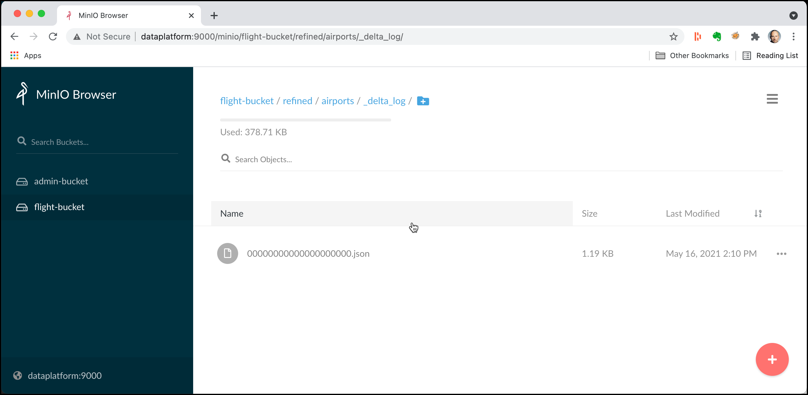
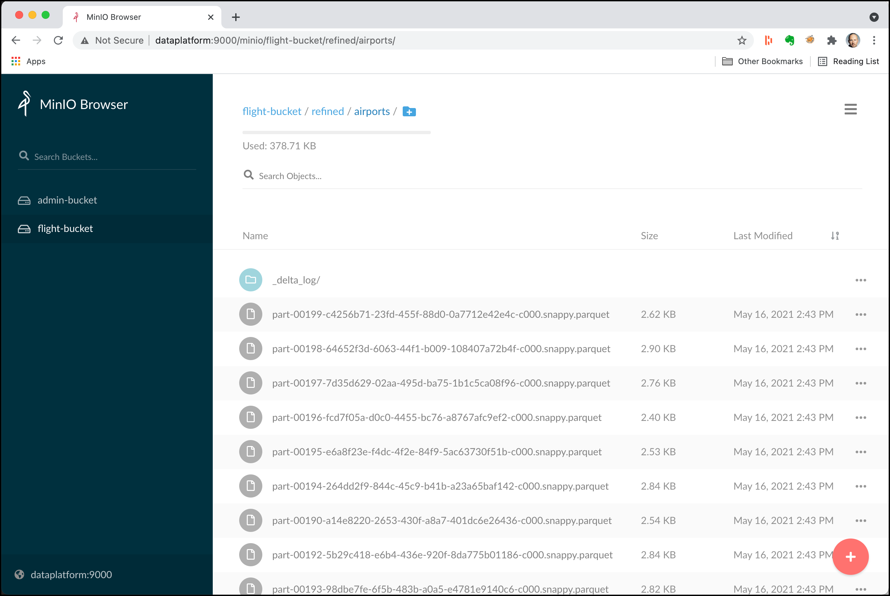

# Working with Delta Lake Table Format

For this workshop you have to start a platform using the `minio` flavour in the init script.

## Introduction

In this workshop we will work with [Delta Lake](https://delta.io/), an open-source storage format that brings ACID transactions to Apache Spark™ and big data workloads.. 

The same data as in the [Object Storage Workshop](../03-object-storage/README.md) will be used. We will show later how to re-upload the files, if you no longer have them available.

We assume that you have done Workshop 5 **Getting Started using Spark RDD and DataFrames**, where you have learnt how to use Spark form either `pyspark`, Apache Zeppelin or Jupyter Notebook. 
 
## Prepare the data, if no longer available

The data needed here has been uploaded in workshop 3 - [Working with MinIO Object Storage](03-object-storage). You can skip this section, if you still have the data available in MinIO. 

Create the flight bucket:

```bash
docker exec -ti awscli s3cmd mb s3://flight-bucket
```
or with `mc`
 
```bash
docker exec -ti minio-mc mc mb minio-1/flight-bucket
```

**Airports**:

```bash
docker exec -ti awscli s3cmd put /data-transfer/flight-data/airports.csv s3://flight-bucket/raw/airports/airports.csv
```

or with `mc`

```bash
docker exec -ti minio-mc mc cp /data-transfer/flight-data/airports.csv minio-1/flight-bucket/raw/airports/airports.csv
```

## Create a new Zeppelin notebook

For this workshop we will be using Zeppelin discussed above. 

But you can easily adapt it to use either **PySpark** or **Apache Jupyter**.

In a browser window, navigate to <http://dataplatform:28080>.

Now let's create a new notebook by clicking on the **Create new note** link and set the **Note Name** to `SparkDeltaLake` and set the **Default Interpreter** to `spark`. 

Click on **Create Note** and a new Notebook is created with one cell which is empty. 

### Add some Markdown first

Navigate to the first cell and start with a title. By using the `%md` directive we can switch to the Markdown interpreter, which can be used for displaying static text.

```
%md # Spark Delta Lake sample with airport data
```

Click on the **>** symbol on the right or enter **Shift** + **Enter** to run the paragraph.

The markdown code should now be rendered as a Heading-1 title.

## Read the airport data and store it as a Delta Lake Table

First add another title, this time as a Heading-2.

```
%md ## Read the airport data and store it as a Delta Lake Table
```

Now let's work with the Airports data, which we have uploaded to `s3://flight-bucket/raw/airports/`. 

First we have to import the spark python API. 

```python
%pyspark
from delta.tables import *
from pyspark.sql.types import *
```

Next let’s import the flights data into a DataFrame and show the first 5 rows. We use header=true to use the header line for naming the columns and specify to infer the schema.  

```python
%pyspark
airportsRawDF = spark.read.csv("s3a://flight-bucket/raw/airports", 
    	sep=",", inferSchema="true", header="true")
airportsRawDF.show(5)
```

The output will show the header line followed by the 5 data lines.

```
+----+--------------------+----------------+-----+-------+-----------+------------+
|iata|             airport|            city|state|country|        lat|        long|
+----+--------------------+----------------+-----+-------+-----------+------------+
| 00M|            Thigpen |     Bay Springs|   MS|    USA|31.95376472|-89.23450472|
| 00R|Livingston Municipal|      Livingston|   TX|    USA|30.68586111|-95.01792778|
| 00V|         Meadow Lake|Colorado Springs|   CO|    USA|38.94574889|-104.5698933|
| 01G|        Perry-Warsaw|           Perry|   NY|    USA|42.74134667|-78.05208056|
| 01J|    Hilliard Airpark|        Hilliard|   FL|    USA| 30.6880125|-81.90594389|
+----+--------------------+----------------+-----+-------+-----------+------------+
only showing top 5 rows
```

```
%pyspark
deltaTableDest = "s3a://flight-bucket/delta/airports"
```


```
%pyspark
airportsRawDF.write.format("delta").save(deltaTableDest)
```


click on the `_delta_log/` folder to see the transaction log metedata



Currently there is one file (`00000000000000000000.json `) in the folder, representing the first transaction. 

Let's see what is in this file by using the `s3cmd get` command. Navigate into the `awscli` container

```
docker exec -ti awscli bash
```

and execute the `s3cmd`

```
s3cmd get s3://flight-bucket/delta/airports/_delta_log/00000000000000000000.json --force
```

Let's view the content downloaded using the `jq` utility, a json pretty-printer

```
jq < 00000000000000000000.json 
```

you should see content similar to the one shown below

```
{
  "commitInfo": {
    "timestamp": 1621167007604,
    "operation": "WRITE",
    "operationParameters": {
      "mode": "ErrorIfExists",
      "partitionBy": "[]"
    },
    "isBlindAppend": true,
    "operationMetrics": {
      "numFiles": "1",
      "numOutputBytes": "142149",
      "numOutputRows": "3376"
    }
  }
}
{
  "protocol": {
    "minReaderVersion": 1,
    "minWriterVersion": 2
  }
}
{
  "metaData": {
    "id": "ec813856-5f63-4879-b158-03b8e9d2edc8",
    "format": {
      "provider": "parquet",
      "options": {}
    },
    "schemaString": "{\"type\":\"struct\",\"fields\":[{\"name\":\"iata\",\"type\":\"string\",\"nullable\":true,\"metadata\":{}},{\"name\":\"airport\",\"type\":\"string\",\"nullable\":true,\"metadata\":{}},{\"name\":\"city\",\"type\":\"string\",\"nullable\":true,\"metadata\":{}},{\"name\":\"state\",\"type\":\"string\",\"nullable\":true,\"metadata\":{}},{\"name\":\"country\",\"type\":\"string\",\"nullable\":true,\"metadata\":{}},{\"name\":\"lat\",\"type\":\"double\",\"nullable\":true,\"metadata\":{}},{\"name\":\"long\",\"type\":\"double\",\"nullable\":true,\"metadata\":{}}]}",
    "partitionColumns": [],
    "configuration": {},
    "createdTime": 1621167000547
  }
}
{
  "add": {
    "path": "part-00000-4b50b05e-ddd6-4e26-ada7-a56192fc7659-c000.snappy.parquet",
    "partitionValues": {},
    "size": 142149,
    "modificationTime": 1621167007000,
    "dataChange": true
  }
}
```

You can see besides some metadata, the first transaction applied represented by the `add` fragement.


## Update the Delta Lake Table

First let's create some updates we want to apply to the delta table. We have a new Airport with the code "ADD" (which does not yet exists) and update the name and city of the existing airport with code "00M" to uppercase.

```
%pyspark
newAirportsData = [('ADD', "This is a new airport", "Somewhere", "SW","USA", 0.0, 0.0),
        ('00M', "THIGPEN" , "BAY SPRINGS", "MS", "USA",31.95376472, -89.23450472)]
```

Let's create a data frame from it. 

```
%pyspark
newAirportsRDD = spark.sparkContext.parallelize(newAirportsData)

newAirportsDF = spark.createDataFrame(newAirportsRDD, airportsRawDF.schema)
newAirportsDF.show() 
```

This `newAirportsDF` dataframe represents the new raw data we would get from a source system.

Now let's update the delta lake table. First let's get a refrence to the delta table

```
%pyspark
from delta.tables import *
from pyspark.sql.functions import *

deltaTable = DeltaTable.forPath(spark, deltaTableDest)
```

and now perform the merge

```
%pyspark
deltaTable.alias("oldData").merge(
    newAirportsDF.alias("newData"),
    "oldData.iata = newData.iata") \
    	.whenMatchedUpdateAll() \
    	.whenNotMatchedInsertAll() \
    	.execute()
```



click on the `_delta_log/` folder to see the transaction log metedata


 
 
```
bash-5.0# jq < 00000000000000000001.json  | more
{
  "commitInfo": {
    "timestamp": 1621168998733,
    "operation": "MERGE",
    "operationParameters": {
      "predicate": "(oldData.`iata` = newData.`iata`)",
      "matchedPredicates": "[{\"actionType\":\"update\"}]",
      "notMatchedPredicates": "[{\"actionType\":\"insert\"}]"
    },
    "readVersion": 0,
    "isBlindAppend": false,
    "operationMetrics": {
      "numTargetRowsCopied": "3374",
      "numTargetRowsDeleted": "0",
      "numTargetFilesAdded": "200",
      "executionTimeMs": "0",
      "numTargetRowsInserted": "0",
      "scanTimeMs": "17981",
      "numTargetRowsUpdated": "2",
      "numOutputRows": "3376",
      "numSourceRows": "2",
      "numTargetFilesRemoved": "1",
      "rewriteTimeMs": "32630"
    }
  }
}
{
  "remove": {
    "path": "part-00000-4b50b05e-ddd6-4e26-ada7-a56192fc7659-c000.snappy.parquet",
    "deletionTimestamp": 1621168998682,
    "dataChange": true,
    "extendedFileMetadata": true,
    "partitionValues": {},
    "size": 142149
  }
}
{
  "add": {
    "path": "part-00000-cec0b4ac-df97-4ee7-9ea3-fc9f37f1d556-c000.snappy.parquet",
    "partitionValues": {},
    "size": 2935,
    "modificationTime": 1621168976000,
    "dataChange": true
  }
}
--More-- 
``` 
 
``` 
%pyspark
spark.read.format("delta").load(deltaTableDest).createOrReplaceTempView("airports")
``` 

``` 
%sql
select * from airports where iata IN ("00M","ADD")
``` 

## Compaction of small files

```
%pyspark
numFiles = 4

spark.read.format("delta") \
 .load(deltaTableDest) \
 .repartition(numFiles) \
 .write \
 .option("dataChange", "false") \
 .format("delta")  \
 .mode("overwrite") \
 .save(deltaTableDest)
```

## Read older versions of data using time travel

Delta Lake time travel allows you to query an older snapshot of a Delta table.

Let's go back to version 0, the version of our first insert of the data and register it as a new table `airportsTimeTravel`

```
%pyspark
airportsBeforeDF = spark.read.format("delta").option("versionAsOf", 0).load(deltaTableDest)

airportsBeforeDF.createOrReplaceTempView("airportsTimeTravel")
```

if we query for the "00M" and "ADD" code, we can see that we are getting the original data

``` 
%sql
select * from airportsTimeTravel where iata IN ("00M","ADD")
``` 

now let's swtich to version 1, register the table

```
%pyspark
airportsBeforeDF = spark.read.format("delta").option("versionAsOf", 1).load(deltaTableDest)

airportsBeforeDF.createOrReplaceTempView("airportsTimeTravel")
```

and perform another select and we can see that we get the data after the merge operation applied

``` 
%sql
select * from airportsTimeTravel where iata IN ("00M","ADD")
``` 

By default, Delta tables retain the commit history for 30 days. This means that you can specify a version from 30 days ago. 

## Vacuum old versions

You can remove files no longer referenced by a Delta table and are older than the retention threshold by running the vacuum command on the table. vacuum is not triggered automatically. The default retention threshold for the files is 7 days.

```python
%pyspark
from delta.tables import *

deltaTable = DeltaTable.forPath(spark, deltaTableDest) 
```

vacuum files not required by versions older than the default retention period

```python
%pyspark
deltaTable.vacuum()        # vacuum files not required by versions older than the default 
```
vacuum files not required by versions more than 1 hours old

```python
%pyspark
deltaTable.vacuum(1)
``` 