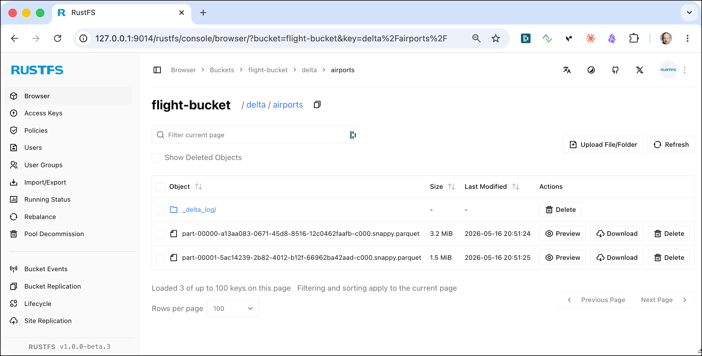
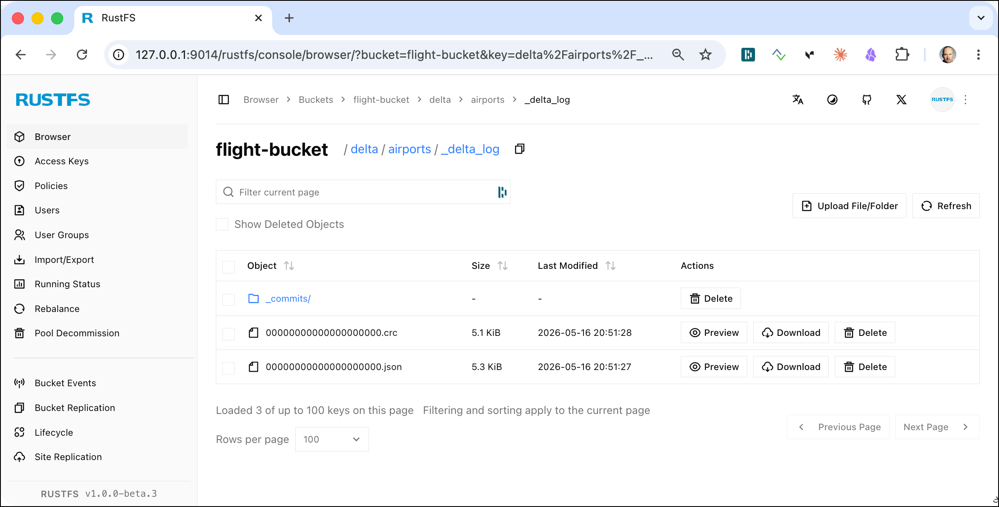
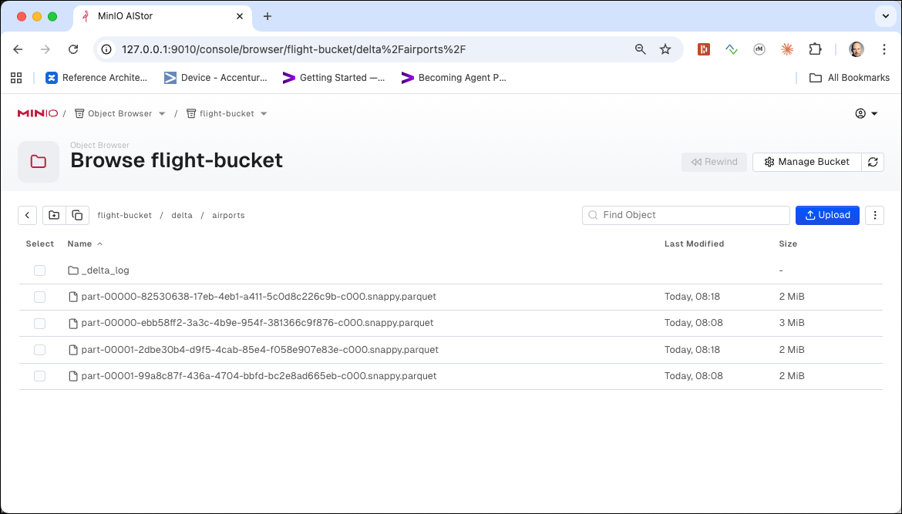
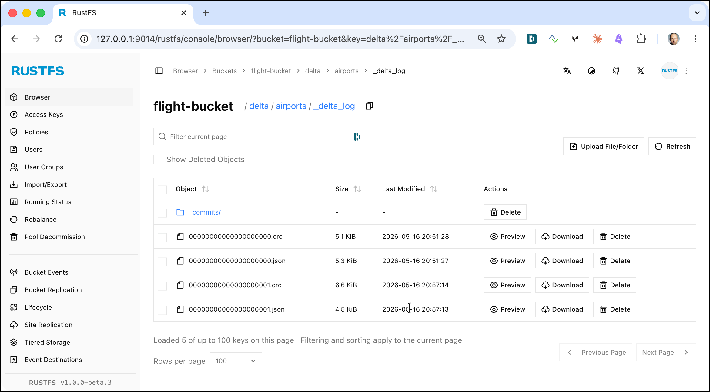

# Working with the Delta Lake Table Format

In this workshop we will work with [Delta Lake](https://delta.io/), an open-source table format that brings ACID transactions to Apache Spark™ and big data workloads.. 

## Table of Contents

- [What you will learn](#what-you-will-learn)
- [Prerequisites](#prerequisites)
- [Prepare the data, if no longer available](#prepare-the-data-if-no-longer-available)
- [Working with Spark and Delta table](#working-with-spark-and-delta-table)
- [Read the airport data and store it as a Delta Lake Table](#read-the-airport-data-and-store-it-as-a-delta-lake-table)
- [Update the Delta Lake Table](#update-the-delta-lake-table)
- [Compaction of small files](#compaction-of-small-files)
- [Read older versions of data using time travel](#read-older-versions-of-data-using-time-travel)
- [Vacuum old versions](#vacuum-old-versions)

## What you will learn

- How to write DataFrames as Delta Lake tables stored in MinIO
- How Delta Lake provides ACID transactions on top of Parquet files
- How to perform `INSERT`, `UPDATE`, and `DELETE` operations on Delta tables
- How to use Delta's time-travel capability to query earlier versions of a table
- How to inspect the Delta transaction log and understand how changes are tracked
- How to use `MERGE INTO` for upsert operations

## Prerequisites

- The **Data Platform** described [here](../00-environment) is running and accessible
- Workshop 3 ([Getting Started using Spark RDD and DataFrames](../03-spark-getting-started)) completed

## Upload the data, if no longer available

The data needed here has been uploaded in workshop 2 - [Working with RustFS Object Storage](01b-rustfs-object-storage). You can skip this section, if you still have the data available in Object Storage. We show both `s3cmd` and the `mc` version of the commands:

Create the flight bucket:

```bash
docker exec -ti awscli s3cmd mb s3://flight-bucket
```

and upload the data

```bash
docker exec -ti awscli s3cmd put /data-transfer/airport-data/airports.csv s3://flight-bucket/raw/airports/airports.csv
```

## Working with Spark and Delta table

In a browser window, navigate to 

  * for Zeppelin:  <http://dataplatform:28080>
  * for Jupyter: <http://dataplatform:28888>

Now let's create a new notebook and name it `SparkDeltaLake`. 

For **Jupyter**, perform the next paragraph, for **Apache Zeppelin**, this is not necessary and the Spark context is pre-configured.

### If you are using Jupyter

You have to create the Spark context with additional configuration settings in the init script:

```python
import os
# get the accessKey and secretKey from Environment
accessKey = os.environ['AWS_ACCESS_KEY_ID']
secretKey = os.environ['AWS_SECRET_ACCESS_KEY']

import pyspark
from pyspark.sql import SparkSession

conf = pyspark.SparkConf()

# point to mesos master or zookeeper entry (e.g., zk://10.10.10.10:2181/mesos)
conf.setMaster("spark://spark-master:7077")

# set other options as desired
conf.set("spark.executor.memory", "8g")
conf.set("spark.executor.cores", "1")
conf.set("spark.core.connection.ack.wait.timeout", "1200")
conf.set("spark.hadoop.fs.s3a.impl", "org.apache.hadoop.fs.s3a.S3AFileSystem")
conf.set("spark.hadoop.fs.s3a.endpoint", "http://rustfs-1:9000")
conf.set("spark.hadoop.fs.s3a.path.style.access", "true")
conf.set("spark.hadoop.fs.s3a.access.key", accessKey)
conf.set("spark.hadoop.fs.s3a.secret.key", secretKey)
conf.set("spark.hadoop.fs.s3a.aws.credentials.provider", "org.apache.hadoop.fs.s3a.SimpleAWSCredentialsProvider")
conf.set("spark.sql.catalogImplementation", "hive")
conf.set("spark.sql.warehouse.dir", "s3a://flight-bucket/warehouse")
conf.set("spark.hadoop.hive.metastore.uris", "thrift://hive-metastore:9083")
conf.set("spark.sql.extensions", "io.delta.sql.DeltaSparkSessionExtension")
conf.set("spark.databricks.delta.catalog.update.metastore", "true")
conf.set("spark.sql.catalog.spark_catalog", "org.apache.spark.sql.delta.catalog.DeltaCatalog")
conf.set("spark.jars.packages", "io.delta:delta-spark_2.12:3.3.2,io.delta:delta-storage:3.3.2")

spark = SparkSession.builder.appName('Jupyter').config(conf=conf).getOrCreate()
spark.sparkContext.setLogLevel("INFO")

sc = spark.sparkContext
```

Also enable sql magic in Jupyter (this will enable the `%%sql` directive to execute plain SQL statements)

```python
%load_ext sql
%config SqlMagic.autopandas = True
%config SqlMagic.displaycon = False

# Connect using the active SparkSession
%sql spark
```

### Add some Markdown first

Navigate to the first cell and start with a title. By using the `%md` directive we can switch to the Markdown interpreter, which can be used for displaying static text.

```
%md # Spark Delta Lake sample with airport data
```

Click on the **>** symbol on the right or enter **Shift** + **Enter** to run the paragraph.

The markdown code should now be rendered as a Heading-1 title.

## Read the airport data and store it as a Delta Lake Table

First add another title, this time as a Heading-2.

```
%md ## Read the airport data and store it as a Delta Lake Table
```

Now let's work with the Airports data, which we have uploaded to `s3://flight-bucket/raw/airports/`. 

First we have to import the spark python API. Don't forget to add the `%pyspark` directive in Zeppelin

```python
from delta.tables import *
from pyspark.sql.types import *
```

Next let’s import the airports data into a DataFrame and show the first 5 rows. We define the schema explicitly instead of inferring it, which avoids the double-scan and gives us stable types.

```python
airportSchema = "`id` INTEGER, `ident` STRING, `type` STRING, `name` STRING, \
    `latitude_deg` DOUBLE, `longitude_deg` DOUBLE, `elevation_ft` INTEGER, \
    `continent` STRING, `iso_country` STRING, `iso_region` STRING, \
    `municipality` STRING, `scheduled_service` STRING, `gps_code` STRING, \
    `iata_code` STRING, `local_code` STRING, `home_link` STRING, \
    `wikipedia_link` STRING, `keywords` STRING"

airportsRawDF = spark.read.csv("s3a://flight-bucket/raw/airports", 
    	sep=",", inferSchema="false", header="true", schema=airportSchema)
airportsRawDF.show(5)
```

The output will show the header line followed by the 5 data lines.

```
+------+-----+-------------+--------------------+-----------------+------------------+------------+---------+-----------+----------+------------+-----------------+--------+---------+----------+--------------------+--------------+--------+
|    id|ident|         type|                name|     latitude_deg|     longitude_deg|elevation_ft|continent|iso_country|iso_region|municipality|scheduled_service|gps_code|iata_code|local_code|           home_link|wikipedia_link|keywords|
+------+-----+-------------+--------------------+-----------------+------------------+------------+---------+-----------+----------+------------+-----------------+--------+---------+----------+--------------------+--------------+--------+
|  6523|  00A|     heliport|   Total RF Heliport|        40.070985|        -74.933689|          11|       NA|         US|     US-PA|    Bensalem|               no|    K00A|     NULL|       00A|https://www.pennd...|          NULL|    NULL|
|323361| 00AA|small_airport|Aero B Ranch Airport|        38.704022|       -101.473911|        3435|       NA|         US|     US-KS|       Leoti|               no|    00AA|     NULL|      00AA|                NULL|          NULL|    NULL|
|  6524| 00AK|small_airport|        Lowell Field|        59.947733|       -151.692524|         450|       NA|         US|     US-AK|Anchor Point|               no|    00AK|     NULL|      00AK|                NULL|          NULL|    NULL|
|  6525| 00AL|small_airport|        Epps Airpark|34.86479949951172|-86.77030181884766|         820|       NA|         US|     US-AL|     Harvest|               no|    00AL|     NULL|      00AL|                NULL|          NULL|    NULL|
|506791| 00AN|small_airport|Katmai Lodge Airport|        59.093287|       -156.456699|          80|       NA|         US|     US-AK| King Salmon|               no|    00AN|     NULL|      00AN|                NULL|          NULL|    NULL|
+------+-----+-------------+--------------------+-----------------+------------------+------------+---------+-----------+----------+------------+-----------------+--------+---------+----------+--------------------+--------------+--------+
only showing top 5 rows
```

Create the flight_db database, if it does not yet exists (we created it already in workshop 5)

```sql
%sql
CREATE DATABASE IF NOT EXISTS flight_db;
```

Now we can write the dataframe as a Delta table

```python
airportsRawDF.write.format("delta").saveAsTable("flight_db.airports_delta_t")
```

Let's view the resulting objects using the `s3cmd` command line tool

```bash
docker exec -ti awscli s3cmd ls --recursive s3://flight-bucket/warehouse/flight_db.db/airports_delta_t/
```

and you should see that the data has been written as parquet files, but that there is also a `_delta_log` folder holding the transactional metadata for the delta table

```bash
ubuntu@ip-172-26-9-12:~/bigdata-spark-workshop/00-environment/docker/data-transfer/result$ docker exec -ti awscli s3cmd ls --recursive s3://flight-bucket/warehouse/flight_db.db/airports_delta_t/
2026-05-16 18:51         5252  s3://flight-bucket/warehouse/flight_db.db/airports_delta_t/_delta_log/00000000000000000000.crc
2026-05-16 18:51         5464  s3://flight-bucket/warehouse/flight_db.db/airports_delta_t/_delta_log/00000000000000000000.json
2026-05-16 18:51            0  s3://flight-bucket/warehouse/flight_db.db/airports_delta_t/_delta_log/_commits/
2026-05-16 18:51      3366543  s3://flight-bucket/warehouse/flight_db.db/airports_delta_t/part-00000-a13aa083-0671-45d8-8516-12c0462faafb-c000.snappy.parquet
2026-05-16 18:51      1618896  s3://flight-bucket/warehouse/flight_db.db/airports_delta_t/part-00001-5ac14239-2b82-4012-b12f-66962ba42aad-c000.snappy.parquet
```

> **What you should see:** Two Parquet data files and a `_delta_log/` folder containing the transaction log. The log already has one entry (`00000000000000000000.json`) and its corresponding `.crc` checksum. The empty `_commits/` folder is a placeholder for future concurrent writer coordination.

> **What just happened?** `write.format("delta").save()` did two things simultaneously: (1) wrote the airport data as standard Parquet files — identical to what `write.parquet()` would produce — and (2) created the Delta transaction log file `00000000000000000000.json` recording which files were written and their statistics. Every future read or write on this Delta table will first consult the `_delta_log/` folder to determine the current table state. The Parquet files themselves have no idea they are part of a Delta table.

We can also alternatively use the RustFS console to view the data



click on the `_delta_log/` folder to see the transaction log metedata



### Viewing the delta table metadata

As we have seen, there is currently one file (`00000000000000000000.json `) in the `_delta_log` folder, representing the first transaction. 

Let's see what is in this file by using the `s3cmd get` command

```
docker exec -ti awscli s3cmd get s3://flight-bucket/warehouse/flight_db.db/airports_delta_t/_delta_log/00000000000000000000.json --force /data-transfer/
```

Let's view the content downloaded using the `jq` utility, a json pretty-printer (**Note:** make sure that DATAPLATFORM_HOME environment variable points to the `docker` folder)

```
cd $DATAPLATFORM_HOME
jq < ./data-transfer/00000000000000000000.json 
```

you should see content similar to the one shown below

```
{
  "commitInfo": {
    "timestamp": 1778957487015,
    "operation": "WRITE",
    "operationParameters": {
      "mode": "ErrorIfExists",
      "partitionBy": "[]"
    },
    "isolationLevel": "Serializable",
    "isBlindAppend": true,
    "operationMetrics": {
      "numFiles": "2",
      "numOutputRows": "81193",
      "numOutputBytes": "4985439"
    },
    "engineInfo": "Apache-Spark/3.5.3 Delta-Lake/3.3.2",
    "txnId": "d6b01d06-9be9-475b-bb13-c016925ea139"
  }
}
{
  "metaData": {
    "id": "bde28fb0-94f0-4884-87fd-d9403e3afa1b",
    "format": {
      "provider": "parquet",
      "options": {}
    },
    "schemaString": "{\"type\":\"struct\",\"fields\":[{\"name\":\"id\",\"type\":\"integer\",\"nullable\":true,\"metadata\":{}},{\"name\":\"ident\",\"type\":\"string\",\"nullable\":true,\"metadata\":{}},{\"name\":\"type\",\"type\":\"string\",\"nullable\":true,\"metadata\":{}},{\"name\":\"name\",\"type\":\"string\",\"nullable\":true,\"metadata\":{}},{\"name\":\"latitude_deg\",\"type\":\"double\",\"nullable\":true,\"metadata\":{}},{\"name\":\"longitude_deg\",\"type\":\"double\",\"nullable\":true,\"metadata\":{}},{\"name\":\"elevation_ft\",\"type\":\"integer\",\"nullable\":true,\"metadata\":{}},{\"name\":\"continent\",\"type\":\"string\",\"nullable\":true,\"metadata\":{}},{\"name\":\"iso_country\",\"type\":\"string\",\"nullable\":true,\"metadata\":{}},{\"name\":\"iso_region\",\"type\":\"string\",\"nullable\":true,\"metadata\":{}},{\"name\":\"municipality\",\"type\":\"string\",\"nullable\":true,\"metadata\":{}},{\"name\":\"scheduled_service\",\"type\":\"string\",\"nullable\":true,\"metadata\":{}},{\"name\":\"gps_code\",\"type\":\"string\",\"nullable\":true,\"metadata\":{}},{\"name\":\"iata_code\",\"type\":\"string\",\"nullable\":true,\"metadata\":{}},{\"name\":\"local_code\",\"type\":\"string\",\"nullable\":true,\"metadata\":{}},{\"name\":\"home_link\",\"type\":\"string\",\"nullable\":true,\"metadata\":{}},{\"name\":\"wikipedia_link\",\"type\":\"string\",\"nullable\":true,\"metadata\":{}},{\"name\":\"keywords\",\"type\":\"string\",\"nullable\":true,\"metadata\":{}}]}",
    "partitionColumns": [],
    "configuration": {},
    "createdTime": 1778957480165
  }
}
{
  "protocol": {
    "minReaderVersion": 1,
    "minWriterVersion": 2
  }
}
{
  "add": {
    "path": "part-00000-a13aa083-0671-45d8-8516-12c0462faafb-c000.snappy.parquet",
    "partitionValues": {},
    "size": 3366543,
    "modificationTime": 1778957484000,
    "dataChange": true,
    "stats": "{\"numRecords\":54024,\"minValues\":{\"id\":2,\"ident\":\"00A\",\"type\":\"balloonport\",\"name\":\"\\\"\\\"\\\"Ghost\\\"\\\" International Airport\",\"latitude_deg\":-89.989444,\"longitude_deg\":-179.876999,\"elevation_ft\":-1266,\"continent\":\"AF\",\"iso_country\":\"AD\",\"iso_region\":\"AD-04\",\"municipality\":\"\\\"\\\"\\\"Jaunkalmes\\\"\\\"\",\"scheduled_service\":\" Lejasciema pag.\",\"gps_code\":\" LV4412\\\"\",\"iata_code\":\"AAA\",\"local_code\":\"00A\",\"home_link\":\"http://GillespieField.com/\",\"wikipedia_link\":\"http://de.wikipedia.org/wiki/Alb\",\"keywords\":\"\\\"\\\"\\\"Alas de Rauch\\\"\\\"\\\"\"},\"maxValues\":{\"id\":558440,\"ident\":\"rjns\",\"type\":\"small_airport\",\"name\":\"​Isla de Desecheo Helipad\",\"latitude_deg\":82.75,\"longitude_deg\":179.9757,\"elevation_ft\":17372,\"continent\":\"SA\",\"iso_country\":\"ZW\",\"iso_region\":\"ZW-MW\",\"municipality\":\"Žocene\",\"scheduled_service\":\"yes\",\"gps_code\":\"ZYXC\",\"iata_code\":\"no\",\"local_code\":\"ZZV\",\"home_link\":\"https:/https://www.dynali.com//w\u007f\",\"wikipedia_link\":\"https://zh.wikipedia.org/wiki/%E\u007f\",\"keywords\":\"황수원비행장, 黃水院飛行場\"},\"nullCount\":{\"id\":0,\"ident\":0,\"type\":0,\"name\":0,\"latitude_deg\":0,\"longitude_deg\":0,\"elevation_ft\":10066,\"continent\":0,\"iso_country\":0,\"iso_region\":0,\"municipality\":2895,\"scheduled_service\":0,\"gps_code\":25018,\"iata_code\":47912,\"local_code\":28459,\"home_link\":50494,\"wikipedia_link\":41736,\"keywords\":40762}}"
  }
}
{
  "add": {
    "path": "part-00001-5ac14239-2b82-4012-b12f-66962ba42aad-c000.snappy.parquet",
    "partitionValues": {},
    "size": 1618896,
    "modificationTime": 1778957485000,
    "dataChange": true,
    "stats": "{\"numRecords\":27169,\"minValues\":{\"id\":7,\"ident\":\"RK41\",\"type\":\"balloonport\",\"name\":\"\\\"Aeropuerto \\\"\\\"General Tomas de H\",\"latitude_deg\":-80.3142,\"longitude_deg\":-179.5,\"elevation_ft\":-223,\"continent\":\"AF\",\"iso_country\":\"AE\",\"iso_region\":\"AE-AZ\",\"municipality\":\"(Old) Scandium City\",\"scheduled_service\":\"no\",\"gps_code\":\"00AR\",\"iata_code\":\"AAB\",\"local_code\":\"00AR\",\"home_link\":\"http://813.mnd.gov.tw/english/\",\"wikipedia_link\":\"http://es.wikipedia.org/wiki/Aer\",\"keywords\":\"\\\"\\\"\\\"Black Bear Creek\\\"\\\"\\\"\"},\"maxValues\":{\"id\":558726,\"ident\":\"spgl\",\"type\":\"small_airport\",\"name\":\"Želiezovce Cropduster Strip\",\"latitude_deg\":81.15,\"longitude_deg\":179.292999,\"elevation_ft\":14965,\"continent\":\"SA\",\"iso_country\":\"ZW\",\"iso_region\":\"ZW-MW\",\"municipality\":\"Охá\",\"scheduled_service\":\"yes\",\"gps_code\":\"ZYYY\",\"iata_code\":\"ZZO\",\"local_code\":\"ZUL\",\"home_link\":\"https://za.geoview.info/himevill\u007f\",\"wikipedia_link\":\"https://zh.wikipedia.org/wiki/%E\u007f\",\"keywords\":\"김해국제공항, 金海國際空港, Kimhae, Pusan\"},\"nullCount\":{\"id\":0,\"ident\":0,\"type\":0,\"name\":0,\"latitude_deg\":0,\"longitude_deg\":0,\"elevation_ft\":4522,\"continent\":0,\"iso_country\":0,\"iso_region\":0,\"municipality\":2105,\"scheduled_service\":0,\"gps_code\":13315,\"iata_code\":24177,\"local_code\":18357,\"home_link\":26464,\"wikipedia_link\":23022,\"keywords\":21120}}"
  }
}
```

You can see besides some metadata, the first transaction applied represented by the `add` fragement.

## Update the Delta Lake Table

First let's create some updates we want to apply to the delta table. 

We have a new Airport with the code "ADD" (which does not yet exists) and update the name and city of the existing airport with code "00M" to uppercase. Execute the statement in the Spark environment

```python
newAirportsData = [(999, "ADD", "small_airport", "This is a new airport", 0.0, 0.0, 0, "US", "US", "CA", "San Francisco", "", "", "ADD", "", "", "", ""),
        (6523, "00A", "heliport", "TOTAL RF HELIPORT", 40.070985, -74.933689, 11, "NA", "US", "US-PA", "Bensalem", "no", "K00A", "", "00A", "https://www.penndot.pa.gov/TravelInPA/airports-pa/Pages/Total-RF-Heliport.aspx", "", "")]
```

Now let's create a data frame from it. 

```python
newAirportsRDD = spark.sparkContext.parallelize(newAirportsData)

newAirportsDF = spark.createDataFrame(newAirportsRDD, airportsRawDF.schema)
newAirportsDF.show() 
```

This `newAirportsDF` dataframe represents the new raw data we would get from a source system.

Now let's update the delta lake table. First let's get a reference to the delta table

```python
from delta.tables import *
from pyspark.sql.functions import *

deltaTable = DeltaTable.forName(spark, "flight_db.airports_delta_t")
```

and now perform the merge

```python
deltaTable.alias("oldData").merge(
    newAirportsDF.alias("newData"),
    "oldData.ident = newData.ident") \
    	.whenMatchedUpdateAll() \
    	.whenNotMatchedInsertAll() \
    	.execute()
```

Let's view the resulting objects using the `s3cmd` command line tool

```bash
docker exec -ti awscli s3cmd ls --recursive s3://flight-bucket/warehouse/flight_db.db/airports_delta_t/
```

and you should see that more data has been written as parquet files, and that in the `_delta_log` folder an addional json file has been created

```bash
ubuntu@ip-172-26-9-12:~/bigdata-spark-workshop/00-environment/docker$ docker exec -ti awscli s3cmd ls --recursive s3://flight-bucket/warehouse/flight_db.db/airports_delta_t/
2026-05-16 18:51         5252  s3://flight-bucket/warehouse/flight_db.db/airports_delta_t/_delta_log/00000000000000000000.crc
2026-05-16 18:51         5464  s3://flight-bucket/warehouse/flight_db.db/airports_delta_t/_delta_log/00000000000000000000.json
2026-05-16 18:57         6784  s3://flight-bucket/warehouse/flight_db.db/airports_delta_t/_delta_log/00000000000000000001.crc
2026-05-16 18:57         4622  s3://flight-bucket/warehouse/flight_db.db/airports_delta_t/_delta_log/00000000000000000001.json
2026-05-16 18:51            0  s3://flight-bucket/warehouse/flight_db.db/airports_delta_t/_delta_log/_commits/
2026-05-16 18:57      1749796  s3://flight-bucket/warehouse/flight_db.db/airports_delta_t/part-00000-9656a858-41f2-4542-9a60-051d31152f02-c000.snappy.parquet
2026-05-16 18:51      3366543  s3://flight-bucket/warehouse/flight_db.db/airports_delta_t/part-00000-a13aa083-0671-45d8-8516-12c0462faafb-c000.snappy.parquet
2026-05-16 18:51      1618896  s3://flight-bucket/warehouse/flight_db.db/airports_delta_t/part-00001-5ac14239-2b82-4012-b12f-66962ba42aad-c000.snappy.parquet
2026-05-16 18:57      1763568  s3://flight-bucket/warehouse/flight_db.db/airports_delta_t/part-00001-ece6bbcc-af13-496b-90f2-d9f938c9b3ab-c000.snappy.parquet
```

> **What you should see:** The original two Parquet files are still present alongside two new files written by the MERGE. The `_delta_log/` folder now contains a second JSON file (`00000000000000000001.json`) representing the MERGE transaction. The original files are still physically on disk but are now "logically deleted" — the new log entry marks them as removed so future reads skip them.

> **What just happened?** Delta Lake's MERGE INTO performed an upsert: it matched rows on the `ident` column, updated the one matching row ("00A" name to uppercase), and inserted the one new row ("ADD"). Because Parquet files are immutable, the MERGE rewrote the entire affected partition into a new file rather than modifying rows in place. This write-on-merge pattern is Delta Lake's key trade-off: it provides ACID guarantees but at the cost of rewriting data files for every update or delete operation.

We can also alternatively use the RustFS console to see the data



click on the `_delta_log/` folder to see the transaction log metedata



As we have seen, there is anew file (`00000000000000000001.json `) in the `_delta_log` folder, representing the first transaction. 

Let's see what is in this file by using the `s3cmd get` command

```
docker exec -ti awscli s3cmd get s3://flight-bucket/warehouse/flight_db.db/airports_delta_t/_delta_log/00000000000000000001.json --force /data-transfer/
```

Let's view the content downloaded using the `jq` utility, a json pretty-printer

```
cd $DATAPLATFORM_HOME
jq < ./data-transfer/00000000000000000001.json 
```

you should see content similar to the one shown below
 
```
ubuntu@ip-172-26-9-12:~/bigdata-spark-workshop/00-environment/docker$ jq < ./data-transfer/00000000000000000001.json 
{
  "commitInfo": {
    "timestamp": 1778957833777,
    "operation": "MERGE",
    "operationParameters": {
      "predicate": "[\"(ident#691 = ident#582)\"]",
      "matchedPredicates": "[{\"actionType\":\"update\"}]",
      "notMatchedPredicates": "[{\"actionType\":\"insert\"}]",
      "notMatchedBySourcePredicates": "[]"
    },
    "readVersion": 0,
    "isolationLevel": "Serializable",
    "isBlindAppend": false,
    "operationMetrics": {
      "numTargetRowsCopied": "54023",
      "numTargetRowsDeleted": "0",
      "numTargetFilesAdded": "2",
      "numTargetBytesAdded": "3513364",
      "numTargetBytesRemoved": "3366543",
      "numTargetDeletionVectorsAdded": "0",
      "numTargetRowsMatchedUpdated": "1",
      "executionTimeMs": "12556",
      "materializeSourceTimeMs": "492",
      "numTargetRowsInserted": "1",
      "numTargetRowsMatchedDeleted": "0",
      "numTargetDeletionVectorsUpdated": "0",
      "scanTimeMs": "9163",
      "numTargetRowsUpdated": "1",
      "numOutputRows": "54025",
      "numTargetDeletionVectorsRemoved": "0",
      "numTargetRowsNotMatchedBySourceUpdated": "0",
      "numTargetChangeFilesAdded": "0",
      "numSourceRows": "2",
      "numTargetFilesRemoved": "1",
      "numTargetRowsNotMatchedBySourceDeleted": "0",
      "rewriteTimeMs": "2837"
    },
    "engineInfo": "Apache-Spark/3.5.3 Delta-Lake/3.3.2",
    "txnId": "2fdd1c5e-aa5d-4d9f-b5c0-673b38f7f1da"
  }
}
{
  "add": {
    "path": "part-00000-9656a858-41f2-4542-9a60-051d31152f02-c000.snappy.parquet",
    "partitionValues": {},
    "size": 1749796,
    "modificationTime": 1778957833000,
    "dataChange": true,
    "stats": "{\"numRecords\":26958,\"minValues\":{\"id\":11,\"ident\":\"00AA\",\"type\":\"balloonport\",\"name\":\"\\\"\\\"\\\"Ghost\\\"\\\" International Airport\",\"latitude_deg\":-78.466139,\"longitude_deg\":-179.876999,\"elevation_ft\":-1266,\"continent\":\"AF\",\"iso_country\":\"AD\",\"iso_region\":\"AD-08\",\"municipality\":\"\\\"Academia Militar \\\"\\\"Mcal. Franci\",\"scheduled_service\":\"no\",\"gps_code\":\"00AA\",\"iata_code\":\"AAD\",\"local_code\":\"00AA\",\"home_link\":\"http://GillespieField.com/\",\"wikipedia_link\":\"http://de.wikipedia.org/wiki/Ber\",\"keywords\":\"\\\"\\\"\\\"Garçon\\\"\\\"\\\"\"},\"maxValues\":{\"id\":558333,\"ident\":\"mdwo\",\"type\":\"small_airport\",\"name\":\"Želeč Airstrip\",\"latitude_deg\":81.697844,\"longitude_deg\":179.951004028,\"elevation_ft\":17372,\"continent\":\"SA\",\"iso_country\":\"ZW\",\"iso_region\":\"ZW-MW\",\"municipality\":\"Želeč\",\"scheduled_service\":\"yes\",\"gps_code\":\"ZYXC\",\"iata_code\":\"ZZU\",\"local_code\":\"ZVOL\",\"home_link\":\"https:/https://www.dynali.com//w\u007f\",\"wikipedia_link\":\"https://zh.wikipedia.org/wiki/%E\u007f\",\"keywords\":\"의주비행장, 義州飛行場\"},\"nullCount\":{\"id\":0,\"ident\":0,\"type\":0,\"name\":0,\"latitude_deg\":0,\"longitude_deg\":0,\"elevation_ft\":5019,\"continent\":0,\"iso_country\":0,\"iso_region\":0,\"municipality\":1445,\"scheduled_service\":0,\"gps_code\":12403,\"iata_code\":23930,\"local_code\":14195,\"home_link\":25254,\"wikipedia_link\":20796,\"keywords\":20343}}"
  }
}
{
  "add": {
    "path": "part-00001-ece6bbcc-af13-496b-90f2-d9f938c9b3ab-c000.snappy.parquet",
    "partitionValues": {},
    "size": 1763568,
    "modificationTime": 1778957833000,
    "dataChange": true,
    "stats": "{\"numRecords\":27067,\"minValues\":{\"id\":2,\"ident\":\"00A\",\"type\":\"balloonport\",\"name\":\"\\\"Aeródromo \\\"\\\"Puente de Genave\\\"\\\"\\\"\",\"latitude_deg\":-89.989444,\"longitude_deg\":-179.667007,\"elevation_ft\":-1207,\"continent\":\"AF\",\"iso_country\":\"AD\",\"iso_region\":\"AD-04\",\"municipality\":\"\\\"\\\"\\\"Jaunkalmes\\\"\\\"\",\"scheduled_service\":\"\",\"gps_code\":\"\",\"iata_code\":\"\",\"local_code\":\"\",\"home_link\":\"\",\"wikipedia_link\":\"\",\"keywords\":\"\"},\"maxValues\":{\"id\":558440,\"ident\":\"rjns\",\"type\":\"small_airport\",\"name\":\"​Isla de Desecheo Helipad\",\"latitude_deg\":82.75,\"longitude_deg\":179.9757,\"elevation_ft\":16200,\"continent\":\"US\",\"iso_country\":\"ZW\",\"iso_region\":\"ZW-MW\",\"municipality\":\"Žocene\",\"scheduled_service\":\"yes\",\"gps_code\":\"ZYUH\",\"iata_code\":\"no\",\"local_code\":\"ZZV\",\"home_link\":\"https://yyb.ca/\",\"wikipedia_link\":\"https://zh.wikipedia.org/wiki/%E\u007f\",\"keywords\":\"황수원비행장, 黃水院飛行場\"},\"nullCount\":{\"id\":0,\"ident\":0,\"type\":0,\"name\":0,\"latitude_deg\":0,\"longitude_deg\":0,\"elevation_ft\":5047,\"continent\":0,\"iso_country\":0,\"iso_region\":0,\"municipality\":1450,\"scheduled_service\":0,\"gps_code\":12615,\"iata_code\":23981,\"local_code\":14264,\"home_link\":25240,\"wikipedia_link\":20939,\"keywords\":20418}}"
  }
}
{
  "remove": {
    "path": "part-00000-a13aa083-0671-45d8-8516-12c0462faafb-c000.snappy.parquet",
    "deletionTimestamp": 1778957833743,
    "dataChange": true,
    "extendedFileMetadata": true,
    "partitionValues": {},
    "size": 3366543,
    "stats": "{\"numRecords\":54024}"
  }
}
``` 

Back in Spark, let's read the delta table and register it as a table, so we can query it using SQL

``` 
spark.table("flight_db.airports_delta_t").createOrReplaceTempView("airports")
``` 

now you can query it by etiher using the `%sql` in Zeppelin or the `%%sql` directive in Jupyter (the statement in this workshop are shown for Zeppelin, replace the `%sql` by `%%sql` for Jupyter.

```sql
%sql
SELECT * FROM airports WHERE ident IN ("00A","ADD")
``` 

and you should see two rows in the result. One is the new record added and the other one the updated row.

## Compaction of small files

Delta Lake can improve the speed of read queries from a table by coalescing small files into larger ones.

```python
from delta.tables import *

deltaTable = DeltaTable.forName(spark, "flight_db.airports_delta_t")  

deltaTable.optimize().executeCompaction()
```

## Read older versions of data using time travel

Delta Lake time travel allows you to query an older snapshot of a Delta table.

Let's go back to version 0, the version of our first insert of the data and register it as a new table `airportsTimeTravel`

```python
airportsBeforeDF = spark.read.format("delta").option("versionAsOf", 0).table("flight_db.airports_delta_t")

airportsBeforeDF.createOrReplaceTempView("airportsTimeTravel")
```

if we now query for the "00A" and "ADD" code, we can see that we are getting the original data (`Total RF Heliport` in mixed case and the added airport is not shown)

```sql
%sql
SELECT * FROM airportsTimeTravel WHERE ident IN ("00A","ADD")
``` 

now let's switch to version 1, register the table

```python
airportsBeforeDF = spark.read.format("delta").option("versionAsOf", 1).table("flight_db.airports_delta_t")

airportsBeforeDF.createOrReplaceTempView("airportsTimeTravel")
```

and perform another select and we can see that we again get the data after the merge operation applied

``` 
%sql
SELECT * FROM airportsTimeTravel WHERE ident IN ("00A","ADD")
``` 

> **What you should see:** Querying version 0 returns only the original "00A" record in mixed case, with no "ADD" airport present. Querying version 1 returns both the updated "TOTAL RF HELIPORT" record and the newly inserted "ADD" airport.

> **What just happened?** Delta Lake's `versionAsOf` option told Spark to reconstruct the table state as it existed after transaction `N`. Spark replays the `_delta_log/` entries up to and including version `N`, building a file list from the resulting state. This is how Delta Lake provides point-in-time reads without physically copying data — the same underlying Parquet files serve multiple time-travel views simultaneously, and no data is ever re-read until a query action triggers execution.

By default, Delta tables retain the commit history for 30 days. This means that you can always go back to a version from 30 days ago. 

## Vacuum old versions

You can remove files no longer referenced by a Delta table and are older than the retention threshold by running the vacuum command on the table. vacuum is not triggered automatically. The default retention threshold for the files is 7 days.

```python
from delta.tables import *

deltaTable = DeltaTable.forName(spark, "flight_db.airports_delta_t") 
```

vacuum files not required by versions older than the default retention period

```python
deltaTable.vacuum()        # vacuum files not required by versions older than the default 
```

vacuum files not required by versions more than 1 hours old

```python
spark.conf.set("spark.databricks.delta.retentionDurationCheck.enabled", "false")
deltaTable.vacuum(1)
``` 

**Note**: To use deltaTable.vacuum(1), you need to enable a specific Spark configuration that allows retaining data for less than the default 7-day retention period. By default, Delta Lake enforces a minimum retention of 168 hours (7 days) as a safety check.

Let's view the resulting objects using the `s3cmd` command line tool

```bash
docker exec -ti awscli s3cmd ls --recursive s3://flight-bucket/warehouse/flight_db.db/airports_delta_t/
```

and you should see that more data has been written as parquet files, and that in the `_delta_log` folder an addional json file has been created

```bash
ubuntu@ip-172-26-9-12:~/bigdata-spark-workshop/00-environment/docker$ docker exec -ti awscli s3cmd ls --recursive s3://flight-bucket/warehouse/flight_db.db/airports_delta_t/
2025-05-22 11:55         5472  s3://flight-bucket/warehouse/flight_db.db/airports_delta_t/_delta_log/00000000000000000000.json
2025-05-22 18:12         4597  s3://flight-bucket/warehouse/flight_db.db/airports_delta_t/_delta_log/00000000000000000001.json
2025-05-22 18:18         2893  s3://flight-bucket/warehouse/flight_db.db/airports_delta_t/_delta_log/00000000000000000002.json
2025-05-22 11:55            0  s3://flight-bucket/warehouse/flight_db.db/airports_delta_t/_delta_log/_commits/
2025-05-22 11:55      3366543  s3://flight-bucket/warehouse/flight_db.db/airports_delta_t/part-00000-235e5c19-143e-4930-8733-1922fa83f2af-c000.snappy.parquet
2025-05-22 18:18      5018495  s3://flight-bucket/warehouse/flight_db.db/airports_delta_t/part-00000-ccf77767-2ddf-4338-bac0-a103c24b4472-c000.snappy.parquet
2025-05-22 18:12      1749796  s3://flight-bucket/warehouse/flight_db.db/airports_delta_t/part-00000-e4fc9ba1-f182-40b5-bb4f-cc7a4ba55a44-c000.snappy.parquet
2025-05-22 18:12      1763568  s3://flight-bucket/warehouse/flight_db.db/airports_delta_t/part-00001-3a745dd6-9d22-4a00-8ca4-253a6fa1232e-c000.snappy.parquet
2025-05-22 11:55      1618896  s3://flight-bucket/warehouse/flight_db.db/airports_delta_t/part-00001-4f29c36d-90a0-45ae-a5a1-cc2b4bcbabcc-c000.snappy.parquet
```

Let's see what is in this file by using the `s3cmd get` command

```
docker exec -ti awscli s3cmd get s3://flight-bucket/warehouse/flight_db.db/airports_delta_t/_delta_log/00000000000000000002.json --force /data-transfer/
```

Let's view the content downloaded using the `jq` utility, a json pretty-printer

```
cd $DATAPLATFORM_HOME
jq < ./data-transfer/00000000000000000002.json 
```

