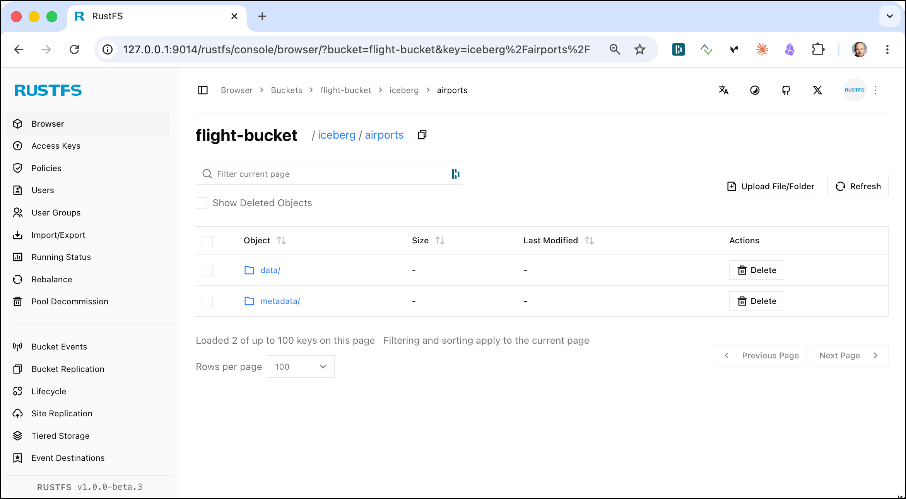
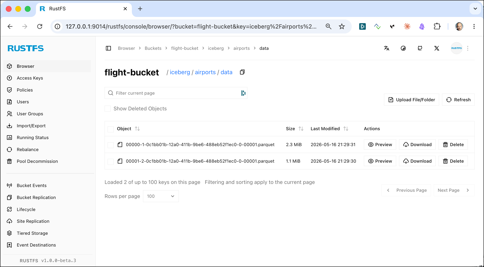
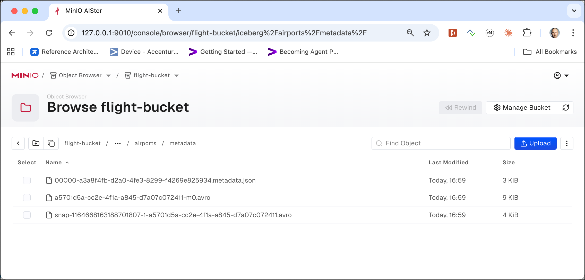
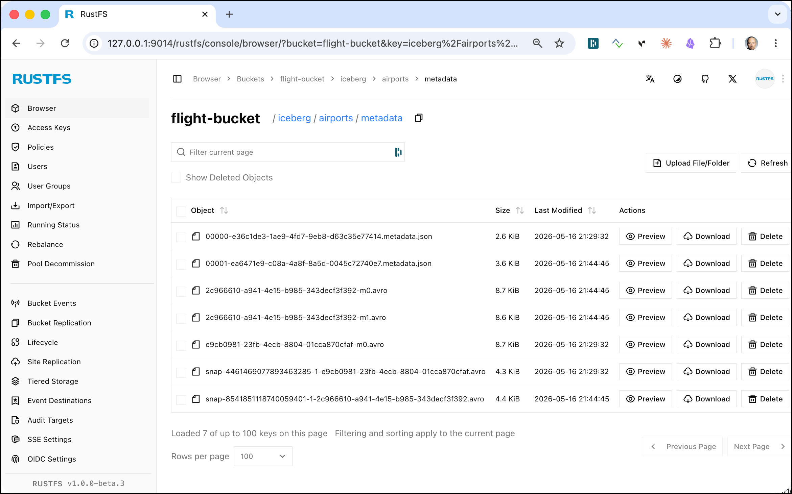

# Working with the Apache Iceberg Table Format

In this workshop we will work with [Apache Iceberg](https://iceberg.apache.org/), a high performance open-source format for large analytic tables. Iceberg enables the use of SQL tables for big data while making it possible for engines like Spark, Trino, Flink, Presto, Hive, Impala, StarRocks, Doris, and Pig to safely work with the same tables, at the same time.

## Table of Contents

- [What you will learn](#what-you-will-learn)
- [Prerequisites](#prerequisites)
- [Prepare the data, if no longer available](#prepare-the-data-if-no-longer-available)
- [Working with Spark and Iceberg table](#working-with-spark-and-iceberg-table)
- [Read the airport data and store it as an Iceberg Table](#read-the-airport-data-and-store-it-as-an-iceberg-table)
- [Update the Iceberg Table](#update-the-iceberg-table)
- [Compaction of small files](#compaction-of-small-files)
- [Read older versions of data using time travel](#read-older-versions-of-data-using-time-travel)
- [Expire old snapshots](#expire-old-snapshots)

## What you will learn

- How to write DataFrames as Apache Iceberg tables stored in MinIO
- How to configure the Iceberg catalog in Spark (Hive Metastore-backed)
- How to perform `INSERT`, `UPDATE`, `DELETE`, and `MERGE INTO` operations on Iceberg tables
- How to use Iceberg's time-travel and snapshot inspection features
- How to inspect Iceberg metadata files (snapshots, manifests, table metadata) in MinIO
- How Iceberg enables multiple engines (Spark, Trino) to safely access the same tables

## Prerequisites

- The **Data Platform** described [here](../00-environment) is running and accessible
- Workshop 3 ([Getting Started using Spark RDD and DataFrames](../03-spark-getting-started)) completed
- Airport data uploaded to MinIO (instructions provided if needed)

## Upload the data, if no longer available

The data needed here has been uploaded in workshop 2 - [Working with RustFS Object Storage](01b-rustfs-object-storage). You can skip this section, if you still have the data available in Object Storage. We show both `s3cmd` and the `mc` version of the commands:

Create the flight bucket:

```bash
docker exec -ti awscli s3cmd mb s3://flight-bucket
```

Upload the data

```bash
docker exec -ti awscli s3cmd put /data-transfer/airport-data/airports.csv s3://flight-bucket/raw/airports/airports.csv
```

## Working with Spark and Iceberg table

In a browser window, navigate to 

  * for Zeppelin:  <http://dataplatform:28080>
  * for Jupyter: <http://dataplatform:28888>

Now let's create a new notebook and name it `SparkIceberg`. 

For **Jupyter**, perform the next paragraph, for **Apache Zeppelin**, this is not necessary and the Spark context is pre-configured.

### If you are using Jupyter

You have to create the Spark context with additional configuration settings in the init script:

```python
import os
# get the accessKey and secretKey from Environment
accessKey = os.environ['AWS_ACCESS_KEY_ID']
secretKey = os.environ['AWS_SECRET_ACCESS_KEY']

from pyspark.sql import SparkSession
spark = (
    SparkSession.builder
        .appName("Jupyter")
        .master("spark://spark-master:7077")

        .config("spark.jars.packages",
                "org.apache.iceberg:iceberg-spark-runtime-3.5_2.12:1.10.1,"
                "org.apache.iceberg:iceberg-aws-bundle:1.10.1")

        .config("spark.hadoop.fs.s3a.impl", "org.apache.hadoop.fs.s3a.S3AFileSystem")
        .config("spark.hadoop.fs.s3a.endpoint", "http://rustfs-1:9000")
        .config("spark.hadoop.fs.s3a.path.style.access", "true")
        .config("spark.hadoop.fs.s3a.access.key", accessKey)
        .config("spark.hadoop.fs.s3a.secret.key", secretKey)
        .config("spark.hadoop.fs.s3a.aws.credentials.provider", "org.apache.hadoop.fs.s3a.SimpleAWSCredentialsProvider")

        # ==== Iceberg catalog (Hive Metastore) ===
        .config("spark.sql.catalog.hive_iceberg", "org.apache.iceberg.spark.SparkCatalog")
        .config("spark.sql.catalog.hive_iceberg.type", "hive")
        .config("spark.sql.catalog.hive_iceberg.uri", "thrift://hive-metastore:9083")
        .config("spark.sql.catalog.hive_iceberg.warehouse.dir", "s3a://admin-bucket/iceberg/warehouse")
    
        # use "hive_iceberg" as the default catalog
        .config("spark.sql.defaultCatalog", "hive_iceberg")

        .config(
            "spark.sql.extensions",
            "org.apache.iceberg.spark.extensions.IcebergSparkSessionExtensions"
        )

        .getOrCreate()
)
```

Also enable sql magic in Jupyter (this will enable the `%%sql` directive to execute plain SQL statements)

```python
%load_ext sql
%config SqlMagic.autopandas = True
%config SqlMagic.displaycon = False

# Connect using the active SparkSession
%sql spark
```

### Add some Markdown first

Navigate to the first cell and start with a title. By using the `%md` directive we can switch to the Markdown interpreter, which can be used for displaying static text.

```
%md 
# Spark Iceberg sample with airport data
```

Click on the **>** symbol on the right or enter **Shift** + **Enter** to run the paragraph.

The markdown code should now be rendered as a Heading-1 title.

## Read the airport data and store it as an Iceberg Table

First add another title, this time as a Heading-2.

```
%md 
## Read the airport data and store it as an Iceberg Table
```

Now let's work with the Airports data, which we have uploaded to `s3://flight-bucket/raw/airports/`.

First import the required Spark Python API. Don't forget to add the `%pyspark` directive in Zeppelin:

```python
from pyspark.sql.types import *
```

Next let's import the airports data into a DataFrame and show the first 5 rows. We define the schema explicitly instead of inferring it, which avoids the double-scan and gives us stable types.

```python
airportSchema = "`id` INTEGER, `ident` STRING, `type` STRING, `name` STRING, \
    `latitude_deg` DOUBLE, `longitude_deg` DOUBLE, `elevation_ft` INTEGER, \
    `continent` STRING, `iso_country` STRING, `iso_region` STRING, \
    `municipality` STRING, `scheduled_service` STRING, `gps_code` STRING, \
    `iata_code` STRING, `local_code` STRING, `home_link` STRING, \
    `wikipedia_link` STRING, `keywords` STRING"

airportsRawDF = spark.read.csv("s3a://flight-bucket/raw/airports",
        sep=",", inferSchema="false", header="true", schema=airportSchema)
airportsRawDF.show(5)
```

The output will show the header line followed by the 5 data lines.

```
+------+-----+-------------+--------------------+-----------------+------------------+------------+---------+-----------+----------+------------+-----------------+--------+---------+----------+--------------------+--------------+--------+
|    id|ident|         type|                name|     latitude_deg|     longitude_deg|elevation_ft|continent|iso_country|iso_region|municipality|scheduled_service|gps_code|iata_code|local_code|           home_link|wikipedia_link|keywords|
+------+-----+-------------+--------------------+-----------------+------------------+------------+---------+-----------+----------+------------+-----------------+--------+---------+----------+--------------------+--------------+--------+
|  6523|  00A|     heliport|   Total RF Heliport|        40.070985|        -74.933689|          11|       NA|         US|     US-PA|    Bensalem|               no|    K00A|     NULL|       00A|https://www.pennd...|          NULL|    NULL|
|323361| 00AA|small_airport|Aero B Ranch Airport|        38.704022|       -101.473911|        3435|       NA|         US|     US-KS|       Leoti|               no|    00AA|     NULL|      00AA|                NULL|          NULL|    NULL|
|  6524| 00AK|small_airport|        Lowell Field|        59.947733|       -151.692524|         450|       NA|         US|     US-AK|Anchor Point|               no|    00AK|     NULL|      00AK|                NULL|          NULL|    NULL|
|  6525| 00AL|small_airport|        Epps Airpark|34.86479949951172|-86.77030181884766|         820|       NA|         US|     US-AL|     Harvest|               no|    00AL|     NULL|      00AL|                NULL|          NULL|    NULL|
|506791| 00AN|small_airport|Katmai Lodge Airport|        59.093287|       -156.456699|          80|       NA|         US|     US-AK| King Salmon|               no|    00AN|     NULL|      00AN|                NULL|          NULL|    NULL|
+------+-----+-------------+--------------------+-----------------+------------------+------------+---------+-----------+----------+------------+-----------------+--------+---------+----------+--------------------+--------------+--------+
only showing top 5 rows
```

Now let's write the data as an Iceberg table. We use the `hive_iceberg` catalog configured above and create a namespace `flight_iceberg_db` (database is a synonym for namespace) to organise our tables:

you can either do it using `spark.sql()` to execute the Spark SQL statement

```python
spark.sql("CREATE NAMESPACE IF NOT EXISTS hive_iceberg.flight_iceberg_db LOCATION 's3a://flight-bucket/iceberg/'")
```

or execute it directly using the `%sql` directive (or `%%sql` if using Jupyter)

```sql
%sql
CREATE  NAMESPACE IF NOT EXISTS hive_iceberg.flight_iceberg_db 
LOCATION 's3a://flight-bucket/iceberg/'
```

and write the data as an Iceberg table

```python
airportsRawDF.writeTo("hive_iceberg.flight_iceberg_db.airports").create()
```

we can always check which table exists in a given catalog and database.

```
%sql
show tables in hive_iceberg.flight_iceberg_db
```

Let's view the resulting objects using the `s3cmd` command line tool

```bash
docker exec -ti awscli s3cmd ls --recursive s3://flight-bucket/iceberg/airports/
```

and you should see that the data has been written as parquet files under a `data/` folder, with an `metadata/` folder holding the Iceberg metadata

```bash
2026-05-16 19:29      2374368  s3://flight-bucket/iceberg/airports/data/00000-1-0c1bb01b-12a0-411b-9be6-488eb52f1ec0-0-00001.parquet
2026-05-16 19:29      1146523  s3://flight-bucket/iceberg/airports/data/00001-2-0c1bb01b-12a0-411b-9be6-488eb52f1ec0-0-00001.parquet
2026-05-16 19:29         2627  s3://flight-bucket/iceberg/airports/metadata/00000-e36c1de3-1ae9-4fd7-9eb8-d63c35e77414.metadata.json
2026-05-16 19:29         8919  s3://flight-bucket/iceberg/airports/metadata/e9cb0981-23fb-4ecb-8804-01cca870cfaf-m0.avro
2026-05-16 19:29         4453  s3://flight-bucket/iceberg/airports/metadata/snap-4461469077893463285-1-e9cb0981-23fb-4ecb-8804-01cca870cfaf.avro
```

> **What you should see:** Two Parquet data files in `data/` and three metadata files in `metadata/`: a `.metadata.json` (the table's top-level catalog entry), a `-m0.avro` manifest file (listing all data files with their statistics), and a `snap-...avro` snapshot file (the manifest list for this snapshot). This three-level metadata hierarchy is more complex than Delta Lake's single JSON log but enables the concurrent, multi-engine access that makes Iceberg unique.

> **What just happened?** `writeTo().create()` registered the table in the Hive Metastore catalog (`hive_iceberg`) and wrote both the Parquet data files and the complete Iceberg metadata tree. Unlike Delta Lake's append-only JSON log, Iceberg uses immutable files at every level: the metadata JSON points to a snapshot Avro file, which points to a manifest list Avro file, which in turn references the actual Parquet data files. This immutability is what allows Iceberg to support concurrent reads and writes from different engines (Spark, Trino, Flink) against the same table simultaneously.

We can also use the RustFS Console to see the data.



click on the `data/` folder to see the datafiles behind the iceberg table



click on the `metadata/` folder to see the datafiles behind the iceberg table



### Viewing the Iceberg table metadata

Unlike Delta Lake which uses plain JSON files for its transaction log, Iceberg uses a combination of JSON metadata files and Avro manifest files.

Let's download and inspect the initial table metadata JSON file (replace `<snapshot-id>` by the correct UUID (`00000-e36c1de3-1ae9-4fd7-9eb8-d63c35e77414` in the case here):

```bash
docker exec -ti awscli s3cmd get s3://flight-bucket/iceberg/airports/metadata/<snapshot-id>.metadata.json --force /data-transfer/iceberg-metadata.json
```

Let's view the content using the `jq` utility

```bash
cd $DATAPLATFORM_HOME
jq < ./data-transfer/iceberg-metadata.json
```

you should see content similar to the one shown below

```json
{
  "format-version": 2,
  "table-uuid": "f5f89db8-a51e-42b0-bb55-7aa58346300a",
  "location": "s3a://flight-bucket/iceberg/airports",
  "last-sequence-number": 1,
  "last-updated-ms": 1778959772104,
  "last-column-id": 18,
  "current-schema-id": 0,
  "schemas": [
    {
      "type": "struct",
      "schema-id": 0,
      "fields": [
        {
          "id": 1,
          "name": "id",
          "required": false,
          "type": "int"
        },
        {
          "id": 2,
          "name": "ident",
          "required": false,
          "type": "string"
        },
        {
          "id": 3,
          "name": "type",
          "required": false,
          "type": "string"
        },
        {
          "id": 4,
          "name": "name",
          "required": false,
          "type": "string"
        },
        {
          "id": 5,
          "name": "latitude_deg",
          "required": false,
          "type": "double"
        },
        {
          "id": 6,
          "name": "longitude_deg",
          "required": false,
          "type": "double"
        },
        {
          "id": 7,
          "name": "elevation_ft",
          "required": false,
          "type": "int"
        },
        {
          "id": 8,
          "name": "continent",
          "required": false,
          "type": "string"
        },
        {
          "id": 9,
          "name": "iso_country",
          "required": false,
          "type": "string"
        },
        {
          "id": 10,
          "name": "iso_region",
          "required": false,
          "type": "string"
        },
        {
          "id": 11,
          "name": "municipality",
          "required": false,
          "type": "string"
        },
        {
          "id": 12,
          "name": "scheduled_service",
          "required": false,
          "type": "string"
        },
        {
          "id": 13,
          "name": "gps_code",
          "required": false,
          "type": "string"
        },
        {
          "id": 14,
          "name": "iata_code",
          "required": false,
          "type": "string"
        },
        {
          "id": 15,
          "name": "local_code",
          "required": false,
          "type": "string"
        },
        {
          "id": 16,
          "name": "home_link",
          "required": false,
          "type": "string"
        },
        {
          "id": 17,
          "name": "wikipedia_link",
          "required": false,
          "type": "string"
        },
        {
          "id": 18,
          "name": "keywords",
          "required": false,
          "type": "string"
        }
      ]
    }
  ],
  "default-spec-id": 0,
  "partition-specs": [
    {
      "spec-id": 0,
      "fields": []
    }
  ],
  "last-partition-id": 999,
  "default-sort-order-id": 0,
  "sort-orders": [
    {
      "order-id": 0,
      "fields": []
    }
  ],
  "properties": {
    "owner": "jovyan",
    "write.parquet.compression-codec": "zstd"
  },
  "current-snapshot-id": 4461469077893463285,
  "refs": {
    "main": {
      "snapshot-id": 4461469077893463285,
      "type": "branch"
    }
  },
  "snapshots": [
    {
      "sequence-number": 1,
      "snapshot-id": 4461469077893463285,
      "timestamp-ms": 1778959772104,
      "summary": {
        "operation": "append",
        "spark.app.id": "app-20260516192853-0011",
        "added-data-files": "2",
        "added-records": "81193",
        "added-files-size": "3520891",
        "changed-partition-count": "1",
        "total-records": "81193",
        "total-files-size": "3520891",
        "total-data-files": "2",
        "total-delete-files": "0",
        "total-position-deletes": "0",
        "total-equality-deletes": "0",
        "engine-version": "3.5.3",
        "app-id": "app-20260516192853-0011",
        "engine-name": "spark",
        "iceberg-version": "Apache Iceberg 1.10.1 (commit ccb8bc435062171e64bc8b7e5f56e6aed9c5b934)"
      },
      "manifest-list": "s3a://flight-bucket/iceberg/airports/metadata/snap-4461469077893463285-1-e9cb0981-23fb-4ecb-8804-01cca870cfaf.avro",
      "schema-id": 0
    }
  ],
  "statistics": [],
  "partition-statistics": [],
  "snapshot-log": [
    {
      "timestamp-ms": 1778959772104,
      "snapshot-id": 4461469077893463285
    }
  ],
  "metadata-log": []
}
```

Iceberg also provides convenient metadata tables that you can query directly with SQL. These are much easier to inspect than raw files:

Select either using `spark.sql()` in pyspark 

```python
spark.sql("SELECT * FROM hive_iceberg.flight_iceberg_db.airports.snapshots").show(truncate=False)
```

or diretly using the SQL with a `%sql` directive (`%%sql` in Jupyter)

```
%sql SELECT * FROM hive_iceberg.flight_iceberg_db.airports.snapshots
```

you should get a result with one row, similar to shown below

```
+-----------------------+-------------------+---------+---------+------------------------------------------------------------------------------------------------------------------+------------------------------------------------------------------------------------------------------------------------------------------------------------------------------------------------------------------------------------------------------------------------------------------------------------------------------------------------------------------------------------------------------------------------------------------------------------------------------------------------+
|committed_at           |snapshot_id        |parent_id|operation|manifest_list                                                                                                     |summary                                                                                                                                                                                                                                                                                                                                                                                                                                                                                         |
+-----------------------+-------------------+---------+---------+------------------------------------------------------------------------------------------------------------------+------------------------------------------------------------------------------------------------------------------------------------------------------------------------------------------------------------------------------------------------------------------------------------------------------------------------------------------------------------------------------------------------------------------------------------------------------------------------------------------------+
|2026-04-03 14:59:41.914|1164668163188701807|NULL     |append   |s3a://flight-bucket/iceberg/airports/metadata/snap-1164668163188701807-1-a5701d5a-cc2e-4f1a-a845-d7a07c072411.avro|{spark.app.id -> app-20260403145823-0001, added-data-files -> 2, added-records -> 81193, added-files-size -> 3520891, changed-partition-count -> 1, total-records -> 81193, total-files-size -> 3520891, total-data-files -> 2, total-delete-files -> 0, total-position-deletes -> 0, total-equality-deletes -> 0, engine-version -> 3.5.3, app-id -> app-20260403145823-0001, engine-name -> spark, iceberg-version -> Apache Iceberg 1.10.1 (commit ccb8bc435062171e64bc8b7e5f56e6aed9c5b934)}|
+-----------------------+-------------------+---------+---------+------------------------------------------------------------------------------------------------------------------+------------------------------------------------------------------------------------------------------------------------------------------------------------------------------------------------------------------------------------------------------------------------------------------------------------------------------------------------------------------------------------------------------------------------------------------------------------------------------------------------+
```

> **What you should see:** One snapshot row with operation `append`, showing the commit timestamp and a summary map containing statistics such as `added-data-files -> 2`, `added-records -> 81193`, and `total-records -> 81193`. The `manifest_list` column provides the S3 path to the Avro snapshot file for this operation.

> **What just happened?** Iceberg stores all table history as an append-only sequence of snapshots. The `.snapshots` suffix on the table name is an Iceberg metadata table — a special virtual table that Iceberg exposes so you can query table history using plain SQL, without downloading and parsing raw Avro files. Every write operation to an Iceberg table creates a new snapshot, and the metadata tables give you a SQL interface to inspect them.

```python
spark.sql("SELECT * FROM hive_iceberg.flight_iceberg_db.airports.history").show(truncate=False)
```

```python
spark.sql("SELECT * FROM hive_iceberg.flight_iceberg_db.airports.files").show(truncate=False)
```

## Update the Iceberg Table

First let's create some updates we want to apply to the Iceberg table. We have a new Airport with the code "ADD" (which does not yet exist) and update the name of the existing airport with code "00A" to uppercase.

```python
newAirportsData = [(999, "ADD", "small_airport", "This is a new airport", 0.0, 0.0, 0, "US", "US", "CA", "San Francisco", "", "", "ADD", "", "", "", ""),
        (6523, "00A", "heliport", "TOTAL RF HELIPORT", 40.070985, -74.933689, 11, "NA", "US", "US-PA", "Bensalem", "no", "K00A", "", "00A", "https://www.penndot.pa.gov/TravelInPA/airports-pa/Pages/Total-RF-Heliport.aspx", "", "")]
```

Let's create a DataFrame from it:

```python
newAirportsRDD = spark.sparkContext.parallelize(newAirportsData)

newAirportsDF = spark.createDataFrame(newAirportsRDD, airportsRawDF.schema)
newAirportsDF.show()
```

This `newAirportsDF` dataframe represents the new raw data we would get from a source system.

Register the new data as a temporary view so we can reference it in the SQL MERGE statement:

```python
newAirportsDF.createOrReplaceTempView("newAirports")
```

Now perform the merge using Iceberg's SQL MERGE INTO statement:

```python
spark.sql("""
    MERGE INTO hive_iceberg.flight_iceberg_db.airports AS target
    USING newAirports AS source
    ON target.ident = source.ident
    WHEN MATCHED THEN UPDATE SET *
    WHEN NOT MATCHED THEN INSERT *
""")
```

Let's view the resulting objects using the `s3cmd` command line tool

```bash
docker exec -ti awscli s3cmd ls --recursive s3://flight-bucket/iceberg/airports/
```

and you should see that new data files have been written, and that a new metadata JSON file and a new snapshot Avro file have been created in the `metadata/` folder

```bash
2026-05-16 19:29      2374368  s3://flight-bucket/iceberg/airports/data/00000-1-0c1bb01b-12a0-411b-9be6-488eb52f1ec0-0-00001.parquet
2026-05-16 19:44      1261619  s3://flight-bucket/iceberg/airports/data/00000-21-d51e048e-a3bb-4141-a718-bd1010ac86e9-0-00001.parquet
2026-05-16 19:29      1146523  s3://flight-bucket/iceberg/airports/data/00001-2-0c1bb01b-12a0-411b-9be6-488eb52f1ec0-0-00001.parquet
2026-05-16 19:44      1290332  s3://flight-bucket/iceberg/airports/data/00001-22-d51e048e-a3bb-4141-a718-bd1010ac86e9-0-00001.parquet
2026-05-16 19:29         2627  s3://flight-bucket/iceberg/airports/metadata/00000-e36c1de3-1ae9-4fd7-9eb8-d63c35e77414.metadata.json
2026-05-16 19:44         3714  s3://flight-bucket/iceberg/airports/metadata/00001-ea6471e9-c08a-4a8f-8a5d-0045c72740e7.metadata.json
2026-05-16 19:44         8932  s3://flight-bucket/iceberg/airports/metadata/2c966610-a941-4e15-b985-343decf3f392-m0.avro
2026-05-16 19:44         8832  s3://flight-bucket/iceberg/airports/metadata/2c966610-a941-4e15-b985-343decf3f392-m1.avro
2026-05-16 19:29         8919  s3://flight-bucket/iceberg/airports/metadata/e9cb0981-23fb-4ecb-8804-01cca870cfaf-m0.avro
2026-05-16 19:29         4453  s3://flight-bucket/iceberg/airports/metadata/snap-4461469077893463285-1-e9cb0981-23fb-4ecb-8804-01cca870cfaf.avro
2026-05-16 19:44         4497  s3://flight-bucket/iceberg/airports/metadata/snap-8541851118740059401-1-2c966610-a941-4e15-b985-343decf3f392.avro
```

We can also alternatively use the RustFS console to see the data



or by querying the `snapshots` Iceberg metadata table

```python
spark.sql("SELECT * FROM hive_iceberg.flight_iceberg_db.airports.snapshots").show(truncate=False)
```

You should now see two snapshots — the initial `append` and a new `overwrite` from the merge:

```
+-----------------------+-------------------+-------------------+---------+------------------------------------------------------------------------------------------------------------------+----------------------------------------------------------------------------------------------------------------------------------------------------------------------------------------------------------------------------------------------------------------------------------------------------------------------------------------------------------------------------------------------------------------------------------------------------------------------------------------------------------------------------------------------------------------------------------+
|committed_at           |snapshot_id        |parent_id          |operation|manifest_list                                                                                                     |summary                                                                                                                                                                                                                                                                                                                                                                                                                                                                                                                                                                           |
+-----------------------+-------------------+-------------------+---------+------------------------------------------------------------------------------------------------------------------+----------------------------------------------------------------------------------------------------------------------------------------------------------------------------------------------------------------------------------------------------------------------------------------------------------------------------------------------------------------------------------------------------------------------------------------------------------------------------------------------------------------------------------------------------------------------------------+
|2026-04-03 14:59:41.914|1164668163188701807|NULL               |append   |s3a://flight-bucket/iceberg/airports/metadata/snap-1164668163188701807-1-a5701d5a-cc2e-4f1a-a845-d7a07c072411.avro|{spark.app.id -> app-20260403145823-0001, added-data-files -> 2, added-records -> 81193, added-files-size -> 3520891, changed-partition-count -> 1, total-records -> 81193, total-files-size -> 3520891, total-data-files -> 2, total-delete-files -> 0, total-position-deletes -> 0, total-equality-deletes -> 0, engine-version -> 3.5.3, app-id -> app-20260403145823-0001, engine-name -> spark, iceberg-version -> Apache Iceberg 1.10.1 (commit ccb8bc435062171e64bc8b7e5f56e6aed9c5b934)}                                                                                  |
|2026-04-03 15:18:49.759|4018939087453753958|1164668163188701807|overwrite|s3a://flight-bucket/iceberg/airports/metadata/snap-4018939087453753958-1-48b85f13-5a8a-428f-a2d4-f9e12d16aa05.avro|{spark.app.id -> app-20260403145823-0001, added-data-files -> 2, deleted-data-files -> 1, added-records -> 54025, deleted-records -> 54024, added-files-size -> 2551951, removed-files-size -> 2374368, changed-partition-count -> 1, total-records -> 81194, total-files-size -> 3698474, total-data-files -> 3, total-delete-files -> 0, total-position-deletes -> 0, total-equality-deletes -> 0, engine-version -> 3.5.3, app-id -> app-20260403145823-0001, engine-name -> spark, iceberg-version -> Apache Iceberg 1.10.1 (commit ccb8bc435062171e64bc8b7e5f56e6aed9c5b934)}|
+-----------------------+-------------------+-------------------+---------+------------------------------------------------------------------------------------------------------------------+----------------------------------------------------------------------------------------------------------------------------------------------------------------------------------------------------------------------------------------------------------------------------------------------------------------------------------------------------------------------------------------------------------------------------------------------------------------------------------------------------------------------------------------------------------------------------------+
```

> **What you should see:** Two snapshot rows — the initial `append` and a new `overwrite` from the MERGE. The overwrite snapshot's summary shows `added-data-files -> 2`, `deleted-data-files -> 1`, `added-records -> 54025`, and `deleted-records -> 54024`, confirming that the affected partition file was rewritten with the upserted rows.

> **What just happened?** Iceberg's MERGE INTO rewrote the file containing the affected row ("00A") and created a new snapshot. Unlike Delta Lake's append-only JSON log, Iceberg updates the manifest entry for the rewritten file — the old manifest becomes part of the previous snapshot only, while the new snapshot references both the surviving old files and the newly written ones. This immutable snapshot-per-operation model is what allows Iceberg to serve concurrent reads from a previous snapshot while a write is in progress on the same table.

Let's use SQL to query the Iceberg table either using `spark.sql()` 

```python
spark.sql("""
	SELECT * 
	FROM hive_iceberg.flight_iceberg_db.airports
	WHERE ident IN ('00A','ADD')
""").show()
```
or the `%sql` directive (again `%%sql` if using Jupyter)

```sql
%sql
SELECT * 
FROM hive_iceberg.flight_iceberg_db.airports
WHERE ident IN ('00A','ADD')
```
and you should see two rows in the result — the updated record and the newly inserted one.

## Compaction of small files

Iceberg can improve the speed of read queries by rewriting small data files into larger ones using the `rewrite_data_files` stored procedure.

```python
spark.sql("""
    CALL hive_iceberg.system.rewrite_data_files(
        table => 'flight_iceberg_db.airports',
        options => map('target-file-size-bytes', '134217728')
    )
""").show()
```

The output will show how many files were rewritten:

```
+--------------------------+----------------------+---------------------+-----------------------+--------------------------+
|rewritten_data_files_count|added_data_files_count|rewritten_bytes_count|failed_data_files_count|removed_delete_files_count|
+--------------------------+----------------------+---------------------+-----------------------+--------------------------+
|                         3|                    83|              3698474|                      0|                         0|
+--------------------------+----------------------+---------------------+-----------------------+--------------------------+
```

> **What you should see:** The procedure rewrote all 3 existing data files into 83 new files (smaller target file size splits the data into more files). `rewritten_bytes_count` matches the total size of the input files, confirming all data was processed.

> **What just happened?** `rewrite_data_files` compacted the three Parquet files into smaller, more uniformly sized files targeting 128 MB each (the `target-file-size-bytes` setting). This creates a new Iceberg snapshot with the rewritten files while the old files are retained until `expire_snapshots` removes them. Compaction is a maintenance operation — it does not change the logical table content, only the physical file layout to improve read performance.

## Read older versions of data using time travel

Iceberg time travel allows you to query an older snapshot of an Iceberg table by snapshot ID or timestamp.

First, let's retrieve the snapshot IDs so we know which version to travel to:

```python
snapshots = spark.sql("""
	SELECT snapshot_id, committed_at, operation 
	FROM hive_iceberg.flight_iceberg_db.airports.snapshots
	""").collect()
for s in snapshots:
    print(s)
```

**Time travel by snapshot ID** — go back to the first snapshot (initial insert):

```python
firstSnapshotId = str(snapshots[0]["snapshot_id"])
print ("Redcover to snapshot: " + firstSnapshotId)

spark.sql(f"""
    SELECT *
    FROM hive_iceberg.flight_iceberg_db.airports
    VERSION AS OF {firstSnapshotId}
""").show()
```

if we query for the "00A" and "ADD" codes, we can see that we are getting the original data (no "ADD" airport, original name for "00A"):

```python
firstSnapshotId = str(snapshots[0]["snapshot_id"])
print ("Redcover to snapshot: " + firstSnapshotId)

spark.sql(f"""
    SELECT *
    FROM hive_iceberg.flight_iceberg_db.airports
    VERSION AS OF {firstSnapshotId}
    WHERE ident IN ('00A','ADD')
""").show()
```

**Time travel by timestamp** — you can also use a timestamp string:

```python
commitedAt = str(snapshots[0]["committed_at"])
print ("Redcover to timestamp: " + commitedAt)

spark.sql(f"""
    SELECT *
    FROM hive_iceberg.flight_iceberg_db.airports
    TIMESTAMP AS OF '{timestamp}'
    WHERE ident IN ('00A','ADD')
""").show()
```

By default, Iceberg retains all snapshots until they are explicitly expired. This means you can always travel back to any point in time, as long as the snapshots have not been expired.

## Expire old snapshots

You can remove snapshots older than a given timestamp using the `expire_snapshots` stored procedure. This is similar to Delta Lake's vacuum command and removes snapshot metadata (and optionally orphan data files) that are no longer needed.

```python
from datetime import datetime, timedelta

# Expire snapshots older than 7 days
expire_before = datetime.now() - timedelta(days=7)
expire_before_ms = int(expire_before.timestamp() * 1000)

spark.sql(f"""
    CALL hive_iceberg.system.expire_snapshots(
        table => 'flight_iceberg_db.airports',
        older_than => TIMESTAMP '{expire_before.strftime('%Y-%m-%d %H:%M:%S')}'
    )
""").show()
```

The output shows how many snapshots and files were removed (because we defined 7 days, there is nothing to remove yet):

```
+------------------------+-----------------------------------+-----------------------------------+----------------------------+----------------------------+------------------------------+
|deleted_data_files_count|deleted_position_delete_files_count|deleted_equality_delete_files_count|deleted_manifest_files_count|deleted_manifest_lists_count|deleted_statistics_files_count|
+------------------------+-----------------------------------+-----------------------------------+----------------------------+----------------------------+------------------------------+
|                       0|                                  0|                                  0|                           0|                           0|                             0|
+------------------------+-----------------------------------+-----------------------------------+----------------------------+----------------------------+------------------------------+
```

> **What you should see:** All counts show `0` — no snapshots, manifests, or data files were removed. This is expected because the retention window is 7 days and all snapshots in this workshop are only minutes old.

> **What just happened?** `expire_snapshots` removes snapshot metadata entries and any data files no longer referenced by a surviving snapshot, freeing up storage space. The 7-day retention period is a safety guard: it prevents removing snapshots that upstream consumers may still be reading via time travel. In production you would schedule this procedure as regular table maintenance, equivalent to Delta Lake's `VACUUM` command.

You can also remove orphan files (data files not referenced by any snapshot) using:

```python
spark.sql("""
    CALL hive_iceberg.system.remove_orphan_files(table => 'flight_iceberg_db.airports')
""").show()
```

Let's view the resulting objects using the `s3cmd` command line tool after the cleanup:

```bash
docker exec -ti awscli s3cmd ls --recursive s3://flight-bucket/iceberg/airports/
```

and you would see that the old data files and metadata entries for expired snapshots have been removed.
