# Data Ingestion with Apache NiFi

In this workshop we will see how we can use [Apache NiFi](http://nifi.apache.org) to ingest the flight data automatically into S3 object storage. It shows the usage of Apache NiFi for Batch-Data (delta) ingestion, refer to the Streaming Workshop for a workshop where Apache NiFi is used in a Stream-Data Ingestion.

## Create the Bucket in S3

For this workshop we will use a new bucket, separate from the other workshops. Use the following command to create the `flight-nifi-bucket`.

```bash
docker exec -ti minio-mc mc mb minio-1/flight-nifi-bucket
```

## Create the Nifi data flow

In a browser navigate to <https://dataplatform:18080/nifi> (make sure to replace `dataplatform` by the IP address of the machine where docker runs on,). We have enabled authentication for NiFi, therefore you have to use https to access it. Due to the use of a self-signed certificate, you have to initially confirm that the page is safe and you want to access the page.

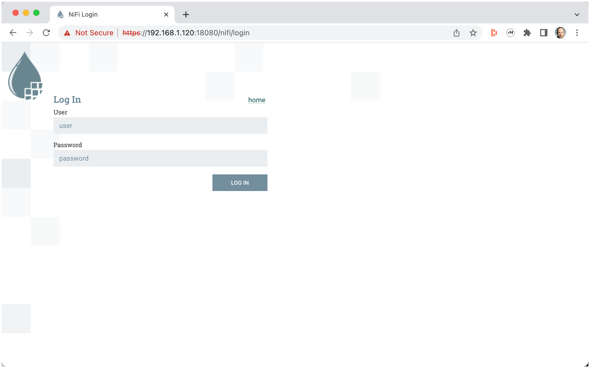

Enter `nifi``into the **User** field and `1234567890ACD` into the **Password** field and click **LOG IN**.

This should bring up the NiFi User Interface, which at this point is a blank canvas for orchestrating a data flow.

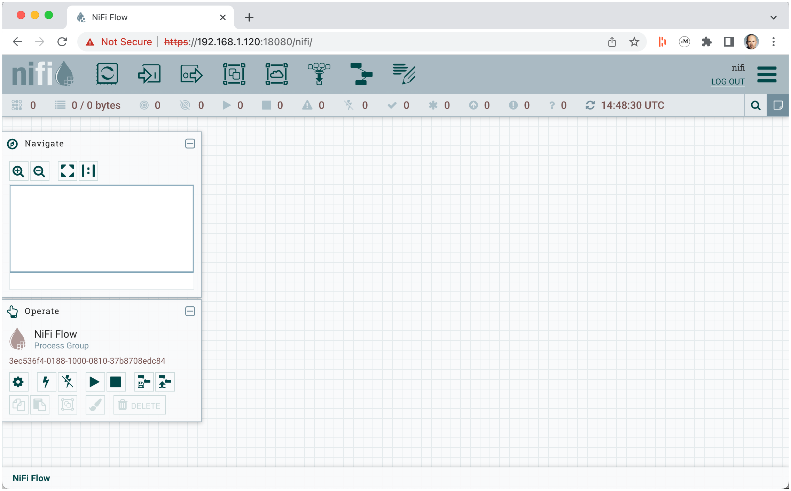

Now you can add **Processor**s to create the pipeline. 

Let's start with the input. 

### Adding a `GetFile` Processor

We can now begin creating our data flow by adding a Processor to our canvas. To do this, drag the Processor icon from the top-left of the screen into the middle of the canvas and drop it there. 

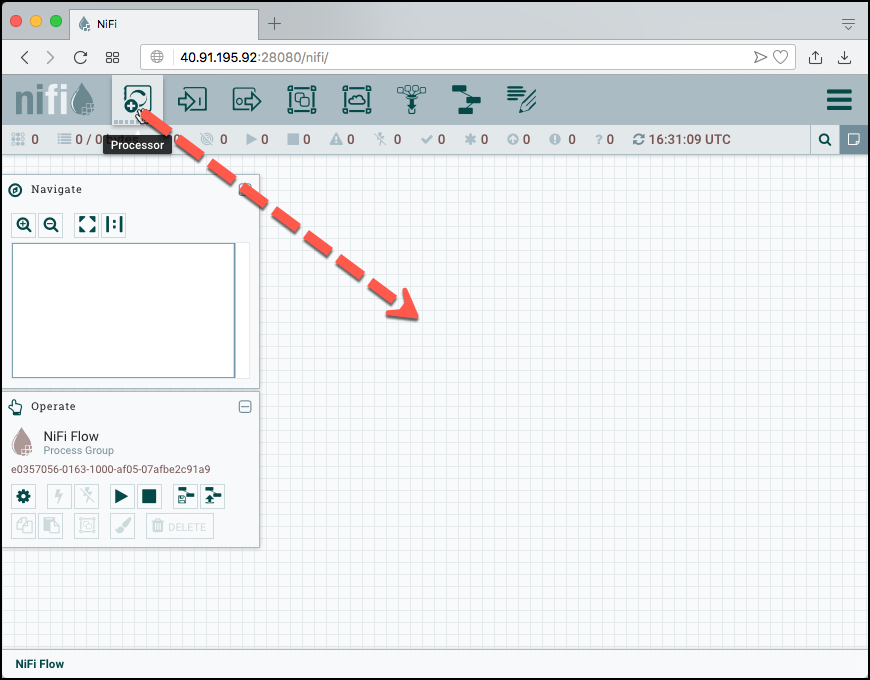

This will give us a dialog that allows us to choose which Processor we want to add. We can see that there are a total of 260 processors currently available. We can browse through the list or use the tag cloud on the left to filter the processors by type.

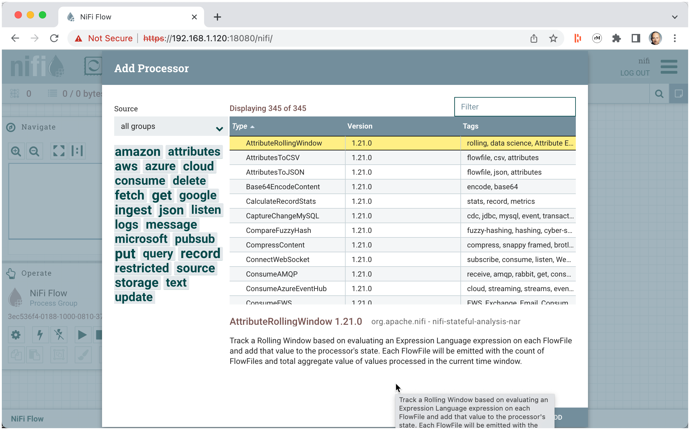

Enter **GetF** into the search field and the list will be reduced to two processors, the **GetFTP** and the **GetFile** processor. As the name implies, the first one can be used to get files from a FTP server, whereas the second one can be used to read local files. We will use the later here. Navigate to the **GetFile** and click **ADD**.

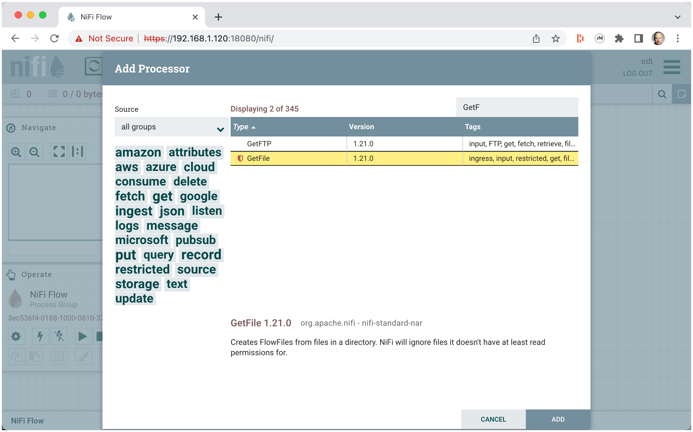

You should now see the canvas with the **GetFile** processor. A yellow marker is shown on the processor, telling that the processor is not yet configured properly. 

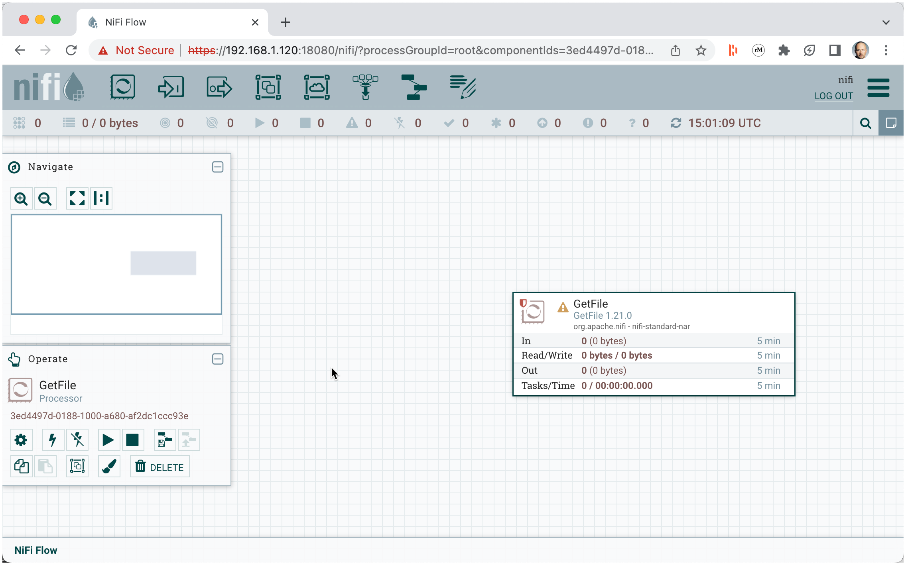

Double-click on the **GetFile** processor and the properties page of the processor appears. Here you can change the name of Twitter processor among other general properties.

Click on **PROPERTIES** tab to switch to the properties page.

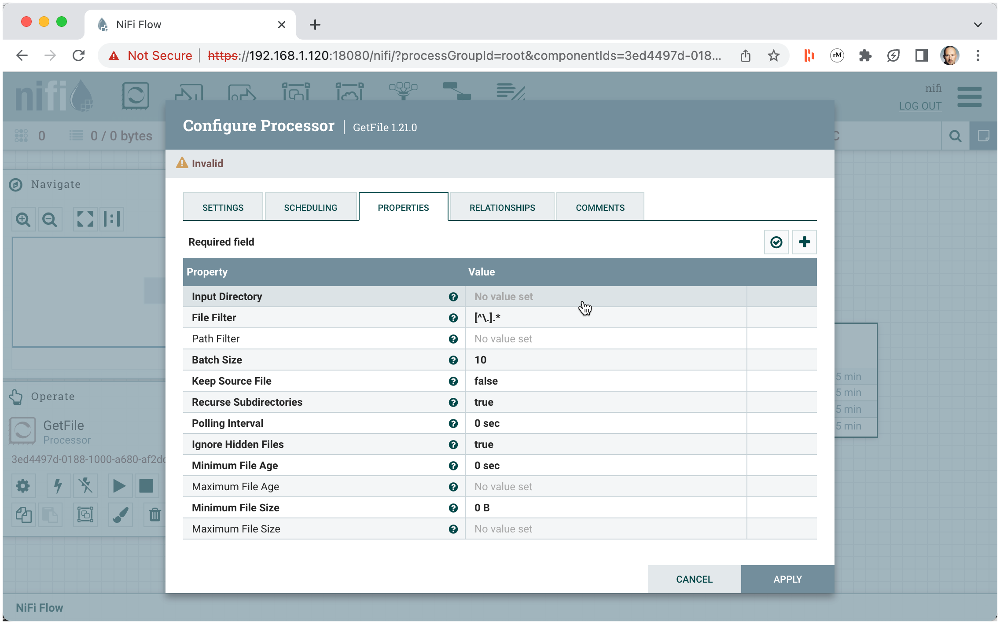

On the properties page, we configure the properties for reading the data from the local file system.  

Set the properties as follows:

  * **Input Directory**: `/data-transfer/landing-zone`
  * **File Filter**: `[^\.].*\.xlsx`
  * **Recursive Subdirectories**: `false`
  * **Minimum File Age**: `5 sec`

The **Configure Processor** should look as shown below

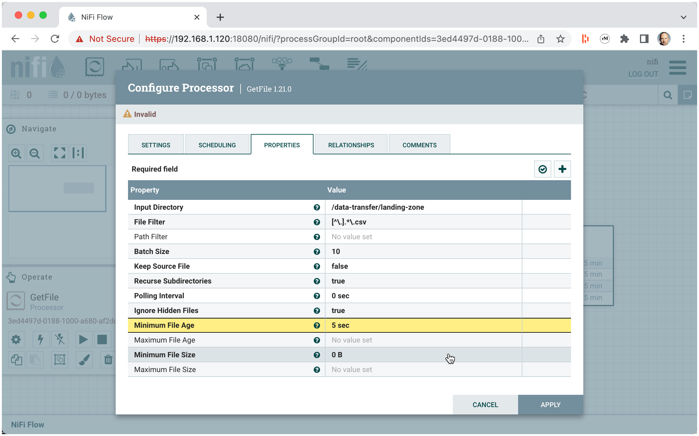

Click **APPLY** to close the window.

The `GetFile` processor still shows the yellow marker, this is because the out-going relationship is neither used nor terminated. Of course we want to use it, but for that we first need another Processor to store the data in S3 object storage. 

### Adding a `PutS3Object` Processor

Drag a new Processor onto the Canvas, just below the **GetFile** processor. 

Enter **PutS3** into the Filter field on top right. Only a single processor, the `PutS3Object` is shown.

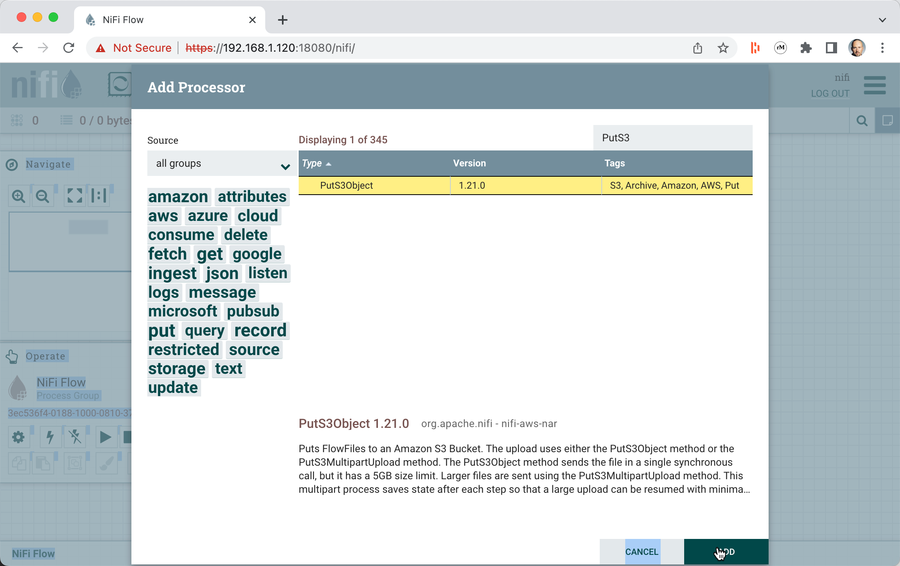

Click on **ADD** to add it to the canvas as well. The canvas should now look like shown below. You can drag around the processor to organize them in the right order. It is recommended to organize the in main flow direction, either top-to-bottom or left-to-right. 

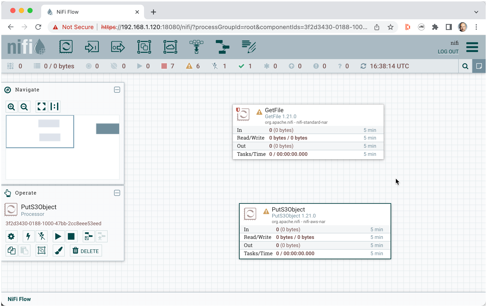

Let's configure the new processor. Double-click on the `PutS3Object` and navigate to **PROPERTIES**.

  * **Object Key**: `/raw/airport/${ingestionTime}/${filename}`
  * **Bucket**: `flight-nifi-bucket`
  * **Access Key ID**: V42FCGRVMK24JJ8DHUYG`
  * **Secret Access Key**: `bKhWxVF3kQoLY9kFmt91l+tDrEoZjqnWXzY9Eza`
  * **Endpoint Override URL**: `http://minio-1:9000`
  * **Use Path Style Access**: `true`

The **Configure Processor** should look as shown below. 

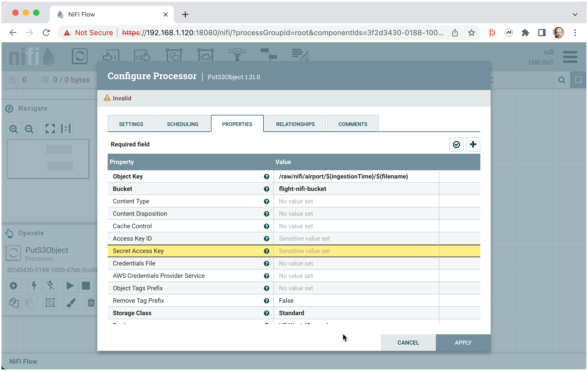

**Note**: NiFi does not display username and password values, they are instead shown as `Sensitive value set` when they hold a value.

Click **APPLY** to close the window.

We also use a variable `ingestionTime` in the **Object Key** expression, which we need to set to the current timestamp when a file is processed. We will do that now by adding an additional **UpdateAttribute** processor.

### Set Variable using `UpdateAttribute` processor

Drag a new Processor onto the Canvas, in between the **GetFile** and **PutS3Object** processor. 

Enter **updateA** into the Filter field on top right. Only a single processor, the `UpdateAttribute ` is shown. Click **ADD** to add it to the canvas as well

Now let's configure the new processor. Double-click on the `UpdateAttribute ` and navigate to **PROPERTIES**. In this case we do not have to update an existing property but instead add a new one. Click on **+** in the upper right corner of the **Configure Processor** window. 

Enter `ingestionTime` into the **Property Name** and click **OK**. Enter the following expression `${now():format("yyyy-MM-dd'T'HH:mm:ss")}` into the pop-up window for the value. 

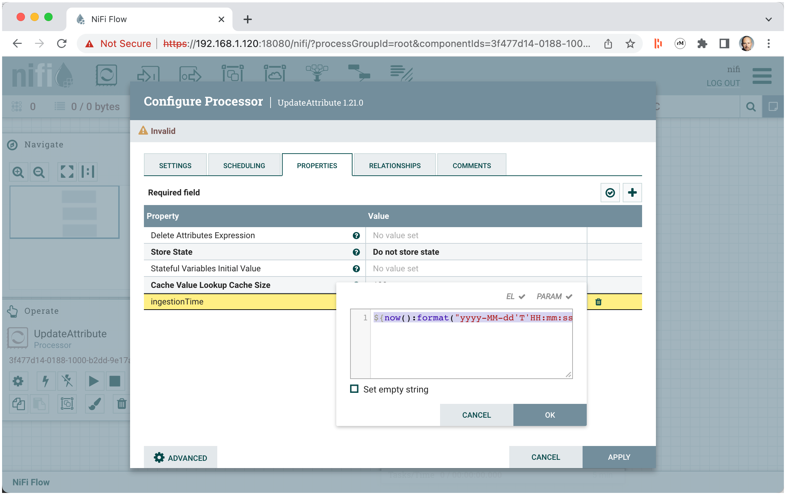

Click **OK** and then **APPLY**.

Now with the 3 processors on the canvas, ordered in the direction of the data flow

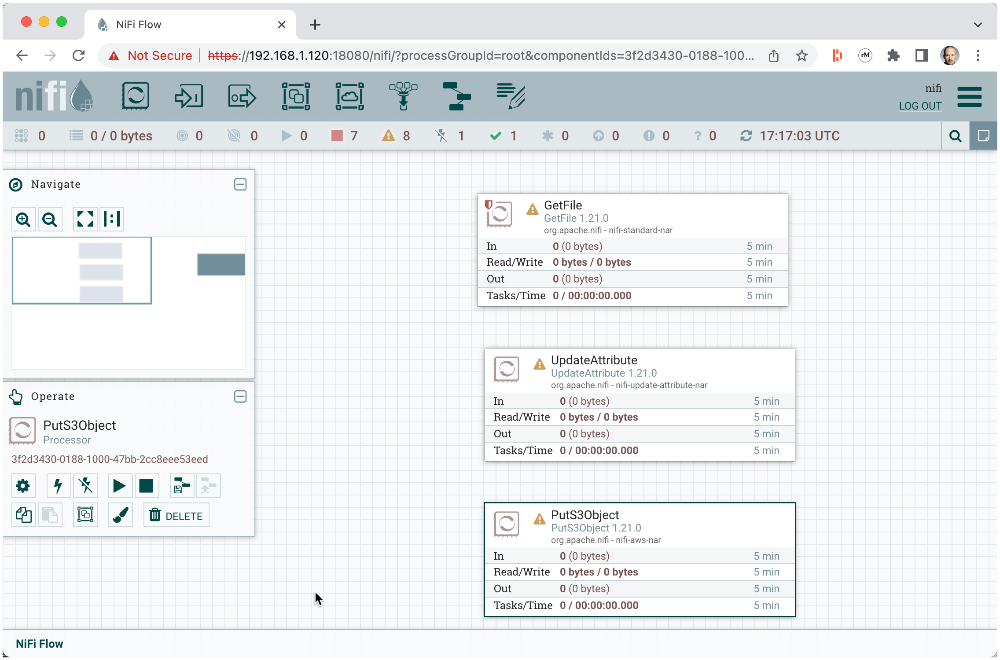

all we have to do before we can run it is connecting the processors.

### Connecting the Processors

Drag a connection from the **GetFile** processor to the **UpdateProcessor** and drop it. 

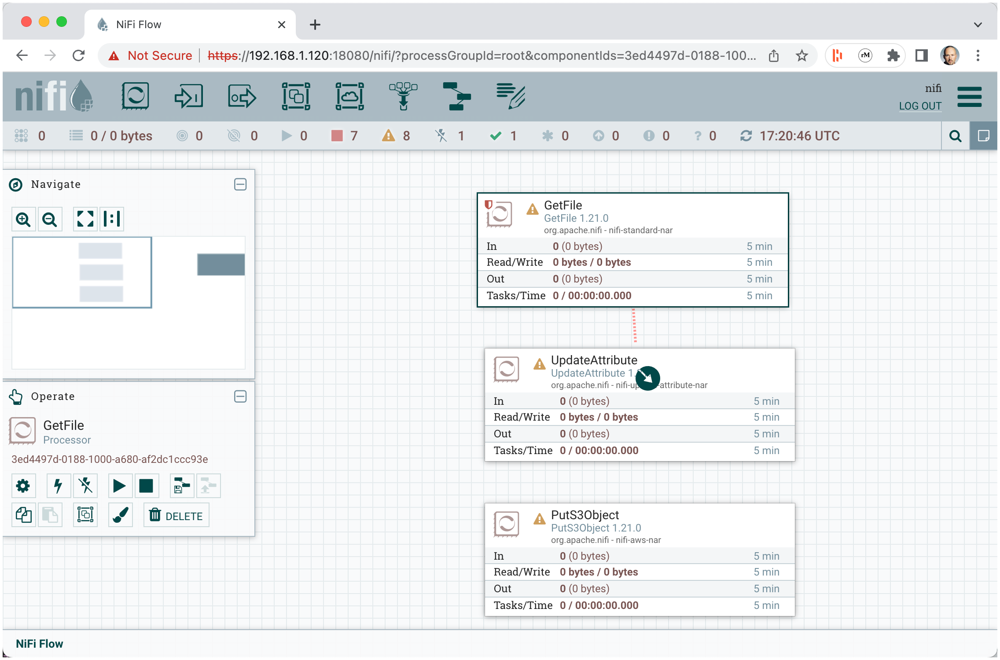

Make sure that **For Relationship** is enabled for the `success` relationship and click **ADD**. 

Repeat it for the connection from **UpdateAttribute** to **PutS3Object**. The data flow on the canvas should now look as shown below

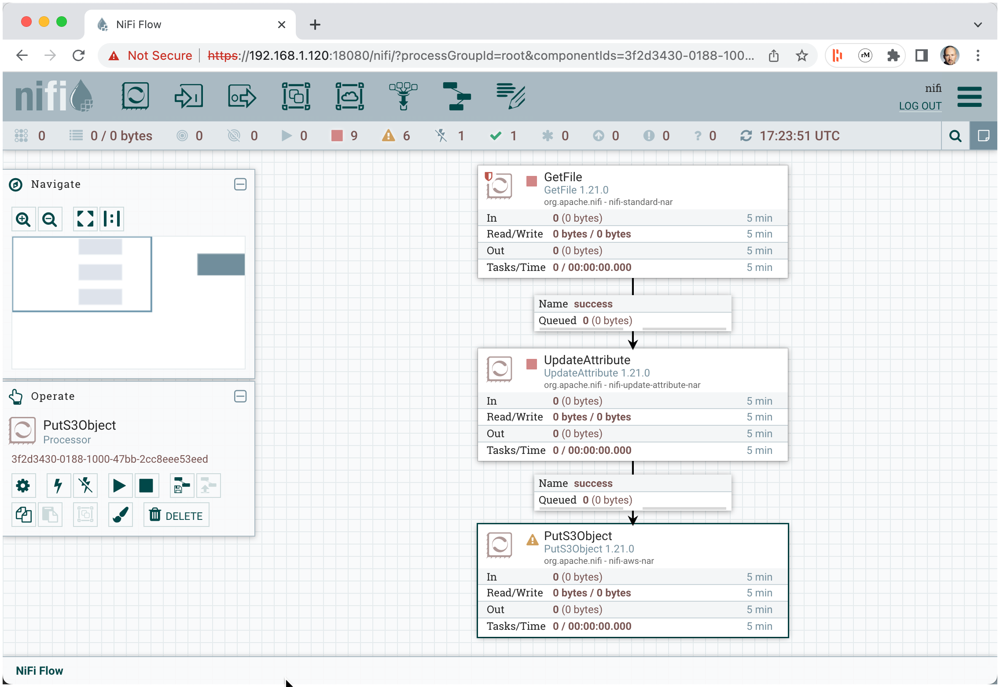

The first two processor no longer hold the yellow marker, but now show the red stop marker, meaning that these two processors can be started. But what about the last one, the **PutS3Object** processor?

If you navigate to the marker, a tool-tip will show the errors. 

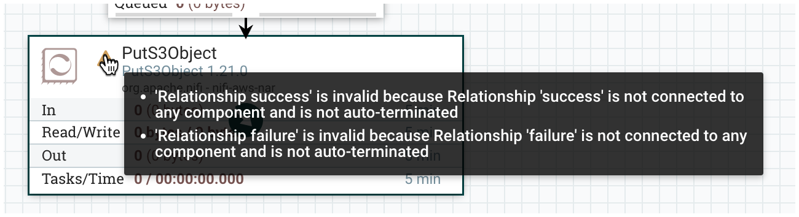

We can see that the processor has two outgoing relationships, which are not "used". We have to terminate them, if we have no use for it. 
Double-click on the **PutS3Object** processor and navigate to **RELATIONSHIPS** and set the check-boxes for both relationships to **terminate**. 

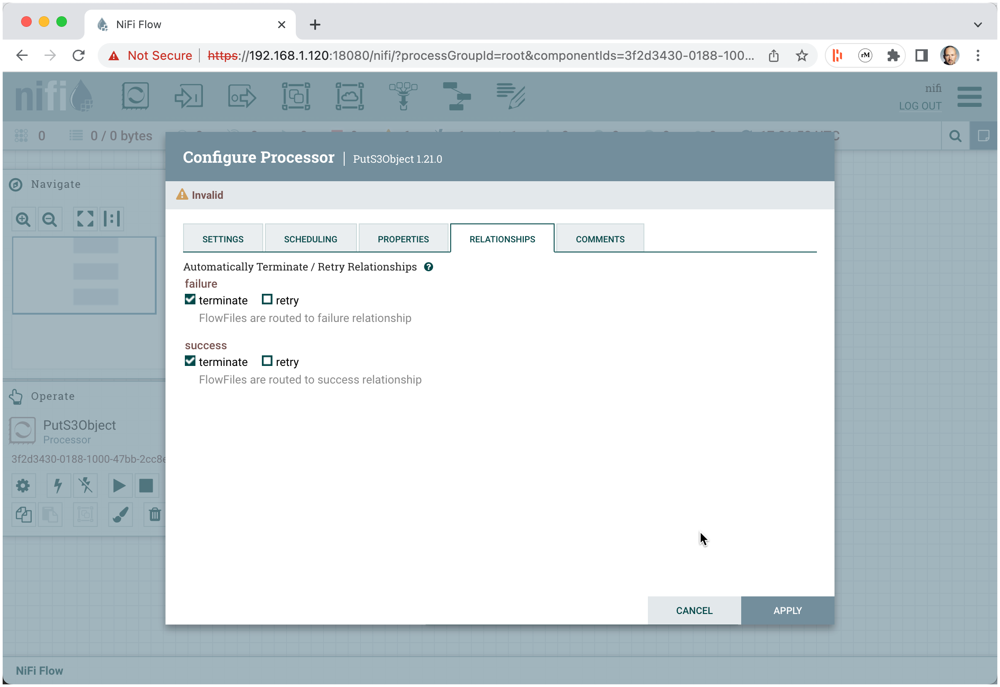

Click **APPLY** to save the settings.

Now our data flow is ready, so let's run it. 

### Starting the Data Flow 

Select all 3 processor and click on the start arrow 

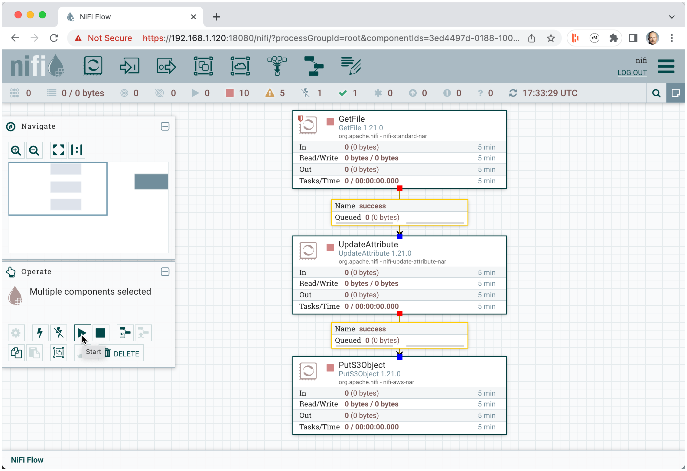

to run the data flow. All three processors now show the green "started" or "running" marker. 

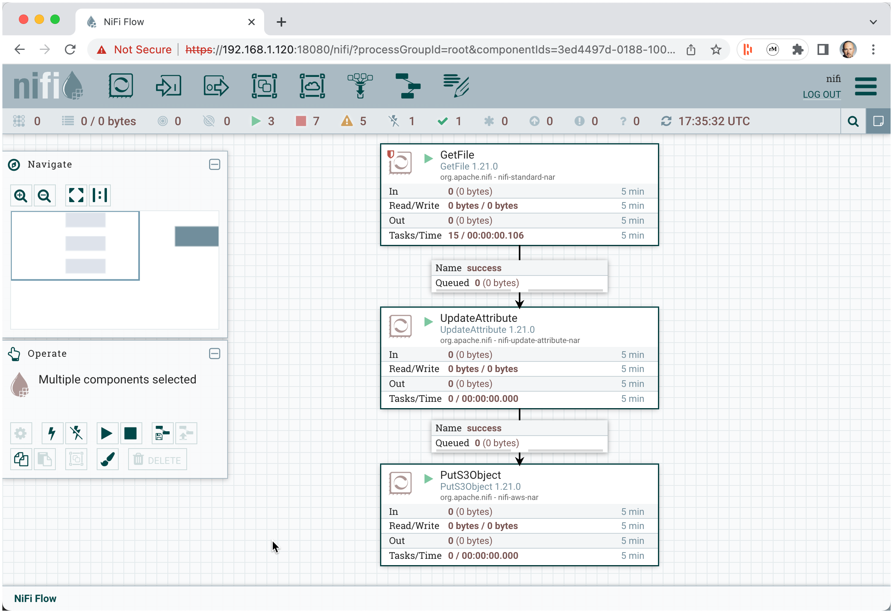

### Copy a file into the landing zone

Now let's copy a file to be uploaded into the `/data-transfer/landing-zone` folder. You can either use a terminal window to do that or the file browser UI, as shown here. 

Navigate to <http://dataplatform:28178> and login with `admin` for the user and the password. 

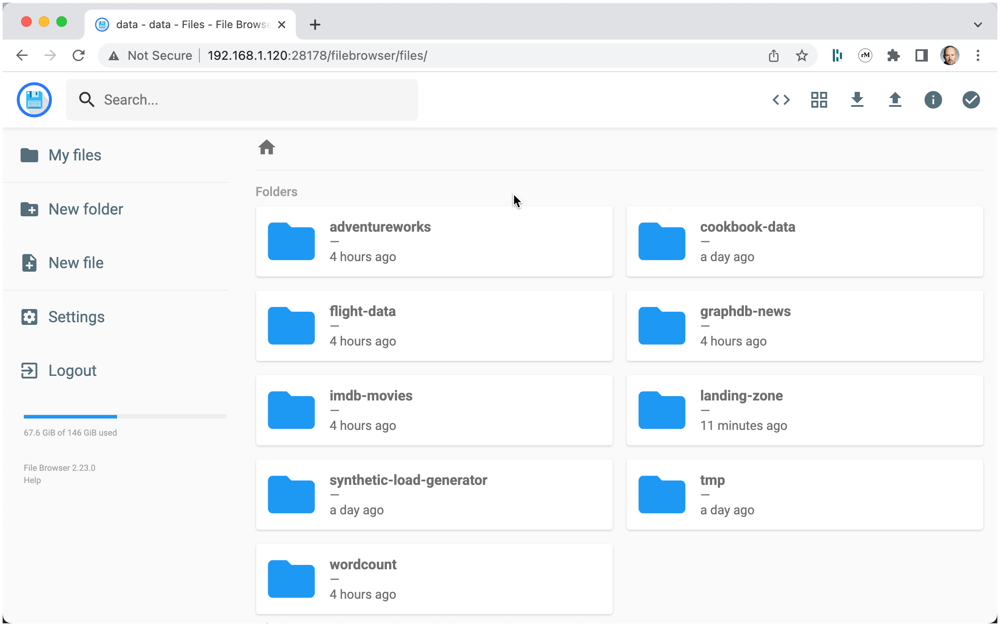

Navigate to **flight-data** folder by double-clicking on it and select the **airports.csv** file. 

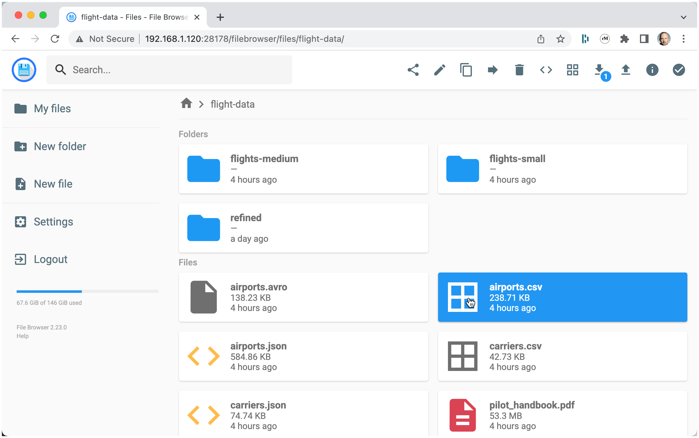

In the menu bar, click on the **Copy file** icon 

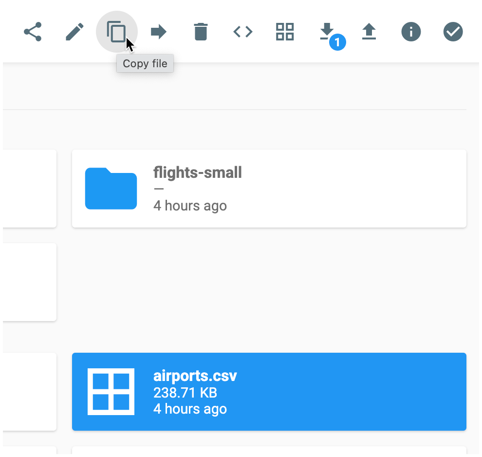

and navigate to the **landing-zone** folder and click **COPY**

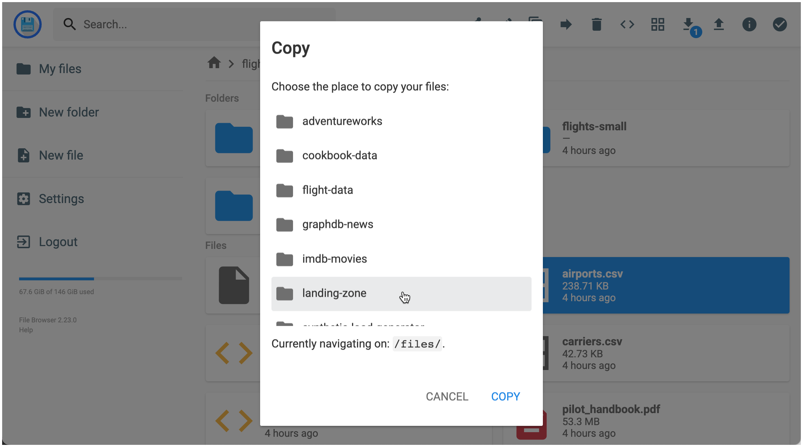

Let's see if our NiFi data flow has done its work!

In a terminal, use the `mc tree` command to  view the `flight-nifi-bucket`

```bash
docker exec -ti minio-mc mc tree --files minio-1/flight-nifi-bucket/
```

if should show an output similar to the one below

```bash
$ docker exec -ti minio-mc mc tree --files minio-1/flight-nifi-bucket/
minio-1/flight-nifi-bucket/
└─ raw
   └─ nifi
      └─ airport
         └─ 2023-05-21T18:40:39
            └─ airports.csv
```

We can see that the file has been loaded under a folder with the timestamp of the file ingestion.            