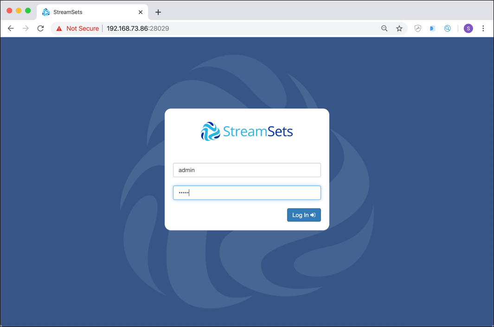
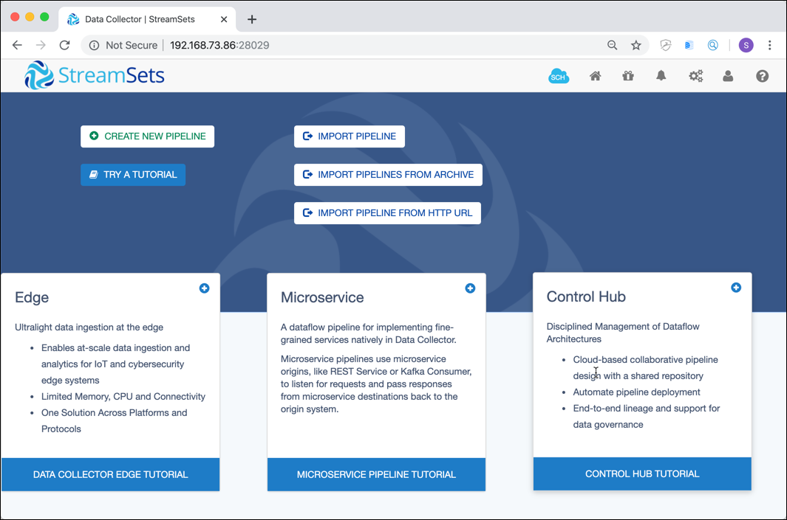
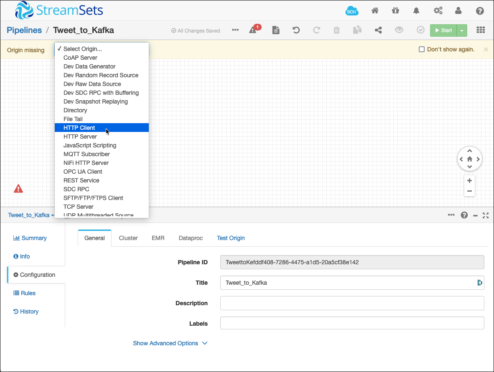
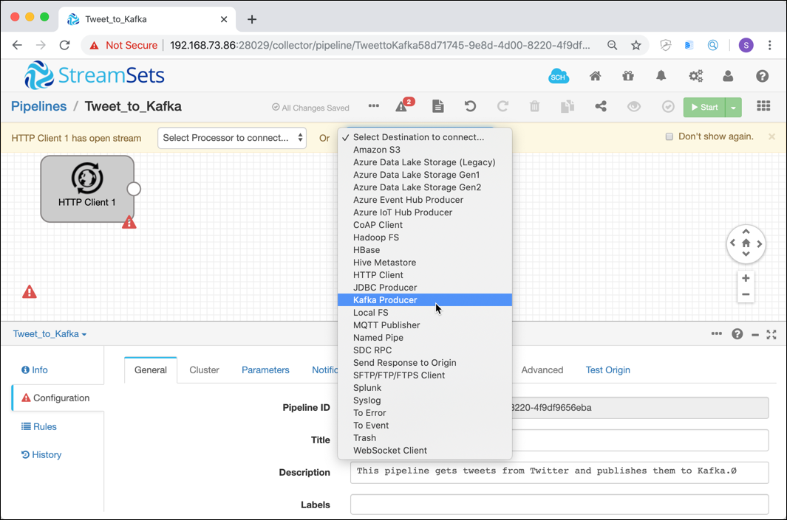
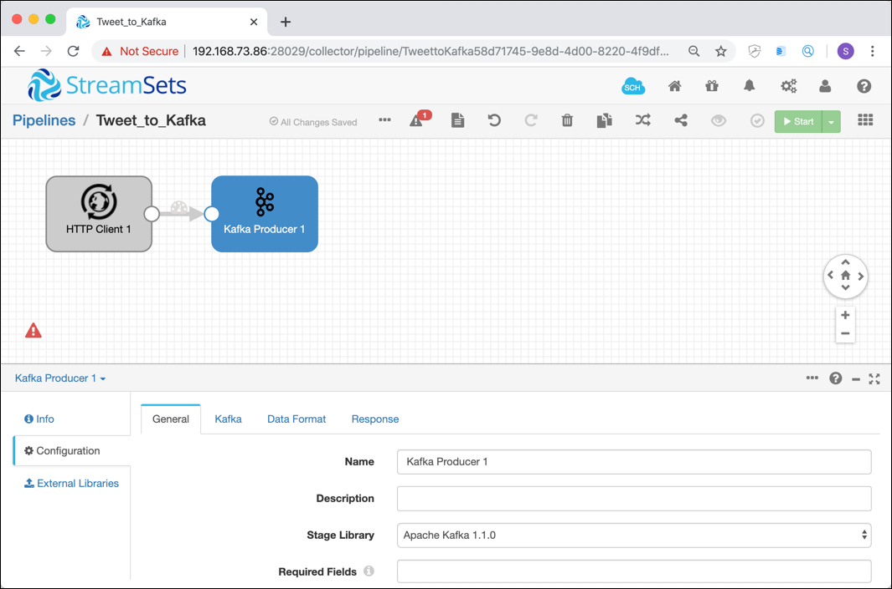
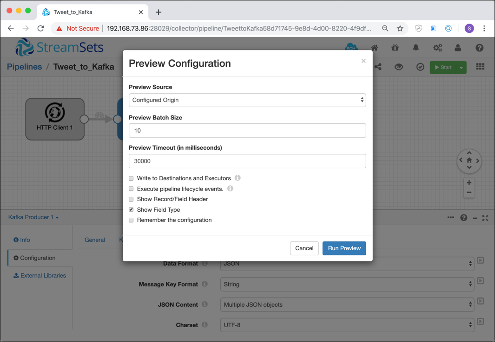
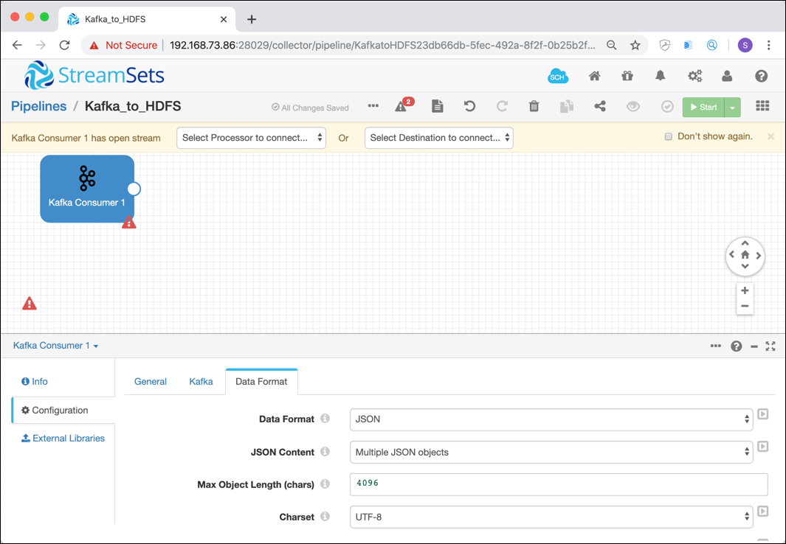
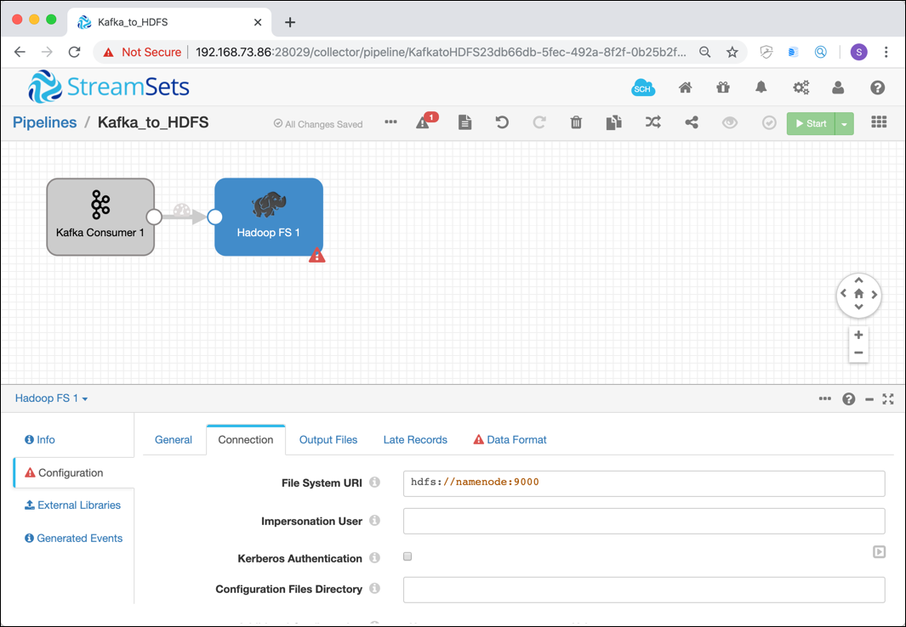
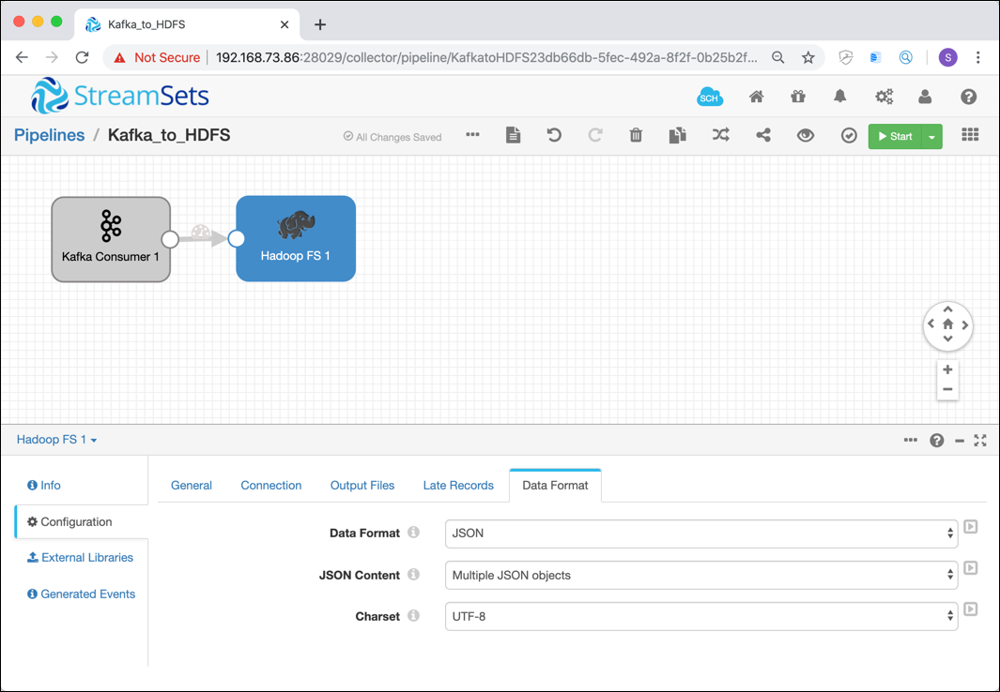
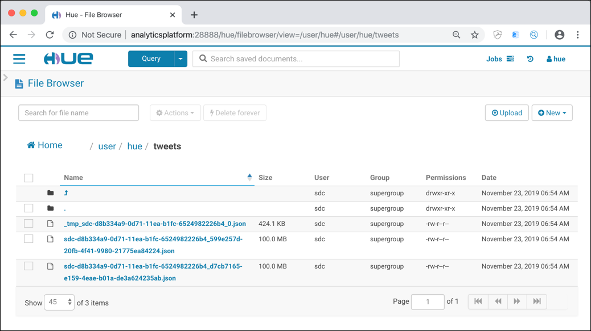

# Data Ingestion with StreamSets Data Collector

For this workshop you have to start a platform using the `hdfs` flavour in the init script (for the 2nd part where the data is written to HDFS).

## Introduction

In this workshop we will see how we can use StreamSets Data Collector for retrieving live tweets from Twitter and storing them in HDFS, sending them through Kafka first.  

## Log into StreamSets

In a browser window, navigate to <http://streamingplatform:18630>. The **StreamSets Data Collector** authentication page should be shown.



Enter **admin** for username and also for the password and click **Log in**. Confirm the pop-up window by clicking on **Later**. You should see the getting started screen of Streamsets.



## Create the a pipeline for retrieving Tweets and sending them to a Kafka topic 

On the **Get Started** screen, click on **Create New Pipeline**.

On the **New Pipeline** pop up, enter `Tweet_to_Kafka` for the **Title** field and a **Description** about the purpose of the new pipeline.


Click on *Save* and an empty canvas for the new pipeline is shown. 


### Designing the pipeline

Select **HTTP Client** from the **Select Origin...** drop-down. 



The **HTTP Client** origin will be shown on the canvas. We will configure it later to retrieve the data from Twitter. But first let's add the producer which sends the data to Apache Kafka. 

Select **Kafka Producer** from the **Select Destination to connect...** drop-down. 



The pipeline will be displayed with the Origin and Destination automatically connected. 



You can see, signaled by the red explanation icons, that the pipeline has errors. They of course tell us that we have to configure the two components first. We have to fix all of the errors, before we run the pipeline. 

Click on the red icon on the lower left corner and select **Discard (Library: Basic)** for the **Error Records** drop-down.


This tells the Streamsets data flow to ignore errors on pipeline level, by just discarding the message should there be an error. 

Now let's configure the two components. 

### Configure the HTTP Client
Let's configure the HTTP Client first. Click on the **HTTP Client 1** component on the canvas, it will change to blue. 

Click on the **HTTP** tab and enter `https://stream.twitter.com/1.1/statuses/filter.json?track=trump` into the **Resource URL** edit field. In order to get some traffic, we use the keyword "trump" to filter the Tweets. 

Scroll down and change the **Authentication Type** to `OAuth`. 


Now click on **Credentials** tab and enter the values for the Twitter application into the **Consumer Key**, **Consumer Secret**, **Token** and **Token Secret**. You can find the steps for creating a new Twitter Application [here](../99-misc/99-twitter-app/README.md). 


Click on the **Data Format** tab and make sure `JSON` is selected for the **Data Format** drop down. 

Increase the value of **Max Object Length (chars)** to `409600`.


### Configure the Kafka Producer

Now let's configure the Kafka Producer. Click on the **Kafka Producer 1** component on the canvas and select the **Kafka** tab. 

Enter `kafka-1:19092` into the **Broker URI** edit field and `tweet-json-topic` into the **Topic** field.


Click on the **Data Format** tab and make sure `JSON` is selected for the **Data Format**. 

### Create the topic in Kafka

Fist we need to create the topic in Kafka which will be used to hold/buffer the tweets retrieved from Twitter.  You have two options:

  * using the `kafka-topics` CLI
  * using the Kafka Manager web application

The `kafak-topics` command is available with the Kafka broker. To use it we have to connect into the `kafka-1` container first. On the Docker host, exeute the following command

```
docker exec -ti kafka-1 bash
```

The command prompt should change to reflect that we are now in the context of the running container.

```
kafka-topics --create \
			--if-not-exists \
			--zookeeper zookeeper-1:2181 \
			--topic tweet-json-topic \
			--partitions 6 \
			--replication-factor 1
```

We are specifying a `replication-factor` of `1` because there is only one broker in the environment. Leave the container by typing `exit`.

Now with the topic in place, let's start a consumer on the new topic. We are using the `kafkacat` utility here, as it simplifies consuming from Kafka compared to the standard CLI commands provided by Kafka. We can either install `kafkcat` locally or use it as a Docker container, which is shown here:

```
docker run --tty --network docker_default confluentinc/cp-kafkacat kafkacat -b kafka-1 -t tweet-json-topic

```

Optionally you can also use **KafkaHQ** Web application to create the topic as well as listening on the topic once it is created. KafkaHQ can be reached on <http://localhost:28042> (if using the TCP Tunnel with port forwarding) or <http://analyticsplatform:28042> (if ports are open).

### Running the pipeline

Now we are ready for running the pipeline. 

There are two ways you can run a pipeline in StreamSets, either 

  * in **Preview** mode with no/minimal side-effects or
  * in **Execution** mode, where the pipeline runs until stopped.

The **Preview** mode, as the name suggest is good while developing, in order to check if the pipeline is working.  

#### Run in Preview mode

The Preview mode allows you to check your pipeline before executing it. 

Click on the **Preview** icon on the menu-bar, as shown on the following screenshot:
 


On the **Preview Configuration** pop-up window you can configure, if the pipeline should produce side-effect or not (option **Write to Destinations and Executors** and **Execute pipeline lifecycle events**). 
Additionally you define from where the source should read the events for the preview. 

From **Configured Source** will use "live" data but you could also take data from a snapshot captured in an earlier run. 



Leave everything to the default settings and click on **Run Preview**.

The Preview mode will get the configured number of events (**Preview Batch Size** setting on previous screen) from the source or stop after the timeout (**Preview Timeout** setting on previous screen). 

You can see that the component **HTTP Client 1** is selected and you can see both the input and the output of that component below. 


You can drill-down into each record as shown below.


Preview mode will be even more helpful if a Processor component is used between an Origin and a Destination, and you will be able to view the change between the Input Data and the Output Data done by the Processor.

#### Run in Execution mode

Now let's run the pipeline. Click on the Start icon in the menu bar in the top right corner. 


The pipeline should change in the **RUNNING** state and the tweets should start to show up on the kafkacat terminal. You can see the that StreamSets also switches into the monitoring view, where you can find statistics about the data flow you run (such as number of rows processed, bot successfully and error as well as throughput). 


You can drill down to each component, by just selecting one of the components. 

### Stop the pipeline 

For stopping a running pipeline, click on the stop button on the top right. But we don't do that now, we rather keep the pipeline running to keep retrieving the tweets and sending them to Kafka. Click on **Pipelines** in the upper left corner to view the **Pipelines** page.


Let's build the second pipeline, which consumes the data from the Kafka topic and write it to HDFS. 

## Create the a pipeline for consuming Tweets from Kafka and writing them to HDFS

Click on **Create New Pipeline** to create this new pipeline.

Enter `Kafka_to_HDFS` into the **Title** field and a meaningful description into the **Description** field. Click on **Save** to create the pipeline.

A new empty canvas is shown, ready to be configured. 

### Add a Kafka Consumer

From the **Select Origin...** drop-down, select `Kafka Consumer`. 

Navigate to the **Kafka** tab, enter `kafka-1:19092` into the **Broker URI** field and enter `zookeeper-1:2181` into the **ZooKeeper URI** field. Enter `tweet-json-topic` into the **Topic** field. 


Navigate to **Data Format** and select `JSON` from the **Data Format** drop-down listbox.



Click on the red icon on the lower left corner and again select **Discard (Library: Basic)** for the **Error Records** drop-down.


There is still a flag on the **Kafka Consumer 1** component. This is caused by not having any desitnation components configured.

So let's add the HDFS destination.

### Add the HDFS 

From the **Select Destination to connect...** drop-down, select the **Hadoop FS** destination. The destination is added to the data flow and automatically linked with the **Kafka Consumer** origin. Let's configure this new component as well. 

Navigate to the **Connection** tab and enter `hdfs://namenode:9000` into the **File System URI** field. 



Now go to the **Output Files** tab and enter `json` into the **Files Suffix** field. In the **Directory Template** field, change the value to `/user/hue/tweets/` so that the HDFS files are created inside the `/user/hue` folder. 
	


Scroll down further to **Max File Size (MB)** and set the value to `100`. Next go to the **Idle Timeout** field and change the value to `${5 * MINUTES}`. This will force closing the file after 5 minutes of inactivity. 


Navigate to the **Data Format** tab and select `JSON` from the **Data Format** drop-down listbox. 



Now the pipeline is read to be executed. Ether start with a Preview to make sure everything is correct or directly execute it by clicking on **Start**.

### Check the files which arrive in HDFS

Either use **Hue** or the Hadoop CLI to check that files are written to `/user/hue/tweets`:



We can see one file starting with `_tmp`, which is the one currently written to, and many other files with size 100 MB, the ones which were closed.
