# Data Ingestion with Apache NiFi

In this workshop we will see how we can use [Apache NiFi](http://nifi.apache.org) to ingest the flight data automatically into S3 object storage. It shows the usage of Apache NiFi for batch (delta) ingestion; refer to the Streaming Workshop for a workshop where Apache NiFi is used in stream data ingestion.

## Table of Contents

- [What you will learn](#what-you-will-learn)
- [Prerequisites](#prerequisites)
- [Create the Bucket in S3](#create-the-bucket-in-s3)
- [Make sure that sub-folders below `data-transfer` belong to your local user (`$USER`)](#make-sure-that-sub-folders-below-data-transfer-belong-to-your-local-user-user)
- [Create the NiFi data flow](#create-the-nifi-data-flow)

## What you will learn

- How to navigate the Apache NiFi web interface and build a data flow on the canvas
- How to use the `GetFile` processor to pick up files from a local landing zone
- How to use the `PutS3Object` processor to write files automatically to MinIO
- How to connect processors, configure relationships, and start/stop a NiFi flow
- How NiFi handles batch (delta) ingestion — only picking up new files since the last run

## Prerequisites

- The **Data Platform** described [here](../00-environment) is running and accessible
- The `flight-nifi-bucket` bucket will be created as part of this workshop
- Write access to the `data-transfer/landing-zone` folder on the host machine

## Create the Bucket in S3

For this workshop we will use a new bucket, separate from the other workshops. Use the following command to create the `flight-nifi-bucket`.

```bash
docker exec -ti awscli s3cmd mb s3://flight-nifi-bucket
```

The data will be uploaded by Apache NiFi below.

## Make sure that sub-folders below `data-transfer` belong to your local user (`$USER`)

In a terminal, navigate to the `data-transfer` folder. 

```bash
cd $DATAPLATFORM_HOME/data-transfer
```

We will use a folder `landing-zone`, which we need to create

```bash
mkdir -p landing-zone
```

Now perform a `chown` to change the owner of all subfolders

```bash
sudo chown $USER:$USER *
```

Check that the folders are now under the right user

```bash
$ ls -lsa
4 drwxr-xr-x 16 ubuntu ubuntu 4096 May 29 20:39 .
4 drwxr-xr-x 15 ubuntu ubuntu 4096 May 29 19:41 ..
8 -rw-r--r--  1 ubuntu ubuntu 5472 May 22 11:55 00000000000000000000.json
8 -rw-r--r--  1 ubuntu ubuntu 4597 May 22 18:12 00000000000000000001.json
4 -rw-r--r--  1 ubuntu ubuntu 2893 May 22 18:18 00000000000000000002.json
4 drwxr-xr-x  2 ubuntu ubuntu 4096 May 29 19:46 adventureworks
4 drwxr-xr-x  2 ubuntu ubuntu 4096 May 29 19:46 airport-data
4 drwxrwxr-x  2 ubuntu ubuntu 4096 May 29 17:06 app
4 drwxr-xr-x  5 ubuntu ubuntu 4096 May 29 19:46 flight-data
4 drwxr-xr-x  2 ubuntu ubuntu 4096 May 29 19:46 graphdb-news
4 drwxr-xr-x  2 ubuntu ubuntu 4096 May 29 19:46 imdb-movies
4 drwxrwxr-x  2 ubuntu ubuntu 4096 May 29 20:39 landing-zone
4 drwxr-xr-x  4 ubuntu ubuntu 4096 May 20 19:58 movie-lens-small
4 drwxr-xr-x  2 ubuntu ubuntu 4096 May 29 19:46 nyc-film-permits
4 drwxr-xr-x  2 ubuntu ubuntu 4096 May 29 19:46 orion-star
4 drwxr-xr-x  3 ubuntu ubuntu 4096 May 20 19:58 platys-cookbooks
4 -rw-r--r--  1 ubuntu ubuntu   59 May 20 19:47 readme.txt
4 drwxr-xr-x  4 ubuntu ubuntu 4096 May 22 11:37 result
4 drwxr-xr-x  2 ubuntu ubuntu 4096 May 20 19:47 synthetic-load-generator
4 drwxr-xr-x  2 ubuntu ubuntu 4096 May 29 19:46 wordcount
```

## Create the NiFi data flow

In a browser, navigate to <https://dataplatform:18083/nifi> (make sure to replace `dataplatform` with the IP address of the machine where Docker runs). We have enabled authentication for NiFi, therefore you have to use https to access it. Due to the use of a self-signed certificate, you have to initially confirm that the page is safe and you want to access the page.

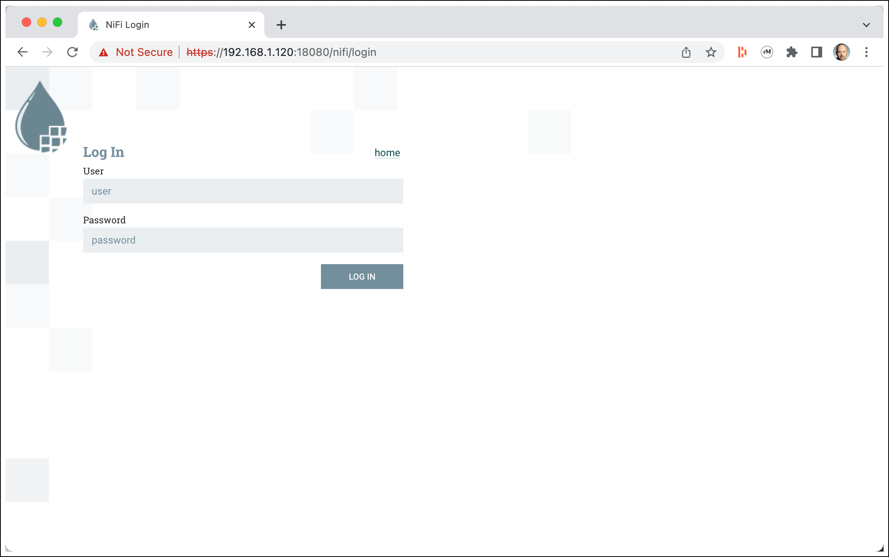

Enter `nifi` into the **User** field and `1234567890ACD` into the **Password** field and click **LOG IN**.

This should bring up the NiFi User Interface, which at this point is a blank canvas for orchestrating a data flow.


Now you can add **Processor**s to create the pipeline. 

Let's start with the input. 

### Adding a `GetFile` Processor

We can now begin creating our data flow by adding a Processor to our canvas. To do this, drag the Processor icon from the top-left of the screen into the middle of the canvas and drop it there. 


This will give us a dialog that allows us to choose which Processor we want to add. We can see that there are a total of 290 processors currently available. We can browse through the list or use the **filter types** box to filter down to one or more processors.


Enter **GetF** into the search field and the list will be reduced to two processors, the **GetFTP** and the **GetFile** processor. As the name implies, the first one can be used to get files from a FTP server, whereas the second one can be used to read local files. We will use the latter here. Navigate to the **GetFile** and click **Add**.

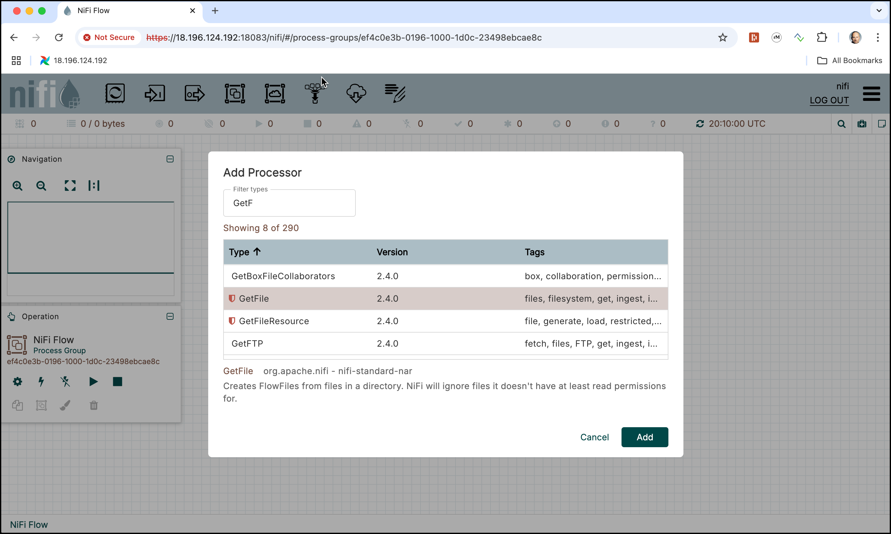

You should now see the canvas with the **GetFile** processor. A yellow marker is shown on the processor, indicating that the processor is not yet configured properly.

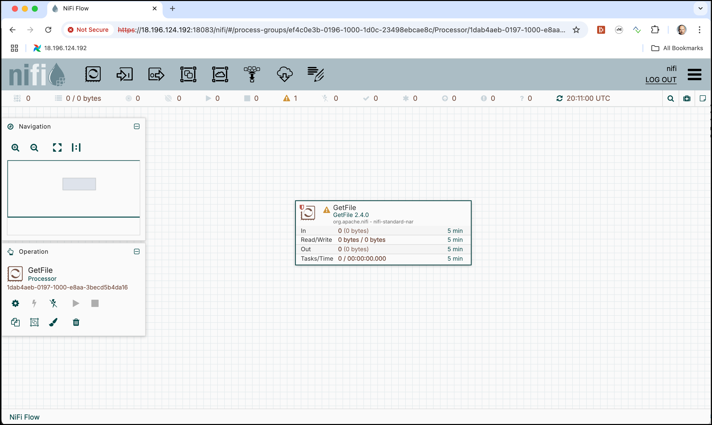

Double-click on the **GetFile** processor and the **Settings** page of the processor appears. Here you can change the name of the processor among other general properties.

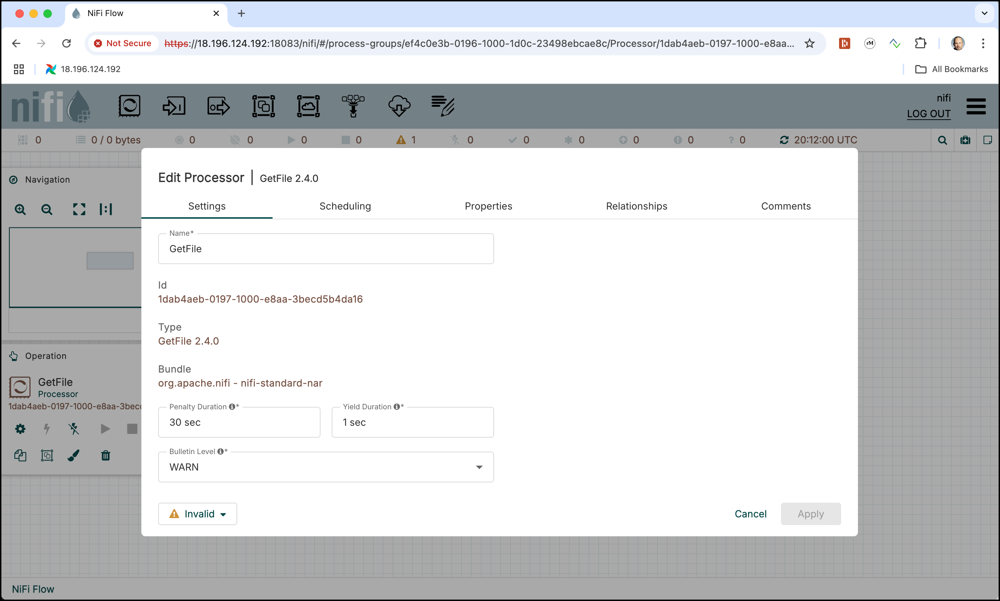

Click on **Properties** tab to switch to the properties page.

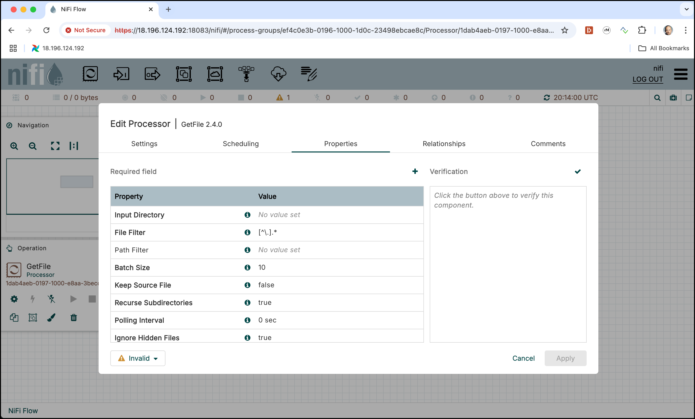

On the properties page, we configure the properties for reading the data from the local file system.  

Set the properties as follows:

  * **Input Directory**: `/data-transfer/landing-zone`
  * **File Filter**: `[^\.].*\.csv`
  * **Recursive Subdirectories**: `false`
  * **Minimum File Age**: `5 sec`

The **Configure Processor** should look as shown below

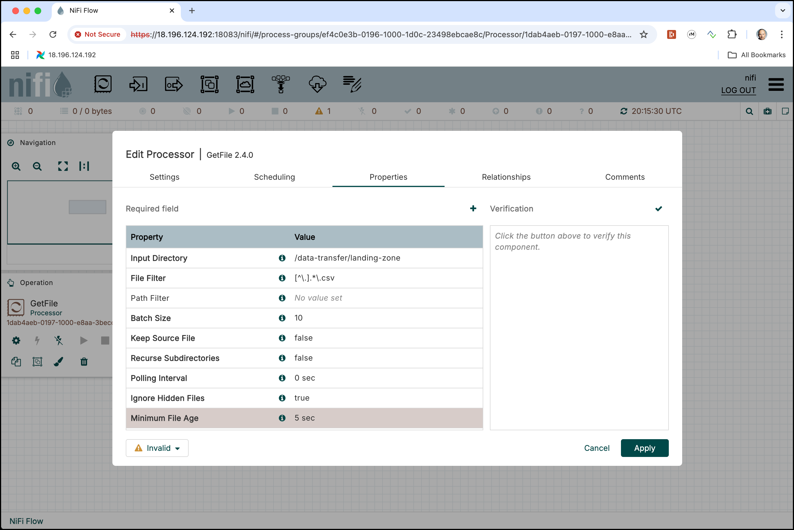

Click **Apply** to close the window.

The `GetFile` processor still shows the yellow marker. This is because the outgoing relationship is neither used nor terminated. Of course we want to use it, but for that we first need another Processor to store the data in S3 object storage. 

### Adding a `PutS3Object` Processor

Drag a new Processor onto the Canvas, just below the **GetFile** processor. 

Enter **PutS3** into the **Filter types** field on top left. Only a single processor, the `PutS3Object` is shown.

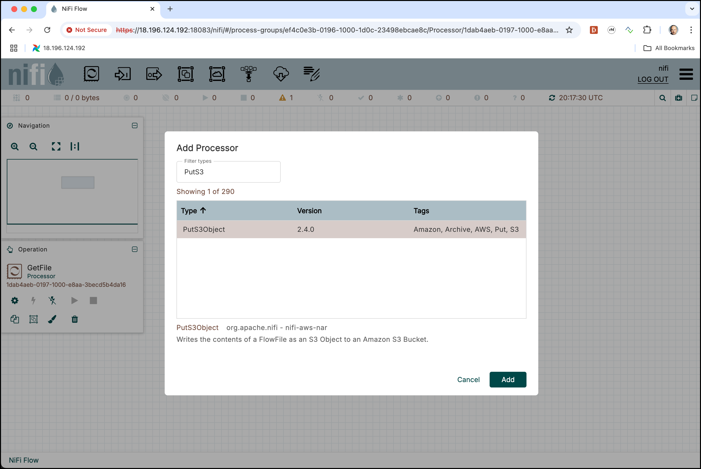

Click on **Add** to add it to the canvas as well. The canvas should now look like shown below. You can drag the processors around to organize them in the right order. It is recommended to organize them in the main flow direction, either top-to-bottom or left-to-right.

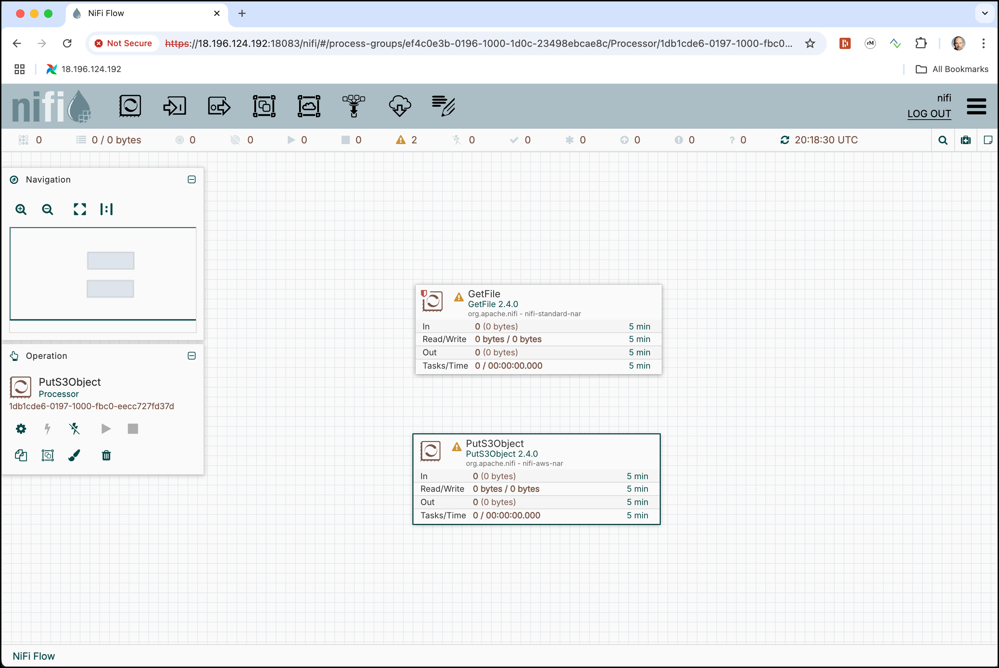

Let's configure the new processor. Double-click on the `PutS3Object` and navigate to **Properties**. Enter the following values:

  * **Bucket**: `flight-nifi-bucket`
  * **Object Key**: `raw/airport/${ingestionTime}/${filename}` (a leading / would currently produce an Invalid Argument error in RustFS)
  * **Region**: `US East (N. Virginia)`
  * **Endpoint Override URL**: `http://rustfs-1:9000`
  * **Use Path Style Access**: `true`
  * **AWS Credentials Provider Service**: click on the 3 dots and select **Create new service** and click **Add** to add a new service of type **AWSCredentialsProviderControllerService**. Click again on the 3 dots and select **Go To Service** and confirm with **Yes**. On the **Controller Services** pop-up page, click on the 3 dots right to the ` AWSCredentialsProviderControllerService` and select **Edit**. Navigate to the **Properties** tab and enter these values:

  * **Access Key ID**: `admin`
	* **Secret Access Key**: `abc123abc123!`

The **Configure Processor** should look as shown below. 

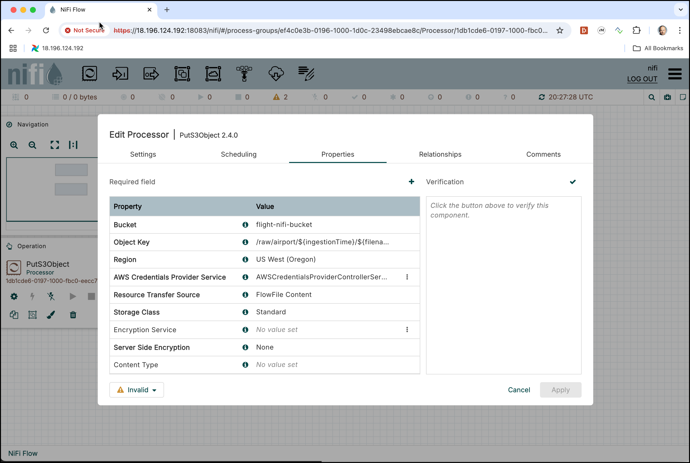

**Note**: NiFi does not display username and password values, they are instead shown as `Sensitive value set` when they hold a value.

Click **Apply** and **Back to Processor**

Because we already saved the settings, we can click **Cancel** to close the **Edit Processor** window. 

We also use a variable `ingestionTime` in the **Object Key** expression above, which we need to set to the current timestamp when a file is processed. We will do that now by adding an additional **UpdateAttribute** processor.

### Set Variable using `UpdateAttribute` processor

Drag a new Processor onto the Canvas, in between the **GetFile** and **PutS3Object** processor. 

Enter **updateA** into the Filter field at the top right. Only a single processor, the `UpdateAttribute`, is shown. Click **Add** to add it to the canvas as well.

Now let's configure the new processor. Double-click on the `UpdateAttribute` and navigate to **Properties**. In this case we do not have to update an existing property but instead add a new one. Click on **+** in the upper right corner of the **Edit Processor** window. 

Enter `ingestionTime` into the **Property Name** and click **Ok**. Enter the following expression `${now():format("yyyy-MM-dd'T'HH:mm:ss")}` into the pop-up window for the value. 

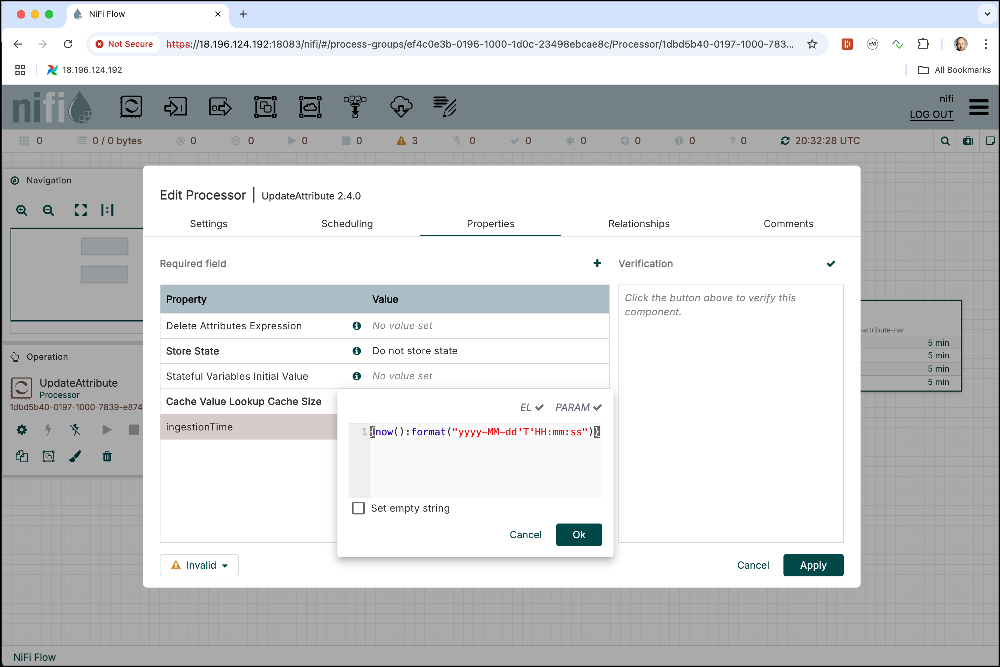

Click **Ok** and then **Apply**.

Now we have 3 processors on the canvas, and we should organize them in the direction of the data flow, either horizontal (left to right) or vertical (top to bottom).

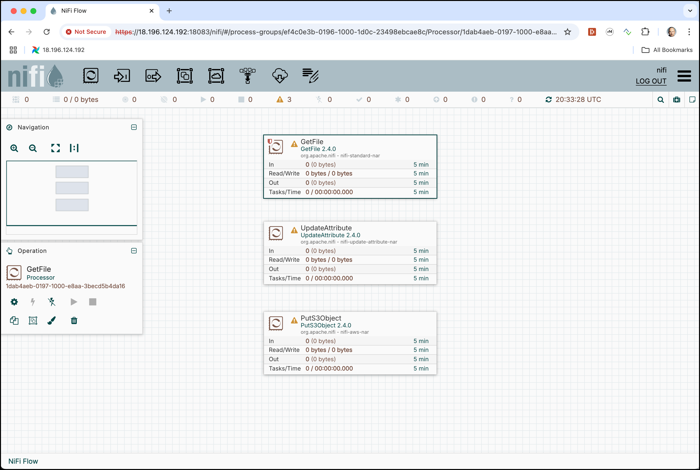

Before we can run the pipeline, we of course have to connect the processors. 

### Connecting the Processors

Drag a connection from the **GetFile** processor to the **UpdateAttribute** processor and drop it.

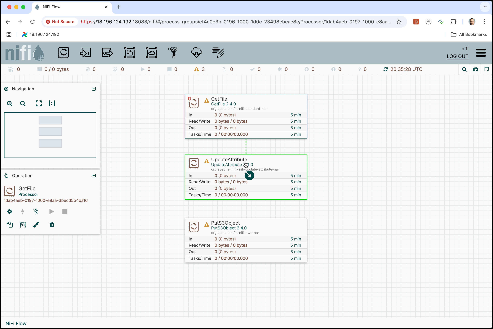

Make sure that the `success` **Relationship** is enabled and click **Add**. 

Repeat it for the connection from **UpdateAttribute** to **PutS3Object**. The data flow on the canvas should now look as shown below

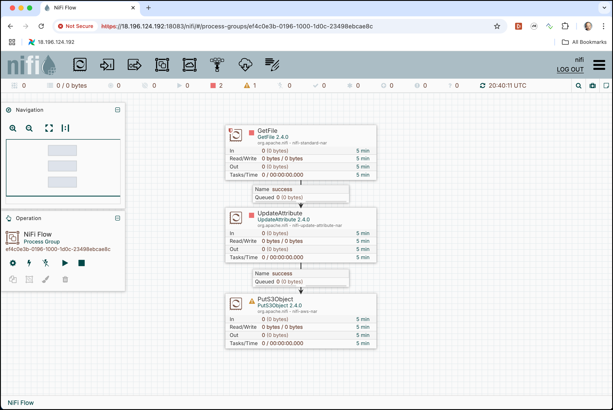

The first two processors no longer hold the yellow marker, but instead show the red stop marker, meaning that these two processors can be started. But what about the last one, the **PutS3Object** processor?

If you navigate to the marker, a tool-tip will show the errors. 

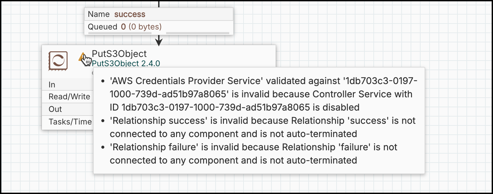

We can see that there are 3 errors on the **PutS3Object** processor. The first one indicates that the controller service we created earlier is still disabled. We can easily enable it by right-clicking on the canvas and selecting **Enable All Controller Services** from the context menu. 

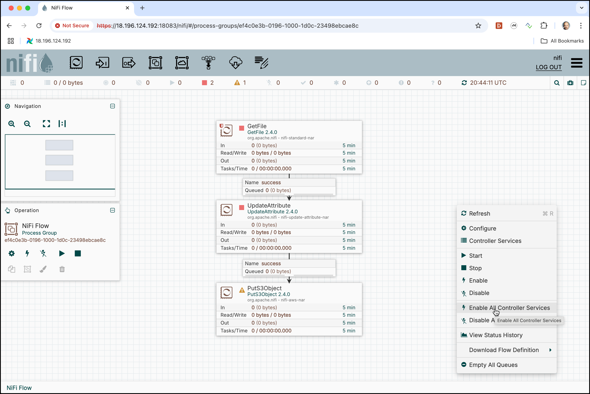

The other two errors are caused by the processor having two outgoing relationships, which are not "used". We have to terminate them, if we have no use for it. 

Double-click on the **PutS3Object** processor and navigate to **Relationships** and set the check-boxes for both relationships to **terminate**. 

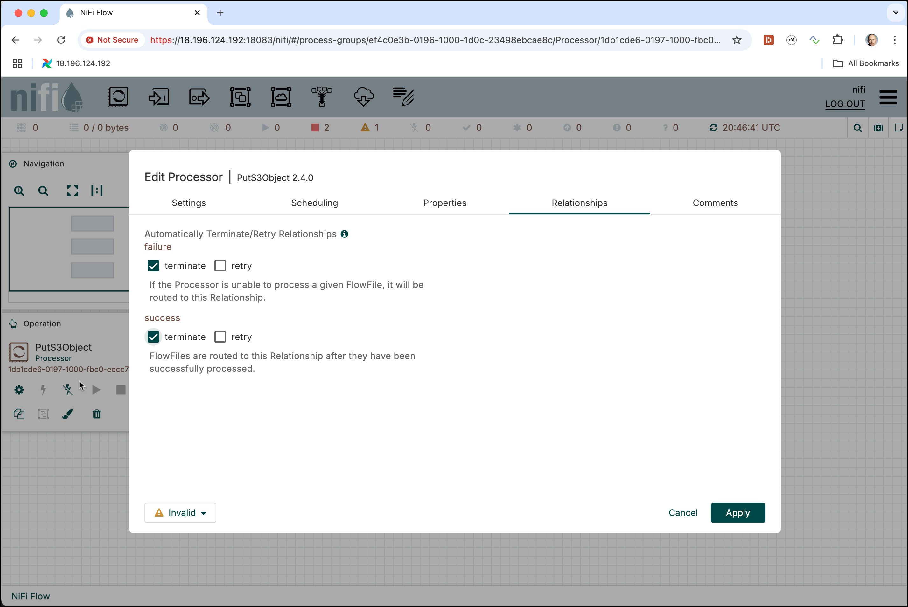

Click **Apply** to save the settings.

Now our data flow is ready, so let's run it. 

### Starting the Data Flow 

Select all 3 processors (press Ctrl-A) and navigate to the start arrow and click on it.

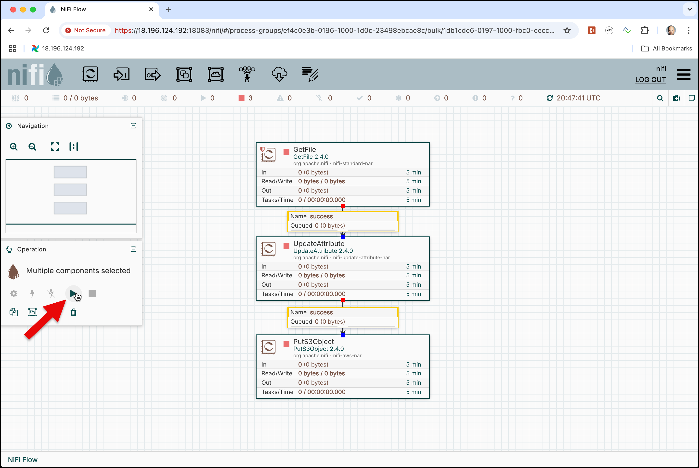

This will run the 3 processors. All three processors now show the green "started" or "running" marker. 

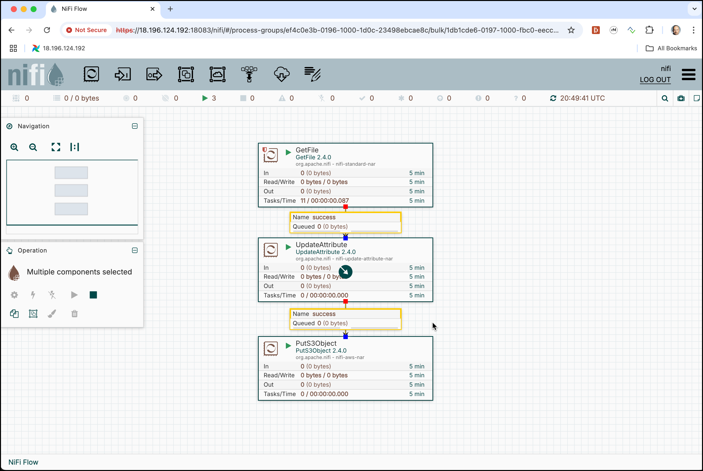

### Copy a file into the landing zone

Now let's copy a file to be uploaded into the `/data-transfer/landing-zone` folder. You can either use a terminal window to do that or the file browser UI, as shown here. 

Navigate to <http://dataplatform:28178> and log in with `admin` for the **Username** and `abc123!` for the **Password**.

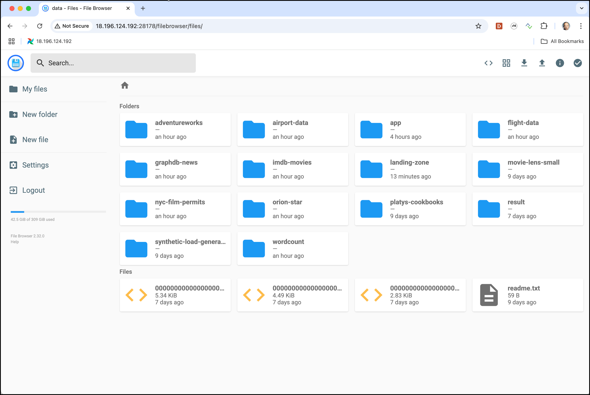

Navigate to **airport-data** folder by double-clicking on it and select the **airports.csv** file. 

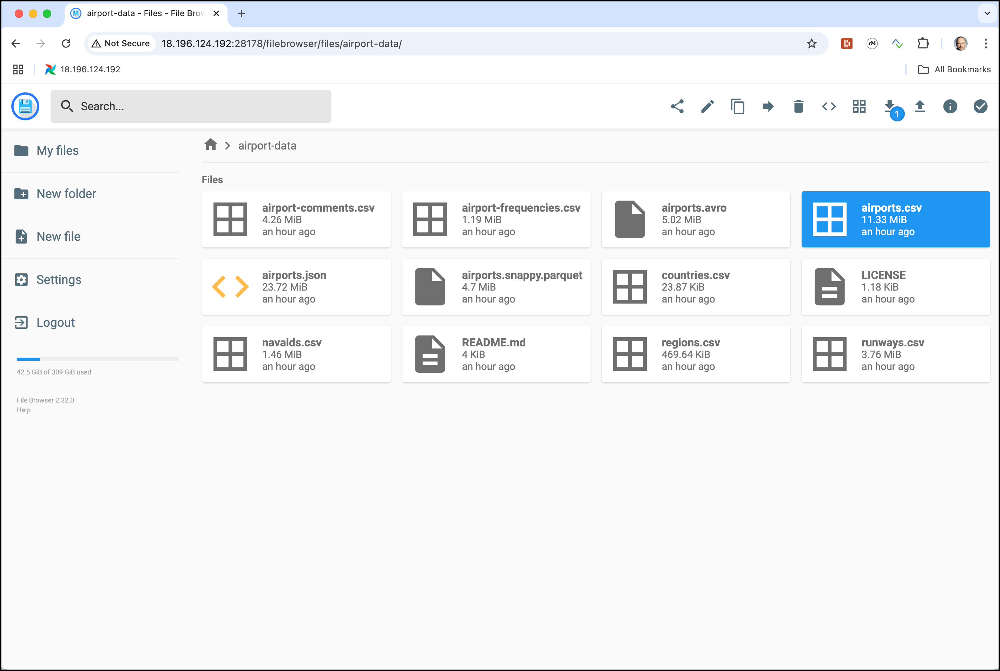

In the menu bar, click on the **Copy file** icon 

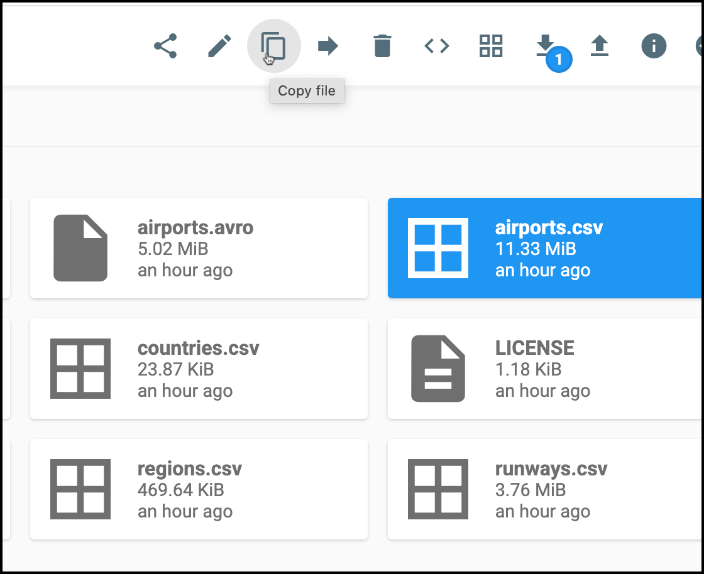

and navigate to the **landing-zone** folder and click **COPY**

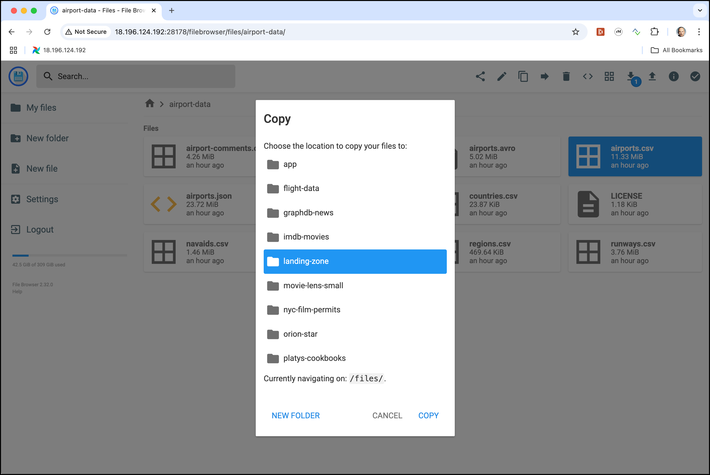

Let's see if our NiFi data flow has done its work!

In a terminal, use the `mc tree` command to  view the `flight-nifi-bucket`

```bash
docker exec -ti rustfs-mc mc tree --files rustfs-1/flight-nifi-bucket/
```

It should show an output similar to the one below

```bash
ubuntu@ip-172-26-9-12:~/bigdata-spark-workshop/00-environment/docker/data-transfer$ docker exec -ti rustfs-mc mc tree --files rustfs-1/flight-nifi-bucket/
rustfs-1/flight-nifi-bucket/
└─ raw
   └─ airport
      └─ 2025-05-29T21:03:52
         └─ airports.csv
```

> **What you should see:** The `airports.csv` file stored under a timestamped folder path `raw/airport/<timestamp>/airports.csv`. The timestamp matches the moment NiFi picked up and processed the file.

> **What just happened?** The three-processor NiFi flow executed automatically: `GetFile` detected the CSV in the landing zone, `UpdateAttribute` computed the current timestamp and stored it as the `ingestionTime` FlowFile attribute, and `PutS3Object` uploaded the file to MinIO using the attribute value in the key expression `/raw/airport/${ingestionTime}/${filename}`. After upload, `GetFile` removed the source file from the landing zone so it won't be re-processed on the next poll cycle — this is NiFi's built-in delta mechanism for file-based ingestion.

We can see that the file has been loaded into a folder with the timestamp of the file ingestion.

### Additional steps

 * Stop one of the processors and check the flow file in the buffer.
 * Check that the new file is uploaded under a different folder (ingestion timestamp).