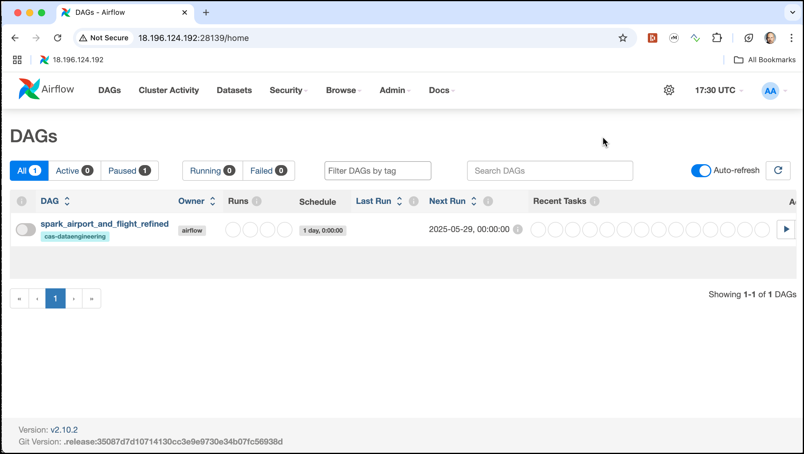
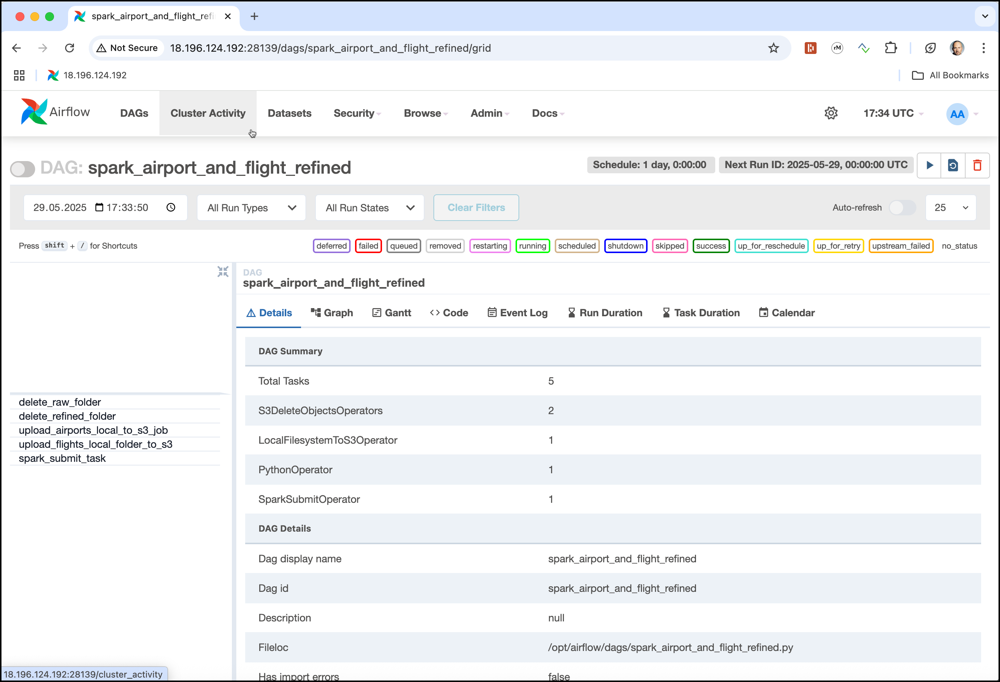
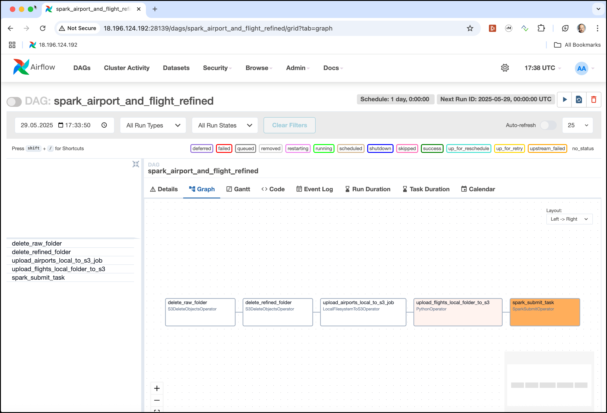
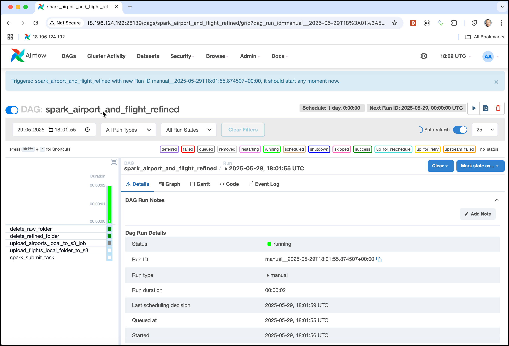
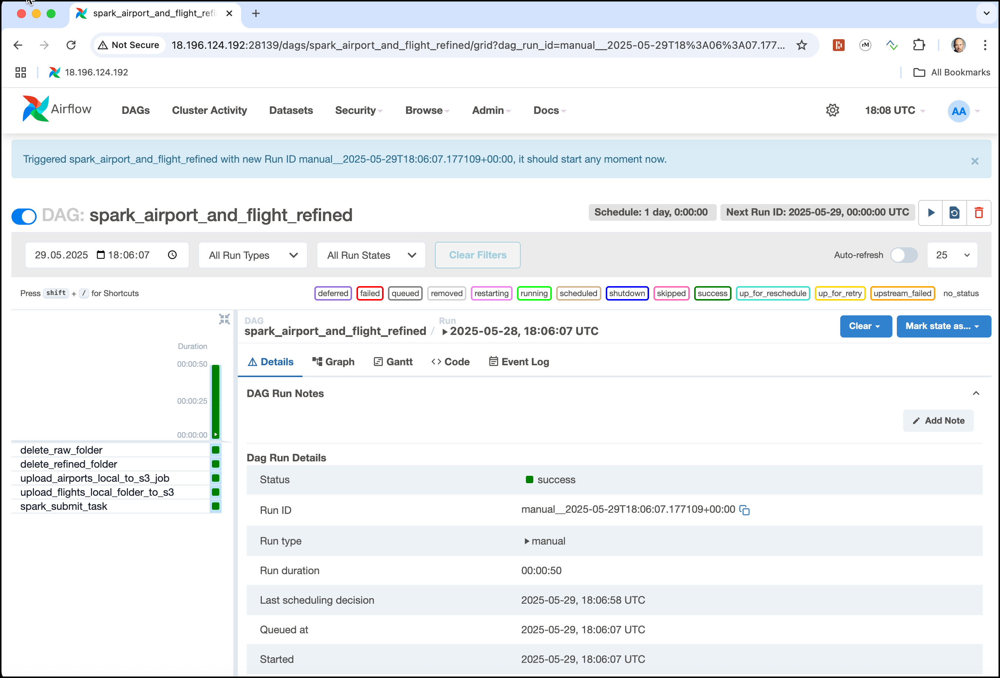
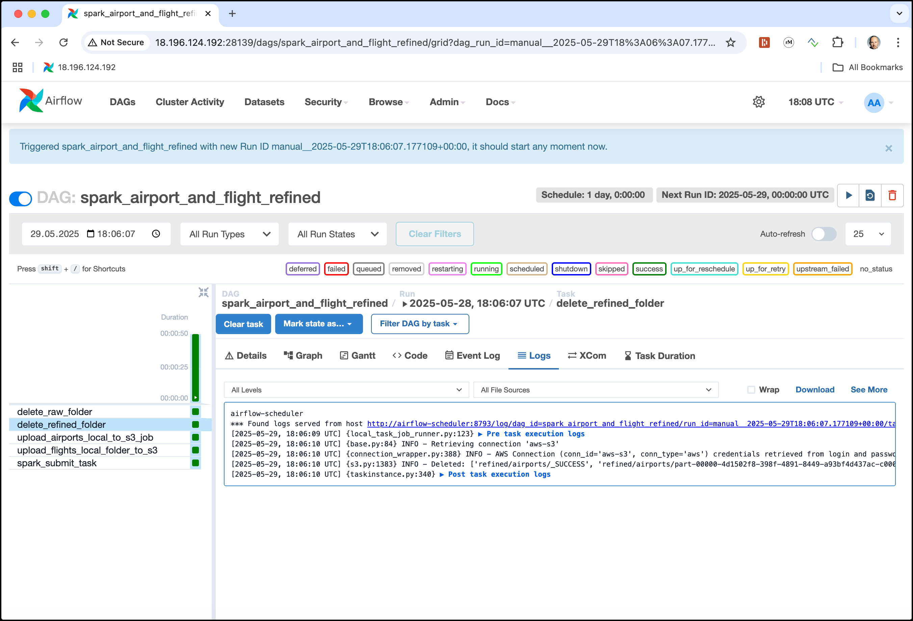
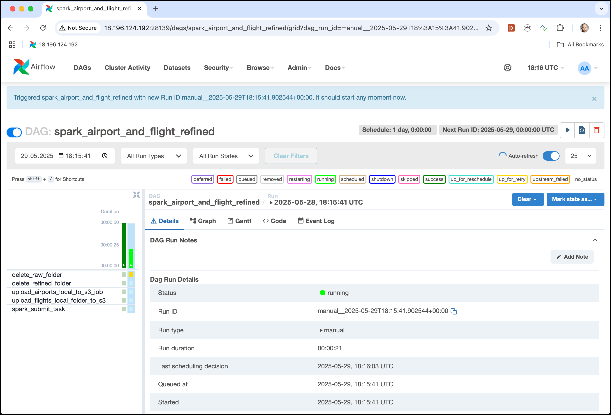
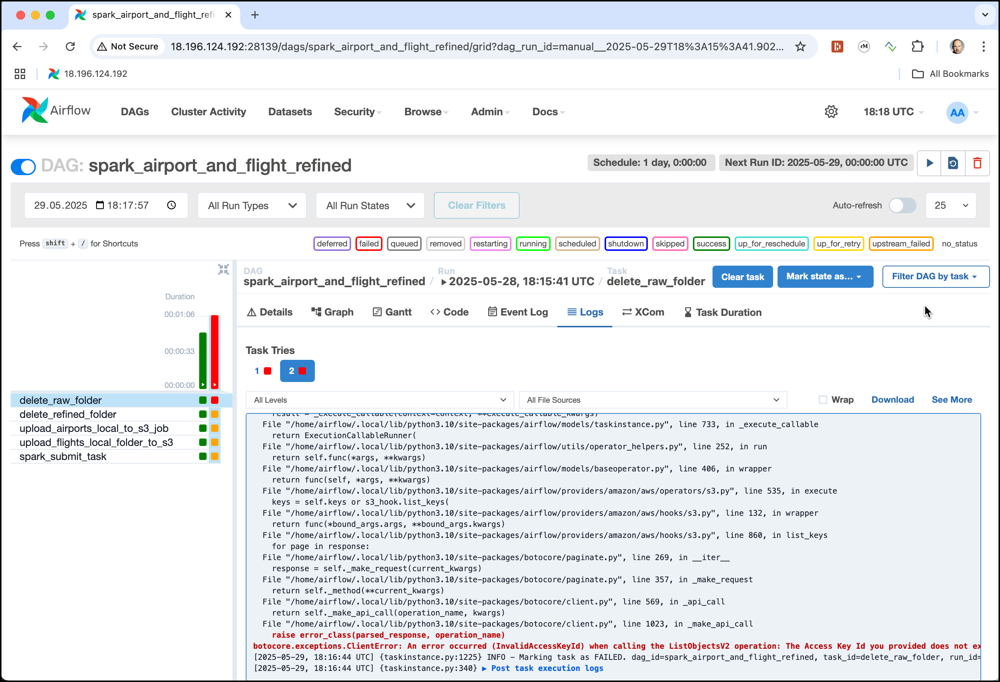

# Job Scheduling with Airflow 2.x

This workshop **will not work** with the dataplatform which is part of this course, as it runs with Airflow 3.x. See [Job Scheduling with Airflow 3.x](../11a-scheduling-with-airflow/README.md) for the same workshop covering Airflow 3.x.

In this workshop we will see how we can use [Apache Airflow](http://airflow.apache.org) 2.x to schedule a Spark Job. We will also use the same Airflow job to upload the data from a local folder to S3. 

## Create the S3 bucket, if not available

Create the flight bucket using the `mc mb` command from a terminal window

```bash
docker exec -ti minio-mc mc mb minio-1/flight-bucket
```

## Create the Spark Python program

For the Spark application we reuse the application created in [Workshop 5 - Creating and running a self-contained Spark Application](../05-spark-application). But for Airflow to run it, we will upload it into the `flight-bucket` bucket on S3 (MinIO).

First let's create a folder for the Spark application 

```bash
cd $DATAPLATFORM_HOME
mkdir -p ./data-transfer/app
```

Create a file, e.g. `prep_refined.py` and save it into the `./data-transfer/app` folder

Use Nano editor to edit the file `nano ./data-transfer/app/prep_refined.py` and copy the following code into editor window.

```python
import argparse

from pyspark.sql import SparkSession
from pyspark.sql.types import *

def main(s3_bucket: str, s3_raw_path: str, s3_refined_path: str):

    spark = SparkSession\
        .builder\
        .appName("FlighTransform")\
        .getOrCreate()
        
    s3_raw_uri = f"s3a://{s3_bucket}/{s3_raw_path}"    
    s3_refined_uri = f"s3a://{s3_bucket}/{s3_refined_path}" 
    print(f"Reading data from raw {s3_raw_uri} and writing to refined {s3_refined_uri}")
    
    airportsRawDF = spark.read.csv(f"{s3_raw_uri}/airports", \
    			sep=",", inferSchema="true", header="true")
    airportsRawDF.write.mode("overwrite").json(f"{s3_refined_uri}/airports")

    flightSchema = """`year` INTEGER, `month` INTEGER, `dayOfMonth` INTEGER,  `dayOfWeek` INTEGER, `depTime` INTEGER, `crsDepTime` INTEGER, `arrTime` INTEGER, `crsArrTime` INTEGER, `uniqueCarrier` STRING, `flightNum` STRING, `tailNum` STRING, `actualElapsedTime` INTEGER,\
                   `crsElapsedTime` INTEGER, `airTime` INTEGER, `arrDelay` INTEGER,`depDelay` INTEGER,`origin` STRING, `destination` STRING, `distance` INTEGER, `taxiIn` INTEGER, `taxiOut` INTEGER, `cancelled` STRING, `cancellationCode` STRING, `diverted` STRING,
                   `carrierDelay` STRING, `weatherDelay` STRING, `nasDelay` STRING, `securityDelay` STRING, `lateAircraftDelay` STRING"""
                   
    flightsRawDF = spark.read.csv(f"{s3_raw_uri}/flights", \
    			sep=",", inferSchema="false", header="false", schema=flightSchema)

    flightsRawDF.write.mode("overwrite").partitionBy("year","month").parquet(f"{s3_refined_uri}/flights")

    spark.stop()
    
if __name__ == "__main__":
    """
    Usage:
        spark-submit spark_app.py --s3-bucket <bucket-name> --s3-raw-path <path/to/data> --s3-refined-path <path/to/data>

    Example:
        spark-submit spark_app.py --s3-bucket my-data-bucket --s3-raw-path <path/to/data> --s3-refined-path <path/to/data>
    """
    parser = argparse.ArgumentParser(description="Spark App with S3 input")
    parser.add_argument("--s3-bucket", required=True, help="S3 bucket name (without s3a://)")
    parser.add_argument("--s3-raw-path", required=True, help="Path in the S3 bucket to the raw data")
    parser.add_argument("--s3-refined-path", required=True, help="Path in the S3 bucket to the refined data")
    args = parser.parse_args()

    main(args.s3_bucket, args.s3_raw_path, args.s3_refined_path)    
```

Save it by hitting `Ctrl-O` and exit by hitting `Ctrl-X`.

The application accepts 3 parameters to specify the **S3 bucket name**, the **raw folder** and the **refined folder**.

Now let's make it available in S3 by uploading it to the `app` folder in the `flight-bucket`. 

```bash
cd $DATAPLATFORM_HOME
docker exec -ti minio-mc mc cp --recursive /data-transfer/app/ minio-1/flight-bucket/app
```

## Create the Airflow DAG

Creating an Airflow DAG (Directed Acyclic Graph) involves defining a workflow as a Python script. 

Let's create a python script by creating a file `spark_airport_and_flight_refined.py` in the `scripts/airflow/dags` folder within the dataplatform root. From there the running Airflow instance will automatically pickup the DAG (after maximum 60s) and load it at runtime. In a terminal window perform

```bash
cd $DATAPLATFORM_HOME/scripts/airflow/dags
nano spark_airport_and_flight_refined.py
```

copy/paste the following python script into the editor window

```python
"""
Airflow DAG to submit Apache Spark applications using
`SparkSubmitOperator`, `SparkJDBCOperator` and `SparkSqlOperator`.
"""
import airflow
import os
from datetime import timedelta
from datetime import datetime
from airflow import DAG
from airflow.operators.python import PythonOperator
from airflow.providers.apache.spark.operators.spark_submit import SparkSubmitOperator 
from airflow.providers.amazon.aws.transfers.local_to_s3 import (
    LocalFilesystemToS3Operator,
)
from airflow.providers.amazon.aws.operators.s3 import (
    S3CopyObjectOperator,
    S3DeleteObjectsOperator,
)
from airflow.providers.amazon.aws.operators.s3 import S3DeleteObjectsOperator
from airflow.providers.amazon.aws.hooks.s3 import S3Hook

default_args = {
 'owner': 'airflow',
 'depends_on_past': False,
 'start_date': datetime.now(),
 'catchup': False,
 'retries':1,
 'retry_delay': timedelta(minutes=1),    
}

def upload_local_folder_to_s3(local_folder, s3_bucket, s3_prefix, aws_conn_id):
    s3_hook = S3Hook(aws_conn_id=aws_conn_id)
    for root, dirs, files in os.walk(local_folder):
        for file in files:
            local_file_path = os.path.join(root, file)
            relative_path = os.path.relpath(local_file_path, local_folder)
            s3_key = os.path.join(s3_prefix, relative_path)
            s3_hook.load_file(
                filename=local_file_path,
                key=s3_key,
                bucket_name=s3_bucket,
                replace=True,
            )

with DAG(
 dag_id='spark_airport_and_flight_refined',
 default_args=default_args,
 schedule='@daily',
 tags=['cas-dataengineering'],
) as dag:

    delete_raw_folder_task = S3DeleteObjectsOperator(
        task_id='delete_raw_folder',
        bucket='flight-bucket',
        prefix='raw/',
        aws_conn_id='aws-s3'
    )
    delete_refined_folder_task = S3DeleteObjectsOperator(
        task_id='delete_refined_folder',
        bucket='flight-bucket',
        prefix='refined/',
        aws_conn_id='aws-s3'
    )

    upload_airports_local_to_s3_task = LocalFilesystemToS3Operator(
        task_id="upload_airports_local_to_s3_job",
        filename="/data-transfer/airport-data/airports.csv",
        dest_key="raw/airports/airports.csv",
        dest_bucket="flight-bucket",
        aws_conn_id="aws-s3",
        replace=True,
    )

    upload_flights_local_folder_to_s3_task = PythonOperator(
        task_id='upload_flights_local_folder_to_s3',
        python_callable=upload_local_folder_to_s3,
        op_kwargs={
            'local_folder': '/data-transfer/flight-data/flights-small/',
            's3_bucket': 'flight-bucket',
            's3_prefix': 'raw/flights/',
            'aws_conn_id': 'aws-s3',
        },
    )

    spark_submit_task = SparkSubmitOperator(
        task_id='spark_submit_task',
        conn_id='spark-cluster',
        application='s3a://flight-bucket/app/prep_refined.py',
        name='Airports and Flight Refinement application',
        application_args=[
            '--s3-bucket', 'flight-bucket',
            '--s3-raw-path', 'raw',
            '--s3-refined-path', 'refined'
        ],
    )    

    delete_raw_folder_task >> delete_refined_folder_task >> upload_airports_local_to_s3_task >> upload_flights_local_folder_to_s3_task >> spark_submit_task
```

Save it by hitting `Ctrl-O` and exit by hitting `Ctrl-X`.

Navigate to <http://dataplatform:28139> and login as `airflow` and password `abc123!`. Repeat clicking on **DAGs** in the top menu and after a while the `spark_airport_and_flight_refined` should show up. 



The loading of the DAG **was successfull!** If there is an error in the script, you will see an error message just below the menu. 

Click on the `spark_airport_and_flight_refined` link to see the details page of the DAG.


 
This is the page where we will later see the task executions and the status of each execution. Currently the DAG is in **paused** state, which can be seen by the **toogle button** in the top left corner. We can not yet **Unpause** it, because we first have to createt the two connections used in the DAG. 

We can also use the various Tabs on the detail window to navigate to the **Graph** view (to see a grapical representation of the DAG).



to the **Code** view (to see the python code), to the **Logs** to see the log statement for each task execution, once the DAG has run at least once.

The Airflow DAG will first delete the `raw` and `refined` folders, if they exist, then upload the airport & flight data and last but not least start the Spark application to create the refined data.

To perform the different steps, we have used various predefined operators such as 

  * `S3DeleteObjectsOperator` - for deleting the existing folders in S3 (MinIO)
  * `LocalFilesystemToS3Operator` - for uploading a single file from the local filesystem to S3
  * `PythonOperator` - for uploading a whole folder from the local filesystem to S3 using a custom function (the `LocalFilesystemToS3Operator` only works for single files)
  * `SparkSubmitOperator` - for submitting the Spark application to the Spark cluster of the dataplatform

Before using these operators, we need to create the necessary connections. 

## Create the Airflow Connection objects

In Airflow, you can create connections to various external systems, including S3 and Spark clusters. Here's how to create these connections.    

### S3 Connection
    
First let's create the S3 connection. 

Naviate to the **Admin** top menu item and click on **Connections**. Create a new connection by  clicking on the **+** button. Fill in following connection details:

  * **Connection Id**: `aws-s3`
  * **Connection Type**: Select **Amazon Web Services** as the connection type.
  * **AWS Access Key ID**: `admin`
  * **AWS Secret Access Key**: `abc123!abc123!`
  
  * **Extra**: You can provide additional configuration options in JSON format. Add the following JSON document    

	```json    
	{
		"endpoint_url": "http://minio-1:9000",
		"region_name": "us-east-1"
	}
	```

Save the Connection by clicking on **Save**.    

### Spark Connection

Now let's do the same for the Spark cluster connection

Clicking again on the **+** button to create a new connection. 

  * **Connection Id**: `spark-cluster`
  * **Connection Type**: Select **Spark** as the connection type.
  * **Host**: `spark://spark-master:7077`

Save the Connection by clicking on **Save**. 

Now the Airflow environment is ready and we can run the DAG for the first time. 

## Activating and starting the Airflow DAG

Navigate back to the **DAG** view by clicking on the item in the top menu. 

Click on the **Toggle** button to **Unpause** the `spark_airport_and_flight_refined`. Click on the DAG to navigate to the details. 
The DAG is now active, but not yet started, as in the python script we did not specify a `start-date` in the past.

```python
with DAG(
 dag_id='spark_airport_and_flight_refined',
 default_args=default_args,
 schedule_interval=timedelta(days=1),
 start_date=days_ago(0),
 tags=['cas-dataengineering'],
) as dag:
```

We can manually start the DAG for the first time by clicking on the **play** button in the top right corner, right to the **Next Run ID**.

We can see the total of five tasks our DAG is made of on the left. Airflow will run one after the other and the status of each execution is shown in different colors.  



After a while all 5 should be in dark green, the DAG has run successfully!



Click on one of the dark green cells and navigate to the **Logs** tab to see the log of the task execution



This is very helpful for debugging, should you run into an error with one of the tasks.

Use the Minio Console to check that the raw data has been loaded an the refined data created.

## Forcing and error to see it in the Airflow UI

You can easily simulate a problem by changing one of the Airflow connections with an invalid value. 

Navigate to the S3 connection `aws-s3` and replace the **AWS Access Key ID** with `minio` (instead of `admin`). Click on **Save** to make it active. 

Now navigate back to the detail page for the `spark_airport_and_flight_refined` DAG and click again on the **Play** button to trigger the DAG once more. 



You will immediately see that there is something wrong in the first task, as its cell is colored in yellow. After a few seconds it will change to red, and it will execute the task 2 times (because of the configured retry). 

If you click on the red cell and navigate to **Logs**, you can see the exception in red, clearly mentioning the reason for the problem. 



Change the **AWS Access Key ID** in the `aws-s3` connection back to `admin`. 

Now navigate back to the detail page for the `spark_airport_and_flight_refined` DAG and click again on the red cell right to the first task, where we got the error. Click on **Clear Task** button and on the pop-up dialog click **Clear** to re-run the problematic task. 

This time the whole DAG should again run successfullly.


