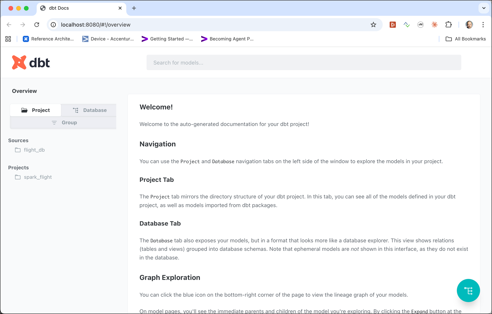
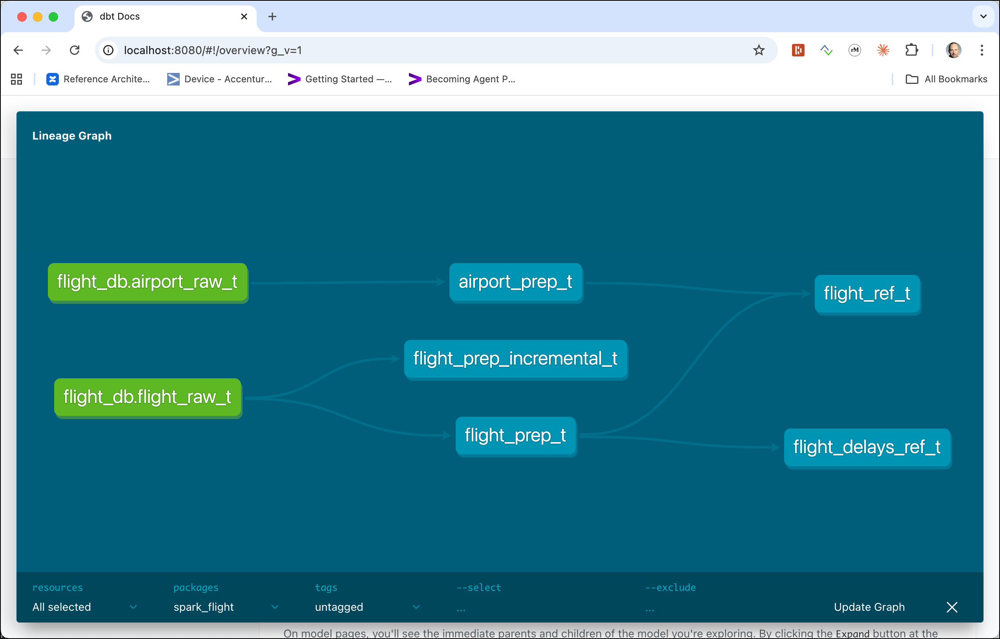

# Working with `dbt` and Spark

In this workshop we will work with [dbt](https://www.getdbt.com/).

The same raw data as in the [Object Storage Workshop](../02a-minio-object-storage/README.md) will be used. We will show later how to re-upload the files, if you no longer have them available.

## Table of Contents

- [What you will learn](#what-you-will-learn)
- [Prerequisites](#prerequisites)
- [Upload the raw data, if no longer available](#upload-the-raw-data-if-no-longer-available)
- [Register tables for Raw data](#register-tables-for-raw-data)
- [Install dbt](#install-dbt)
- [Create the dbt project](#create-the-dbt-project)
- [Create models](#create-models)
- [Per-layer Materialization](#per-layer-materialization)
- [Targeted Runs with --select](#targeted-runs-with---select)
- [dbt Tests](#dbt-tests)
- [Incremental Models](#incremental-models)
- [dbt Documentation](#dbt-documentation)
- [Query the Results from Trino](#query-the-results-from-trino)
- [Semantic Models and Metrics](#semantic-models-and-metrics-does-not-work-yet---spark-is-not-supported)

## What you will learn

- How to set up a dbt project connected to a Spark backend via the Thrift Server
- How to define dbt models (SQL `SELECT` statements) that transform raw data into prepared and refined layers
- How to configure materialization strategies: `view`, `table`, and `incremental` — per layer
- How to use `dbt run --select` to target individual models or subgraphs
- How to write generic tests (`not_null`, `unique`, `accepted_values`, `relationships`) in `schema.yml`
- How to run `dbt test` to validate data quality across all models
- How to build an incremental model that only processes new rows on subsequent runs
- How to generate and serve dbt documentation with the interactive lineage DAG
- How to query dbt-produced tables from Trino to close the end-to-end pipeline
- How to define a dbt Semantic Model with entities, dimensions, and measures
- How to create a time spine model and register it so MetricFlow can power time-series queries
- How to declare reusable business metrics (`simple`, `ratio`) on top of semantic models
- How to query metrics using the MetricFlow CLI (`mf query`) without writing SQL

## Prerequisites

- The **Data Platform** described [here](../00-environment) is running and accessible
- Workshop 2a ([Working with MinIO Object Storage](../02a-minio-object-storage)) completed — airport and flight data must be in MinIO
- The Hive Metastore is running and accessible (included in the data platform)
- dbt with the `dbt-spark` adapter installed (instructions provided in the workshop)

## Upload the data, if no longer available

The data needed here has been uploaded in workshop 2 - [Working with RustFS Object Storage](01b-rustfs-object-storage). You can skip this section, if you still have the data available in Object Storage. We show both `s3cmd` and the `mc` version of the commands:

Create the flight bucket:

```bash
docker exec -ti awscli s3cmd mb s3://flight-bucket
```

Upload all data

```bash
# Airports
docker exec -ti awscli s3cmd put /data-transfer/airport-data/airports.csv s3://flight-bucket/raw/airports/airports.csv

# Plane Data
docker exec -ti awscli s3cmd put /data-transfer/flight-data/plane-data.csv s3://flight-bucket/raw/planes/plane-data.csv

# Carriers
docker exec -ti awscli s3cmd put /data-transfer/flight-data/carriers.json s3://flight-bucket/raw/carriers/carriers.json

 #Flights
docker exec -ti awscli s3cmd put /data-transfer/flight-data/flights-small/flights_2008_4_1.csv s3://flight-bucket/raw/flights/ &&
   docker exec -ti awscli s3cmd put /data-transfer/flight-data/flights-small/flights_2008_4_2.csv s3://flight-bucket/raw/flights/ &&
   docker exec -ti awscli s3cmd put /data-transfer/flight-data/flights-small/flights_2008_5_1.csv s3://flight-bucket/raw/flights/ &&
   docker exec -ti awscli s3cmd put /data-transfer/flight-data/flights-small/flights_2008_5_2.csv s3://flight-bucket/raw/flights/ &&
   docker exec -ti awscli s3cmd put /data-transfer/flight-data/flights-small/flights_2008_5_3.csv s3://flight-bucket/raw/flights/
```

## Register tables for Raw data

In order to access data in Object Storage using `dbt`, we have to create a table in the Hive metastore. Note that the location `s3a://flight-bucket/raw/..` points to the data we have uploaded before.

Connect to Hive Metastore CLI

```bash
docker exec -ti hive-metastore hive
```

and on the command prompt first create a new database `flight_db` 

```sql
CREATE DATABASE flight_db
LOCATION 's3a://flight-bucket/warehouse';
```

switch into that database

```sql
USE flight_db;
```

and register the airport data as table `airport_raw_t `

```
DROP TABLE IF EXISTS airport_raw_t;
CREATE EXTERNAL TABLE airport_raw_t 
   (id string
   , ident string
   , type string
   , name string
   , latitude_deg string
   , longitude_deg string
   , elevation_ft string
   , continent string
   , iso_country string
   , iso_region string
   , municipality string
   , scheduled_service string
   , gps_code string
   , iata_code string
   , local_code string
   , home_link string
   , wikipedia_link string
   , keywords string)
ROW FORMAT SERDE 'org.apache.hadoop.hive.serde2.OpenCSVSerde'
WITH SERDEPROPERTIES (
   "skip.header.line.count" = "1",
   "separatorChar" = ","
)
STORED AS TEXTFILE
LOCATION 's3a://flight-bucket/raw/airports';
```

We use `string` as the datatype for all columns in the raw layer. We will later cast to the correct datatypes when creating the data in the prepared layer.

Register the flights data as table `flight_raw_t`

```
DROP TABLE IF EXISTS flight_raw_t;
CREATE EXTERNAL TABLE flight_raw_t 
   (year integer,
   month integer,
   dayOfMonth integer,
   dayOfWeek integer,
   depTime integer,
   crsDepTime integer,
   arrTime integer,
   crsArrTime integer,
   uniqueCarrier string,
   flightNum string,
   tailNum string,
   actualElapsedTime integer,
   crsElapsedTime integer,
   airTime integer,
   arrDelay integer,
   depDelay integer,
   origin string,
   destination string,
   distance integer,
   taxiIn integer,
   taxiOut integer,
   cancelled string,
   cancellationCode string,
   diverted string,
   carrierDelay string,
   weatherDelay string,
   nasDelay string,
   securityDelay string,
   lateAircraftDelay string
   )
ROW FORMAT SERDE 'org.apache.hadoop.hive.serde2.OpenCSVSerde'
LOCATION 's3a://flight-bucket/raw/flights';
```

These two tables provide the base infrastructure to run dbt on top.

## Install `dbt`

Let's install `dbt` in virtual environment. You can perfom the steps in this workshop either on the cloud Linux VM (e.g. AWS Lightsail) or on your local workstation (you need to have Python 3.x available and you might need to adapt the Linux shell commands to Windows). In a terminal window.

```bash
mkdir -p workspace/dbt-spark-flight
cd workspace/dbt-spark-flight
```

Install `venv` support if not available (adapt if not Linux)

```bash
sudo apt install python3.12-venv
```

Now create a virtual environment

```bash
python3 -m venv venv
source venv/bin/activate
python3 -m pip install --upgrade pip
```

Create the `requirements.txt` file

```bash
nano requirements.txt
```

and add the following lines to install `dbt-core` and `dbt-spark`

```bash
# dbt Core 1.11
dbt-core>=1.11.7

# spark adapter
dbt-spark>=1.10.1

dbt-spark[PyHive]
```

Save by hitting `Crtl-O` and exit by hitting `Ctrl-X`.

Install requirements into virtual environment

```bash
python3 -m pip install -r requirements.txt
```
	
Verify the `dbt` installation by displaying the version of `dbt`

```bash
dbt --version
```
  
which should return

```bash
(venv) ubuntu@ip-172-26-6-70:~/workspace/dbt-spark$ dbt --version
WARNING:thrift.transport.sslcompat:using legacy validation callback
Core:
  - installed: 1.11.10
  - latest:    1.11.10 - Up to date!

Plugins:
  - spark: 1.10.1 - Up to date!
```

You now have successfully installed `dbt-core` with `dbt-spark` on your machine.	
## Create the `dbt` project

Now we can create the skeleton of a `dbt` project. The following statement will provide the necessary folder structure as well as some configuration files. 

```bash
dbt init
```

Enter the following values:

  * **Name of project**: `spark_flight`
  * **Which database**: `1` (i.e. spark)
  * **Thrift Server Host**: `192.168.1.112` (IP address where the dataplatform is running)
  * **Desired authentication method**: `3` (i.e. thriftserver)
  * **poll_interval**: `5` (default)
  * **query_timeout**: `60`
  * **query_retries**: `1` (default)
  * **Thrift Server Port**: `28118`
  * **Schema**: `flight_db`
  * **Threads**: `1`

The question/answer flow should look similar to that

```bash
(venv) ubuntu@ip-172-26-6-70:~/workspace/dbt$ dbt init
19:42:20  Running with dbt=1.11.7
Enter a name for your project (letters, digits, underscore): spark_flight
19:42:25
Your new dbt project "spark_flight" was created!

For more information on how to configure the profiles.yml file,
please consult the dbt documentation here:

  https://docs.getdbt.com/docs/configure-your-profile

One more thing:

Need help? Don't hesitate to reach out to us via GitHub issues or on Slack:

  https://community.getdbt.com/

Happy modeling!

19:42:25  Setting up your profile.
Which database would you like to use?
[1] spark

(Don't see the one you want? https://docs.getdbt.com/docs/available-adapters)

Enter a number: 1
WARNING:thrift.transport.sslcompat:using legacy validation callback
host (yourorg.sparkhost.com): 192.168.1.112
[1] odbc
[2] http
[3] thrift
Desired authentication method option (enter a number): 3
poll_interval (seconds between polling attempts for query status) [5]:
query_timeout (maximum seconds to wait for query completion (optional)): 60
query_retries (number of times to retry on connection loss during query execution) [1]: 1
port [443]: 28118
schema (default schema that dbt will build objects in): flight_db
threads (1 or more) [1]: 1
19:44:29  Profile spark_flight written to /Users/guido.schmutz/.dbt/profiles.yml using target's profile_template.yml and your supplied values. Run 'dbt debug' to validate the connection.
```

Navigate into the newly created folder called `spark_flight` (same as the name of the project entered above)

```
cd spark_flight
```

We can see the directory structure created by the `init` easily by using the `tree` command (if available)

```bash
(venv) ubuntu@ip-172-26-6-70:~/workspace/dbt/spark_flight$ tree
.
├── analyses
├── dbt_project.yml
├── macros
├── models
│   └── example
│       ├── my_first_dbt_model.sql
│       ├── my_second_dbt_model.sql
│       └── schema.yml
├── README.md
├── seeds
├── snapshots
└── tests

8 directories, 5 files
```

We won`t use the example in models, so let's remove it for now. 

```bash
rm -R models/example
```

Now let's see if the dbt project is valid by using the `dbt debug` command

```bash
dbt debug
```

And you should see an output similar to the one shown below. 

```bash
(venv) ubuntu@ip-172-26-6-70:~/workspace/dbt/spark_flight$ dbt debug
18:23:01  Running with dbt=1.9.6
18:23:01  dbt version: 1.9.6
18:23:01  python version: 3.12.3
18:23:01  python path: /home/ubuntu/workspace/dbt/venv/bin/python3
18:23:01  os info: Linux-6.8.0-1018-aws-x86_64-with-glibc2.39
WARNING:thrift.transport.sslcompat:using legacy validation callback
18:23:01  Using profiles dir at /home/ubuntu/.dbt
18:23:01  Using profiles.yml file at /home/ubuntu/.dbt/profiles.yml
18:23:01  Using dbt_project.yml file at /home/ubuntu/workspace/dbt/spark_flight/dbt_project.yml
18:23:01  adapter type: spark
18:23:01  adapter version: 1.9.2
18:23:01  Configuration:
18:23:01    profiles.yml file [OK found and valid]
18:23:01    dbt_project.yml file [OK found and valid]
18:23:01  Required dependencies:
18:23:02   - git [OK found]

18:23:02  Connection:
18:23:02    host: 18.158.72.138
18:23:02    port: 28118
18:23:02    cluster: None
18:23:02    endpoint: None
18:23:02    schema: flight
18:23:02    organization: 0
18:23:02  Registered adapter: spark=1.9.2
18:23:02    Connection test: [OK connection ok]

18:23:02  All checks passed!
```

If it shows `All checks passed!` then we are ready to work with dbt. 

## Create models

Let's create the folder structure underneath the `models` folder to organize the models. The `flight/` subfolder is the domain grouping — if you added customer data you'd create a customer/ folder with the same three sub-layers alongside it.

```bash
mkdir -p models/flight/raw
mkdir -p models/flight/prepared
mkdir -p models/flight/refined
```

The folder structure follows the medallion architecture (also called the multi-hop pattern) — a standard data engineering pattern for organizing data by quality/refinement level.

```
models/
└── flight/                     ← domain (could have others: e.g. customer/, finance/)
    ├── raw/                    ← Layer 1: source registration only
    │   └── raw-sources.yml     ← no SQL transforms, just points to Hive Metastore tables
    │
    ├── prepared/               ← Layer 2: clean & typed
    │   ├── airport_prep_t.sql  ← casts strings to correct types, renames columns
    │   ├── flight_prep_t.sql   ← same for flights
    │   └── schema.yml          ← column docs + data quality tests
    │
    ├── refined/                ← Layer 3: business-ready
    │   ├── flight_ref_t.sql        ← joins flights + airports (origin + destination)
    │   ├── flight_delays_ref_t.sql ← adds delay bucket classification
    │   └── schema.yml
    │
    └── semantic/               ← Layer 4: business metrics (optional)
        ├── sem_flights.yml     ← entities, dimensions, measures
        └── metrics_flights.yml ← named metrics (avg delay, cancellation rate, ...)
```

### Raw Layer

First we have to "register" the raw sources. 

```bash
nano models/flight/raw/raw-sources.yml
```

Add the following YAML definition

```yaml
version: 2

sources:
  - name: flight_db
    config:
      meta:
        technical_owner: PeterMuster
        data_tier: Raw
    tables:
      - name: airport_raw_t

      - name: flight_raw_t
```

The tables we register here have to match the ones we created above in Hive Metastore on our raw objects in MinIO.

### Prepared Layer

Now with the raw tables listed, we can start creating the transformations for the prepared layer. 

First let's transform the airport data

```bash
nano models/flight/prepared/airport_prep_t.sql
```

Add the following SQL statment

```sql
WITH airport_prep_t AS (
   SELECT 
        CAST (id AS INT) as id, 
        ident,
        type,
        name,
        CAST (latitude_deg AS DOUBLE) as latitude_degree,
        CAST (longitude_deg AS DOUBLE) as longitude_degree,
        CAST (elevation_ft AS INT) as elevation_feet,
        CASE WHEN continent IS NULL
                THEN NULL
            ELSE continent
        END AS continent,
        iso_country,
        iso_region,
        municipality,
        CASE WHEN scheduled_service IS NULL
                THEN NULL
            WHEN scheduled_service = 'no'
                THEN 0
            ELSE 1
        END AS scheduled_service,
        gps_code,
        iata_code,
        local_code,
        home_link,
        wikipedia_link,
        keywords
    FROM {{ source('flight_db', 'airport_raw_t') }}
) SELECT * 
FROM airport_prep_t
```

As you can see the SQL statement only returns the data in a SELECT clause. We can see that we change (CAST) some of the values to the appropriate data types (in the raw table everything is a string).  

Everything this clause returns will be part of either a view or a table created (depending on the `dbt` materialization strategy, which you can change according to your needs). We will see it later in use. 

Now let's also create the transformation for the flight data. 

```bash
nano models/flight/prepared/flight_prep_t.sql
```

with the following SELECT clause

```sql
WITH flight_prep_t AS (
   SELECT year, 
        month,
        CAST(dayOfMonth AS INT) AS dayOfMonth,
        CAST(dayOfWeek AS INT) AS dayOfWeek,
        CAST(depTime AS INT) AS depTime,
        CAST(crsDepTime AS INT) AS crsDepTime,
        CAST(arrTime AS INT) AS arrTime,
        CAST(crsArrTime AS INT) AS crsArrTime,
        uniqueCarrier, 
        flightNum, 
        tailNum, 
        CAST(actualElapsedTime AS INT) AS actualElapsedTime,
        CAST(crsElapsedTime AS INT) AS crsElapsedTime, 
        CAST(airTime AS INT) AS airTime, 
        CAST(arrDelay AS INT) AS arrDelay,
        CAST(depDelay AS INT) AS depDelay,
        origin, 
        destination, 
        CAST(distance AS INT) AS distance, 
        CAST(taxiIn AS INT) AS taxiIn, 
        CAST(taxiOut AS INT) AS taxiOut, 
        CASE WHEN cancelled IS NULL 
                THEN 0 
            WHEN cancelled = 'N' 
                THEN 0
            ELSE 1 
        END AS cancelled,         
        cancellationCode, 
        CASE WHEN diverted IS NULL 
                THEN 0 
            WHEN diverted = 'N' 
                THEN 0
            ELSE 1 
        END AS diverted,         
        CASE WHEN carrierDelay IS NULL
                THEN NULL 
            WHEN diverted = 'NA' 
                THEN NULL
            ELSE CAST(carrierDelay AS INT)
        END AS carrierDelay,
        CASE WHEN weatherDelay IS NULL
                THEN NULL 
            WHEN weatherDelay = 'NA' 
                THEN NULL
            ELSE CAST(weatherDelay AS INT)
        END AS weatherDelay,
        CASE WHEN nasDelay IS NULL
                THEN NULL 
            WHEN nasDelay = 'NA' 
                THEN NULL
            ELSE CAST(nasDelay AS INT)
        END AS nasDelay,
        CASE WHEN securityDelay IS NULL
                THEN NULL 
            WHEN securityDelay = 'NA' 
                THEN NULL
            ELSE CAST(securityDelay AS INT)
        END AS securityDelay,
        CASE WHEN lateAircraftDelay IS NULL
                THEN NULL 
            WHEN lateAircraftDelay = 'NA' 
                THEN NULL
            ELSE CAST(lateAircraftDelay AS INT)
        END AS lateAircraftDelay
    from {{ source('flight_db', 'flight_raw_t') }} 
)select * 
from flight_prep_t
```

Now with these two transformations in place, let's run dbt

```bash
dbt run
```

and you should see a result similar to the one below

```
(venv) ubuntu@ip-172-26-6-70:~/workspace/dbt/spark_flight$ dbt run
19:02:29  Running with dbt=1.9.6
WARNING:thrift.transport.sslcompat:using legacy validation callback
19:02:29  Registered adapter: spark=1.9.2
19:02:29  [WARNING]: Configuration paths exist in your dbt_project.yml file which do not apply to any resources.
There are 1 unused configuration paths:
- models.spark_flight.example
19:02:29  Found 2 models, 2 sources, 473 macros
19:02:29
19:02:29  Concurrency: 1 threads (target='dev')
19:02:29
19:02:30  1 of 2 START sql view model flight_db.airport_prep_t ........................... [RUN]
19:02:30  1 of 2 OK created sql view model flight_db.airport_prep_t ...................... [OK in 0.45s]
19:02:30  2 of 2 START sql view model flight_db.flight_prep_t ............................ [RUN]
19:02:30  2 of 2 OK created sql view model flight_db.flight_prep_t ....................... [OK in 0.36s]
19:02:31
19:02:31  Finished running 2 view models in 0 hours 0 minutes and 1.19 seconds (1.19s).
19:02:31
19:02:31  Completed successfully
19:02:31
19:02:31  Done. PASS=2 WARN=0 ERROR=0 SKIP=0 TOTAL=2
```

> **What you should see:** Two models created as `view model` in under 2 seconds. The model names match the SQL files you created in the prepared layer.

> **What just happened?** dbt parsed the SQL files, resolved the `{{ source() }}` references to determine execution order, and submitted each SELECT to the Spark Thrift Server wrapped in a `CREATE OR REPLACE VIEW AS SELECT ...` statement. Each view is registered in the Hive Metastore under `flight_db`. No data was moved or read from MinIO yet — views are just stored query definitions that execute lazily when queried.

The two objects in the prepared layer have been created as views (as shown by `view model`). You can check these either by using Hive Metastore CLI or DBeaver. 

Using Hive Metastore CLI

```bash
docker exec -ti hive-metastore hive

use flight_db;
show views;
```

and you should see an output similar to the one below

```
(venv) ubuntu@ip-172-26-6-70:~/workspace/dbt/spark_flight$ docker exec -ti hive-metastore hive
SLF4J: Class path contains multiple SLF4J bindings.
SLF4J: Found binding in [jar:file:/opt/hive/lib/log4j-slf4j-impl-2.17.1.jar!/org/slf4j/impl/StaticLoggerBinder.class]
SLF4J: Found binding in [jar:file:/opt/hadoop/share/hadoop/common/lib/slf4j-log4j12-1.7.25.jar!/org/slf4j/impl/StaticLoggerBinder.class]
SLF4J: See http://www.slf4j.org/codes.html#multiple_bindings for an explanation.
SLF4J: Actual binding is of type [org.apache.logging.slf4j.Log4jLoggerFactory]
Hive Session ID = 46a42ae8-5342-480b-a77b-c89f9f2c6eef

Logging initialized using configuration in file:/opt/hive/conf/hive-log4j2.properties Async: true
Hive-on-MR is deprecated in Hive 2 and may not be available in the future versions. Consider using a different execution engine (i.e. spark, tez) or using Hive 1.X releases.
Hive Session ID = 7d44efe4-44bf-42f2-b480-1bccf550b94e
WARNING: Directory for Hive history file: /home/hive does not exist.   History will not be available during this session.
hive> use flight_db;
OK
Time taken: 0.635 seconds
hive> show views;
OK
airport_prep_t
flight_prep_t
Time taken: 0.148 seconds, Fetched: 4 row(s)
hive>
```

### Refined Layer

Now with the prepared layer defined and created, we can start creating the transformations for the refined layer. 

First let's create the joined version of fligth data with airport data (once for the origin and once for the destination)

```bash
nano models/flight/refined/flight_ref_t.sql
```

with the base SQL statement we have used in Workhop 4

```sql
WITH flight_ref_t as (
    SELECT ao.name AS origin_airport
            , ao.type AS origin_type
            , ao.municipality AS origin_municipality
            , ad.name AS destination_airport
            , ad.type AS destination_type
            , ad.municipality AS destination_municipality
            , f.*
    FROM {{ref ('flight_prep_t')}}  AS f
    LEFT JOIN {{ref ('airport_prep_t')}} AS ao
    ON (f.origin = ao.iata_code)
    LEFT JOIN {{ref ('airport_prep_t')}} AS ad
    ON (f.destination = ad.iata_code)
) SELECT * 
FROM flight_ref_t
```

Let's also create the delay information by time bucket

```bash
nano models/flight/refined/flight_delays_ref_t.sql
```

and use the same base SQL statement as used in Workshop 4

```sql
WITH flight_delays_ref_t AS (
    SELECT year, month, dayOfMonth, dayOfWeek, arrDelay, origin, destination,
        CASE
            WHEN arrDelay > 360 THEN 'Very Long Delays'
            WHEN arrDelay > 120 AND arrDelay < 360 THEN 'Long Delays'
            WHEN arrDelay > 60 AND arrDelay < 120 THEN 'Short Delays'
            WHEN arrDelay > 0 and arrDelay < 60 THEN 'Tolerable Delays'
            WHEN arrDelay = 0 THEN 'No Delays'
            ELSE 'Early'
        END AS flight_delays
            FROM {{ref ('flight_prep_t')}}
) SELECT * 
FROM flight_delays_ref_t
```

With the two more refined transformation in place, let's rerun `dbt run`

```bash
(venv) ubuntu@ip-172-26-6-70:~/workspace/dbt/spark_flight$ dbt run
19:13:12  Running with dbt=1.9.6
WARNING:thrift.transport.sslcompat:using legacy validation callback
19:13:13  Registered adapter: spark=1.9.2
19:13:13  Unable to do partial parsing because a project config has changed
19:13:15  [WARNING]: Configuration paths exist in your dbt_project.yml file which do not apply to any resources.
There are 1 unused configuration paths:
- models.spark_flight.example
19:13:15  Found 4 models, 2 sources, 473 macros
19:13:15
19:13:15  Concurrency: 1 threads (target='dev')
19:13:15
19:13:15  1 of 4 START sql view model flight_db.airport_prep_t ........................... [RUN]
19:13:15  1 of 4 OK created sql view model flight_db.airport_prep_t ...................... [OK in 0.38s]
19:13:16  2 of 4 START sql view model flight_db.flight_prep_t ............................ [RUN]
19:13:16  2 of 4 OK created sql view model flight_db.flight_prep_t ....................... [OK in 0.29s]
19:13:16  3 of 4 START sql view model flight_db.flight_delays_ref_t ...................... [RUN]
19:13:16  3 of 4 OK created sql view model flight_db.flight_delays_ref_t ................. [OK in 0.36s]
19:13:16  4 of 4 START sql view model flight_db.flight_ref_t ............................. [RUN]
19:13:17  4 of 4 OK created sql view model flight_db.flight_ref_t ........................ [OK in 0.42s]
19:13:17
19:13:17  Finished running 4 view models in 0 hours 0 minutes and 1.91 seconds (1.91s).
19:13:17
19:13:17  Completed successfully
19:13:17
19:13:17  Done. PASS=4 WARN=0 ERROR=0 SKIP=0 TOTAL=4
(venv) ubuntu@ip-172-26-6-70:~/workspace/dbt/spark_flight$
```

> **What you should see:** All four models created as `view model` in under 2 seconds. The two new refined models (`flight_delays_ref_t` and `flight_ref_t`) were created after the prepared models because dbt resolved their `{{ ref() }}` dependencies automatically.

> **What just happened?** dbt built a dependency graph from the `{{ ref() }}` and `{{ source() }}` calls, then executed models in topological order: prepared models first, then refined models. The `{{ ref('flight_prep_t') }}` in the refined SQL was automatically resolved to the actual table/view name in the Hive Metastore, making models portable across environments without hardcoded schema names.

We can see that these are also created as Views (`view model`).

You can crosscheck that by using DBeaver and connecting to the Spark Thriftserver, as demonstrated in [Workshop 4 - Data Reading and Writing using DataFrames](../04-spark-dataframe/README.md).

We can also change the materialization to table. This can be configured in `dbt_project.yml`.

```bash
nano dbt_project.yml
```

Navigate to the end and remove the entry for the `example` model

```
models:
  spark_flight:
    # Config indicated by + and applies to all files under models/example/
    example:
      +materialized: view
```

by an entry for our `flight` model with the materialization as `table`

```
models:
  spark_flight:
    # Config indicated by + and applies to all files under models/example/
    flight:
      +materialized: table
```

Now re-run dbt

`dbt run` 

and the views should get replaced by tables, as shown in the log

```bash
(venv) ubuntu@ip-172-26-6-70:~/workspace/dbt/spark_flight$ dbt run
19:21:42  Running with dbt=1.9.6
WARNING:thrift.transport.sslcompat:using legacy validation callback
19:21:42  Registered adapter: spark=1.9.2
19:21:43  Unable to do partial parsing because a project config has changed
19:21:44  Found 4 models, 2 sources, 473 macros
19:21:44
19:21:44  Concurrency: 1 threads (target='dev')
19:21:44
19:21:44  1 of 4 START sql table model flight_db.airport_prep_t .......................... [RUN]
19:21:47  1 of 4 OK created sql table model flight_db.airport_prep_t ..................... [OK in 2.98s]
19:21:47  2 of 4 START sql table model flight_db.flight_prep_t ........................... [RUN]
19:21:50  2 of 4 OK created sql table model flight_db.flight_prep_t ...................... [OK in 2.58s]
19:21:50  3 of 4 START sql table model flight_db.flight_delays_ref_t ..................... [RUN]
19:21:52  3 of 4 OK created sql table model flight_db.flight_delays_ref_t ................ [OK in 1.90s]
19:21:52  4 of 4 START sql table model flight_db.flight_ref_t ............................ [RUN]
19:21:56  4 of 4 OK created sql table model flight_db.flight_ref_t ....................... [OK in 3.88s]
19:21:56
19:21:56  Finished running 4 table models in 0 hours 0 minutes and 11.69 seconds (11.69s).
19:21:56
19:21:56  Completed successfully
19:21:56
19:21:56  Done. PASS=4 WARN=0 ERROR=0 SKIP=0 TOTAL=4
(venv) ubuntu@ip-172-26-6-70:~/workspace/dbt/spark_flight$
```

> **What you should see:** The log now says `table model` instead of `view model` and the run takes about 12 seconds — because dbt now actually executes each SELECT and materialises the results as a physical Parquet-backed table in the Hive Metastore.

> **What just happened?** Changing `+materialized: table` in `dbt_project.yml` caused dbt to wrap each SELECT in a `CREATE TABLE AS SELECT ...` (CTAS) statement. The `airport_prep_t` and `flight_prep_t` tables now exist as real tables in the Hive Metastore backed by Parquet files in MinIO — downstream tools like Trino can query them without traversing the view chain back to the raw CSV files, improving query performance for downstream consumers significantly.

## Per-layer Materialization

Rather than setting the same materialization for all models at once, a more realistic pattern is to configure it per layer in `dbt_project.yml`. Views are cheap to create and suitable for the prepared layer; tables are better for the refined layer since they are queried frequently by downstream tools.

```bash
nano dbt_project.yml
```

Replace the `flight:` block with per-sublayer config:

```yaml
models:
  spark_flight:
    flight:
      prepared:
        +materialized: view
      refined:
        +materialized: table
```

Re-run dbt and you will see that the prepared models are created as views while the refined models are created as tables:

```bash
dbt run
```

## Targeted Runs with `--select`

As a project grows, running every model on every change becomes slow. The `--select` flag lets you target a single model, a folder, or a subgraph.

Run a single model:

```bash
dbt run --select flight_ref_t
```

Run a model and all of its ancestors (everything it depends on):

```bash
dbt run --select +flight_ref_t
```

Run all models in a folder:

```bash
dbt run --select models/flight/refined
```

Run only models that have changed since the last run:

```bash
dbt run --select state:modified --state ./target
```

**Note:** When you use `state:modified`, dbt needs a previous `manifest.json` to compare your current project against. You have to explicitly tell it where that manifest lives using the `--state` flag.

The same `--select` syntax works with `dbt test` and `dbt docs generate`.

## dbt Tests

dbt has a built-in testing framework. **Generic tests** are declared in a `schema.yml` file alongside your models — no Python or SQL needed. The four built-in test types are `not_null`, `unique`, `accepted_values`, and `relationships`.

Create a schema file for the prepared layer:

```bash
nano models/flight/prepared/schema.yml
```

Add the following:

```yaml
version: 2

models:
  - name: airport_prep_t
    description: "Airports with corrected data types from the raw layer."
    columns:
      - name: id
        description: "Unique numeric airport identifier."
        tests:
          - not_null
          - unique
      - name: iata_code
        description: "IATA airport code."
        tests:
          - not_null
      - name: iso_country
        description: "ISO country code."
        tests:
          - not_null

  - name: flight_prep_t
    description: "Raw flight records with original column names preserved."
    columns:
      - name: origin
        description: "IATA code of the origin airport."
        tests:
          - not_null
      - name: destination
        description: "IATA code of the destination airport."
        tests:
          - not_null
      - name: year
        tests:
          - not_null
      - name: month
        tests:
          - accepted_values:
              values: [1, 2, 3, 4, 5, 6, 7, 8, 9, 10, 11, 12]
```

Also create a schema file for the refined layer:

```bash
nano models/flight/refined/schema.yml
```

```yaml
version: 2

models:
  - name: flight_ref_t
    description: "Flights enriched with origin and destination airport details."
    columns:
      - name: origin
        description: "IATA code of the origin airport."
        tests:
          - not_null
          - relationships:
              to: ref('airport_prep_t')
              field: iata_code

  - name: flight_delays_ref_t
    description: "Flights with delay bucket classification."
    columns:
      - name: flight_delays
        description: "Categorical delay bucket."
        tests:
          - not_null
          - accepted_values:
              values:
                - 'Very Long Delays'
                - 'Long Delays'
                - 'Short Delays'
                - 'Tolerable Delays'
                - 'No Delays'
                - 'Early'
```

Now run all tests:

```bash
dbt test
```

You should see output similar to:

```bash
19:45:02  Running with dbt=1.9.6
19:45:03  Found 4 models, 2 sources, 8 tests, 473 macros
19:45:03
19:45:03  Concurrency: 1 threads (target='dev')
19:45:03
19:45:03  1 of 8 START test not_null_airport_prep_t_id ............................ [RUN]
19:45:04  1 of 8 PASS not_null_airport_prep_t_id .................................. [PASS in 1.02s]
19:45:04  2 of 8 START test unique_airport_prep_t_id .............................. [RUN]
19:45:05  2 of 8 PASS unique_airport_prep_t_id .................................... [PASS in 0.91s]
...
19:45:12  Finished running 8 tests in 0 hours 0 minutes and 9.41 seconds.
19:45:12  Completed successfully
19:45:12  Done. PASS=8 WARN=0 ERROR=0 SKIP=0 TOTAL=8
```

> **What you should see:** All 8 tests passing. Each test name shows the model, column, and test type — e.g., `not_null_airport_prep_t_id` confirms no airport has a null `id` value, and `unique_airport_prep_t_id` confirms all IDs are distinct.

> **What just happened?** dbt translated each generic test declaration from `schema.yml` into a SQL query that runs on Spark: `not_null` becomes `SELECT count(*) WHERE column IS NULL`, `unique` becomes a GROUP BY counting duplicates, `accepted_values` becomes a `NOT IN` filter, and `relationships` becomes a LEFT JOIN looking for orphan rows. Any query returning one or more rows is treated as a test failure. All queries ran on Spark via the Thrift Server, validating the actual materialised table data — not mocked data or schema metadata.

You can also run tests for a specific model only:

```bash
dbt test --select airport_prep_t
```

## Incremental Models

The `table` materialization drops and recreates the full table on every `dbt run`. For large datasets this is expensive. The `incremental` materialization only processes rows that are new since the last run.

Let's create an incremental version of the flight prepared model. Create a new model file:

```bash
nano models/flight/prepared/flight_prep_incremental_t.sql
```

```sql
{{ config(
    materialized='incremental',
    unique_key='flightNum'
) }}

WITH flight_prep_incremental_t AS (
    SELECT year,
        month,
        dayOfMonth,
        dayOfWeek,
        depTime,
        crsDepTime,
        arrTime,
        crsArrTime,
        uniqueCarrier,
        flightNum,
        tailNum,
        actualElapsedTime,
        crsElapsedTime,
        airTime,
        arrDelay,
        depDelay,
        origin,
        destination,
        distance,
        taxiIn,
        taxiOut,
        cancelled,
        cancellationCode,
        diverted,
        carrierDelay,
        weatherDelay,
        nasDelay,
        securityDelay,
        lateAircraftDelay
    FROM {{ source('flight_db', 'flight_raw_t') }}

    
    WHERE year > (SELECT MAX(year) FROM {{ this }})
       OR (year = (SELECT MAX(year) FROM {{ this }})
           AND month > (SELECT MAX(month) FROM {{ this }}))
    
) SELECT *
FROM flight_prep_incremental_t
```

The `` block is only applied after the first run — on the initial run the full table is created. On subsequent runs only rows newer than what is already in the table are processed.

Run it for the first time (full load):

```bash
dbt run --select flight_prep_incremental_t
```

Run it again (incremental — only new rows, but there are none of course):

```bash
dbt run --select flight_prep_incremental_t
```

Upload two new flight files (month=6) to the raw folder

```bash
   docker exec -ti awscli s3cmd put /data-transfer/flight-data/flights-small/flights_2008_6_1.csv s3://flight-bucket/raw/flights/
   docker exec -ti awscli s3cmd put /data-transfer/flight-data/flights-small/flights_2008_6_2.csv s3://flight-bucket/raw/flights/   
```

Run it again (incremental — only new rows):

```bash
dbt run --select flight_prep_incremental_t
```

To force a full refresh (drop and recreate):

```bash
dbt run --select flight_prep_incremental_t --full-refresh
```

## dbt Documentation

dbt can generate a full documentation site from the descriptions you added to `schema.yml`, including an interactive **lineage DAG** that shows how models depend on each other.

Generate the documentation:

```bash
dbt docs generate
```

Serve it locally:

```bash
dbt docs serve --port 8080
```

A browser window should open automatically on this ULR <http://dataplatform:8080>. 



You will see:

- A searchable catalog of all models and sources with their descriptions
- Column-level documentation for every column you described in `schema.yml`
- A **lineage graph** showing the full dependency chain from raw sources through prepared to refined models

The lineage graph should look like:



## Query the Results from Trino

Now that dbt has created the refined tables in the Hive Metastore, they are immediately accessible from Trino — no additional configuration is needed.

Connect to Trino using the CLI:

```bash
docker exec -ti trino-1 trino
```

List the available tables in the `flight_db` schema:

```sql
SHOW TABLES IN minio.flight_db;
```

You should see all the tables and views created by dbt:

```
trino> SHOW TABLES IN minio.flight_db;
           Table
---------------------------
 airport_prep_t
 airport_raw_t
 flight_delays_ref_t
 flight_prep_incremental_t
 flight_prep_t
 flight_raw_t
 flight_ref_t
(7 rows)
```

Query the refined flight data with airport names:

```sql
SELECT origin_airport, destination_airport, distance, depDelay, arrDelay
FROM minio.flight_db.flight_ref_t
WHERE arrDelay > 60
ORDER BY arrDelay DESC
LIMIT 10;
```

Query the delay bucket distribution:

```sql
SELECT flight_delays, COUNT(*) AS num_flights
FROM minio.flight_db.flight_delays_ref_t
GROUP BY flight_delays
ORDER BY num_flights DESC;
```

Find the top 10 routes by average arrival delay:

```sql
SELECT origin, destination, 
       ROUND(AVG(arrDelay), 1) AS avg_arr_delay,
       COUNT(*) AS num_flights
FROM minio.flight_db.flight_ref_t
WHERE arrDelay IS NOT NULL
GROUP BY origin, destination
HAVING COUNT(*) > 10
ORDER BY avg_arr_delay DESC
LIMIT 10;
```

This completes the full pipeline: raw data in MinIO → registered in Hive Metastore → transformed by dbt → queried via Trino.

----

## Semantic Models and Metrics (Does not work yet -> Spark is not supported)

dbt's [Semantic Layer](https://docs.getdbt.com/docs/use-dbt-semantic-layer/dbt-sl) (introduced in dbt Core 1.6, powered by MetricFlow) lets you define business metrics and dimensions **once in YAML** and query them consistently — no more copy-pasted SQL aggregations across notebooks and dashboards.

The key idea: instead of writing `COUNT(flightNum)` or `AVG(arrDelay)` in every query, you define those measures centrally in a semantic model and refer to them by name everywhere.

### Install MetricFlow

MetricFlow is the engine behind the dbt Semantic Layer. Add it to `requirements.txt`:

```
metricflow[dbt-spark]>=0.200
```

Then reinstall:

```bash
python3 -m pip install -r requirements.txt
```

### Create the folder structure

Semantic models and metrics live alongside regular dbt models. Create a dedicated folder:

```bash
mkdir -p models/flight/semantic
```

### Define a Semantic Model

A semantic model sits on top of an existing dbt model and declares the **entities** (grain), **dimensions**, and **measures** of that model.

```bash
nano models/flight/semantic/sem_flights.yml
```

```yaml
semantic_models:
  - name: flights
    description: "Flight-level facts enriched with airport details."
    model: ref('flight_ref_t')

    # The primary grain of this semantic model
    entities:
      - name: flight
        type: primary
        expr: flightNum

    # Categorical and time dimensions
    dimensions:
      - name: origin
        type: categorical
        description: "IATA code of the origin airport."
      - name: destination
        type: categorical
        description: "IATA code of the destination airport."
      - name: origin_airport
        type: categorical
        description: "Full name of the origin airport."
      - name: destination_airport
        type: categorical
        description: "Full name of the destination airport."
      - name: flight_month
        type: time
        type_params:
          time_granularity: month
        description: "Month of the flight."
        expr: make_date(year, month, 1)
      - name: flight_year
        type: time
        type_params:
          time_granularity: year
        description: "Year of the flight."
        expr: make_date(year, 1, 1)
      - name: cancelled
        type: categorical
        description: "Whether the flight was cancelled (1 = yes, 0 = no)."

    # Reusable measures (aggregations)
    measures:
      - name: total_flights
        description: "Total number of flights."
        agg: count
        expr: flightNum

      - name: avg_arr_delay
        description: "Average arrival delay in minutes."
        agg: average
        expr: arrDelay

      - name: avg_dep_delay
        description: "Average departure delay in minutes."
        agg: average
        expr: depDelay

      - name: total_distance
        description: "Total distance flown in miles."
        agg: sum
        expr: distance

      - name: cancelled_flights
        description: "Number of cancelled flights."
        agg: sum
        expr: "CASE WHEN cancelled = 1 THEN 1 ELSE 0 END"
```

### Define Metrics

Metrics are named, reusable business calculations built from the measures defined above. Create a separate metrics file:

```bash
nano models/flight/semantic/metrics_flights.yml
```

```yaml
metrics:
  - name: total_flights
    label: "Total Flights"
    description: "Total number of flights in the dataset."
    type: simple
    type_params:
      measure: total_flights

  - name: avg_arrival_delay
    label: "Average Arrival Delay (min)"
    description: "Average arrival delay across all flights."
    type: simple
    type_params:
      measure: avg_arr_delay

  - name: avg_departure_delay
    label: "Average Departure Delay (min)"
    description: "Average departure delay across all flights."
    type: simple
    type_params:
      measure: avg_dep_delay

  - name: cancelled_flights
    label: "Cancelled Flights"
    description: "Total number of cancelled flights."
    type: simple
    type_params:
      measure: cancelled_flights

  - name: cancellation_rate
    label: "Cancellation Rate"
    description: "Ratio of cancelled flights to total flights."
    type: ratio
    type_params:
      numerator: cancelled_flights
      denominator: total_flights

  - name: total_distance_flown
    label: "Total Distance Flown (miles)"
    description: "Total miles flown across all flights."
    type: simple
    type_params:
      measure: total_distance

  - name: flights_per_origin
    label: "Flights per Origin Airport"
    description: "Total flights grouped by origin airport."
    type: simple
    type_params:
      measure: total_flights
```

### Create a Time Spine Model

MetricFlow requires a **time spine** — a table containing one row per date — to power time-series metric queries such as cumulative metrics, period-over-period comparisons, and gap-filling. Without it, `mf query` will fail for any metric that involves a time dimension.

Create the time spine SQL model:

```bash
nano models/flight/semantic/metricflow_time_spine.sql
```

```sql
{{
    config(
        materialized = 'table',
    )
}}

with days as (

    {{
        dbt.date_spine(
            'day',
            "to_date('01/01/2000','mm/dd/yyyy')",
            "to_date('01/01/2025','mm/dd/yyyy')"
        )
    }}

),

final as (
    select cast(date_day as date) as date_day
    from days
)

select * from final
where date_day > dateadd(year, -4, current_timestamp()) 
and date_day < dateadd(day, 30, current_timestamp())
```

Now register the time spine in the project configuration so MetricFlow knows which model and column to use.

Create the time spine meta info:

```bash
nano models/flight/semantic/metricflow_time_spine.yml
```

Add the following block at the end of the file (at the top level, not nested under `models:`):

```yaml
models:
  - name: metricflow_time_spine
    time_spine:
      standard_granularity_column: date_day # column for the standard grain of your table

    columns:
      - name: date_day
        granularity: day # set granularity at column-level for standard_granularity_column
```

Run dbt to create the time spine table:

```bash
dbt run --select metricflow_time_spine
```

You should see:

s```
1 of 1 START sql table model flight_db.metricflow_time_spine ............... [RUN]
1 of 1 OK created sql table model flight_db.metricflow_time_spine .......... [OK in 3.21s]
```

Now update the `flights` semantic model to link the `month` and `year` dimensions to the time spine. Reopen `models/flight/semantic/sem_flights.yml` and change the `month` and `year` dimensions from `categorical` to `time`:

```yaml
    dimensions:
      - name: origin
        type: categorical
      - name: destination
        type: categorical
      - name: origin_airport
        type: categorical
      - name: destination_airport
        type: categorical
      - name: month
        type: time
        type_params:
          time_granularity: month
      - name: year
        type: time
        type_params:
          time_granularity: year
      - name: cancelled
        type: categorical
```

Re-parse to validate the full semantic layer including the time spine:

```bash
dbt parse
```

### Query Metrics with the MetricFlow CLI

After defining your metrics, validate the semantic layer parses correctly:

```bash
dbt parse
```

Now we can use the MetricFlow CLI (`mf`) to query metrics without writing any SQL. First let's install it into the Pyhton environment

```bash
pip install dbt-metricflow
```

Total flights:

```bash
mf query --metrics total_flights
```

Average arrival delay by origin airport:

```bash
mf query --metrics avg_arrival_delay --group-by origin
```

Cancellation rate by month:

```bash
mf query --metrics cancellation_rate --group-by month --order month
```

Total flights and average delay together, by year and month:

```bash
mf query --metrics total_flights,avg_arrival_delay --group-by year,month --order year,month
```

MetricFlow translates each `mf query` into optimised SQL against your Spark backend — you can inspect the generated SQL with `--explain`:

```bash
mf query --metrics avg_arrival_delay --group-by origin --explain
```

### List available metrics

```bash
mf list metrics
```

```
total_flights
avg_arrival_delay
avg_departure_delay
cancellation_rate
total_distance_flown
flights_per_origin
```

### Why use the Semantic Layer?

| Without Semantic Layer | With Semantic Layer |
|---|---|
| Each analyst writes their own `AVG(arrDelay)` | One definition, used everywhere |
| Inconsistent filters and rounding across queries | Consistent, tested metric logic |
| Breaking a column rename breaks every query | Only the semantic model needs updating |
| No central documentation of business metrics | Metrics documented and discoverable in `dbt docs` |

The semantic models and metrics you define here are also visible in the `dbt docs serve` documentation site, giving a complete, navigable catalog of your data pipeline from raw sources through to business metrics.


